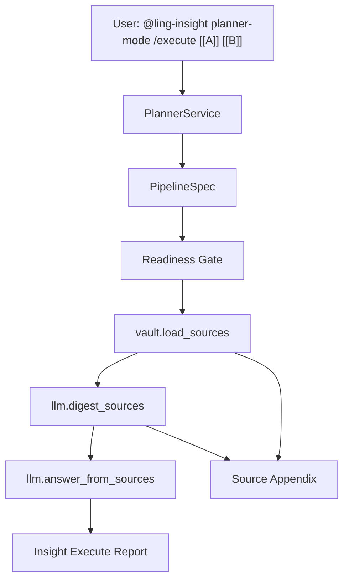

# Phase 0.3.1 Source Digest Plan

## Goal

Make planner execution reliable for multi-book, long-source Insight requests without changing the 0.3 safety model.

Ling-Ling 0.3 can already plan, load sources, pass readiness gates, and execute `load_sources -> answer_from_sources`. The remaining quality issue is source scale: long books are truncated at the front, so cross-book answers can become biased toward early sections. Phase 0.3.1 fixes that by adding a digest layer between source loading and final answering.

## Non-Goals

- Do not refactor the whole `InsightAgent`.
- Do not move the adapter allow-list out of Python.
- Do not enable arbitrary planner adapters.
- Do not introduce full-repo lint/type gates.
- Do not change the default preview-first behavior of `planner-mode`.

## Proposed Flow



## Work Items

### P0: `digest_sources` Capability

- Add `lings-desktop/Templates/Operations/digest_sources.md`.
- Add built-in adapter `llm.digest_sources`.
- Input contract:
  - `query`
  - `sources` or `source_text`
  - optional `target_titles`
  - optional `digest_budget`
- Output contract:
  - `source_digests`
  - `digest_text`
  - `source_coverage`
  - `warnings`

### P0: Digest Prompt Contract

The digest operation should preserve:

- Core thesis per source.
- Evidence snippets or line/source anchors when available.
- Terms and motifs relevant to the user directive.
- Contrasts between sources.
- Coverage warnings when source text is truncated, summary-only, or missing.

The digest output should be structured JSON where possible, with Markdown fallback tolerated by the adapter.

### P0: Planner Canonical Pattern

Update `PlannerService.canonical_planning_patterns()` and `Templates/Operations/plan.md`:

```json
{
  "id": "load_digest_answer",
  "steps": [
    {
      "id": "load_sources",
      "capability": "load_sources",
      "adapter": "vault.load_sources",
      "inputs": {"titles": "${context.target_titles}"}
    },
    {
      "id": "digest_sources",
      "capability": "digest_sources",
      "adapter": "llm.digest_sources",
      "inputs": {
        "query": "${context.user_directive}",
        "sources": "${steps.load_sources.source_text}"
      },
      "when": {"var": "steps.load_sources.source_text", "op": "nonempty"}
    },
    {
      "id": "answer",
      "capability": "answer_from_sources",
      "adapter": "llm.answer_from_sources",
      "inputs": {
        "query": "${context.user_directive}",
        "sources": "${steps.digest_sources.digest_text}"
      },
      "when": {"var": "steps.digest_sources.digest_text", "op": "nonempty"}
    }
  ]
}
```

### P1: Readiness and Reporting

- Add readiness warnings when:
  - `load_sources` has multiple long sources and no `digest_sources` step follows.
  - a final answer consumes raw `source_text` from more than one source.
  - any loaded source has `truncated: true`.
  - any loaded source has `source_kind: synthesis`.
- Extend Source Appendix with digest coverage:
  - source title
  - source kind
  - original chars
  - loaded chars
  - truncated
  - digest chars
  - coverage warning

### P1: Three-Book Manual Acceptance

Manual acceptance command:

```md
@ling-insight planner-mode /execution [[金剛般若波羅蜜經]][[妙法蓮華經]][[Siddhartha]] 分析三本書互相呼應之處，並列出行動指引。
```

Expected result:

- Planner chooses `load_sources -> digest_sources -> answer_from_sources`.
- Execution succeeds.
- Final answer does not say sources were missing.
- Source Appendix shows all three targets.
- Report clearly flags summary-only or truncated sources.

## Test Profile

Use `System_Engine/DesignDoc/Test_Profiles.md`.

For this phase, the normal loop is:

```bash
PYTHONPATH="$PWD/System_Engine" venv/bin/python -m pytest -q \
  System_Engine/tests/test_pipeline_runner.py \
  System_Engine/tests/test_planner_service.py \
  System_Engine/tests/test_plan_readiness.py \
  System_Engine/tests/test_insight_agent.py \
  System_Engine/tests/test_llm_client.py
```

Release gate remains:

```bash
PYTHONPATH="$PWD/System_Engine" venv/bin/python -m pytest -q System_Engine/tests
```

## Exit Criteria

- Full suite passes.
- Three-book manual acceptance produces a source-grounded answer.
- Source Appendix exposes truncation and source-kind caveats.
- No new execution path bypasses the adapter allow-list.
