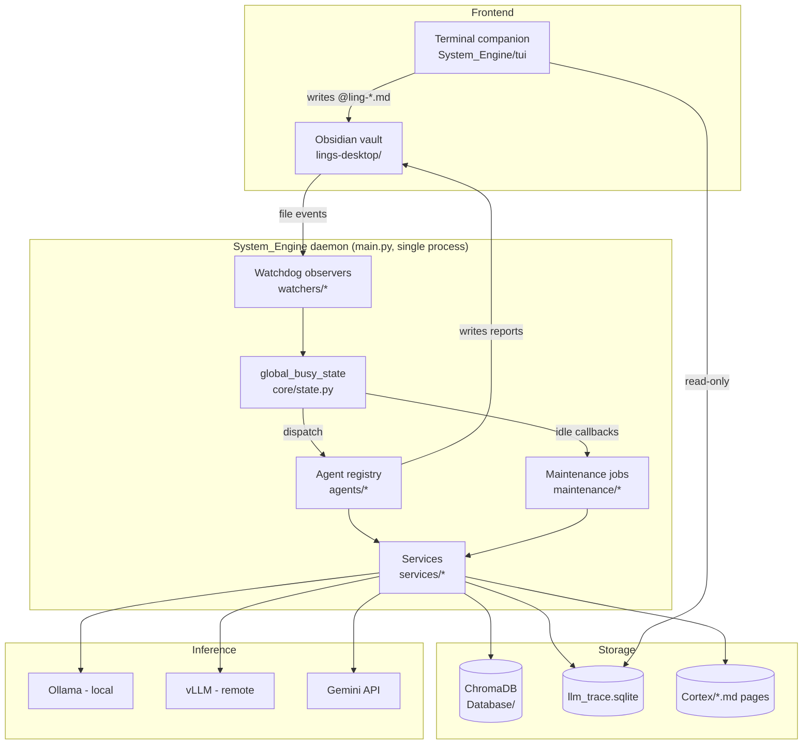
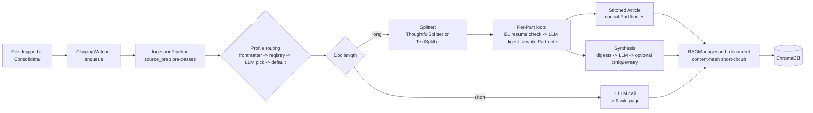
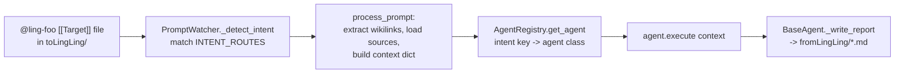
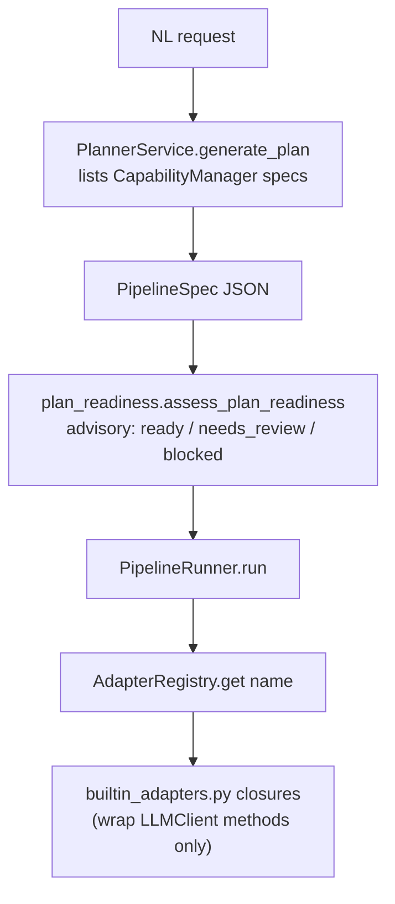

# Ling-Ling System Design

> Status: current · Last updated: 2026-07-01
> Supersedes the 2026-05-23 revision of this document, which described an earlier
> module layout (`auto_ingest.py`, `wiki_linter.py`, `Strategies/`) that no longer
> exists in the codebase. This revision was written by reading the current
> `System_Engine/` source tree end to end.

## 1. Purpose & Scope

Ling-Ling is a single-user, file-based personal knowledge daemon. A human curates
material inside an Obsidian vault (`lings-desktop/`); a Python background process
(`System_Engine/`) watches specific vault folders, and reacts to file events by
splitting/summarizing long documents, answering `@ling-*` commands, maintaining a
vector+lexical retrieval index, and slowly distilling recurring insights into a
long-term "belief" store (Cortex). All communication between the human and the
daemon happens through Markdown files — there is no HTTP API and no GUI beyond
Obsidian and an optional terminal companion (TUI).

This document describes the **runtime architecture**: process model, data flows,
subsystem responsibilities, and the design decisions/tradeoffs visible in the
current code. It does not restate the vault folder layout or CLI usage — see
[`README.md`](../../lings-desktop/README.md) for that.

## 2. Goals & Non-Goals

**Goals**

- Turn unstructured long-form reading into structured, source-grounded notes
  without losing the ability to trace a claim back to its original text range.
- Keep the human as the only writer of *raw* material; the daemon only ever
  reads from designated inboxes (`Consolidate/`, `toLingLing/`) and writes to
  designated outboxes (`pages/`, `fromLingLing/`, `Cortex/`).
- Make retrieval good enough that the RAG layer is reliable in a mixed
  zh/en/de corpus, on commodity hardware, without a hosted vector DB.
- Let background "thinking" (insight generation, memory consolidation,
  self-assessment) happen without ever competing with a live user command for
  the LLM or the database.
- Keep every automated write reversible or gated: nightly consolidation is
  probabilistic and reviewable via `@ling-tensions`/`@ling-cortex`; self-improve
  proposals require explicit human approval before they touch prompt files.

**Non-Goals**

- Multi-user access, auth, or a network-exposed API.
- Guaranteeing perfect recall — the system explicitly decays low-value memory
  (see §8) rather than keeping everything forever.
- Being a general agent framework; the capability/adapter layer (§9) exists
  only to let `@ling-plan`/`@ling-do` compose the operations this project
  already has, not to host arbitrary third-party tools.

## 3. High-Level Architecture



Everything downstream of "file events" is one Python process. There is
deliberately no second writer to ChromaDB or the vault — the TUI, in
particular, is read-only by construction (§12), which is why the whole system
can use a single SQLite/Chroma writer without a locking protocol beyond the
PID file and `global_busy_state`.

## 4. Process & Concurrency Model

`main.py` is the only entry point. On startup it, in order: acquires a PID
lock (`core/utils.acquire_pid_lock`), loads `Scripture/Scripture.md` into the
hot-reloadable `settings` object, applies any pending DB migrations
(`maintenance/migrate.py`), reaps orphaned trace runs left by a previous crash,
then wires three `watchdog` observers (`ClippingWatcher`, `PromptWatcher`,
`VaultWatcher`) and starts a `MaintenanceScheduler`.

Concurrency inside the daemon is cooperative, not parallel-worker based:

- **`core/state.global_busy_state`** is a `BusyState` singleton with a
  thread-safe `_busy` flag. `set_busy(False)` fires a list of
  `register_idle_callback` callbacks **while still holding the busy lock**,
  so no new command can interleave mid-drain. Each callback returns an int
  (truthy = "I queued more work"); the loop re-runs the callback list until
  everyone returns 0.
- **Priority is registration order.** `main.py` registers, in this exact
  sequence: `ClippingWatcher.scan_existing`, `PromptWatcher.scan_existing`,
  then `FacetBackfillPump.on_idle`, then `DaydreamPump.on_idle` — comments in
  the code call this out explicitly ("registered LAST so user-work queues
  always drain before the pump gets a turn"). This registration order *is*
  the priority ladder; there is no separate scheduler config for it.
- **File-drop watchers hand off to worker threads**, not the watchdog dispatch
  thread itself (`PromptWatcher`/`ClippingWatcher` each run a queue + worker
  thread), so slow LLM calls never block filesystem event delivery.
- **Idle-time pumps never do work inline.** `FacetBackfillPump.on_idle()` and
  `DaydreamPump.on_idle()` both just arm a `threading.Timer` (`kick()`) and
  return immediately; the actual "one bite" of work happens later in
  `_run_step()` under its own `try_set_busy()` check. This is what lets a
  pump be pre-empted the instant a real command arrives.

## 5. Data Flow: Long-Document Ingestion



Key steps, by file:

1. **Pre-passes** (`services/source_prep.py`): strip Gutenberg-style
   boilerplate/TOC, promote plain-text chapter cues to Markdown headings.
2. **Routing** (`IngestionPipeline._resolve_routing`): frontmatter override →
   a registered `Profile` matched by `document_type` → an LLM closed-choice
   pick → `default` profile. Unmatched document types get queued as draft
   profiles in `Scripture/Profiles/_pending/` rather than silently guessed.
3. **Splitter choice**: `USE_THOUGHTFUL_SPLITTER` selects between
   `services/text_splitter.py` (word-count, fast, safe default) and
   `services/thoughtful_splitter.py` (structure-aware: parses a block AST via
   `md_block_scanner.py`, cuts on the highest-weight boundary available —
   H1 > H2 > HR > H3 > LLM-detected topic shift > ... > forced — and never
   cuts inside a code fence/table/list-item/math block). Both exist because
   the structure-aware splitter costs more (an LLM call for topic-shift
   detection) and the legacy splitter is still the safe fallback.
4. **B1 resume** (`IngestionPipeline._resume_part`): each Part note's
   frontmatter persists `pending_concepts`, `part_digest`, and a
   `part_chunk_hash` (sha256 of that chunk's text). If ingestion is
   interrupted partway through a hundred-Part document, the next run skips
   every Part whose hash still matches and only resumes LLM work from the
   first Part that changed.
5. **Synthesis critique loop** (opt-in via `SYNTHESIS_CRITIQUE_ENABLED`):
   `critique_text()` grades the draft synthesis; the pipeline retries up to
   `SYNTHESIS_CRITIQUE_MAX_RETRIES` times, keeping the best of
   keep > revise > reject rather than always taking the last attempt.
6. **RAG indexing** (`services/rag_manager.py`): document id is
   `sha256(vault-relative path)` (stable across content edits); a separate
   content hash (`sha256(text + tags + section_path)`) short-circuits
   re-embedding when nothing actually changed.

## 6. Data Flow: Command Dispatch (`@ling-*`)



`watchers/prompt_watcher.py` is the single command facade: a hardcoded
`INTENT_ROUTES` table maps filename prefixes / inline `/directive` tokens to
an intent key. `agents/registry.py` is a plain factory (`dict[str, type]`)
from intent key to agent class — several intent keys intentionally share one
class (`"lens"` and `"count"` both go to `CounterAgent`; `"patrol"` and
`"linter"` both go to `LinterAgent`, parameterized by which intent key is in
the context). A handful of intents (`dream`, `consolidate`, `decay`, `ledger`,
`assess`, `resynthesize`, and the KB zip/reset/unzip trio) bypass the agent
pattern entirely and call a maintenance function or `KBManager` directly.

**Agent inventory:**

| Agent | Intent key(s) | Responsibility |
|---|---|---|
| `CounterAgent` | `lens`, `count` | Concept-lens scan: extract instances of a user-defined concept, dedupe, tally, with evidence + confidence. |
| `InsightAgent` | `insight` | Cross-domain insight generation; single-shot or multi-strategy Monte Carlo (explore → score → filter → expand → synthesize). |
| `MergeAgent` | `merge` | Fuse two or more linked notes into one via LLM synthesis. |
| `PlannerAgent` | `plan` | Decompose a directive into a validated pipeline JSON against the capability registry; never executes it. |
| `ExecutorAgent` | `do` | Re-validate and run a `PlannerAgent`-produced pipeline via `PipelineRunner`. |
| `ReviewAgent` | `review` | Turn a note's Synthesis into a reporter/reviewer-voice write-up (book/explainer/paper/patent genre). |
| `BlogAgent` | `blog` | Local-only copy of approved `Blog/` reviews into the Quartz-content shape (no LLM, no network, no build/push). |
| `CortexAgent` | `cortex` | Run the three-tier Cortex validation report (§8). |
| `RecallAgent` | `recall` | Answer from distilled Cortex claims rather than raw notes. |
| `TensionAgent` | `tensions` | Surface contradictions, dogmatic claims, thin evidence, falsified beliefs. |
| `VisualizeAgent` | `visualize` | Classify a note's cognitive structure and emit the matching diagram/artifact. |
| `ProfilesAgent` | `profiles` | List/approve pending document-routing profile drafts. |
| `LinterAgent` | `patrol`, `linter` | Vault health report (broken links, orphans) or focused DB repair. |
| `TagPatrolAgent` | `patrol_tags` | Tag hygiene: format errors, missing bilingual pairs, deprecated tags. |
| `ImproveAgent` | `improve` | Review queue for M3 self-improvement proposals (§11): show diff, approve/reject. |

`agents/base_agent.py` gives every agent `self.llm`/`self.rag`, an
`execute(context)` contract, tracing helpers (`llm.trace_run`), and
`_write_report()` — which unwraps LLM output, repairs Mermaid blocks, runs a
Markdown QA pass, and writes a timestamped report with frontmatter into
`fromLingLing/`. This is a plain command-registry pattern; there is
deliberately no capability-metadata layer at this level (that only exists one
layer up, for the planner — see §9), so onboarding a new `@ling-*` command
still means: add the agent class, register it, add an `INTENT_ROUTES` entry.

## 7. Retrieval Path (RAG)

Retrieval is a composable, independently-togglable pipeline rather than a
single vector lookup:

```
vector search  →  (+BM25, fused by RRF)  →  (+cross-lingual query expansion, fused by RRF)  →  (cross-encoder rerank)  →  (MMR diversification)  →  per-document cap  →  facet dereference
```

- **Vector search** hits ChromaDB with an embedding function wrapped in a
  persistent content-hash cache (`services/embedding_cache.py`): key is
  `sha256(model_name || text)`, stored in SQLite, so re-embedding survives a
  DB wipe or an embedding-model swap.
- **BM25 + RRF** (`services/bm25_index.py`): a parallel lexical index catches
  proper nouns, identifiers, and patent/paper numbers that embeddings tend to
  wash out; Reciprocal Rank Fusion combines the two rankings without a tuned
  weight.
- **Cross-lingual expansion** (`services/cross_lingual.py`, opt-in): the
  corpus is zh/en/de mixed. A translator callable is injected into
  `RAGManager` post-construction (`rag_manager.translator = llm_client.translate_query`
  in `main.py`) so the RAG module itself stays LLM-free; this only fires when
  the reranker's candidate pool doesn't contain the right-language document
  at all.
- **Reranking** (`services/reranker.py`, `BAAI/bge-reranker-v2-m3`): this is
  the single biggest quality lever in the system (golden-query bench
  0.867 → 0.933) and is lazy-imported on first use — `sentence-transformers`
  + `torch` are a ~500MB optional install, so `RERANKER_ENABLED=true` silently
  no-ops if the package isn't installed rather than failing startup.
- **Facet index** (`RAGManager.add_facets` / `_dereference_facets`): each Part
  digest's thesis/key-points are indexed as short, retrieval-only pointer
  documents. Facet hits are appended *after* direct chunk hits (never
  displace them) and are dereferenced back to their parent document's real
  chunk in one batched `collection.get(where={"doc_id": {"$in": ...}})` call
  before reranking, so a short, semantically dense facet sentence can rescue
  a long relevant document without letting facets dominate the ranking.

## 8. Long-Term Memory: Cortex

Cortex is a distillation layer on top of the raw insight reports: instead of
answering from notes (RAG), `@ling-recall` answers from a smaller set of
atomic **claims** that have survived repeated scrutiny.

**Distillation lifecycle** (`maintenance/cortex_consolidation.py`):

1. **Candidate gating** — an insight only becomes consolidation input if it
   passed refutation and clears a groundedness threshold.
2. **Claim extraction** — `llm.extract_claims()` breaks the insight into
   atomic claim objects.
3. **Neighbor search** — cached page embeddings find existing claims at
   ≥0.80 cosine similarity.
4. **Entailment adjudication** — one LLM call per candidate pair (quota-capped
   per night via `CORTEX_MAX_ADJUDICATIONS_PER_NIGHT`) classifies
   equivalent / entails / contradicts / complementary.
5. **Absorption** — equivalent claims merge evidence into the existing
   `CortexPage` (reinforcement); everything else creates a new page with
   typed links. Pages are written atomically (write-temp-then-rename).

**Dual-strength decay** (`services/cortex_decay.py`), modeled on Bjork's New
Theory of Disuse:

- **S (storage strength)** only ever increases; it represents how deeply a
  claim has been consolidated and is written on every reinforce/merge event.
- **R (retrievability)** is *not* stored — it's computed at read time as
  `R = exp(-Δt · ln2 / half_life(S))`, where `half_life` grows with `S`. This
  avoids a write storm just from the passage of time.
- **Spacing-effect reinforcement**: `ΔS = gain × (1 - R_at_event)`, so a
  same-day duplicate view (R≈1) barely moves S, while rediscovering a nearly-
  forgotten claim (R≈0) consolidates it deeply — matching how spaced
  repetition works in humans.
- **Hysteresis status machine**: active → fading below R<0.5, fading →
  dormant below R<0.2; promotion back up requires clearing R>0.3 / R>0.6
  respectively. The gap between the demote and promote thresholds exists
  specifically to prevent a claim flapping between statuses at the boundary.

**Falsification** (`maintenance/cortex_ledger.py`): a page only becomes
eligible for falsification once it has ≥2 contradiction links from
*independent* insights. "Independent" matters because of a **provenance
firewall** in `_merge_into()`: if a new claim's supporting insight itself
cited the page being merged into, that agreement is circular and is recorded
but explicitly excluded from reinforcement — otherwise the system could
convince itself of something by re-reading its own prior conclusion.

**"Three-layer validation"** (`maintenance/cortex_validation.py`): despite the
README describing this as three layers, it is implemented as **one**
`run_validation()` function that runs three sequential check tiers in a
single audit report, not three separate scheduled passes:

1. *Red lines* — machine-checkable invariants (every Cortex page parses,
   claim ids are unique, facet/page indexes agree, adjudication quota
   respected).
2. *Quality targets* — softer signals with warning bands (claim yield per
   insight, refute survival rate, mean falsifiability, broken-link rate).
3. *Retrieval effect* — observational telemetry (Cortex hit rate in recent
   retrieval events, facet lift from bench history); not a pass/fail check,
   just appended context.

## 9. Capability / Planner Layer

`@ling-plan` / `@ling-do` let a request be decomposed into a multi-step
pipeline over the system's existing operations, under one hard constraint
(documented in code comments and enforced structurally, not just by
convention): **`PipelineRunner` never calls a production private method
directly — every step goes through a named adapter.**



- **`CapabilityManager`** (`services/capability_manager.py`) is metadata-only:
  it scans `Templates/Operations/*.md` and `Skills/*.md` frontmatter into
  frozen `CapabilitySpec` records (name, inputs, outputs, cost class). It
  never executes anything.
- **`AdapterRegistry`** (`services/pipeline_runner.py`) is a plain
  `dict[str, Callable]`. `services/builtin_adapters.py` registers each
  capability name to a closure that calls a public `LLMClient` method
  (`llm.digest_sources`, `llm.answer_query`, ...) — never an internal helper.
  This is the concrete mechanism behind the "adapter layer" constraint: a new
  capability requires a new named adapter, which is a deliberate seam against
  the planner silently growing access to internals it shouldn't have.
- **`plan_readiness`** is advisory only — it scores a plan and flags missing
  inputs/unregistered adapters, but does not itself block execution; that
  gate is `PipelineRunner.validate()` at run time.
- **`ProfileManager`** (named persona+template routing, replacing the old
  `DocType.md`) is **not** part of this pipeline. It answers a different
  question — "which persona/template should ingest this document" — and is
  consulted at ingestion time (§5), not planning time. A profile's optional
  `operations:` field is a metadata hint for that routing decision, not
  something the planner reads.

## 10. Idle-Time Scheduling: Facet Backfill & Daydream

Two background pumps implement the same "one small bite, yield instantly,
daily budget cap" contract, registered as the lowest-priority idle callbacks
(§4): `maintenance/facet_backfill.py` (backfills the facet index for older
documents) and `maintenance/daydream.py` (makes up thinking that a busy
nightly window skipped).

**Daydream's escalating ladder** (`DaydreamPump._choose_action`), evaluated
top to bottom, first match wins:

1. **Consolidation backlog** — if under budget and unconsolidated insights
   exist, process exactly one (`run_consolidation(max_insights=1)`).
2. **Missed daily insight** — if under budget and today's scheduled insight
   never ran, generate it now (tagged "Daydream makeup").
3. **Spontaneous reflection** — if enabled and under budget, generate a
   lightweight ad-hoc insight even when nothing is owed.

Both pumps enforce **daytime-only**: if the current time is inside the
nightly dream window (`Scripture.md`'s `DREAMING_FROM`/`DREAMING_TO`,
default 1–5am), `kick()` reschedules itself for after the window instead of
running — daydream never competes with the deep-sleep pass for the same
work. Budgets are per-day counters (e.g. `DAYDREAM_CONSOLIDATION_BUDGET`)
reset at midnight, so a very busy day simply defers everything to that
night's deep-sleep pass rather than trying to catch up mid-day.

## 11. Self-Improvement Loop (M1–M4)

| Phase | File | Status | Gate |
|---|---|---|---|
| M1 — Assessment | `maintenance/self_assessment.py` | Implemented, always on | Read-only; zero LLM calls; six health axes scored deterministically into a 🥀🌼🌸🌱 lamp. |
| M2 — Diagnosis | `maintenance/self_diagnosis.py` | Implemented, **off by default** (`SELF_DIAGNOSIS_ENABLED`) | One LLM call per red/yellow axis for root-cause + candidate fixes; failures are per-axis, don't block other axes. |
| M3 — Improve | `maintenance/self_improve.py` | Implemented, **off by default** (`SELF_IMPROVE_ENABLED`), v1 scoped to the "report quality" axis only | Generates find/replace edits against a prompt template file, rejects anything that isn't a verbatim, size-bounded targeted edit, and queues it to `Scripture/Improvements/_pending/` — nothing is ever applied without `@ling-improve approve <id>`. |
| M4 — AutoTune | `maintenance/autotune.py` | Implemented, **off by default** (`AUTOTUNE_ENABLED`), one knob live (`CORTEX_GROUND_FRACTION`) | The only phase that changes behavior without a human approval step, which is why it's the most constrained: damped ±20%/step, minimum sample size before adjusting, and auto-rollback if the echo-chamber canary's novelty gap crosses a danger threshold. |

M1→M2→M3 is a straight data pipeline (each phase consumes the previous
phase's result object) called in sequence from one weekly
`MaintenanceScheduler` task; only M1 is mandatory, M2/M3 short-circuit if
their flag is off.

## 12. TUI Companion

`System_Engine/tui/` is an optional terminal app, architecturally isolated
from the daemon's write path by construction, not just convention: it never
imports `rag_manager` or opens ChromaDB. Its entire data model is read-only —
`llm_trace.sqlite` opened in `mode=ro`, a handful of JSON state files
(`maintenance_state.json`, `daydream_state.json`, ...), and `fromLingLing/`
markdown output. Submitting a command from its palette
(`tui/command_specs.py: build_command_file`) writes an `@ling-*.md` file into
`toLingLing/` — the exact same channel Obsidian uses — so the daemon treats
TUI-issued and Obsidian-issued commands identically. If the daemon isn't
running, a TUI-submitted command simply waits in `toLingLing/` until it is.

## 13. Key Design Decisions & Tradeoffs

| Decision | Why |
|---|---|
| Two splitters (word-count default, structure-aware opt-in) | Structure-aware chunking (section-boundary cuts, atomic-block protection) measurably improves Part coherence, but costs an extra LLM call per topic-shift check. Opt-in via `USE_THOUGHTFUL_SPLITTER` so existing behavior doesn't regress in cost for users who don't need it. |
| Content-hash caching at three layers (embeddings, chunk re-index, B1 resume) | Each protects a different expensive operation from re-running on unchanged input: model inference, ChromaDB re-embedding, and per-Part LLM digestion respectively. |
| Reranker lazy-imported, silent no-op if uninstalled | The single largest retrieval-quality lever (bench 0.867→0.933) also carries the heaviest optional dependency (~500MB, `torch`); failing loudly at daemon startup for an opt-in feature would be worse than a documented silent fallback. |
| Adapter registry between PipelineRunner and production code | Lets `@ling-plan`/`@ling-do` compose real functionality without ever being able to reach a private method the planner shouldn't touch — the seam is enforced by what's registered, not by trusting the planner's output. |
| Retrievability computed at read time, never stored | Avoids a background write for every claim on every clock tick just because time passed; storage strength (which does need writing) only changes on actual reinforcement events. |
| Provenance firewall in Cortex merge | Without it, a claim's own supporting insight could "agree" with the page it just fed into, letting the system manufacture false confidence from a single source re-read as if it were independent confirmation. |
| Idle pumps registered last, and never inline | Guarantees user-issued commands always preempt background thinking — the ladder is enforced by registration order plus the busy-lock re-entrancy check, not a priority number that could be misconfigured. |
| Self-improve produces gated proposals, never live edits | M3 can rewrite a prompt template, but only ever via reviewable find/replace diffs sitting in a pending queue — matches the project's general stance that automated writes to human-authored config must be reversible and reviewed. |

## 14. Known Limitations / Rough Edges

Consolidated from source-level review; none of these are urgent, but worth
tracking:

- `thoughtful_splitter.py`'s LLM topic-shift detection has a documented stub
  path (marked "real impl arrives in P5" in comments) — verify current status
  before relying on topic-shift quality claims.
- Agent naming is inconsistent with intent keys (`"lens"` → `CounterAgent`,
  `"patrol"` → `LinterAgent`), which makes the registry harder to read from
  the outside; only discoverable by reading `registry.py`.
- Command-dispatch context is an untyped `dict` with agent-specific ad-hoc
  keys (e.g. `strategy_id`, `confidence`, `planner_mode`) — no schema catches
  a typo in a key name until the agent silently ignores it.
- `watchers/insight_scheduler.py` is now a thin backward-compatibility shim
  over `MaintenanceScheduler`; nothing currently imports it directly.
- `DaydreamPump` reads `MaintenanceScheduler`'s `maintenance_state.json`
  directly to check "did today's insight already run" — a working but
  coupling-by-file-format dependency between two otherwise-separate modules.
- M3 self-improve is intentionally scoped to one axis ("report quality");
  extending it to Cortex/Retrieval axes has no placeholder yet.
- RAG section-path metadata caps at 6 levels (`section_l1`..`section_l6`);
  deeper nesting silently truncates.
- Orphan-chunk reconciliation in `rag_manager.py` is a full collection scan,
  not incremental — fine at current corpus size, would need revisiting if the
  vault grows by an order of magnitude.

## 15. Testing & Verification

Full suite and profile-scoped subsets are documented in
[`Test_Profiles.md`](Test_Profiles.md) and [`Testing_Strategy.md`](Testing_Strategy.md).
In short: `System_Engine/tests/` is the pytest gate (full suite required
before declaring a phase complete); smaller profiles exist for common change
areas (e.g. planner/executor changes only need the planner-related subset,
not the full suite, during iteration).

## 16. Related Documents

- [`README.md`](../../lings-desktop/README.md) — install, usage, command
  reference, and the chronological feature-evolution log.
- [`Engineering_Conventions.md`](Engineering_Conventions.md) — contribution
  conventions, including the Gemini-implements/Claude-reviews delegation
  workflow used for Cortex Memory phases.
- [`ThoughtfulSplitter_implementation_plan.md`](ThoughtfulSplitter_implementation_plan.md) —
  detailed design of the structure-aware splitter referenced in §5.
- Phase-specific implementation plans (`CortexMemory_phase*.md`,
  `Phase4_CapabilityLayer_implementation_plan.md`, etc.) — historical record
  of how each subsystem in this document was originally designed and reviewed.
