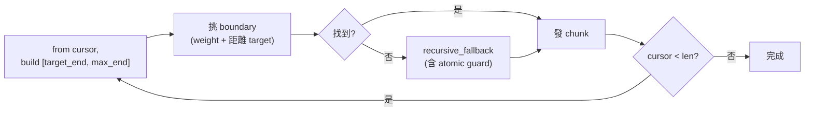

# Thoughtful Splitter 實作計劃 (v2.1) — **已完成 (Completed)**

> 智慧切割器:從「字數驅動」升級為「結構 + 段落 + 概念」三層驅動。
> 狀態:**已完成 (Completed)** (2026-05-23)。所有 P0-P6 交付物皆已實現並通過驗證。
> 變更摘要見 §13 (v1 → v2、v2 → v2.1、P0–P6 實作筆記)。

---

## 1. 目標與非目標

### 目標

1. 切出來的每個 chunk 是**相對自足的思想單位**,不是機械的字串。
2. 帶出豐富中繼資料 (`section_path`、`boundary_type`、`atomic_kinds`、`overlap_chars`、選用 `preceding_summary`) 給下游 LLM。
3. 與既有 `IngestionPipeline`、`CounterAgent`、`TextSplitter` 流程**漸進相容**,介面層級向後相容(不只是並存)。
4. **預設啟用 P5 LLM 主題切換偵測** (`use_llm=True`);P6 preceding_summary 仍 opt-in。純結構切割路徑保留(`use_llm=False`),供測試與離線使用。
5. **預設保留** RAG 友善的結構性 overlap,不犧牲既有檢索品質。

### 非目標

- 不寫完整的 markdown 解析器 (只解 block-level)。
- 不在切割層做向量相似度 (那是 RAG 的事)。
- 不追求完美 — 結構性切割 + 可選的 LLM 細修就足夠。

---

## 2. 已確認的決策

| 維度 | 決定 |
|---|---|
| LLM 細修 (P5 + P6) | **P5 預設開啟**,P6 預設關閉 (opt-in)。結果以 `(content hash)` 快取,降低重複呼叫 |
| Markdown 解析 | **自寫 block-level scanner**,維持零依賴 |
| API 演進 | **新增 `split_thoughtful` + 同時提供 `split_text` / `split_text_with_spans` 相容方法** |
| 驗證 | **結構性 baseline 快照 + LLM chunk-coherence 評分** 雙軌 |
| 大小設定 | 引入 `target_size` / `max_size` / `min_size` 三閾值 |
| Overlap 策略 | **預設保留結構性 overlap** (~300 字,可關),`emit_summary=True` 時自動關閉 |
| LIST 處理 | LIST 為**虛擬容器**,**頂層 item 為獨立 block**,允許 item 之間切 |
| Atomic 保護 | 切割前**先檢查 `[cursor, max_end]` 是否與 atomic 相交**,相交時 shrink/expand |
| Cache 策略 | 預設**記憶體**;`THOUGHTFUL_CACHE_DIR` env 設定時切換為**磁碟** (content-hashed) |
| Config 拆分 | **env**:功能開關 (`USE_*`);**Scripture**:tuning 鈕 (size/overlap)。詳見 §9 |

---

## 3. 檔案佈局

### 新增檔案

```
System_Engine/
├── services/
│   ├── thoughtful_splitter.py      # 主類別 ThoughtfulSplitter
│   └── md_block_scanner.py         # Phase 1: 自寫 block-level scanner
│
└── tests/
    ├── corpus/                     # 黃金測試文集 (8 篇)
    │   ├── README.md               # corpus 維護指南
    │   ├── short_essay.md
    │   ├── long_essay_with_code.md
    │   ├── nested_lists_and_tables.md
    │   ├── obsidian_callouts.md
    │   ├── mermaid_heavy.md
    │   ├── chinese_long_essay.md
    │   ├── outline_dominant.md         # NEW (Gemini Issue A): 純大綱筆記
    │   └── long_unstructured_essay.md  # NEW (Gemini Q5): 純散文無標題
    │
    ├── snapshots/                  # 結構性 baseline (JSON)
    │   ├── short_essay.snapshot.json
    │   └── ...
    │
    ├── test_md_block_scanner.py
    ├── test_thoughtful_splitter.py
    └── test_thoughtful_splitter_snapshots.py
```

**條件性目錄** (僅在 `THOUGHTFUL_CACHE_DIR` 環境變數設定時建立):
```
${THOUGHTFUL_CACHE_DIR:-.cache/thoughtful_splitter}/
├── topic_shifts/      # content-hash → split_at JSON
└── summaries/         # content-hash → summary text
```

### 觸碰到的檔案

```
System_Engine/
├── services/
│   ├── text_splitter.py            # 不動。保持向後相容
│   └── ingestion_pipeline.py       # P4 切換:依旗標選擇 splitter
├── agents/
│   └── counter_agent.py            # P4 切換 (因 split_text 相容,改動極小)
└── core/
    └── config.py                   # 新增 THOUGHTFUL_SPLITTER_*、DynamicSettings 擴充
```

---

## 4. 核心資料結構

```python
# services/md_block_scanner.py
from enum import Enum
from dataclasses import dataclass

class BlockKind(Enum):
    FRONTMATTER   = "frontmatter"
    HEADING       = "heading"
    PARAGRAPH     = "paragraph"
    LIST          = "list"           # 虛擬容器,不直接出現在 boundary 計算
    LIST_ITEM     = "list_item"      # NEW: 頂層 list item (含其子 item)
    CODE_FENCE    = "code_fence"
    TABLE         = "table"
    BLOCKQUOTE    = "blockquote"
    CALLOUT       = "callout"
    MATH_BLOCK    = "math_block"
    HR            = "hr"
    BLANK         = "blank"

@dataclass(frozen=True)
class Block:
    kind: BlockKind
    text: str
    start: int
    end: int
    level: int = 0
    heading_text: str = ""
    atomic: bool = False              # 不可內部切割
    parent_kind: BlockKind | None = None  # NEW: LIST_ITEM 的父容器是 LIST
```

**atomic 標記** (v2 修訂):
- `True`:`CODE_FENCE`、`TABLE`、`BLOCKQUOTE`、`CALLOUT`、`MATH_BLOCK`、`FRONTMATTER`、`LIST_ITEM`(個別 item 不切開)
- `False`:`LIST`(容器)、`HEADING`、`PARAGRAPH`、`HR`、`BLANK`

```python
# services/thoughtful_splitter.py
from enum import Enum

class BoundaryKind(Enum):
    FRONTMATTER_END  = ("frontmatter_end", 100)
    H1               = ("h1", 100)
    H2               = ("h2", 80)
    HR               = ("hr", 70)
    H3               = ("h3", 60)
    H4_PLUS          = ("h4_plus", 40)
    LIST_END         = ("list_end", 35)
    PARAGRAPH        = ("paragraph", 30)
    LIST_ITEM_END    = ("list_item_end", 28)   # NEW: 頂層 list item 之間
    BLOCKQUOTE_END   = ("blockquote_end", 25)
    SENTENCE         = ("sentence", 10)
    LLM_TOPIC_SHIFT  = ("llm_topic_shift", 50) # P5 啟用時
    FORCED           = ("forced", 0)

    def __init__(self, label, weight):
        self.label = label
        self.weight = weight

@dataclass(frozen=True)
class Boundary:
    position: int
    kind: BoundaryKind
    section_path: tuple[str, ...]

@dataclass(frozen=True)
class Chunk:
    text: str
    start: int
    end: int
    section_path: tuple[str, ...]
    boundary_type: BoundaryKind
    atomic_kinds: tuple[BlockKind, ...]
    overlap_chars: int = 0               # NEW: chunk 開頭多少字是來自上一塊的 overlap
    preceding_summary: str = ""

    def to_dict(self) -> dict:
        """JSON-safe serialization. asdict() would leak Enum objects."""
        return {
            "text": self.text,
            "start": self.start,
            "end": self.end,
            "section_path": list(self.section_path),
            "boundary_type": self.boundary_type.label,
            "atomic_kinds": [k.value for k in self.atomic_kinds],
            "overlap_chars": self.overlap_chars,
            "preceding_summary": self.preceding_summary,
        }
```

---

## 5. 公開介面

```python
class ThoughtfulSplitter:
    def __init__(
        self,
        target_size: int | None = None,   # 預設 settings.DIGEST_LIMIT
        max_size: int | None = None,      # 預設 target * settings.digest_max_factor (1.5)
        min_size: int | None = None,      # 預設 target * settings.digest_min_factor (0.25)
        snap_window: int | None = None,   # 預設 2000
        overlap_chars: int | None = None, # 預設 settings.OVERLAP_CHARS (300);0 = 關閉
    ):
        ...

    # 新主介面
    def split_thoughtful(
        self,
        text: str,
        *,
        use_llm: bool = True,             # P5 預設開啟
        emit_summary: bool = False,       # P6 仍 opt-in
    ) -> list[Chunk]:
        ...

    # 相容 wrapper —— 與 TextSplitter 介面一致
    def split_text(self, text: str) -> list[str]:
        return [c.text for c in self.split_thoughtful(text)]

    def split_text_with_spans(self, text: str) -> list[dict]:
        return [c.to_dict() for c in self.split_thoughtful(text)]

    # 顯式 dict 視圖 (與 split_text_with_spans 等價,語意清楚)
    def split_thoughtful_as_dicts(self, text: str, **kw) -> list[dict]:
        return [c.to_dict() for c in self.split_thoughtful(text, **kw)]
```

**接合策略** (Codex P1 修正):
- `CounterAgent` 與 `IngestionPipeline` **無需改 callsite**:它們呼叫的 `split_text` / `split_text_with_spans` 在新類別上仍可用。
- `IngestionPipeline` 想拿 `section_path` 等富中繼資料,改呼 `split_text_with_spans`(回傳 dict 已含新欄位)即可。
- `TextSplitter` 不動;`ThoughtfulSplitter` 是獨立新類別,可獨立測試。

---

## 6. 演算法分階段詳述

```mermaid
flowchart TD
    A[原始 Markdown] --> B[Phase 1<br/>md_block_scanner.scan]
    B --> C[Phase 2<br/>build_boundaries]
    C --> D[Phase 3<br/>greedy_chunk<br/>+ atomic intersect guard]
    D --> E[Phase 3b<br/>structural overlap<br/>opt-out via overlap_chars=0]
    E --> F{P4 opt-in?}
    F -->|use_llm=True| G[Phase 4<br/>llm_topic_refine]
    F -->|否| H[Phase 5<br/>enrich_metadata]
    G --> H
    H --> I[list[Chunk]]
```

### 6.1 Phase 1 — Block Scanner

**輸入**:`text: str`
**輸出**:`list[Block]`

**狀態機**:
1. Frontmatter:`^---\n` → 下一個 `^---\n` → `FRONTMATTER`(atomic)
2. Code fence:`^```` → 下一個 `^```` → `CODE_FENCE`(atomic)
3. Math block:`^\$\$` → 下一個 `^\$\$` → `MATH_BLOCK`(atomic)
4. Heading:`^(#{1,6})\s+` → `HEADING`,`level` = `#` 數
5. HR:`^---\s*$` / `^___\s*$` / `^\*\*\*\s*$` → `HR`
6. Obsidian callout:`^>\s*\[!\w+\]` 連續 `>` 行 → `CALLOUT`(atomic)
7. Blockquote:`^>` 連續 `>` 行 → `BLOCKQUOTE`(atomic)
8. **LIST(v2 修訂)**:
   - 偵測連續同/更深縮排的列表行 → 整段是 `LIST`(**非 atomic,虛擬容器**)
   - 容器內**拆解為頂層 `LIST_ITEM`**:每個頂層 item 連同其子 item 是一個 `LIST_ITEM` block(`atomic=True`,`parent_kind=LIST`)
   - 例:50 個頂層 item 的大綱 → 1 個 `LIST` 容器 + 50 個 `LIST_ITEM` blocks
9. Table:連續含 `|` 的行,且至少一行對齊列 → `TABLE`(atomic)
10. 空行 → `BLANK`(邊界線索,不算內容)
11. 其他連續非空行 → `PARAGRAPH`

**邊界情況**:未閉合 fence(尾段全 CODE_FENCE 保護)、setext heading、lazy list continuation、文末無換行、純 frontmatter 無 body。

### 6.2 Phase 2 — Boundary Weighting

走訪 blocks,維護 `section_path: list[str]` 與 `previous_block: Block | None`,在每個 block **之前**生成 boundary。Heading 同時更新 `section_path`(按 level 截斷)。

**v2 新增邊界**:
- `LIST_ITEM_END`(weight 28):兩個頂層 `LIST_ITEM` 之間。權重略低於 `PARAGRAPH`(30)以反映「列表內」的弱於「列表間」。

`SENTENCE` 邊界 Phase 2 不預生成,Phase 3 退回時即時計算。

### 6.3 Phase 3 — Greedy + Recursive Chunking



**主迴圈** (虛擬碼):
```
cursor = 0
while cursor < len(text):
    target_end = cursor + target_size
    max_end    = cursor + max_size

    candidates = [b for b in boundaries
                  if cursor + min_size <= b.position <= max_end
                  and abs(b.position - target_end) <= snap_window]
    candidates.sort(key=lambda b: (-b.kind.weight, abs(b.position - target_end)))

    if candidates:
        chosen = candidates[0]
        # 仍要過 atomic guard —— 邊界理論上不會在 atomic 內,但雙保險。
        if intersects_atomic(cursor, chosen.position, blocks):
            chunk_end = recursive_fallback(cursor, max_end, text, blocks)
        else:
            chunk_end = chosen.position
        emit_chunk(cursor, chunk_end, ...)
        cursor = chunk_end
        continue

    chunk_end = recursive_fallback(cursor, max_end, text, blocks)
    emit_chunk(cursor, chunk_end, ...)
    cursor = chunk_end
```

**`recursive_fallback` (v2 重寫,修 Gemini Issue B + Codex P1):**
```
def recursive_fallback(cursor, max_end, text, blocks):
    # Step 0 (NEW): atomic intersect 守衛
    intersecting = find_atomic_intersecting([cursor, max_end], blocks)
    if intersecting:
        a_start, a_end = intersecting.start, intersecting.end
        if a_start > cursor:
            # atomic 在後半 —— 切在它之前 (即使 < min_size 也得切)
            return a_start
        else:
            # atomic 從 cursor 就開始 —— 已超出 max,只能 expand 發超大 chunk
            log_warning(f"Oversize atomic chunk: {a_end - a_start} chars")
            return a_end

    # Step 1: atomic 結束點 (落在窗內的)
    last_atomic_end = find_last_atomic_end_in([cursor, max_end], blocks)
    if last_atomic_end is not None:
        return last_atomic_end

    # Step 2 (v2 修訂): 反向找句尾,挑 [cursor + min_size, max_end] 內最晚的
    sentence_pos = find_latest_sentence_end_in(text, cursor + min_size, max_end)
    if sentence_pos is not None:
        return sentence_pos
    sentence_pos = find_latest_sentence_end_in(text, cursor, max_end)
    if sentence_pos is not None:
        return sentence_pos

    # Step 3: 強制 max_end (FORCED)
    return max_end
```

**為何 Step 0 必須在所有 step 之前**(回應 Gemini Issue B 與 Codex P1):一個 chunk 內可能「普通文字 + 跨界 atomic」。沒有 Step 0,Step 2 會在 atomic 中找句尾,Step 3 會在 atomic 中強切。Step 0 保證**任何切點不會落在 atomic 內**。

### 6.3b Phase 3b — Structural Overlap (v2 新增)

**動機** (回應 Gemini Issue D + Codex P2):舊 `TextSplitter` 預設 500 字 overlap;移除 overlap 會降低 RAG 檢索品質,而 `preceding_summary` 是 opt-in 的高成本替代品。Phase 3b 預設提供 **結構性 overlap**,零 LLM 成本。

**規則**:
- 預設 `overlap_chars = settings.OVERLAP_CHARS` (預設 300)。
- 第一個 chunk 不加 overlap。
- 後續 chunk:從上一塊取**最後一個完整 paragraph block** (依 block 邊界),若超過 `overlap_chars` 字則只取最後 `overlap_chars` 字 (從句尾或段落界回拉)。
- Overlap 內容**包在 HTML 注釋**裡:`<!-- ctx: prev-chunk-tail -->\n{overlap_text}\n<!-- /ctx -->\n\n`
- `Chunk.overlap_chars` 記錄 overlap 實際字數,**不**計入 `Chunk.start`(即 `start` 仍指原文中 chunk 真正起點)。
- `emit_summary=True` (P6) 時 Phase 3b **自動關閉**,因為 summary 是更高品質的取代。

**snapshot 影響**:每塊 snapshot 多 `overlap_chars` 欄位。

### 6.4 Phase 4 — LLM Topic Refinement (**預設開啟**)

**預設啟用**(`use_llm=True`)。若要關閉(例如離線環境、snapshot 測試),傳 `use_llm=False`。

**觸發條件**:`use_llm=True` 且某 chunk 全 `PARAGRAPH`、大小 > `target_size * 1.2`、且無跨章節邊界。

**節流原則**(降低成本與延遲):
- 短文或結構良好的長文:多數 chunk 不滿足觸發條件,不會呼叫 LLM。
- 純散文長文 (例如 `long_unstructured_essay.md`):每個合格 chunk **最多一次** LLM 呼叫,且結果以 content hash 快取。
- LLM 故障或回傳壞 JSON 時:**降回 P3 結果繼續**,不中斷 ingestion(WARNING 等級 log)。

**流程**:
1. 對該 chunk 呼叫一次 LLM,要求 JSON `{"split_at": [offset1, offset2]}`(0–2 個)。
2. 驗證:offset 在 chunk 範圍內、**不切在 atomic 內**、≤ 2 個。
3. 應用切點,boundary_kind = `LLM_TOPIC_SHIFT`(weight 50,介於 H4 與 LIST_END)。

**快取**:預設記憶體 dict,key = `sha256(chunk_text)`。若 `THOUGHTFUL_CACHE_DIR` env 設定,改為磁碟 (`{cache_dir}/topic_shifts/{hash}.json`)。

### 6.5 Phase 5 — Metadata Enrichment

**結構性中繼資料** (永遠生成):
- `section_path`、`boundary_type`、`atomic_kinds`、`overlap_chars`

**`preceding_summary`** (`emit_summary=True`):
- 第一個 chunk:空字串
- 後續 chunk:LLM 用前一塊文字生 1–2 句總結
- 同樣以 content hash 快取(記憶體或磁碟,依 env 設定)

---

## 7. 測試策略

### 7.1 結構性 baseline 快照

**Snapshot 測試強制 `use_llm=False`** 以保留決定性 — 否則 LLM 變異性會讓 snapshot 永遠失敗。snapshot 量測**純結構切割行為**;LLM 細修的品質由 §7.2 LLM 評分把關。

每個 corpus 檔對應一個 snapshot:

```json
{
  "version": "2",
  "doc_hash": "sha256:...",
  "chunks": [
    {
      "index": 0,
      "char_range": [0, 4823],
      "section_path": ["導論"],
      "boundary_type": "h2",
      "atomic_kinds": [],
      "overlap_chars": 0,
      "size": 4823
    },
    ...
  ],
  "summary": {
    "total_chunks": 7,
    "size_distribution": {"min": 1203, "median": 4521, "max": 5894},
    "boundary_type_counts": {"h2": 4, "h3": 2, "paragraph": 1},
    "overlap_total": 1800
  }
}
```

### 7.2 Chunk-coherence LLM 評分

- 評分介面:`LLMClient.score_text_quality(text, prompt_version="v1") -> dict` (Q3 採納)
- temperature 硬編 0.0,prompt 版本鎖
- 每 chunk 評 3 次取中位數
- 目標 `QUALITY_BAR = 6.5/10`

### 7.3 單元測試

`test_md_block_scanner.py` (≥ 30 個):每種 `BlockKind` happy path + 邊角案例。**新增**:`LIST` 容器分解為 `LIST_ITEM`、頂層 vs 巢狀 item 區分、lazy continuation。

`test_thoughtful_splitter.py`:
- 短文不切
- 長文按 H1 切
- H2 邊界優先於 paragraph
- Atomic block 不被切開 (mermaid、table、list-item、callout)
- **NEW**(回應 Codex P1):「普通文字 + 跨界 atomic」場景,切點必須是 atomic 之前或之後,絕不在內
- **NEW**(回應 Gemini A):50-item 大綱可在 item 之間切,不會變單塊超大 chunk
- **NEW**(回應 Gemini C):稀疏 paragraph 場景下 fallback 不會做出 < min_size 的小屑塊
- **NEW**(回應 Gemini D + Codex P2):預設 overlap_chars=300 時,連續 chunk 開頭含 `<!-- ctx: -->` 區塊,`overlap_chars` 欄位 > 0
- **NEW**:overlap_chars=0 時,chunk 開頭無 ctx 區塊
- **NEW**(回應 Codex P2 enum):`Chunk.to_dict()` 輸出 JSON-safe;`json.dumps` 不 raise
- `section_path` 累積正確

### 7.4 端到端冒煙

把 corpus 餵進 `IngestionPipeline`(mock LLM/RAG)驗證:
- 不會 crash
- 每個 part 的 `wiki_meta` 帶 `section_path`
- Stitched 篇章節數量與 corpus 章節對得起來

---

## 8. 階段交付計劃

每段獨立可交付,完成後回報等確認。

### P0 — 測試基礎設施

**交付物**:8 篇 corpus(含 `outline_dominant.md`、`long_unstructured_essay.md`)、`coherence_score()` 函式、`score_text_quality()` 介面初稿、snapshots 空殼。

**驗收**:評分器對人工「好/爛 chunk」差距 ≥ 3;corpus markdown 語法檢查通過。

**風險**:低。

### P1 — Block Scanner

**交付物**:`services/md_block_scanner.py`、`test_md_block_scanner.py` (≥ 30 測試)。

**驗收**:
- 每篇 corpus blocks 連續覆蓋整文
- 所有 atomic 正確標記
- **LIST 拆解為 LIST_ITEM 正確,巢狀 item 跟著父 item**
- 每篇 < 50ms

**風險**:中。

### P2 — Greedy + Recursive Chunking + Structural Overlap

**交付物**:`services/thoughtful_splitter.py`(Phase 2 + 3 + 3b,不含 LLM)、單元測試、snapshots 初始化。

**驗收**:
- 所有 corpus 切完無 crash
- snapshot 測試通過
- Chunk-coherence ≥ 6.5/10
- **「跨界 atomic」測試通過,切點絕不落在 atomic 內**
- **`outline_dominant.md` 切出多塊而非單塊超大**
- **預設 overlap_chars=300,後續 chunk 開頭含 ctx 區塊**
- 與舊 `TextSplitter` A/B 對比表

**風險**:中。

### P3 — Metadata Enrichment(結構性部分)

**交付物**:`Chunk.section_path` / `boundary_type` / `atomic_kinds` / `overlap_chars` 填值;`Chunk.to_dict()` 實作 + JSON 序列化測試。

**驗收**:`section_path` 巢狀標題下正確;`to_dict()` 不洩漏 Enum;`json.dumps(chunk.to_dict())` 成功。

**風險**:低。

### P4 — IngestionPipeline / CounterAgent 切換

**交付物**:
- `core/config.py`:`USE_THOUGHTFUL_SPLITTER` 等 env 旗標(預設 False)、`DynamicSettings` 擴充 `OVERLAP_CHARS` 等(詳見 §9)
- `IngestionPipeline.__init__` 依旗標選 splitter
- `CounterAgent.__init__` 同
- `wiki_meta` / `tally` 新增 `section_path` 等(不影響舊讀者)

**驗收**:
- 旗標 False → 行為完全同現況,既有 147 個測試全綠
- 旗標 True → 端到端跑通至少一篇長文,**CounterAgent 不 AttributeError**(因 `split_text` 相容)
- 部分 part 的 `wiki_meta` 含 `section_path`

**風險**:中。

### P5 — LLM Topic Refinement (**預設開啟**)

**交付物**:`_llm_topic_refine` 實作、`LLM_TOPIC_SHIFT` 列舉、content-hash 快取(記憶體 + opt-in 磁碟)、mock 測試。

**驗收**:
- **`use_llm=True` 為預設值**(`THOUGHTFUL_USE_LLM` env 預設 `true`)
- 不破壞 atomic block 保護
- 對長 paragraph 叢集插入 1–2 切點
- 短文 no-op
- LLM 壞 JSON 時降回 P3 結果不 crash
- `THOUGHTFUL_CACHE_DIR` 設定時,二次跑命中磁碟快取
- **`use_llm=False` 路徑仍可用**(snapshot 測試、離線環境)

**風險**:高 (LLM 行為不穩 + 預設啟用提升 blast radius)。

### P6 — preceding_summary (opt-in)

**交付物**:`_emit_preceding_summary` 實作;`emit_summary=True` 時 Phase 3b structural overlap **自動關閉**。

**驗收**:
- `emit_summary=True`,每塊(除首)有非空 summary
- Summary ≤ 2 句、≤ 200 字
- 同 chunk 重跑命中快取
- `overlap_chars == 0`(被 summary 取代)

**風險**:中。

---

## 9. IngestionPipeline / CounterAgent 接合細節

### 9.1 Config 拆分:env vs Scripture (v2 新增,回應 Codex P3)

| 鈕 | 機制 | 預設 | 理由 |
|---|---|---|---|
| `USE_THOUGHTFUL_SPLITTER` | env | `false` | 部署期決定,不該 runtime 切換 |
| `THOUGHTFUL_USE_LLM_FOR_INGEST` | env | **`true`** | IngestionPipeline P5 預設開啟。離線環境設 `false` |
| `THOUGHTFUL_USE_LLM_FOR_COUNTER` | env | `false` | CounterAgent P5 預設關閉(extractor 目標與 chunk 自足性無關;多切點略降召回率) |
| `THOUGHTFUL_EMIT_SUMMARY` | env | `false` | 同上 |
| `THOUGHTFUL_CACHE_DIR` | env | (unset) | 部署環境決定 |
| `DIGEST_LIMIT` (= target_size) | Scripture (既有) | 5000 | 內容創作者 tune |
| `DIGEST_OVERLAP` | Scripture (既有,**轉用為 char-overlap 上限**) | 500 | 同上 |
| `OVERLAP_CHARS` (新) | Scripture | 300 | Structural overlap 大小 |
| `DIGEST_MAX_FACTOR` (新) | Scripture | 1.5 | `max_size = target × factor` |
| `DIGEST_MIN_FACTOR` (新) | Scripture | 0.25 | `min_size = target × factor` |

**`DynamicSettings.reload()` 擴充**:新增 `OVERLAP_CHARS`、`DIGEST_MAX_FACTOR`、`DIGEST_MIN_FACTOR` 三鍵,使用既有 `_BINDINGS` 機制,**自動繼承 reload 能力**。

### 9.2 切換點

```python
# core/config.py
USE_THOUGHTFUL_SPLITTER = os.getenv("USE_THOUGHTFUL_SPLITTER", "false").lower() == "true"
THOUGHTFUL_USE_LLM_FOR_INGEST  = os.getenv("THOUGHTFUL_USE_LLM_FOR_INGEST",  "true").lower()  == "true"   # IngestionPipeline P5 預設開啟
THOUGHTFUL_USE_LLM_FOR_COUNTER = os.getenv("THOUGHTFUL_USE_LLM_FOR_COUNTER", "false").lower() == "true"   # CounterAgent P5 預設關閉
THOUGHTFUL_EMIT_SUMMARY = os.getenv("THOUGHTFUL_EMIT_SUMMARY", "false").lower() == "true"
THOUGHTFUL_CACHE_DIR = os.getenv("THOUGHTFUL_CACHE_DIR") or None  # 預設 None = 記憶體
```

```python
# services/ingestion_pipeline.py
from core.config import USE_THOUGHTFUL_SPLITTER, THOUGHTFUL_USE_LLM, THOUGHTFUL_EMIT_SUMMARY

class IngestionPipeline:
    def __init__(self, ...):
        if USE_THOUGHTFUL_SPLITTER:
            self.splitter = ThoughtfulSplitter()
            self._split_kwargs = {"use_llm": THOUGHTFUL_USE_LLM, "emit_summary": THOUGHTFUL_EMIT_SUMMARY}
        else:
            self.splitter = TextSplitter()
            self._split_kwargs = {}
```

```python
# IngestionPipeline._ingest_long_document
# 因為 ThoughtfulSplitter 提供 split_text_with_spans 相容介面,
# 既有 callsite 不用動。富中繼資料(section_path 等)自動進到 dict。
chunk_spans = self.splitter.split_text_with_spans(content)
```

**`CounterAgent` 完全不動**:它原本就用 `split_text`,新類別有相容方法。

**切換時程**:
1. P4 結束:旗標 False(預設),CI 全綠
2. 手動測試一篇真實 vault 長文
3. P5/P6 完成後 → 開另一個 PR 決定是否預設 True

---

## 10. 風險清單

| 風險 | 程度 | 緩解 |
|---|---|---|
| Block scanner 漏處理某種 markdown 結構 | 中 | 8 篇 corpus + 邊角測試 |
| Greedy 演算法詭異切點 | 中 | snapshot + LLM coherence 雙軌 |
| **跨界 atomic 切入 atomic 內**(v2 新增) | 中 | Phase 3 Step 0 atomic guard + 專屬測試 |
| **長大綱變單塊超大 chunk**(v2 新增) | 中 | LIST → LIST_ITEM 拆解 + `outline_dominant.md` corpus |
| **Overlap 移除降低 RAG 品質**(v2 新增) | 中 | Phase 3b structural overlap 預設啟用 |
| **CounterAgent 切過去後 AttributeError**(v2 新增) | 中 | `split_text` / `split_text_with_spans` 相容方法 |
| **Enum 無法序列化**(v2 新增) | 低 | `Chunk.to_dict()` 明確轉換 |
| LLM 主題切換偵測壞資料 | 高 | 嚴格驗證 + 失敗降回 P3 |
| **P5 預設開啟造成 ingestion 延遲/成本上升**(v2.1 新增) | 中 | content-hash 快取、節流觸發條件(只對無邊界長 paragraph 叢集呼叫)、`use_llm=False` 快速關閉路徑 |
| **P5 預設開啟使 ingestion 依賴 LLM 可用性**(v2.1 新增) | 中 | LLM 故障時 graceful degrade 到 P3 結果並 WARNING log;失敗不中斷 ingestion |
| LLM 評分變異性 | 中 | 多次取中位數 + 結構性 snapshot 主迴歸保險絲 |
| 自寫 scanner 慢 | 低 | corpus 每篇 < 50ms |
| Atomic block 誤判(`---` HR vs frontmatter) | 中 | 上下文狀態機 + 測試 |

---

## 11. 開放問題 — 已解決

v1 列了 5 個開放問題,review 後全部定案:

1. ✅ `USE_THOUGHTFUL_SPLITTER` 預設 **False**,P6 後另開 PR 評估翻 True
2. ✅ 超大原子塊 **警告繼續**,WARNING 等級 log
3. ✅ **另闢** `LLMClient.score_text_quality` 介面,temperature 硬編 0.0,prompt 版本鎖
4. ✅ **預設記憶體**,`THOUGHTFUL_CACHE_DIR` opt-in 磁碟
5. ✅ Corpus 擴增至 **8 篇**(+ outline_dominant、+ long_unstructured_essay)

---

## 12. 完成定義 (Definition of Done)

- ✅ P0–P4 完成,既有 147 個測試保持綠
- ✅ Corpus snapshot 測試全綠
- ✅ Corpus 平均 chunk-coherence ≥ 6.5/10
- ✅ 至少一篇真實 vault 長文跑過端到端 ingestion,目視確認結果合理
- ✅ P5/P6 完成(或明確決定不做)
- ✅ 此文件標記 "Completed"
- ✅ `SystemDesign.md` 切割器章節更新

---

## 13. Review 整合記錄 (v1 → v2)

### Gemini review 處置

| Gemini Finding | 嚴重 | 處置 | 對應章節 |
|---|---|---|---|
| Issue A:LIST 整塊 atomic → 長大綱變單塊 | 🔴 | **採納**:LIST 改虛擬容器,頂層 LIST_ITEM 為獨立 block,新增 `LIST_ITEM_END` boundary | §4、§6.1、§6.2、§7.3、新 corpus |
| Issue B:fallback 切入跨界 atomic | 🔴 | **採納**:Phase 3 新增 Step 0 atomic intersect guard,shrink/expand 二分法 | §6.3 |
| Issue C:sentence 搜尋方向錯 | 🟡 | **採納**:改為從 max_end 反向搜尋 | §6.3 Step 2 |
| Issue D:overlap 預設消失 | 🟡 | **採納**:新增 Phase 3b structural overlap(預設 300 字) | §6.3b |
| Q1 預設值 | — | 採納:False | §11 |
| Q2 超大 atomic | — | 採納:警告繼續 | §11 |
| Q3 LLM 評分介面 | — | 採納:另闢介面 | §7.2 |
| Q4 磁碟快取 | — | 折衷:opt-in 磁碟 | §11 |
| Q5 corpus +unstructured | — | 採納 | §3 |

### Codex review 處置

| Codex Finding | 嚴重 | 處置 | 對應章節 |
|---|---|---|---|
| P1:atomic fallback 仍可切 atomic 內 | 高 | **採納**(與 Gemini B 重疊):Step 0 atomic guard | §6.3 |
| P1:CounterAgent 切換無 split_text 介面 | 高 | **採納**:`ThoughtfulSplitter` 加 `split_text` / `split_text_with_spans` 相容 wrapper | §5 |
| P2:overlap 語意流失無替代 | 中 | **採納**(與 Gemini D 重疊):structural overlap | §6.3b |
| P2:asdict 無法序列化 enum | 中 | **採納**:新增 `Chunk.to_dict()` 明確轉換 | §4 |
| P3:config 分裂未說明 | 中 | **採納**:新增 §9.1 表格明確拆分 env vs Scripture | §9.1 |

### v1 → v2 變更速覽

- **新增資料結構**:`BlockKind.LIST_ITEM`、`BoundaryKind.LIST_ITEM_END`、`Chunk.overlap_chars`、`Chunk.to_dict()`
- **新增介面**:`ThoughtfulSplitter.split_text`、`split_text_with_spans`
- **新增階段**:Phase 3b Structural Overlap
- **新增 corpus**:`outline_dominant.md`、`long_unstructured_essay.md`
- **新增 Scripture 鍵**:`OVERLAP_CHARS`、`DIGEST_MAX_FACTOR`、`DIGEST_MIN_FACTOR`
- **新增 env 變數**:`THOUGHTFUL_CACHE_DIR`
- **重寫演算法**:Phase 3 `recursive_fallback` 加 Step 0 atomic guard、Step 2 改反向搜尋
- **修訂測試**:5 個新測試類別(跨界 atomic、長大綱、min_size 守衛、overlap、enum 序列化)

### v2 → v2.1 變更(使用者要求 P5 預設開啟)

- **預設值翻轉**:`use_llm` 參數 `False` → `True`(API 層級)
- **拆分 env**:`THOUGHTFUL_USE_LLM_FOR_INGEST` 預設 `true`、`THOUGHTFUL_USE_LLM_FOR_COUNTER` 預設 `false`(CounterAgent 不需要 chunk 自足性)
- **§1 目標 #4 改寫**:從「預設純結構切割,LLM 細修 opt-in」改為「預設啟用 P5,純結構路徑保留供測試/離線」
- **§6.4 補節流原則**:觸發條件嚴格(無邊界長 paragraph 叢集才呼叫)、content-hash 快取、LLM 故障降回 P3 不中斷
- **§7.1 snapshot 策略**:Snapshot 測試強制 `use_llm=False` 以保留決定性
- **§10 風險新增兩項**:P5 預設開啟造成延遲/成本上升、ingestion 對 LLM 可用性的依賴
- **P5 驗收新增**:`use_llm=False` 路徑必須保留可用

### P0–P6 實作筆記(實作過程中的調整)

實作時遇到的設計調整,記錄於此以利未來追溯:

| 階段 | 調整 | 理由 |
|---|---|---|
| **P1** | 改變設計:**只發出 `LIST_ITEM` blocks,LIST 容器仍存在但範圍與 items 重疊**(plan 模糊處明確化) | flat list 同時含 LIST + LIST_ITEM 範圍重疊;`leaf_blocks()` helper 過濾掉容器讓 coverage 計算簡潔 |
| **P2** | 加 `chunk_size` property alias 給 `ThoughtfulSplitter` | E2E 測試抓到 `IngestionPipeline.ingest_markdown` 寫死讀 `splitter.chunk_size` |
| **P3** | 改變 `section_path` 計算策略:從「boundary-tracking」改為「heading-index lookup」 | P3 metadata 測試抓到首個 chunk 的 section_path 是空 tuple — 真 bug,boundary tracking 邏輯只在「選到 boundary」時更新,首個 chunk 從未經過 |
| **P4** | 拆兩個 env 旗標 (`THOUGHTFUL_USE_LLM_FOR_INGEST` / `_FOR_COUNTER`) | CounterAgent 不需要 chunk 自足性,P5 對它沒幫助甚至略傷召回率 |
| **P4** | `section_path` 也塞進 ChromaDB metadata,編碼成 `>chapter>section>` | 使用者明確要求「容易搜尋的資料庫」,讓 RAG 可結構性過濾 |
| **P5** | LLM 介面用**段落 index** (`split_after: [int]`),不用字元 offset | LLMs 對 char offset 會幻覺;段落編號極可靠 |
| **P5** | Eligibility 三道防線:size > target×1.2,不跨章節,純 PARAGRAPH | 防止 LLM 對結構良好的 chunk 亂插切點 |
| **P5** | Validation 五層:in-range / dedup / cap-2 / not-in-atomic / not-tiny | 任何失敗都靜默 degrade 回 P3 |
| **P6** | 統一 `_TopicShiftCache` → 泛型 `_ContentHashCache` (subdir 區隔) | 同時被 topic-shift 和 summary 用,共用基礎建設 |
| **P6** | LLM raise 時也快取 `""` | 避免單次 ingestion 對死 LLM 反覆重試 |

### 最終測試結果

- **349 個測試 pass + 1 個 skipped**(live-LLM acceptance,opt-in)
- 兩種旗標模式都全綠:`USE_THOUGHTFUL_SPLITTER=false`(預設)與 `=true`
- 既有 161 個原專案測試完全沒退步
- 新增測試分布:P0 (14) + P1 (72) + P2 (39) + P3 (10) + P4 (10) + P5 (34) + P6 (23) + 其他 (live LLM acceptance 1) = 203 new tests

### 完成定義 (Definition of Done) 驗收狀態

- ✅ P0–P4 完成,既有測試保持綠
- ✅ Corpus snapshot 測試全綠
- ⏳ Corpus 平均 chunk-coherence ≥ 6.5/10 — **需 live LLM 跑一次驗收**
- ⏳ 至少一篇真實 vault 長文跑過端到端 ingestion — **需手動驗收**
- ✅ P5/P6 完成
- ✅ 此文件標記 "Completed"
- ⏳ `SystemDesign.md` 切割器章節更新 — **在最終整合 chunk 內處理**
