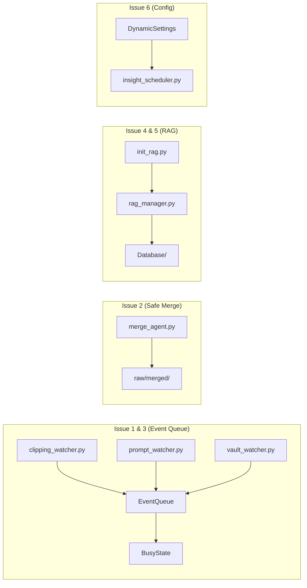

# 🐛 Ling-Ling 六大問題分析報告

---

## Issue 1: Busy 時檔案事件被直接丟棄（Event Drop on Busy）

**嚴重度**: 🔴 高 — 資料遺失風險

### 問題現場

```python
# clipping_watcher.py:43-44
if global_busy_state.is_busy():
    return  # ← 事件直接丟棄，永遠不會被重新處理

# vault_watcher.py:24-26
if global_busy_state.is_busy():
    return  # ← 同樣的問題
```

Watchdog 的事件是 **fire-and-forget** 的。一旦 `return`，該檔案事件就永遠消失了。如果使用者在系統忙碌時拖入新檔案，那份素材會被無聲吞掉，除非使用者手動觸發（重新搬移檔案或重啟 daemon）。

### 提案方向

| 方案 | 說明 | 複雜度 |
|------|------|--------|
| **A. 延遲重試佇列** | 將 busy 期間的事件推入 `queue.Queue()`，busy 解除時消化 | 中 |
| **B. 排隊 + 去重** | 同上但加上 filepath 去重，避免 watchdog 對同一檔案產生多個 created/modified 事件 | 中高 |
| **C. Startup scan 即安全網** | 不改 watcher，但讓 `scan_existing()` 也在每次 busy→idle 轉換時執行一次 | 低 |

> [!IMPORTANT]
> 方案 A 最平衡。核心改動：在 `_handle_event` 把 filepath 推入佇列、在 `set_busy(False)` 後 drain 佇列。

### 討論點
- `vault_watcher` 的 `on_created` 也有同樣問題（L24-26），是否一起處理？
- 佇列有無上限？如果使用者批次拖入 200 個 `.md`，是否需要 rate-limit？

---

## Issue 2: Merge 指令不可逆刪除原文（Destructive Merge）

**嚴重度**: 🔴 高 — 資料遺失風險

### 問題現場

```python
# merge_agent.py:112-116
# Cleanup old files
for filepath in valid_files:
    filepath.unlink()  # ← 永久刪除，沒有備份
    if self.rag:
        self.rag.delete_document(filepath.stem)
```

合併後直接 `unlink()` 原始檔，沒有任何復原機制。在 Obsidian 工作流中，這等同於跳過回收桶直接刪除。

### 提案方向

| 方案 | 說明 |
|------|------|
| **A. 移入 raw/merged/** | 建立 `RAW_DIR / "merged"` 資料夾，用 `shutil.move()` 取代 `unlink()` |
| **B. Obsidian trash** | 搬移到 `.trash/`（Obsidian 內建回收桶），但需確認 `.obsidian/config` 的設定 |
| **C. 寫入合併筆記 metadata** | 在新文章的 frontmatter 記錄 `merged_from_backup: [路徑]`，方便溯源 |

> [!TIP]
> 建議 A+C 組合：搬移到 `raw/merged/` 並在 metadata 記錄路徑。最小侵入且可逆。

### 討論點
- 是否保留 RAG 中的舊文索引？（可能不需要，因為內容已合併進新文）
- `raw/merged/` 是否需要加入 `ensure_directories()`？

---

## Issue 3: Prompt Watcher 不尊重全域 Busy

**嚴重度**: 🟡 中 — 競態條件風險

### 問題現場

```python
# prompt_watcher.py:38-65
def _handle_event(self, event, is_move=False):
    if event.is_directory:
        return
    filepath = Path(event.dest_path) if is_move else Path(event.src_path)
    # ... 格式檢查 ...
    
    # 注意：這裡沒有 global_busy_state.is_busy() 檢查！
    # 只有 LOCK_FILE 檢查（L60-62），但那是不同的概念
    
    global_busy_state.set_busy(True)  # ← 直接搶佔 busy
```

對比 [clipping_watcher.py:43-44](file:///Users/stevenlee/projects/ling-ling/System_Engine/watchers/clipping_watcher.py#L43-L44)，`ClippingWatcher` 會在 busy 時退出，但 `PromptWatcher` 完全無視 busy 旗標。

如果 `ClippingWatcher` 正在消化長文（已 set_busy=True），此時使用者丟入一個 `@ling-merge` 指令，兩個 handler 會同時操作 LLM 和 RAG，導致：
- LLM 請求可能互相干擾（如果是 local vLLM）
- ChromaDB 可能出現 `database is locked` 錯誤

### 提案方向

```python
# 在 _handle_event 加入 busy 檢查 + 佇列機制（與 Issue 1 統一方案）
if global_busy_state.is_busy():
    self._pending_queue.put(filepath)
    return
```

> [!WARNING]
> 但 prompt_watcher 跟 clipping_watcher 不同的是——指令通常是使用者**主動**發出的，丟棄或延遲可能讓使用者覺得「系統沒反應」。可能需要 UI 提示 "System busy, your command has been queued."

### 討論點
- 指令是否應該有更高優先級？（中斷正在進行的 insight 任務？）
- 或者只需加一個 UI 提示 + 佇列，讓使用者知道「排隊中」？

---

## Issue 4: RAG 重建邏輯漏掃現有 Nested Pages

**嚴重度**: 🟡 中 — 資料不完整

### 問題現場

```python
# init_rag.py:42-45
for d in search_dirs:
    if d.exists():
        # 只抓取該層目錄的 .md，不遞迴（避免抓到備份或 raw）
        md_files.extend(list(d.glob("*.md")))  # ← 只掃一層！
```

但 `clipping_watcher.py` 在建立頁面時會使用 **nested 結構**：

```python
# clipping_watcher.py:95-96
entity_dir = PAGES_DIR / base_title
synthesis_file = entity_dir / f"{base_title} (Synthesis).md"

# clipping_watcher.py:253-254
page_folder = PAGES_DIR / base_title
page_path = page_folder / f"{title}.md"
```

所以實際結構是：
```
pages/
├── index.md          ← 被掃到
├── 某篇文章/
│   ├── 某篇文章 (Synthesis).md  ← 漏掃！
│   ├── 某篇文章 (Part 1).md     ← 漏掃！
│   └── 某篇文章 (Part 2).md     ← 漏掃！
```

### 提案

```python
# 改為 rglob 但排除特定目錄
for d in search_dirs:
    if d.exists():
        for f in d.rglob("*.md"):
            # 排除 raw、Database、.obsidian 等
            if not any(excl in f.parts for excl in ['raw', 'Database', '.obsidian', 'Templates']):
                md_files.append(f)
```

### 討論點
- 是否要維持 explicit 白名單（只掃 pages/ Notes/）而非黑名單排除？
- `vault_dir` 根目錄的 `.md` 還需要被索引嗎？（`index.md`, `log.md` 本身似乎不需要）

---

## Issue 5: RAG Wipe 路徑不一致（Database Path Mismatch）

**嚴重度**: 🟠 中高 — 靜默失敗

### 問題現場

**RAGManager 建立 DB 的位置：**
```python
# rag_manager.py:30-36
from core.config import DATABASE_DIR  # = lings-desktop/Database/
self.db_dir = DATABASE_DIR  # 直接使用 DATABASE_DIR
self.client = chromadb.PersistentClient(path=str(self.db_dir))
```

**實際檔案系統：**
```
lings-desktop/Database/
├── chroma.sqlite3          ← 實際 DB（7.6MB）
├── 19e25af6-.../           ← ChromaDB segment 資料夾
├── 28f5edde-.../
├── ...
```

**init_rag_from_scratch(wipe=True) 刪的位置：**
```python
# init_rag.py:20-23
db_path = DATABASE_DIR / "chroma_db"  # ← 指向 Database/chroma_db/（不存在！）
if db_path.exists():
    shutil.rmtree(db_path)  # ← 永遠不會執行
```

### 結論
`wipe=True` 完全是一個 **空操作（no-op）**。`chroma_db` 子資料夾根本不存在，實際 DB 在 `DATABASE_DIR/` 根目錄下。

### 提案

```python
# 方案 A: 直接 wipe DATABASE_DIR（簡單但暴力）
if wipe:
    if DATABASE_DIR.exists():
        shutil.rmtree(DATABASE_DIR)
        DATABASE_DIR.mkdir(parents=True, exist_ok=True)

# 方案 B: 使用 RAGManager 自己的 wipe 方法（更安全）
manager = RAGManager()
if wipe:
    manager.wipe_collection()  # 已有此方法，只刪 collection 不刪整個 DB
```

> [!TIP]
> 方案 B 更好：用 `manager.wipe_collection()` 而非刪檔案系統。這樣即使 ChromaDB 的內部結構變更（版本升級），也不會出問題。

### 討論點
- `init_rag.py` 的 `wipe` 語意到底要「清集合」還是「清整個 DB + 重建 schema」？
- 是否乾脆移除 filesystem wipe，統一用 `wipe_collection()`？

---

## Issue 6: DynamicSettings 缺少 DREAMING_FROM 預設值

**嚴重度**: 🟠 中高 — 部署爆炸風險

### 問題現場

```python
# config.py:42-55
class DynamicSettings:
    def __init__(self):
        self.AGENT_ROLE = "assistant"
        self.OUTPUT_LANGUAGE = "Traditional Chinese"
        self.DIGEST_LIMIT = 5000
        self.DIGEST_OVERLAP = 500
        self.DREAMING_TO = 5      # ✅ 有預設
        # self.DREAMING_FROM = ???  # ❌ 沒有預設！
        self.SELF_HEALING = True
        # ...
```

**使用它的地方：**
```python
# insight_scheduler.py:22
logging.info(f"InsightScheduler: Started. Window: {settings.DREAMING_FROM:02d}:00 ...")
#                                                  ^^^^^^^^^^^^^^^^^^^^^^^^
#                                                  如果 Scripture 沒有設定 → AttributeError!

# insight_scheduler.py:29
if settings.DREAMING_FROM <= current_hour < settings.DREAMING_TO:
#   ^^^^^^^^^^^^^^^^^^^^^ → AttributeError!
```

**同樣在 reload() 中：**
```python
# config.py:88
f"Dreaming {self.DREAMING_FROM}-{self.DREAMING_TO}."
#           ^^^^^^^^^^^^^^^^^ → 如果 YAML 沒有 dreaming_from 欄位，就是 AttributeError
```

### 目前沒爆的原因
Scripture.md 恰好有 `dreaming_from` 欄位，而且 `settings.reload()` 在 main.py L31 被呼叫，所以屬性在 scheduler 啟動前就被設定了。

### 爆炸條件
1. Scripture.md 缺少 `dreaming_from` 欄位
2. Scripture.md 的 YAML 格式錯誤導致 parse 失敗（`reload()` 被 `except` 吞掉）
3. 部署到新環境（如 192.168.1.103）時忘記複製 Scripture.md

### 提案

```python
class DynamicSettings:
    def __init__(self):
        # ... 其他設定 ...
        self.DREAMING_FROM = 1   # 預設 01:00
        self.DREAMING_TO = 5     # 預設 05:00
        self.SELF_HEALING = True
```

> [!IMPORTANT]
> 同時建議在 `reload()` 失敗時加入更明確的 fallback 日誌，避免靜默失敗：
> ```python
> except Exception as e:
>     logging.error(f"Failed to reload settings from Scripture: {e}")
>     logging.warning("Using default settings as fallback.")
> ```

### 討論點
- `DREAMING_FROM` 的合理預設值？（建議 1，配合 `DREAMING_TO=5` 形成 01:00-05:00 窗口）
- 是否需要在 `reload()` 對 **所有** 設定做 `hasattr` 防禦？或者信任 `__init__` 的預設值就夠了？

---

## 🗺️ 改動影響範圍總覽



| # | 檔案 | 改動類型 |
|---|------|---------|
| 1 | `core/state.py` | 可能擴充 busy callback 或增加 event queue |
| 1+3 | `watchers/clipping_watcher.py` | 加入 queue 機制 |
| 1+3 | `watchers/prompt_watcher.py` | 加入 busy 檢查 + queue |
| 1 | `watchers/vault_watcher.py` | 加入 queue 機制 |
| 2 | `agents/merge_agent.py` | `unlink()` → `shutil.move()` + metadata |
| 2 | `core/config.py` | 新增 `RAW_MERGED_DIR` + `ensure_directories()` |
| 4 | `maintenance/init_rag.py` | `glob` → `rglob` + 排除邏輯 |
| 5 | `maintenance/init_rag.py` | 修正 wipe 路徑 / 改用 `wipe_collection()` |
| 6 | `core/config.py` | 加入 `DREAMING_FROM` 預設值 |
