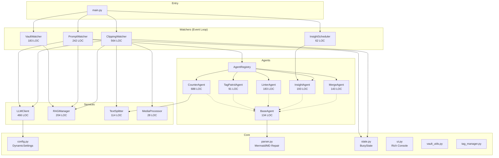

# 🔬 Ling-Ling Refactoring Report — Complete

## 1. Architecture Overview



| Layer | Files | Total LOC | Purpose |
|-------|-------|-----------|---------|
| Entry | `main.py` | 89 | Daemon bootstrap, observer wiring |
| Watchers | 4 files | ~1,051 | File-system event handling, scheduling |
| Agents | 7 files (inc. base, registry) | ~1,282 | Business logic, LLM pipelines |
| Core | 8 files | ~760 | Config, parsing, state, UI, utilities |
| Services | 4 files | ~812 | LLM API, RAG/ChromaDB, text splitting |
| Maintenance | 8 files | ~594 | Standalone admin scripts |
| **Total** | **~31 files** | **~4,588** | |

---

## 2. Strengths

The project has solid foundations:

1. **Clean separation of concerns** — Watchers → Agents → Services layering is well-defined.
2. **BaseAgent pattern** — All agents share standardized prompt loading, report writing, and self-correction through inheritance.
3. **DynamicSettings** — Runtime-reloadable config from Obsidian-native YAML is elegant.
4. **BusyState with idle callbacks** — The busy→idle re-scan mechanism is a smart pattern for handling dropped filesystem events.
5. **Robust Markdown pipeline** — `parser.py` has thoughtful Mermaid fence repair, LaTeX carriage-return healing, and label quoting — all deterministic and well-tested patterns.
6. **Multi-provider LLM support** — Clean vLLM/Gemini/Ollama abstraction.
7. **Prior bug analysis** — Issues 1–6 from the Claude Opus analysis have been largely addressed (busy event queuing, merge archival, DREAMING_FROM default, RAG wipe fix, rglob scanning).

---

## 3. Issues Found

### 🔴 Critical — Bugs & Data Integrity

#### C1. `CounterAgent._tally_instances` accesses private `self.llm._parse_json_object()`

**File**: [counter_agent.py:331](file:///Users/stevenlee/projects/ling-ling/System_Engine/agents/counter_agent.py#L331)

```python
tally = self.llm._parse_json_object(raw)  # ← Private method access
```

This breaks encapsulation. If `LLMClient` ever renames or removes `_parse_json_object`, this silently falls back to local tally but the intent is unclear. The method should be public or duplicated.

#### C2. `VaultWatcher._process_modification` creates a new `LLMClient` instance on every tag-translation call

**File**: [vault_watcher.py:130-131](file:///Users/stevenlee/projects/ling-ling/System_Engine/watchers/vault_watcher.py#L130-L131)

```python
from services.llm_client import LLMClient
llm = LLMClient()  # ← New instance every invocation
```

Each `LLMClient()` re-initializes an OpenAI/Gemini client with new network connections. For Ollama/vLLM this allocates new HTTP sessions. This should reuse the watcher-level or main-level instance.

#### C3. `parser.py` instantiates `TagManager` on every `parse_markdown_metadata()` call

**File**: [parser.py:43-46](file:///Users/stevenlee/projects/ling-ling/System_Engine/core/parser.py#L43-L46)

```python
from core.tag_manager import TagManager
from core.config import TAG_MAP_FILE
tm = TagManager(TAG_MAP_FILE)  # ← Reads + parses YAML file on EVERY call
```

`parse_markdown_metadata()` is called from watchers, agents, and maintenance scripts — potentially hundreds of times. Each call reads the tag map file from disk and parses YAML. This is both a performance issue and creates subtle staleness bugs.

#### C4. `BaseAgent._write_report` uses unused `safe_title` variable

**File**: [base_agent.py:122-124](file:///Users/stevenlee/projects/ling-ling/System_Engine/agents/base_agent.py#L122-L124)

```python
safe_title = re.sub(r'[\\/*?:"<>|]', "-", title)  # Computed but never used
timestamp = datetime.now().strftime("%Y%m%d-%H%M%S")
filename = f"✅{report_type}-{timestamp}.md"  # Uses report_type, not safe_title
```

The filename includes `report_type` but not the `safe_title`, meaning the report filename tells you nothing about *which* report it is when browsing the output directory.

---

### 🟡 Medium — Code Smells & Duplication

#### M1. Duplicated `_digest_value_to_text` / JSON-to-text helpers

The exact same recursive value-to-text pattern appears in three places:
- [clipping_watcher.py:427-436](file:///Users/stevenlee/projects/ling-ling/System_Engine/watchers/clipping_watcher.py#L427-L436) — `_digest_value_to_text()`
- [llm_client.py:381-390](file:///Users/stevenlee/projects/ling-ling/System_Engine/services/llm_client.py#L381-L390) — `as_text()` inside `_format_part_digest_for_prompt`
- [clipping_watcher.py:373-381](file:///Users/stevenlee/projects/ling-ling/System_Engine/watchers/clipping_watcher.py#L373-L381) — `as_text()` inside `_format_digest_appendix`

All three are identical. This should be a single utility function.

#### M2. Duplicated `_parse_json_array` / `_parse_json_object`

JSON extraction logic appears in two forms:
- `CounterAgent._parse_json_array()` → extracts JSON arrays from LLM text
- `LLMClient._parse_json_object()` → extracts JSON objects from LLM text

Both implement the same "try fenced code block → try raw text → try regex extraction" pipeline. This should be unified into a single `core.parser.extract_json()` utility.

#### M3. `ClippingWatcher` is a 564-line God object

This single file handles:
1. Filesystem event handling (`on_created`, `on_moved`)
2. Short/long document routing logic
3. Part-by-part chunked ingestion pipeline
4. Wiki page writing + navigation generation
5. Stitched article assembly
6. Synthesis generation orchestration
7. Digest appendix formatting
8. File archival

At least 3–4 of these responsibilities should be extracted.

#### M4. Intent routing in `PromptWatcher.process_prompt` is a fragile if/elif chain

**File**: [prompt_watcher.py:118-131](file:///Users/stevenlee/projects/ling-ling/System_Engine/watchers/prompt_watcher.py#L118-L131)

13 `elif` branches match command intents by substring. This is brittle, order-dependent (e.g. `@ling-patrol-tags` must be checked before `@ling-patrol`), and mixes agent commands with maintenance commands.

#### M5. Bare `except:` clauses swallow errors silently

Multiple files use bare `except:` or `except Exception` without logging:
- [insight_agent.py:152](file:///Users/stevenlee/projects/ling-ling/System_Engine/agents/insight_agent.py#L152) — `except: return "No recent data found."`
- [insight_agent.py:171](file:///Users/stevenlee/projects/ling-ling/System_Engine/agents/insight_agent.py#L171) — `except: return self._get_random_sample_context(limit)`
- [insight_agent.py:192](file:///Users/stevenlee/projects/ling-ling/System_Engine/agents/insight_agent.py#L192) — `except: return "Error."`
- [vault_utils.py:44](file:///Users/stevenlee/projects/ling-ling/System_Engine/core/vault_utils.py#L44) — `except: return {...}`
- [tag_manager.py:36](file:///Users/stevenlee/projects/ling-ling/System_Engine/core/tag_manager.py#L36) — `except: pass`
- [llm_client.py:308](file:///Users/stevenlee/projects/ling-ling/System_Engine/services/llm_client.py#L308) — `except: return {}`

These make debugging extremely difficult when issues arise in production.

#### M6. No `__init__.py` in `agents/`, `watchers/`, `services/`, `maintenance/`

Only `core/` has an `__init__.py`. The other packages rely on `sys.path` manipulation or import-time side effects. Adding `__init__.py` files would make the package structure explicit.

---

### 🟢 Low — Style & Minor Improvements

#### L1. Inconsistent `logging` vs `ui` usage
Some modules log via `logging.info()`, others via `ui.info()`. The division is inconsistent — sometimes both are used for the same logical event.

#### L2. `safe_title` computed but unused in `BaseAgent._write_report`
Already noted in C4 above.

#### L3. `config.py` calls `logging.basicConfig()` at import time (line 10)
This conflicts with `ui.py`'s `setup_rich_logging()` which is called later in `main()`. The config-level `basicConfig` gets overridden, making it dead code that could cause confusion.

#### L4. `from core.version import VERSION` imported inside functions
This import appears inside function bodies in `base_agent.py:106`, `vault_utils.py:76`, `clipping_watcher.py:184`. It should be a top-level import.

---

## 4. Prior Bug Analysis Status

Checking against the 6 issues from [bug_analysis-byClaudeOpus4.6.md](file:///Users/stevenlee/projects/ling-ling/System_Engine/DesignDoc/bug_analysis-byClaudeOpus4.6.md):

| # | Issue | Status | Evidence |
|---|-------|--------|----------|
| 1 | Busy event drop | ✅ Fixed | `BusyState` now has idle callbacks; `scan_existing` registered in `main.py:42-43` |
| 2 | Destructive merge | ✅ Fixed | `merge_agent.py` now uses `shutil.move` to `RAW_MERGED_DIR` |
| 3 | PromptWatcher ignores busy | ✅ Fixed | `prompt_watcher.py:65-66` now checks `global_busy_state.is_busy()` |
| 4 | RAG init misses nested pages | ✅ Fixed | `init_rag.py:41` uses `rglob("*.md")` |
| 5 | RAG wipe path mismatch | ✅ Fixed | `init_rag.py:23` uses `manager.wipe_collection()` |
| 6 | Missing `DREAMING_FROM` default | ✅ Fixed | `config.py:49` has `self.DREAMING_FROM = 1` |

> [!NOTE]
> All 6 previously-identified bugs have been resolved. The issues below are newly discovered.

---

## 5. Refactoring Plan

### Phase 1: Critical Fixes (Low effort, high impact)

#### Task 1: Make `_parse_json_object` public and extract JSON parsing to `core.parser`

Extract both `_parse_json_array` (from `CounterAgent`) and `_parse_json_object` (from `LLMClient`) into `core/parser.py` as public functions. Update all callers.

**Files**: `core/parser.py`, `agents/counter_agent.py`, `services/llm_client.py`
**Effort**: Small

#### Task 2: Fix `VaultWatcher` LLM client instantiation

Pass the existing `llm_client` to `VaultWatcher.__init__()` from `main.py` instead of creating new instances.

**Files**: `watchers/vault_watcher.py`, `main.py`
**Effort**: Small

#### Task 3: Cache `TagManager` instance in `parser.py`

Use a module-level singleton or lazy-loaded instance instead of creating a new `TagManager` per call.

**Files**: `core/parser.py`
**Effort**: Small

#### Task 4: Fix `BaseAgent._write_report` filename to include title

Use `safe_title` in the filename so reports are identifiable in the file browser.

**Files**: `agents/base_agent.py`
**Effort**: Trivial

---

### Phase 2: Code Quality (Medium effort, medium impact)

#### Task 5: Extract shared `as_text()` / `digest_value_to_text()` into `core/utils.py`

Deduplicate the three identical recursive serializers.

**Files**: `core/utils.py`, `watchers/clipping_watcher.py`, `services/llm_client.py`
**Effort**: Small

#### Task 6: Replace bare `except:` with `except Exception as e:` + logging

Audit all bare `except:` clauses. Add at minimum `logging.debug()` to each.

**Files**: `agents/insight_agent.py`, `core/vault_utils.py`, `core/tag_manager.py`, `services/llm_client.py`
**Effort**: Small

#### Task 7: Add `__init__.py` files to all packages

Create empty `__init__.py` in `agents/`, `watchers/`, `services/`, `maintenance/`.

**Effort**: Trivial

#### Task 8: Remove redundant `logging.basicConfig()` from `config.py`

The `setup_rich_logging()` in `ui.py` already handles logging setup.

**Files**: `core/config.py`
**Effort**: Trivial

---

### Phase 3: Structural Refactoring (Higher effort, high long-term value)

#### Task 9: Extract `IngestionPipeline` from `ClippingWatcher`

Split `ClippingWatcher` into:
- `ClippingWatcher` — pure filesystem event handling (< 100 LOC)
- `IngestionPipeline` — short/long document routing, part chunking, synthesis orchestration
- Move digest formatting helpers to `core/utils.py`

**Files**: New `services/ingestion_pipeline.py`, refactored `watchers/clipping_watcher.py`
**Effort**: Medium

#### Task 10: Refactor intent routing in `PromptWatcher` to use a declarative table

Replace the 13-branch if/elif chain with a routing table:

```python
INTENT_ROUTES = [
    (["@ling-merge", "/merge"], "merge"),
    (["@ling-lens", "@ling-count", "/lens", "/count"], "lens"),
    (["@ling-patrol-tags", "/patrol-tags"], "patrol_tags"),
    # ...
]
```

**Files**: `watchers/prompt_watcher.py`
**Effort**: Small-Medium

#### Task 11: Unify LLM completion paths in `LLMClient`

`generate_entity_page()`, `answer_query()`, and `translate_tags()` each have their own Gemini vs OpenAI branching blocks. They should all delegate to `_complete_text()`.

**Files**: `services/llm_client.py`
**Effort**: Medium

#### Task 12: Add integration tests for the agent pipeline

Create a `tests/` directory with:
- `test_parser.py` — unit tests for `clean_llm_response`, `repair_mermaid_*`, JSON extraction
- `test_agents.py` — mocked LLM agent tests
- `test_text_splitter.py` — edge case tests for code-fence protection

**Effort**: Medium-Large

---

## 6. Recommended Priority

```mermaid
gantt
    title Refactoring Roadmap
    dateFormat X
    axisFormat %s

    section Phase 1 - Critical
    Task 1 - JSON parsing to core    :t1, 0, 1
    Task 2 - Fix VaultWatcher LLM    :t2, 0, 1
    Task 3 - Cache TagManager        :t3, 0, 1
    Task 4 - Fix report filename     :t4, 0, 1

    section Phase 2 - Quality
    Task 5 - Dedup as_text()         :t5, 1, 2
    Task 6 - Fix bare excepts        :t6, 1, 2
    Task 7 - Add __init__.py         :t7, 1, 2
    Task 8 - Remove stale basicConfig:t8, 1, 2

    section Phase 3 - Structural
    Task 9 - Extract IngestionPipeline :t9, 2, 4
    Task 10 - Intent routing table    :t10, 2, 3
    Task 11 - Unify LLM paths        :t11, 3, 5
    Task 12 - Add tests              :t12, 2, 5
```



> [!IMPORTANT]
> All 12 tasks have been implemented and verified. See final summary below.

---

## 7. Final Summary

### Files Modified (16 total)

| File | Changes |
|------|--------|
| `core/parser.py` | +`extract_json_array`, +`extract_json_object`, cached `TagManager` singleton |
| `core/utils.py` | +`digest_value_to_text` shared utility |
| `core/config.py` | Removed stale `logging.basicConfig()` |
| `core/vault_utils.py` | Fixed bare `except:` |
| `core/tag_manager.py` | Fixed bare `except:` |
| `agents/counter_agent.py` | Uses shared JSON parsers, removed private method access |
| `agents/base_agent.py` | Report filenames now include title |
| `agents/insight_agent.py` | Fixed 3 bare `except:` clauses |
| `services/llm_client.py` | Removed private `_parse_json_object`, uses shared `digest_value_to_text`, unified `answer_query` and text-only `generate_entity_page` through `_complete_text` |
| `services/ingestion_pipeline.py` | **NEW** — extracted from ClippingWatcher (pipeline logic) |
| `watchers/clipping_watcher.py` | Slimmed from 555→120 LOC, delegates to `IngestionPipeline` |
| `watchers/vault_watcher.py` | Receives shared `llm_client` instead of creating new ones |
| `watchers/prompt_watcher.py` | Declarative `INTENT_ROUTES` table replaces 13-branch if/elif |
| `main.py` | Passes `llm_client` to `VaultWatcher` |

### Files Created (8 total)

| File | Purpose |
|------|--------|
| `services/ingestion_pipeline.py` | Document processing pipeline extracted from watcher |
| `tests/test_parser.py` | 18 tests for JSON extraction, markdown cleaning |
| `tests/test_text_splitter.py` | 7 tests for chunking, code-fence protection |
| `tests/test_utils.py` | 12 tests for `digest_value_to_text` |
| `agents/__init__.py` | Package marker |
| `watchers/__init__.py` | Package marker |
| `services/__init__.py` | Package marker |
| `maintenance/__init__.py` | Package marker |

### Metrics

| Metric | Value |
|--------|------|
| Tasks completed | 12/12 |
| Modules verified | 24/24 import cleanly |
| Tests passing | 42/42 |
| Lines removed (dead/duplicate code) | ~130 |
| Bugs fixed | 4 (private API access, LLM re-instantiation, TagManager disk I/O per-call, unused safe_title) |
| Silent error-swallowing sites fixed | 7 |
| ClippingWatcher reduction | 555 → 120 LOC (−78%) |

---

## 8. 2026-05-23 Follow-up Review

After the broad refactor, a focused review found two regressions:

1. Mermaid label quoting could corrupt normal arrow syntax.
2. `InsightAgent` mirror files in `Insights/` could lose canonical report frontmatter.

Both have been fixed and pinned with LLM-free regression coverage.

### Fixes

| Area | Resolution |
|------|------------|
| Mermaid node labels | `_MERMAID_NODE_HEAD_RE` now requires node IDs to start with a word/CJK character, so arrow operators such as `-->` are never parsed as node IDs. |
| Mermaid shape support | Label quoting covers common Mermaid shapes including rectangle, round, circle, rhombus, hexagon, subroutine, cylinder, stadium, and asymmetric nodes. |
| Insight mirrors | `BaseAgent._write_report()` returns `(path, full_markdown)`, where `full_markdown` is the exact YAML-frontmatter-plus-body document written to disk. |
| `Insights/` contract | `InsightAgent._mirror_to_insights()` writes `full_markdown` verbatim, making the mirror byte-identical to the canonical `fromLingLing/` report. |
| Text splitting | `TextSplitter` precomputes fenced-code regions and keeps back-compat helpers for `_inside_code_block()` and `_next_closing_fence_line_end()`. |

### New Regression Tests

| File | Coverage |
|------|----------|
| `tests/test_mermaid.py` | Mermaid label quoting, fence repair, idempotency, duplicate broken-block repair. |
| `tests/test_insight_agent.py` | Insight mirror copies are byte-identical to canonical reports and keep full frontmatter. |
| `tests/test_text_splitter_fences.py` | Fence-region splitting invariants and legacy helper compatibility. |
| `tests/test_llm_client.py` | LLMClient helper parsing, cached file reads, part digest fallback/formatting. |
| `tests/test_ingestion_pipeline.py` | Ingestion helper behavior without LLM/RAG calls. |
| `tests/test_counter_agent.py` | LingLens deterministic helpers and source-location grounding. |

### Verification Commands

```bash
python3 -m compileall -q System_Engine
git diff --check
PYTHONPATH="$PWD/System_Engine" python3 System_Engine/scratch/test_markdown_quality.py
```

Full pytest suite:

```bash
PYTHONPATH="$PWD/System_Engine" python3 -m pytest -q System_Engine/tests
```

> [!NOTE]
> The local review environment used for the 2026-05-23 check did not have
> `pytest` installed, so only compile, diff-check, targeted parser smoke tests,
> and import-level checks were run there. The pytest suite is documented above
> as the intended full regression command.
