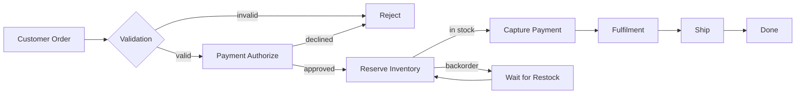
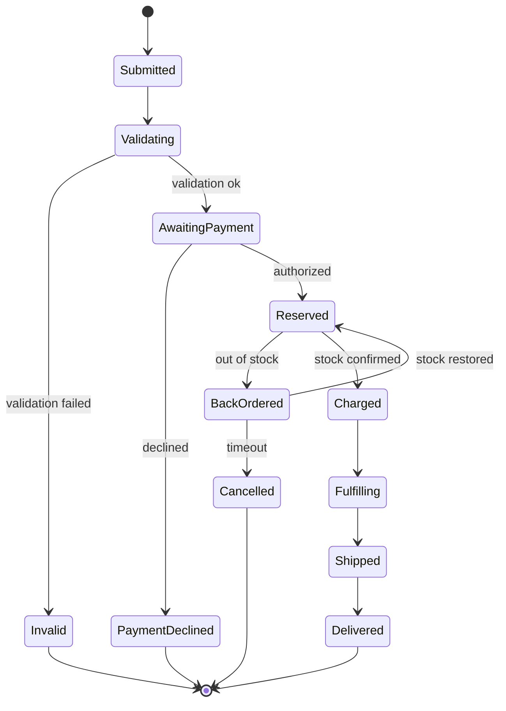
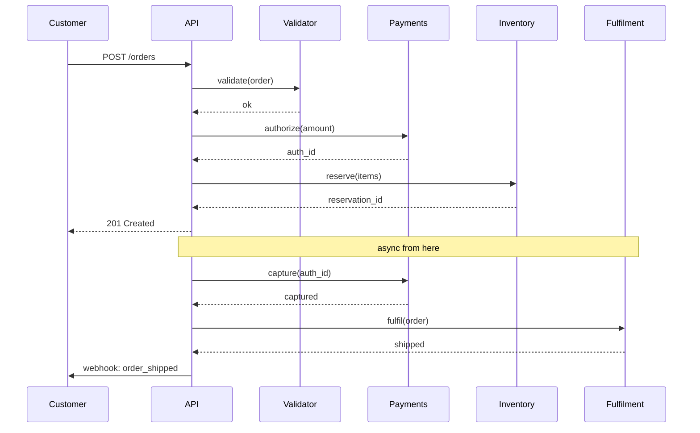
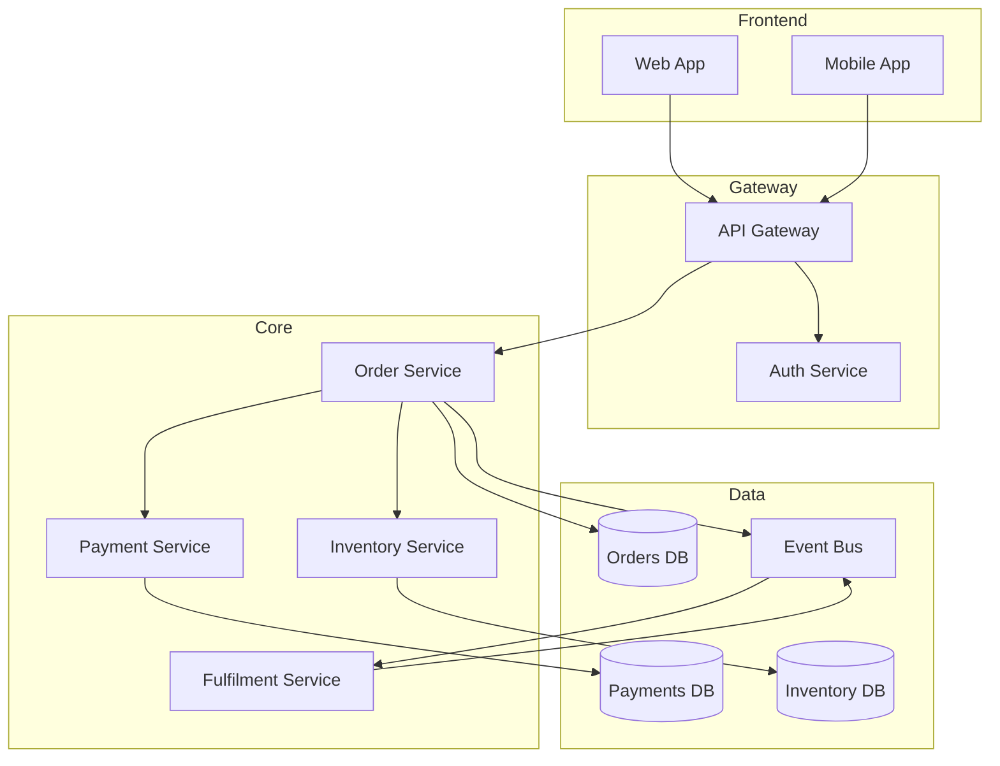
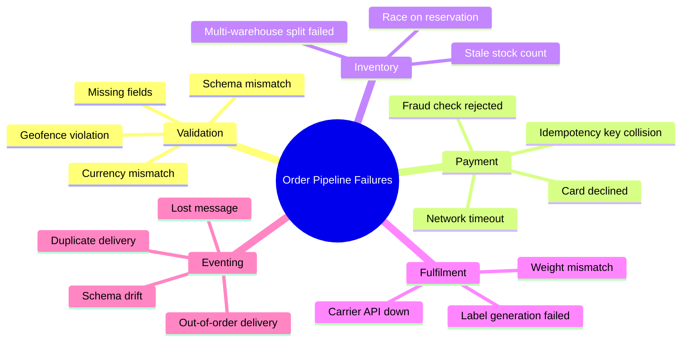

# System Diagrams — Order Processing Pipeline

## High-Level Flow

The order processing pipeline has three stages: validation, payment,
fulfilment. Each stage emits domain events that downstream services
react to asynchronously.

The choice to authorize-then-capture (rather than charge once) lets us
handle partial fulfilment cleanly. If we run out of stock between
authorization and capture, we void the authorization rather than refund.

## State Machine of an Order

Note that an order in `Reserved` state has authorized payment but not
captured funds. Authorisations expire after 7 days at most card networks.

## Sequence: Successful Order

## Component Diagram

The runtime topology is small but the failure modes are not:

## Failure Mode Map

## Notes

These diagrams are kept here as the canonical source. Code references
this file in PR descriptions ("update PaymentService — see
[[mermaid_heavy#Component Diagram]]"). When the architecture changes,
update the diagram first, then the code.
