## Part 1

Source note: [[The Prince (Part 1)]]

Original range: lines 1-63
Original chars: 0-8496

<!-- source: The Prince (Part 1).md -->

### 本部分建立馬基維利政治思想的歷史與個人背景，將其著作與佛羅倫斯從美第奇盛世、共和政體到美第奇復辟的動盪歷史相結合。

#### 摘要

本文件為經典政治學著作《君主論》（The Prince）的開篇部分，包含 Project Gutenberg 的版權聲明、書目資訊、完整的章節目錄，以及作者尼科洛·馬基．維利（Niccolo Machiavelli）的生平簡介與導論。內容涵蓋了馬基維利生命的三個重要階段：青年時期（受美第奇家族影響）、任職時期（佛羅倫斯共和國時期）以及文學與晚年時期（美第奇家族復辟與流亡）。

#### 翻譯內文

##### 《君主論》
**Project Gutenberg 電子書**

本電子書可供美國及世界其他大部分地區的任何人免費使用，且幾乎不受任何限制。您可以根據隨附於本書或在 [www.gutenberg.org](https://www.gutenberg.org/) 線上提供的 Project Gutenberg 授權條款進行複製、贈送或重新使用。如果您不在美國境內，在使用本電子書前，您必須檢查您所在地國家的法律。

**書名**：君主論 (The Prince)
**發佈日期**：2006 年 2 月 11 日 [電子書編號 #1232]
**最近更新**：2024 年 10 月 29 日
**語言**：英語
**其他資訊與格式**：[www.gutenberg.org/ebooks/1232](https://www.gutenberg.org/ebooks/1232)
**致謝**：John Bickers, David Widger 及其他人員

*** Project Gutenberg 電子書《君主論》開始 ***

#### 君主論
**作者：尼科洛·馬基維利 (Nicolo Machiavelli)**
**譯者：W. K. Marriott**

---

##### 目錄

[導論](#pref01) [青年時期：1-25 歲—1469-94](#pref02) [任職時期：25-43 歲—1494-1512](#pref03) [文學與逝世：43-58 歲—1512-27](#pref04) [此人及其著作](#pref05) [獻詞](#pref06)

**【君主論】**
*   **第一章**：君主政體之種類及其取得手段
*   **第二章**：論世襲君主政體
*   **第三章**：論混合政體
*   **第四章**：論亞歷山大征服大流士王國後，其繼承者為何未遭反叛
*   **第五章**：論對於併吞前原屬自主法律之城市或政體之治理方式
*   **第六章**：論憑藉自身武力與才能取得之新政體
*   **第七章**：論憑藉他人武力或藉由運氣取得之新政體
*   **第八章**：論透過不義手段取得政體之人
*   **第九章**：論公民政體
*   **第十章**：論衡量各類政體強度之方法
*   **第十一章**：論教會政體
*   **第十二章**：部隊之種類及其傭兵問題
*   **第十三章**：論增援部隊、混合部隊及自有部隊
*   **第十四章**：論君主在戰爭議題上之應對
*   **第十五章**：論人們（尤其是君主）受稱頌或受指責之事由
*   **第十六章**：論慷慨與吝嗇
*   **第十七章**：論殘忍與仁慈，以及受人愛戴或受人畏懼孰優孰劣
*   **第十八章**：論君主應如何信守諾言
*   **第十九章**：論應避免受人輕視與怨恨
*   **第二十章**：堡壘及君主常用之其他手段，究竟是有利還是有害？
*   **第二十一章**：君主應如何行事以贏得聲望
*   **第二十二章**：論君主之秘書
*   **第二十三章**：應如何避免諂媚之徒
*   **第二十四章**：論義大利諸君主為何喪失其國土
*   **第二十五章**：命運在人類事務中之影響，以及如何抵禦命運
*   **第二十六章**：呼籲將義大利從蠻族手中解放出來

**【關於瓦倫蒂諾公爵以謀殺維泰洛佐·維泰利、奧利維羅托·達·費爾莫、西尼奧·帕戈洛及格拉維納公爵奧西尼之手段描述】**
**【盧卡人卡斯特魯喬·卡斯特拉卡尼之生平】**

*尼科洛·馬基維利，1469 年 5 月 3 日生於佛羅倫斯。1494 年至 1512 年間，於佛羅倫斯擔任公職，職責包括前往歐洲各國進行外交任務。1512 年於佛羅倫斯入獄；隨後遭流放，後返回聖卡西亞諾。1527 年 6 月 22 日逝世於佛羅倫斯。*

---

#### 導論

尼科洛·馬基維利於 1469 年 5 月 3 日出生於佛羅倫斯。他是著名的律師貝納多·迪·尼科洛·馬基維利（Bernardo di Nicolo Machiavelli）與其妻巴托洛梅亞·迪·史蒂芬諾·內利（Bartolommea di Stefano Nelli）的次子。雙親皆為佛羅倫斯舊貴族成員。

他的生命自然可分為三個時期，而每一個時期都極其顯著地構成佛羅倫斯歷史中一個獨特且重要的時代。他的青年時期正值佛羅倫斯在羅倫佐·德·美第奇（Lorenzo de’ Medici，即「華麗者」）的領導下，作為義大利強權的鼎盛時期。1494 年，美第奇家族在佛羅倫斯倒台，同年馬基維利進入公職生涯。在他的任職期間，佛羅倫斯在共和政體下維持自由，此狀態一直持續到 1512 年美第奇家族重新掌權，馬基維利隨之失去官職。美第奇家族從 1512 年起再次統治佛羅倫斯，直到 1527 年再次被驅逐。這段時期是馬基維利文學活動與影響力日益增長的時期；但他於美第डीसी家族被驅逐後僅幾週，即在 58 歲那年（1527 年 6 月 22 日）逝世，未能重返官位。

#### 青年時期：1469-1494（1-25 歲）

雖然關於馬基維利青年時期的記載不多，但當時的佛羅倫斯已廣為人知，因此可以輕易想像這位代表性公民早期的成長環境。佛羅銳斯曾被描述為一座存在著兩種相反生命潮流的城市：一種由狂熱且嚴厲的薩佛拿洛拉（Savonarola）所主導；另一種則由熱愛華麗的羅倫佐（Lorenzo）所主導。薩佛拿洛拉對年輕馬基維利的影響必定微乎其微，因為儘管他曾一度對佛羅倫斯的命運握有巨大的權力，但他僅在《君主論》中成為馬基維利嘲諷的對象，被引用為一個「沒有武力武裝的先知」且最終下場悲慘的例子。相比之下，羅倫佐統治時期的美第奇式輝煌似乎給馬基維利留下了深刻印象，因為他在著作中頻繁提及此時，且《君主論》正是獻給羅倫佐的孫子的。

馬基維利在其《佛羅倫斯史》中，為我們描繪了他青年時代所處的年輕人群像。他寫道：「他們的衣著與生活比祖先更加自由，在其他種種放縱行為上花費更多，將時間與金錢耗費在懶散、賭博與女色之上；他們的主要目標是穿著得體，並展現機智與敏銳，而那些能最巧妙地傷害他人的人，則被認為是最睿智的。」在給兒子圭多（Guido）的一封信中，馬基維利說明了青年人應如何利用學習的機會，並讓我們推論出他自己的青年時期也是如此充實。他寫道：「我收到了你的信，這讓我感到極大的快樂，特別是得知你的健康已完全恢復，這對我來說是最好的消息；因為如果上帝賜予你我生命，只要你願意盡到你的責任，我希望能將你培養成一個正直的人。」接著，在提到一位新的贊助人時，他繼續寫道：「這對你會有好處，但學習是必要的；既然你現在不再有生病的藉口，請務必努力學習文學與音樂，因為你看見了我僅憑微小的技能所獲得的榮耀。因此，我的兒子，如果你想讓我高興，並為你自己帶來成功與榮耀，請務必勤學，因為如果你能自力更生，他人自然會幫助你。」

#### 任職時期：1494-1512（25-43 歲）

馬基維利生命的第二個時期是在佛羅倫斯自由共和國任職。如前所述，該共和國從 1494 年美第奇家族被驅逐到 1512 年其復辟期間，正處於繁榮時期。在某個公職部門服務四年後，他被任命為「自由與和平第二書記處」的書記官與秘書。在處理馬基維利生平事件時，我們此時擁有堅實的史料基礎，因為在此期間他參與了共和國事務的核心，我們有其法令、紀錄與公文可供參考，同時也有他本人的著作。僅僅回顧他與當時政治家及軍事將領的幾次往來，便足以展現他的活動範圍，並為他撰寫《君主論》時所引用的經驗與人物提供了素材來源。

#### 詞彙與關鍵術語

| 英文原文 | 繁體中文翻譯 | 語境說明 |
| :--- | :--- | :--- |
| Principalities | 君主政體 / 公國 | 指由單一統治者掌控的領土與政體。 |
| Hereditary | 世襲的 | 指透過血緣繼承權力。 |
| Mixed Principalities | 混合政體 | 指將原有的領土併入新領土後形成的政體。 |
| Arms | 武力 / 軍隊 | 在馬基維利的語境中，常指軍事力量或武裝手段。 |
| Mercenaries | 傭兵 | 受僱於他人、僅為報酬而戰的軍隊。 |
| Auxiliaries | 增援部隊 / 輔助部隊 | 指由盟友提供的軍事支援，通常被馬基維利視為危險。 |
| Clemency | 仁慈 / 寬大 | 指統治者對臣民或戰俘的寬容態度。 |
| Cruelty | 殘忍 | 指統治者使用暴力或嚴厲手段維持秩序。 |
| Republic | 共和國 | 指不以君主為核心，由公民或代表參與治理的政體。 |

#### 文化與語境解析

1.  **美第奇家族與佛羅倫斯政治**：馬基維利的生平與美第奇家族的興衰緊密相連。羅倫佐·德·美第奇（Lorenzo the Magnificent）的統治象徵著佛羅倫斯的文化與政治巔峰，而美第奇家族的復辟則象徵著共和精神的終結與馬基維利個人政治生涯的轉折。
2.  **薩佛拿洛拉（Savonarola）的對比**：薩佛拿洛拉是一位激進的宗教改革者，其嚴厲的道德主義與美第奇家族的世俗輝煌形成強烈對比。馬基維利在《君主論》中將其視為「無武裝的先知」，這反映了他對「政治權力必須具備武力支撐」的核心觀點。
3.  **政治哲學的轉向**：馬基維利在書中探討的「仁慈與殘忍」、「愛戴與畏懼」等議題，標誌著政治學從傳統的道德倫理學（強調統治者應具備美德）轉向了現實主義（強調統治者應根據實際需求採取手段）。

#### 內容邏輯圖

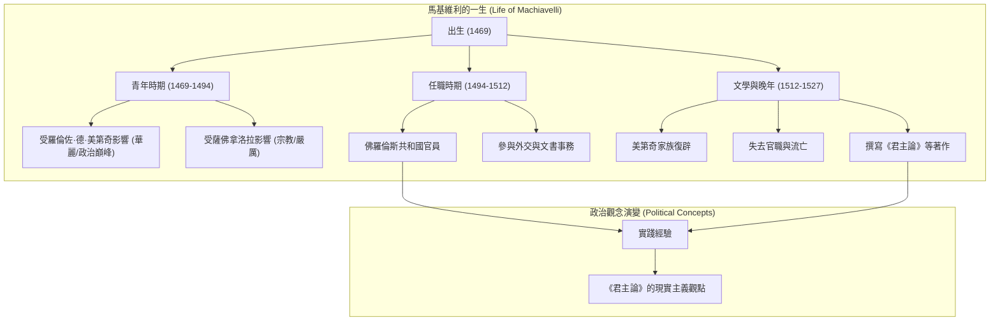

---

## Part 2

Source note: [[The Prince (Part 2)]]

Original range: lines 59-86
Original chars: 7474-15715

<!-- source: The Prince (Part 2).md -->

### The empirical foundations of *The Prince* were forged through Machiavelli's direct diplomatic observations of Italian and European power dynamics, later synthesized through a scholarly immersion in classical antiquity during his political exile.

#### 摘要

本篇文本詳細描述了尼科洛·馬基維利（Niccolò Machiavelli）生命的兩個重要階段：第一是他在佛羅倫斯共和國擔任公職的時期（1494–1512），以及第二是美第奇家族復辟後，他隱居於聖卡西亞諾並投身文學創作的時期（1512–1527）。文中透過馬基維利的外交經歷，揭示了《君主論》中核心觀念的來源，包括對切薩雷·波吉亞（Cesare Borgia）權力手段的觀察、對教宗朱利亞諾二世（Julius II）政治手腕的見證，以及他如何透過閱讀古典文獻，在精神上與古人對話，進而完成對君主政體的研究。

#### 翻譯內文

「……如果你想取悅我，並為自己帶來成功與榮耀，就請行事端正並勤於學習，因為如果你能成就自己，他人亦會助你。」

#### 公職時期 —— 25至43歲 —— 1494–1512年

馬基維利生命的第二時期，是在佛羅驗斯自由共和國任職期間度過的。如前所述，該共和國從 1494 年美第奇家族被驅逐，一直繁榮到 1512 年他們重新掌權。在擔任其中一個公職長達四年後，他被任命為「自由與和平第二官署」（Second Chancery of the Ten of Liberty and Peace）的尚書與秘書。在處理馬基維利生平事件時，我們此時的論述是建立在堅實基礎上的，因為在此期間，他深度參與了共和國的政務；我們不僅有當時的法令、紀錄與公文可供參考，還有他本人的著作作為指引。僅僅回顧他與當時政治家及將領的幾次往來，便足以清楚展現他的活動軌跡，並提供他從中汲取經驗、用以充實《君主論》案例與人物特徵的素材來源。

他的第一次外交任務發生在 1499 年，前往拜訪卡特里娜·斯福札（Caterina Sforza，即《君主論》中的「福爾利夫人」）。他從她的行為與命運中得出了一個道德教訓：贏得人民的信任遠比依賴堡壘更為重要。這是馬基維利思想中一個非常顯著的原則，且他在許多地方都強調這是對君主至關重要的事。

1500 年，他被派往法國，旨在與路易十二（Louis XII）達成協議，以繼續對皮薩（Pisa）的戰爭。正是這位國王在處理義大利事務時，犯下了《君驗論》中所總結的五項重大政略錯誤，進而導致被驅逐出義大利。此外，這位國王也曾以解除婚姻關係作為支持教宗亞歷山大六世（Pope Alexander VI）的條件；這也導致馬基維利在論及那些主張應遵守承諾的人時，會引用他關於「君主信譽」的論述。

馬基維利的公眾生活，很大程度上圍繞著教宗亞歷山大六世及其子——切薩雷·波吉亞（Cesare Borgia，即瓦倫提諾公爵）的野心所引發的事件，這些人物在《君主論》中佔據了極大的篇幅。馬基維利從不吝於引用這位公爵的行動，來作為那些企圖保住篡奪領土者的參考範例；事實上，他找不到比切薩雷·波吉亞的行為模式更完美的準則了，以至於有些評論家甚至稱切薩雷為《君主論》中的「英雄」。然而，在《君主論》中，這位公爵實際上被視為一種「依附他人運勢而興起，並隨之衰落」的人物典型；他採取了所有一個謹慎的人可能會採取的手段，卻唯獨沒有採取能自救的手段；他對所有可能發生的情況都做好了準備，卻唯獨沒料到正在發生的變故；當他所有的能力都無法支撐局面時，他便哀嘆這並非他的過錯，而是某種超乎預期且不可預見的命運。

1503 年，在皮烏斯三世（Pius III）逝世後，馬基維利被派往羅馬觀察繼任者的選舉。在那裡，他目睹了切薩雷·波吉亞如何透過欺詐手段，使樞機主教團的選擇落在了朱利亞諾·德拉·羅維雷（Giuliano delle Rovere，即朱利亞諾二世）身上，而後者正是最恐懼這位公爵的樞機主教之一。馬基維利在評論這次選舉時說，若有人認為新的恩寵能讓權臣忘卻舊日的傷害，那他是在自欺欺人。朱利亞諾二世直到摧毀了切薩雷，才肯罷休。

1506 年，馬基維利再次被派往朱利亞諾二世麾下，當時這位教宗正開始對博洛尼亞（Bologna）發動征討；由於教宗那種衝動的性格，他成功地完成了這項任務，正如他完成許多其他冒險一樣。正是透過對朱利亞的描述，馬基維利對「運勢（Fortune）與女性的相似性」進行了哲理性的論述，並得出結論：在面對兩者時，唯有果敢而非謹慎的人，才能贏得並掌控它們。

此處無法一一追蹤 1507 年義大利各邦國變幻莫測的命運，當時這些國家受控於法國、西班牙與德意志，其影響力一直持續到今日；我們關注這些事件及其中的三位大人物，僅限於這些事件如何影響馬基維利的個人特質。他曾多次會見法國的路易十二，且對這位君主性格的評價已在前文提及。馬基維利將阿拉貢的斐迪南（Ferdinand of Aragon）描繪成一個在宗教掩護下成就大事的人，但實際上他既無仁慈、亦無信義、人性或正直；若他曾受此類動機影響，恐怕早已毀滅。皇帝馬克西米利安（Maximilian）是那個時代最有趣的人物之一，其性格已被多方描繪；但馬基維利在 1507 至 1508 年擔任其朝廷使節期間，揭示了他多次失敗的秘密：他將其描述為一個深沉寡言、缺乏魄力的人——忽視了推動其計劃所需的各種人力因素，且從未堅持要求其願望得到實現。

馬基維利官職生涯的剩餘歲月，充滿了因「坎布雷盟約」（League of Cambrai）而起的事件。該盟約於 1508 年由上述歐洲三大強權與教宗共同簽署，旨在摧毀威尼斯共和國。這一結果在瓦伊拉戰役（Battle of Vaila）中達成，威尼斯在一天之內失去了八百年來所獲得的一切。在這些事件中，佛羅倫斯扮演了艱難的角色，因為教宗與法國之間的衝突使局勢變得複雜，而佛羅倫斯的政策一直以來都傾向於與法國結盟。當 1511 年朱利亞諾二世最終組成「神聖同盟」對抗法國，並在瑞士傭兵的協助下將法國人趕出義大利時，佛羅倫斯便任由教宗擺佈，不得不接受其條件，其中一項便是恢復美第奇家族的統治。1512 年 9 月 1 日，美第奇家族重返佛羅倫斯，隨之而來的共和國倒台，成為馬基維利及其友人被解職的信號，也結束了他的公職生涯；正如我們所見，他去世時仍未能重返官位。

#### 文學與晚年 —— 43至58歲 —— 1512–1527年

隨著美第奇家族的回歸，馬基維利曾徒勞地希望在新主人的統治下能留任數週，但最終於 1512 年 11 月 7 日被下令解職。不久後，他被指控參與了一場針對美第奇家族的失敗陰謀，遭到監禁並接受酷刑審訊。新任的美第奇教宗利奧十世（Leo X）促成了他的釋放，隨後他退隱至佛羅倫斯附近的聖卡西亞諾（San Casciano）小莊園，全身心投入於文學創作。在 1513 年 12 月 13 日寫給弗朗切斯科·維托里（Francesco Vettori）的一封信中，他對這段時期的生活進行了非常有趣的描述，這也闡明了他撰寫《君誠論》的方法與動機。在描述了與家人及鄰居的日常活動後，他寫道：

「傍晚時分，我回到家中，進入書房；在門口，我脫下沾滿塵土與污穢的農夫服裝，換上華麗的宮廷盛裝；就這樣穿戴整齊地，我步入了古人的殿堂，在那裡受到他們的熱情接待，並享用著唯有我能享用的精神食糧；在那裡，我能毫無顧忌地與他們交談，並詢問他們行為背後的動機，而他們也會慈悲地回答我；在那裡，四個小時的時光我都不覺疲倦，忘卻了所有煩惱，貧窮不再令我沮喪，死亡也不再令我恐懼；我完全被那些偉大的人物所佔據。正如但丁所言：

『知識源於勤奮的學習，
否則終將徒勞無功。』

我將從他們的對話中獲得的感悟記錄下來，並撰寫了一部關於『君主政體』的小作品，我在其中盡情地傾注了對此主題的冥想，討論了什麼是君主政體、其種類、如何獲取、如何維持，以及為何會失去。如果我的任何構想曾令你感到愉悅，那麼這部作品也不應令你反感；對於一位君主，特別是新任君主來說，這應是值得歡迎的。因此，我將此書獻給偉大的朱利亞諾。菲利波·卡薩韋基奧（Filippo Casavecchio）已經看過此書；他能告訴你書中的內容，以及我與他討論的內容；儘管如此，我仍在不斷地充實與潤飾它。」

#### 詞彙與關鍵術語

| 英文原文              | 繁體中文翻譯    | 語境說明                  |
| :---------------- | :-------- | :-------------------- |
| Chancellor        | 尚書 / 大臣   | 指馬基維利在共和國政府中的高級官職。    |
| Chancery          | 官署 / 書記處  | 負責處理文書與外交事務的政府部門。     |
| Usurper           | 篡位者       | 指透過非正當手段奪取政權的人。       |
| Statecraft        | 政略 / 政治手腕 | 治理國家與處理政治事務的藝術與技巧。    |
| Fortune (Fortuna) | 運勢 / 命運   | 在馬基維利思想中，指不可預測的變數與機遇。 |
| Principality      | 君主政體 / 領地 | 指由單一君主統治的政治實體。        |

#### 文化與語境解析

1.  **「農夫服裝」與「宮廷盛裝」的隱喻**：
    馬基維利在信中描述脫下「農夫服裝」換上「宮廷盛裝」，這不僅是物理上的更衣，更是一種精神上的昇華。農夫服裝象徵著他在現實世界中卑微、貧困且受政治鬥爭折磨的身份；而宮廷盛裝則象徵著他進入了由古典文獻構成的「精神宮廷」，與但丁、古羅馬政治家等偉人進行跨時空的對話。這種隱喻展現了他如何透過文學來尋求政治智慧的救贖。

2.  **歷史人物的政治原型**：
    文中提到的歷史人物在《君主論》中皆具備原型功能。例如，切薩雷·波吉亞（Cesare Borgia）代表了「依靠能力與手段建立政權」的典型；而路易十二則代表了「因錯誤政略導致失敗」的反面教材。馬基維利將外交觀察轉化為政治理論，使《君主論》具有極強的實證主義色彩。

3.  **美第奇家族的政治循環**：
    文本強調了美第奇家族的「回歸」與「驅逐」交替，這反映了當時義大利半島政局的不穩定性。這種權力結構的劇烈變動，正是馬基維利研究「政權如何建立與維持」的核心動機。

#### 邏輯結構圖

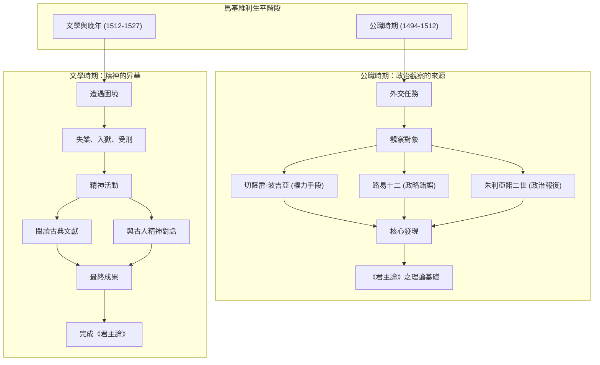

---

## Part 3

Source note: [[The Prince (Part 3)]]

Original range: lines 81-110
Original chars: 14693-23366

<!-- source: The Prince (Part 3).md -->

### This part traces the transformation of Machiavelli's writings from early drafts to established historical works, evaluates his personal failures in political practice against his literary success, and defends the enduring relevance of his political realism.

#### 摘要

本篇文本記述了尼科洛·馬基維利（Niccolò Machiavelli）晚年的生活軌跡、著作演變及其政治思想的歷史地位。內容涵蓋了《君主論》（*The Prince*）從最初的草稿《公國論》（*Principalities*）到最終成書的變遷過程，以及他與美第奇家族（Medici）複雜的政治互動。此外，文本深入探討了馬基驗利個人性格的矛盾性——既是一位觀察敏銳、勤奮好學的學者，也是一位在政治實務上屢遭挫敗、甚至被視為「不義巫師」的人物。最後，文本評價了其思想的永恆價值：儘管其手段被認為缺乏道德，但他對權力運作真相的揭露，至今仍是研究統治者與被統治者關係的核心課題。

#### 翻譯內文

（接續前文）……與他們交談，並詢問其行為之由，他們以仁慈之姿回應我；與他們共處四個小時，我亦不覺疲憊，忘卻了所有煩憂，貧窮不再令我沮喪，死亡亦不足懼；我彷彿完全被那些偉大的人物所附身。正如但丁所言：

「知識源於良好的學習與記憶，
否則，徒勞無功。」

因此，我將從他們的對談中所獲得的養分悉心記錄，並撰寫了一部關於「公國」（Principal驗）的小作。我在其中盡情地傾注思緒，對該主題進行深思，討論何謂公國、其種類為何、如何獲得、如何維持，以及為何會失落。若我的任何臆測能令您悅納，願此書不至令您反感；對於一位君主，尤其是新任君主而言，這應是值得歡迎的。因此，我將此書獻給尊貴的朱利亞諾（Giuliano）。菲力波·卡薩韋基奧（Filippo Casavecchio）已閱覽此書，他能向您轉述書中內容以及我與他的論述；儘管如此，我仍在不斷充實並磨練此作。」

這部「小書」在呈現為我們今日所見的形式之前，經歷了多次變遷。其撰寫過程中受到多種思想影響；書名與贊助人亦曾更迭；且出於不明原因，最終獻給了洛倫佐·德·美第奇（Lorenzo de’ Medici）。雖然馬基維利曾與卡薩韋基奧討論應親自送達或委託送達贊助人，但並無證據顯示洛倫佐曾收到或閱讀過此書；且他肯定從未給予馬基維利任何職務。雖然《君主論》在馬基維利生前便遭人剽竊，但他本人從未出版此書，其文本內容至今仍有爭議。

馬基維利在給維托里（Vettori）的信末如此總結：「至於這件小事［他的書］，待其讀完後，人們便會發現，在我致力於研究治國術的這十五年裡，我既未曾懈怠，也未曾荒廢；而人們理應渴望受僱於一位能從他人的經驗中獲益的人。對於我的忠誠，無人可以懷疑，因為我始終恪守信義，如今已不知如何背信；因為像我這樣始終誠實可靠的人，是無法改變本性的；而我的貧窮，便是對我誠實的最佳見證。」

在處理完《君主論》的稿件後，馬基維利開始著手撰寫《李維史篇論》（*Discourse on the First Decade of Titus Livius*），此書應與《君主論》併讀。這些以及其他幾部次要著作一直伴隨著他，直到 1518 年，他接受了一項小規模的委託，負責照管幾位在熱那亞的佛羅倫斯商人的事務。1519 年，佛羅倫斯的美第奇統治者向市民授予了一些政治特權，馬基維利等人受邀參與討論新的憲法，旨在恢復大議會（Great Council）的地位；但由於種種藉口，該憲法最終未能頒布。

1520 年，佛羅倫斯商人再次向馬基維利求助，以解決他們與盧卡（Lucca）之間的糾紛；但這一年最顯著的成就，是他重新回歸佛羅倫斯的文壇，受到眾人追捧，同時也完成了《戰爭的藝術》（*Art
Art of War*）。同年，他受樞機主教德·美第奇（Cardinal de’ Medici）之託，開始撰寫《佛羅倫斯史》（*History of Florence*），這項任務一直持續到 1525 年。他重獲大眾青睞，或許正是促使美第奇家族給予他這項工作的關鍵，因為一位老作家曾觀察到：「一位失業的能幹政治家，若沒有空桶可以把玩，就像一頭巨大的鯨魚，會試圖掀翻整艘船。」

當《佛羅倫斯史》完稿時，馬基維利將其帶往羅馬，呈獻給他的贊助人朱利亞諾·德·美第奇，此時的朱利亞諾已成為教宗克勉七世（Clement VII）。令人驚訝的是，1513 年馬基維利在美第奇家族剛奪回佛羅倫斯政權時，撰寫《君主論》以供其參考；而到了 1525 年，當該家族的覆滅已近在咫尺時，他卻將《佛羅倫斯史》獻給了家族的首領。那一年，帕維亞戰役（Battle of Pavia）摧毀了法國在義大利的統治，使法王法蘭西一世（Francis I）淪為宿敵查理五世（Charles V）的俘虜。隨之而來的羅馬劫掠（Sack of Rome）消息，促使佛羅倫斯的民粹派推翻了美第奇的枷鎖，使其再次被驅逐。

馬基維利當時不在佛羅倫斯，但他匆忙趕回，希望能重返「自由與和平十人會議」（Ten of Liberty and Peace）的秘書職位。不幸的是，抵達佛羅倫斯後不久他便病倒，並於 1527 年 6 月 22 日逝世。

#### 此人及其著作

無人能確切知曉馬基維利的遺骨安放在何處，但現代佛羅倫斯已在聖十字大教堂（Santa Croce）為他豎立了一座莊嚴的紀念碑，與她最著名的子嗣並列；這表明，無論其他國家從他的著作中發現了什麼，義大利卻從中發現了民族統一的理念，以及在歐洲諸國中復興的萌芽。雖然抗議他的名聲在世界範圍內帶來的負面影響是徒勞的，但可以指出的是，這種惡名所暗示的嚴酷教條，在他所處的時代其實並不為人所知；而近期的研究使我們能夠以更理性的方式來詮釋他。正是透過這些探究，長期困擾人們視覺的「不義巫師」形象，才開始逐漸消散。

馬基維利無疑是一位具備極強觀察力、敏銳度與勤奮精神的人；他以欣賞的眼光注視著眼前的一切，並憑藉其卓越的文學天賦，在被迫從政退隱期間將這些觀察轉化為成就。他既不自詡，其同時代的人也未將他描繪成那種罕見的、成功結合了政治家與作家的典範，因為他在各項外交與政治任職中的經濟狀況僅算中等。他曾被卡特琳娜·斯福札（CCatherina Sforza）誤導，被路易十二（Louis XII）忽視，並被切薩雷·波吉亞（Cesare Borgia）威懾；他的幾次外交任務幾乎毫無成果；他強化佛羅倫斯的嘗試宣告失敗，而他招募的士兵因其懦弱而令眾人震驚。在處理個人事務時，他顯得畏縮且投機；他不敢出現在對他恩重如山的索德里尼（Soderini）身邊，唯恐自身受累；他與美第奇家族的關係也易受猜疑；而朱利亞諾似乎也看出了他的真實長處，因此讓他撰寫《佛羅倫斯史》，而非委以政務。唯有在文學特質這一方面，我們才找不到任何弱點或失敗。

儘管近四個世紀的光芒都聚焦在《君主論》上，但其問題至今仍具爭議且引人入勝，因為這些是統治者與被統治者之間永恆的課題。就其本身而言，其倫理觀反映了馬基維利同時代人的價值觀；然而，只要歐洲的政權仍依賴物質力量而非道德力量，其思想便稱不上過時。其記載的歷史事件與人物，因馬基於其中用以闡述其政府與行為理論的用途，而變得極具研究價值。

撇開那些至今仍為部分歐洲與東方政治家提供行動準則的治國格言不談，《君主論》中遍布著隨處可證的真理。人類依然會因其單純與貪婪而受騙，正如在亞歷山大六世（Alexander VI）時代一樣。宗教的外衣依然掩蓋著馬基維利在斐迪南德·阿拉貢（Ferdinand of Aragon）性格中所揭露的惡習。人們不會如實看待事物，而是如其所願地看待事物——進而走向毀滅。在政治中，不存在絕對安全的策略；審慎在於選擇風險最小的方案。接著——上升到更高的層面——馬基維利重申，雖然犯罪可以贏得帝國，卻無法贏得榮耀。必要的戰爭即是正義的戰爭，當一個國家除了戰鬥別無他法時，其武力便是神聖的。

雖然「政府應被提升為一種活生生的道德力量，能夠激發人民對社會基本原則的正義認同」這種訴求出現於比馬基維利更晚的時代，但《君主論》對這種「高尚論點」的貢獻微乎其微。馬基維利始終拒絕以任何偏離現實的方式去書寫人類或政府，他以如此精湛的技巧與洞察力進行書寫，使其作品具有永恆的價值。然而，賦予《君主論》超越藝術或歷史興趣的，是其不容置疑的真理：它探討了那些至今仍引導著國家與統治者之間、以及國家與鄰國之間關係的宏大原則。

#### 詞彙與關鍵術語

| 英文原文 | 繁體中文翻譯 | 語境說明 |
| :--- | :--- | :--- |
| Principalities | 公國 / 君主政體 | 指代馬基維利早期研究的政體類型。 |
| Statecraft | 治國術 / 政治手段 | 指運用政治智慧與手段來管理國家的技術。 |
| Vicissitudes | 變遷 / 滄桑 | 形容作品或命運經歷的多次起伏與變動。 |
| Unholy necromancer | 不義的巫師 / 邪惡的通靈者 | 用於形容馬基維利因其政治現實主義而遭受的惡名。 |
| The ruled and their rulers | 被統治者與統治者 | 政治學中討論權力結構的核心對象。 |
| Material forces | 物質力量 | 指軍事、經濟等實質性的國家實力，對比道德力量。 |

#### 邏輯結構圖

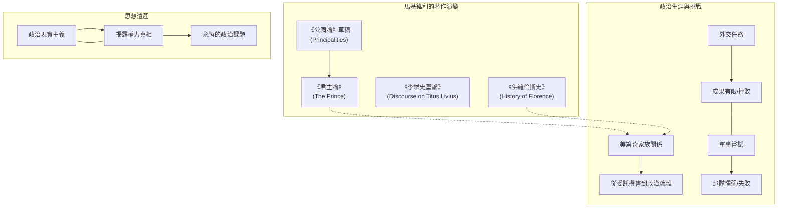

---

## Part 4

Source note: [[The Prince (Part 4)]]

Original range: lines 108-156
Original chars: 22345-31592

<!-- source: The Prince (Part 4).md -->

### 本部分確立了《君主論》作為政治現實主義經典的地位，並初步界定了君主政體的分類與世襲政體的統治穩定性。

#### 摘要

本文件涵蓋了馬基維利（Niccolò Machiavelli）名著《君主論》（*The Prince*）的譯者序言、馬基維利著作清單、致美第奇家族的獻詞，以及書中第一與第二章的內容。譯者在序言中探討了翻譯策略，強調追求原文的「精確字面呈現」而非現代風格的「流暢轉述」，並特別討論了義大利語與英語在歷史語境下的詞義演變（如 *intrattenere* 一詞）。隨後的章節則進入了政治學的核心，論述了政權的分類（共和國與君學政體）以及世襲政體的統治原則。

#### 翻譯內文

##### 譯者論述（節選）

沒有絕對安全的道路；審慎在於選擇風險最小的道路。接著——進一步提升層次——馬基維利重申，雖然罪行可能贏得帝國，卻無法贏得榮耀。必要的戰爭即是正義的戰爭；當一個國家除了戰鬥之外別無他途時，其軍隊便是神聖的。

比起馬基維利時代，更晚近的呼聲主張政府應被提升為一種活生生的道德力量，能夠透過對社會基本原則的正當認同來啟發人民；對於這種「高層次的論點」，《君主論》貢獻甚微。馬基維利始終拒絕以他所見之外的方式來書寫人或政府，且其寫作技巧與洞察力之深，使他的作品具有永恆的價值。然而，賦予《君主論》超越藝術或歷史興趣的，是其不可辯駁的真理：它處理的是至今仍指導著國家與統治者之間，以及國家與鄰國之間關係的偉大原則。

在翻譯《君主論》時，我的目標是不惜一切代價追求對原文精確的字面呈現，而非為了適應現代風格與表達習慣而進行流暢的意譯。馬基川利並非輕易玩弄文字的人；他寫作時的環境迫使他必須斟酌每一個字；他的主題崇高，內容莊重，風格則高貴而樸素。在《君主．論》中，可以確切地說，不僅每個字都有其理由，甚至每個字的位置也都有其用意。對於莎士比亞時代的英國人來說，翻譯此類論著在某些方面是相對容易的，因為當時英語的天賦與義大利語極其相似；但對於今日的英國人而言，事情並非如此簡單。舉一個例子：馬基維利用 *intrattenere* 一詞來表示羅馬元老院對希臘弱小國家的政策，對於伊莉莎白時代的人來說，可以正確地譯為「entertain」（款待/維持），當時的讀者能理解「羅馬 *entertained*（維持了與）埃托利亞與阿凱亞的關係，且未增加其力量」的意思。但到了今天，這樣的片語會顯得過時且含糊，甚至毫無意義：我們被迫必須說「羅馬與埃托利亞維持了友好關係」等等，用四個字來完成原本一個字的工作。我已在絕對忠於原意的基礎上，盡力保留義大利語那種精煉簡潔的特質。如果結果偶爾顯得生澀，我只能希望讀者在渴望理解作者原意的過程中，能忽略通往真理之路的崎嶇。

##### 馬基維利著作清單（主要作品）

*   **主要著作**：
    *   《論比薩之事》(1499)
    *   《論如何處理叛亂的瓦爾迪基亞人民》(1502)
    *   《論瓦倫蒂諾公爵殺害維泰洛佐·維泰利等人之手段》(150．2)
    *   《論財政供應》(1502)
    *   《第一十年紀》(三韻體詩, 1506)
    *   《論德國之事》(1508-12)
    *   《第二十年紀》(1509)
    *   《論法國之事》(1510)
    *   《李維第十篇紀》(三卷, 1512-17)
    *   **《君主論》(1513)**
    *   《安德里亞》(改編自泰倫斯的喜劇, 1513?)
    *   《曼德拉戈拉》(五幕散文喜劇, 1513)
    *   《論語言》(對話錄, 1514)
    *   《克里齊亞》(散文喜劇, 1515?)
    *   《貝法洛·大惡魔》(小說, 1515)
    *   《金驢》(三韻體詩, 1517)
    *   《戰爭藝術》(1519-20)
    *   《論佛羅倫斯國家之改革》(1520)
    *   《盧卡市大事摘要》(1520)
    *   《盧卡卡斯特魯喬·卡斯特拉卡尼之生平》(1520)
    *   《佛羅倫薩史》(8卷, 1521-5)
    *   《歷史片段》(1525)

##### 獻詞

**致顯赫的洛倫佐·迪·皮耶羅·德·美第奇**

凡致力於獲得君主恩寵之人，習慣於帶著其最珍視之物，或其認為君主最感興趣之物前來謁見；因此，常能見到馬匹、武器、金錦、寶石及類似的裝飾品被呈獻給君主，以彰顯其偉大。

因此，為了向閣下展現我的忠誠，我並未在我的財產中發現任何比「透過對當代事務的長期經驗與對古代的持續研究，所獲得的對偉人行徑之知識」更珍貴或更有價值的事物；經過長期的勤勉思考，我現將其整理成這本小冊子，呈獻給閣下。

儘管我認為這部作品不配呈獻於閣下的尊容之下，但我仍寄望於閣下的仁慈，使其能被接受；因為我無法提供比這更好的禮物，即讓閣下能在最短時間內，理解我在多年來經歷了如此多困難與危險後所學到的一切。我並未用華麗或宏大的辭藻來裝飾這部作品，也沒有用圓滑的句式或任何外在的誘惑來填充；我希望這部作品的價值，要麼來自於它不求任何榮譽，要麼來自於其事物的真實與主題的沉重。

我並不贊同那些認為「地位低下、卑微之人竟敢討論並決定君主事務是一種僭越」的人。因為，正如繪製風景畫的人會置身於平原以觀察山脈與高地的自然，並登上高山以觀察平原；同樣地，要理解人民的本性，需要身處於君主之位；而要理解君主的本性，則需要身處於人民之中。

因此，閣下，請接受這份精神上的小禮物；若閣下能勤勉地閱讀與思考，您將看到我極度渴望您能實現命運與其他特質所承諾的偉大。倘若閣下能從偉大的巔峰偶爾俯瞰這些低窪之地，您將看到我如何如此不應得地承受著命運持續的惡意。

##### 《君主論》第一章與第二章

###### 第一章：政體之種類及其取得手段

凡統治人類之國家與權力，皆為共和國或君主政體。

君主政體分為世襲制（家族已長期立足於此）或新建立的政體。

新建立的政體，或是完全新建立的（如弗朗切斯科·斯福爾扎的米蘭），或是併吞自君主既有世襲領土的一部分（如西班牙國王對那不勒斯王國的併吞）。

如此取得的領土，其人民習慣於受君主統治，或是習慣於自由生活；而其取得手段，則是透過君主自身的武力、他人的武力，或是透過命運或能力。

###### 第二章：關於世襲政體

我將略過關於共和國的討論，因為我曾在別處詳述過，我將僅針對君主政體進行論述。我將遵循上述順序，討論此類政體應如何統治與維持。

我首先要說，維持世襲政體比維持新政體要容易得多，因為人民已長期習慣於君主的家族；只要不違背祖先的習俗，並審慎處理隨之而來的變故，一位能力平庸的君主便足以維持其地位，除非遭遇極其異常且巨大的武力。即便如此，一旦篡位者遭遇不幸，世襲君主仍能奪回政權。

例如，我們在義大利有費拉拉公爵，若非其領土根基深厚，他將無法抵禦 1384 年威尼斯人的攻擊，也無法抵禦教宗朱利亞諾在 1410 年的進攻。因為世襲君主較少有理由與必要去冒犯人民，因此他更容易受到愛戴；除非其極端的惡行導致他被憎恨，否則可以合理地期待臣民對他持有天然的好感。由於統治的悠久與穩定，那些促成變革的記憶與動機都已消逝，因為每一次的變革，往往都會為下一次的變革留下伏筆。

#### 詞彙與關鍵術語

| 術語 (Original) | 翻譯 (Traditional Chinese) | 說明 |
| :--- | :--- | :--- |
| *Intrattenere* | 維持 / 款待 | 義大利語，在歷史語境中指維持外交關係或款待。 |
| Principalities | 君主政體 | 指由單一統治者（Prince）掌權的政體。 |
| Republics | 共和國 | 與君主政體相對，強調集體或制度化權力的政體。 |
| Hereditary | 世襲的 | 指透過家族血緣傳承的政權。 |
| Prudence | 審慎 / 明智 | 指在政治決策中選擇風險最小、最符合長遠利益的智慧。 |

#### 文化解析

1.  **政治現實主義的起源**：
    馬基維利在序言中提到他拒絕「美化」事物，堅持「如其所見」（as he found them）。這標誌著政治學從「道德教化」向「政治現實主義」的轉變。他關注的是權力的實際運作，而非理想化的道德標準。

2.  **語言與權力的關係**：
    譯者提到的 *intrattenere* 案例，揭示了語言演變如何影響政治理解。在外交語境中，一個詞的含義從「款待」轉向「維持關係」，反映了政治溝通從個人化的儀式感向制度化、程序化的轉變。

3.  **美第奇家族的贊助制度**：
    獻詞中展現了典型的文藝復興時期「贊助人制度」（Patronage）。作者透過展示對古代與當代知識的研究，作為一種「智力禮物」來換取政治上的保護或地位，這反映了當時知識分子與權力階層之間共生的關係。

#### 邏輯架構圖

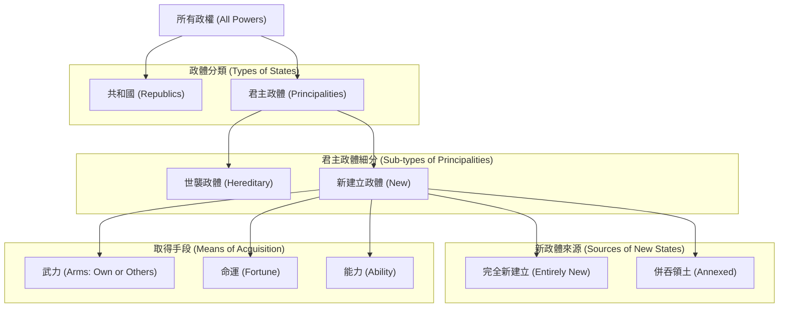

---

## Part 5

Source note: [[The Prince (Part 5)]]

Original range: lines 154-178
Original chars: 30570-39646

<!-- source: The Prince (Part 5).md -->

### 君主在併吞文化或法律不同的新領土（混合政體）時，必須透過降低統治成本、建立直接控制機制及平衡地緣政治，以克服臣民因期望改變而發生的叛亂風險。

#### 摘要

本節內容探討了馬基維利（Niccolò Machiavelli）關於「如何維持新獲得領土」的核心政治理論。重點在於區分「世襲政體」與「混合政體」的治理難度。馬基維利指出，世襲政體因其慣例的延續而較易維持；而混合政體（即在原有領土上增加新領土）則面臨臣民因期望改變而發動叛亂的風險。

文中提出了兩種應對文化差異的策略：一是「親自居住」以即時應對動盪；二是「建立殖民地」以低成本換取忠誠。同時，他強烈批判了依賴「駐軍」而非「殖民地」的做法，認為這會造成沉重的財政負擔並激起民怨。最後，他提出了地緣政治的權力平衡原則：應保護弱小鄰國並削弱強大鄰國，以防止外來勢力的介入。

#### 翻譯內文

（接續前文）……只要不背離祖先的慣例，並能審慎應對新發生的變故，平庸的君主便足以維持其地位，除非遭遇某種極端且過度的武力而失去政權；即便如此，只要篡位者遭遇任何不幸，君主便能重新奪回政權。

例如，在義大利，費拉拉公爵若非其統治根基深厚，便無法抵禦 1384 年威尼斯人的進攻，亦無法抵禦教宗朱利亞諾在 1310 年的攻擊。因為世襲君主較少冒犯臣民的理由與必要性，因此往往更受愛戴；除非其極端的惡行導致被憎恨，否則可以預期臣民對其天然地持有好感。且由於統治時間久遠，那些促成變革的記憶與動機也隨之消逝，因為每一次的變革總會為下一次的變革埋下伏筆。

##### 第三章：論混合政體

然而，困難出現在新建立的政體中。首先，若該政體並非完全全新，而是作為一個「複合政體」的一部分，其困難主要源於所有新政體固有的難題：人們往往樂於更換統治者，寄望於能改善自身的處境，而這種希望促使他們拿起武器對抗現有的統治者；然而這種希望卻令他們受騙，因為事後經驗證明，他們只是從惡變成了更惡。此外，還存在另一種自然且普遍的必然性，即新君主為了鞏固新獲得的領土，必然要向臣民徵收兵役及其他無盡的負擔。

如此一來，凡是在你奪取政體過程中受到你傷害的人，都將成為你的敵人；而那些協助你奪取政權的人，你也無法留住作為盟友，因為你無法滿足他們原本的期望，且你因受制於他們而無法採取強硬手段。因為，即便一個人在武力上非常強大，在進入一個省份時，仍需仰賴當地人的好感。

基於這些原因，法國國王路易十二迅速佔領了米蘭，卻也同樣迅速地失去了它；第一次將他驅逐，僅需洛維科（Lodovical）自身的部隊即可；因為那些為他開啟城門的人，發現自己對未來利益的期望落空，便無法忍受新君主的惡劣待遇。事實確是如此，在第二次奪取叛亂的領土後，領土便不再那麼容易丟失，因為君主會毫不猶豫地利用叛亂的機會來懲處違法者、清除嫌疑人，並在薄弱環節強化自己的統治。因此，法國第一次失去米蘭，僅需洛維科公爵在邊境煽動起義；但若要讓他第二次失去米蘭，則需要舉世來對抗他，並使他的軍隊在義大利被擊敗並驅逐，這便源於上述的原因。

（註：洛維科公爵即洛維科·莫羅，弗朗切斯科·斯福爾札之子，娶了貝亞特里切·埃斯特。他於 1494 年至 1500 年間統治米蘭，並於 1510 年去世。）

儘管如此，米蘭在第一次與第二次都被法國奪走了。第一次的原因已在前文討論；現在仍需說明第二次的原因，並探討在這種情況下，比起法國國王，任何人應具備哪些資源來更穩固地維持其領土。

我必須說，那些在奪取時併入舊政體的領土，若非語言與文化相同，便是不同。若兩者相同，則較易維持，特別是當這些領土不習慣自治時；要穩固地維持，只需剷除原統治家族即可；因為這兩群人在其他方面保留了舊有的條件，且習俗相近，將能和平共處，正如我們在布列塔尼、勃艮第、加斯科尼和諾曼第所見，這些地方長期隸屬於法國；儘管語言可能存在差異，但習俗相近，人民能輕易地融合。併吞者若想維持統治，只需記住兩點：其一，原統治者的家族已滅絕；其規模，其法律與稅收均未改變，如此在極短時間內，新領土便會與舊政體完全合而為一。

然而，若奪取的領土在語言、習俗或法律上有所不同，則會產生困難，需要極大的好運與強大的精力才能維持。其中最有效且真實的助力之一，便是奪取者應親自前往該地居住。這能使地位更穩固且持久，正如土耳其人在希臘的統治一樣，儘管他採取了其他所有手段，但若非親自定居，便無法保住該地。因為，若君主在場，動盪發生時便能即時察覺並迅速補救；若不在場，則只能在動盪擴大後才聞訊，屆時便已無法挽救。此外，領土不會被你的官員掠奪；臣民因能迅速向君主申訴而感到滿意；因此，他們若想從善，便更有理由愛戴君主；若想作亂，則會心生畏懼。任何試圖從外部攻擊該政體的人都必須極其謹慎；只要君主居住於此，便極難被奪走。

另一個更好的方案是，在一個或兩個地點建立殖民地，將其作為該國的關鍵點；因為君主必須採取這種做法，否則就必須在當地駐紮大量的騎兵與步兵。建立殖誠地對君主而言並不昂貴，因為只需極少的開支便能派遣並維持；雖然這會傷害少數失去土地與房屋的公民，但這些被傷害的人因貧困且分散，永遠無法對君主造成傷害；而未受損的其餘人民則容易維持平靜，且因害怕遭遇與被剝奪者相同的命運，反而不敢犯錯。總而言之，我說這些殖民地成本不高、更忠誠、傷害更小，且如前所述，受害者因貧困且分散，無法造成威脅。在此必須指出，人若不被善待，就必須被徹底摧毀，因為輕微的傷害尚能復仇，嚴重的傷害則無法；因此，對人施加的傷害必須是那種不會讓你面臨復仇威脅的程度。

相比之下，若以駐軍取代殖民地，則開支會大得多，必須耗盡該領土的所有收入來供養駐軍，導致領土變成了負擔；且更多的人會感到憤怒，因為整個國家都受到了損害；由於駐軍的頻繁調動，所有人皆深感艱辛，且皆會變得敵對，而這些敵人即便在自家領土上戰敗，仍能造成傷害。因此，各種理由都表明，這種駐軍與殖民地的效用完全相反。

再者，統治文化不同的國家的君主，應致力於成為弱小鄰國的領袖與守護者，並削弱其中強大的鄰國，且要小心不要讓任何與自己實力相當的外來勢力藉機介入；因為一旦出現此類勢力，往往會由那些因野心過大或出於恐懼而不滿的臣民所引入，正如我們之前所見。羅馬人就是被埃托利亞人引入希臘的；在其他任何國家，外來勢力的立足都是由當地居民引入的。事情的常規發展是，一旦強大的外來者進入一個國家，所有附庸國都會因對現任統治者的仇恨而轉向該外來者。因此，對於這些附庸國，君主無需費力爭取，因為他們會迅速集結到他新獲得的勢力之下。他唯一需要做的，就是確保這些附庸國不會獲得過大的權力與權威，如此一來，憑藉他自己的軍隊與他們的認同，他便能輕易地壓制強大的鄰國，從而完全掌控該地區。而未能妥善處理此事務的人，很快就會失去所獲得的一切，且在持有領土期間，將面臨無止盡的困難與麻煩。

#### 詞彙與關鍵術語

| 英文原文 | 繁體中文翻譯 | 語境說明 |
| :--- | :--- | :--- |
| Hereditary prince | 世襲君主 | 指透過血緣繼承王位的統治者，政權較穩定。 |
| Mixed principality | 混合政體 | 指在原有領土基礎上，新併吞了不同文化或法律的領土。 |
| Composite state | 複合政體 | 指由多個不同部分組成的國家或政體。 |
| Colonies | 殖民地 | 馬基維利提倡的低成本、高忠誠度的統治手段。 |
| Garrisons / Armed men | 駐軍 / 武裝部隊 | 指長期駐紮在領土內的軍隊，馬基維利認為其成本高且易招怨。 |
| Customs of his ancestors | 祖先的慣例 | 穩定政權的核心要素，不輕易改變傳統。 |
| Subject states | 附庸國 / 臣屬國 | 在強大政體勢力範圍內，較弱小的鄰近國家。 |

#### 邏輯架構圖

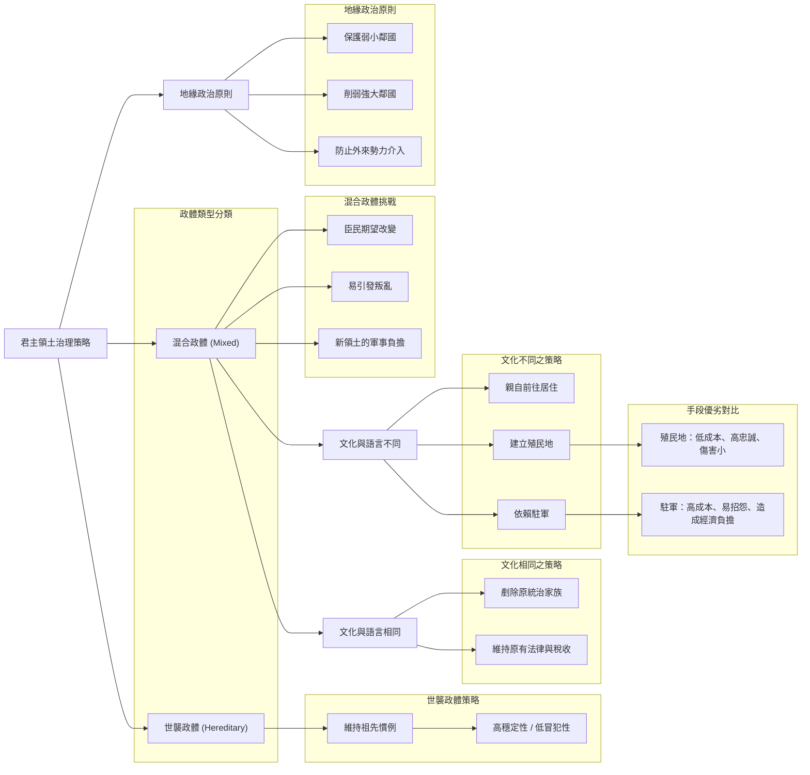

---

## Part 6

Source note: [[The Prince (Part 6)]]

Original range: lines 178-198
Original chars: 38624-46890

<!-- source: The Prince (Part 6).md -->

### 成功的統治依賴於預見危機並透過扶持弱小、壓制強大來維持權力平衡；反之，若在危機尚未成形前盲目擴張或引入外來勢力，則會導致政權無法挽救。

#### 摘要

本段文本探討了政治統治中「預防性干預」與「反應性錯誤」之間的關鍵差異。馬基維利首先以羅馬人的成功策略為例，說明如何透過扶持弱小勢力、壓制強大勢力，並在威脅尚未成形時就予以化解，從而維持政權的穩定。接著，他以法國國王路易十二（Louis XII）的失敗作為反面教材，指出路易十二因錯誤地擴張教會權力、引入西班牙勢力以及破壞地方勢力平衡，導致其政權陷入無法挽救的危機。文中著名的「醫學隱喻」生動地描述了政治危機若不早期察覺與處理，將會從「易治但難察」演變成「易察但難治」的局面。

#### 翻譯內文

無論是出於過度的野心還是出於恐懼，正如先前所見，人們常會陷入這種境地。羅馬人是由埃托利亞人引入希臘的；而在其他任何他們取得立足點的國家，也是由當地的居民引入的。通常的局勢是，一旦強大的外來者進入一個國家，所有的附庸國都會因為對現有統治者的仇恨而倒向他。因此，對於這些附庸國而言，他不需要費力去爭取，因為所有的附庸國都會迅速集結到他所獲得的政權之下。他唯一需要留心的，是不要讓這些附庸國獲得過大的權力與威信；只要利用他自己的軍隊與這些附庸國的好感，他就能輕易地壓制其中較強大的勢力，從而完全掌控該國。而未能妥善處理這項事務的人，很快就會失去他所獲得的一切，且在統治期間將面臨無止盡的困難與麻煩。

羅馬人在其併吞的國家中，嚴格遵守了這些措施；他們派遣殖民地，並與小規模勢力保持友好關係，卻不增加其力量；他們壓制強大勢力，且不允許任何強大的外來勢力獲得權威。對我而言，希臘的例子已足夠說明。阿凱亞人和埃托利亞人被他們維持在友好狀態，馬其頓王國被削弱，安條克被驅逐；然而，阿凱亞人和埃托利亞人的功績從未換取到增加權力的許可；費利普的說服也未能讓羅馬人在削弱他之前與他結盟；安條克力的影響力也未能讓羅馬人同意讓他保留對該國的統治權。因為羅馬人在這些案例中所做的，正是所有明智的君主在面對當前與未來困難時應有的作為——他們必須竭盡全力地為未來做準備，因為一旦預見了問題，解決起來便容易；但若等到問題逼近，藥物便已來不及施用，因為病症已變得無法治癒；正如醫生所說，這就像熱病一樣：在疾病初期，它易於治癒但難以察覺；隨著時間推移，若初期未被察覺或治療，它會變得易於察覺但難以治癒。政治事務亦是如此，當產生的惡果能被預見時（唯有智者方能預見），便能迅速糾正；但若因未能預見，任由其擴大到人盡皆見的地步，便再無救藥。因此，羅馬人預見了麻煩，便立即處理，甚至為了避免戰爭，不讓矛盾激化；因為他們深知戰爭無法避免，只能透過延後戰爭來為他人謀利。此外，他們希望在希臘與費利普和安條克交戰，以免戰火燒到義大利；他們本可以避開兩者，但他們不願如此；他們也不喜歡那句當今智者口中常說的話：「讓我們享受當下的利益」——他們寧願依靠自身的勇氣與謹慎來獲取利益，因為時間會沖刷一切，並帶來好壞交織的變遷。

（註：見引言中關於「intrattenere」一詞的評論。）

但讓我們轉向法國，探究她是否實踐了上述做法。我將討論路易（而非查理），因為路易對義大利的統治時間最長，其行為更具觀察價值；你會發現，他所做的恰恰與維持一個由多元元素組成的政權應有的做法相反。

法國國王路依十二世，「人民之父」，生於 1462 年，卒於 1515 年。
（查理八世，法國國王，生於 1470 年，卒於 1498 年。）

路易國王是受威尼斯人的野心驅使而進入義大利的，威尼斯人希望透過他的介入來獲得倫巴第州的一半領土。我不會責怪國王的行為，因為他渴望在義大利取得立足點，且在當地沒有盟友——由於查理之前的行為，所有的門戶都對他關閉了——他被迫接受了所能獲得的友誼。如果他在其他方面沒有犯錯，他的計畫本可以非常迅速地達成。然而，國王在獲得倫巴逼後，立即恢復了查理曾失去的權威：熱那亞屈服了；佛羅倫斯人成為了他的盟友；曼托瓦侯爵、費拉公爵、本蒂沃利家族、福利女爵、法恩札、佩薩羅、里米尼、卡梅里諾、皮奧姆比諾、盧卡、比薩、錫耶納的領主們——每個人都主動向他示好，尋求結盟。於是，威尼斯人意識到他們所採取行動的魯莽：為了確保在倫巴第獲得兩個城鎮，他們竟讓國王成為義大利三分之二的主人。

任何人現在只要思考一下，如果國王遵循上述規則，確保所有盟友的安全與受保護，他維持在義渡地位的難度將是多麼之小；因為儘管盟友人數眾多，但他們既弱小又膽怯，有些人畏懼教會，有些人畏懼威尼斯人，因此他們將被迫與他站在同一陣線，藉此他可以輕易地防範那些強大的勢力。然而，他一進入米蘭，便採取了相反的做法，協助教宗亞歷山大佔領羅馬涅。他從未想到，此舉實際上是在削弱自己，剝奪了那些投身於他的盟友，同時卻透過增加教會的世俗權力來擴大其宗教權威，從而強化了教會的地位。犯下這個首要錯誤後，他被迫一路錯下去，以至於為了終止亞歷山大的野心，並防止他統治托斯卡尼，路易本人被迫再次深入義大利。

不僅擴大了教會權力、失去了盟友，他為了獲得那不勒斯王國，竟與西班牙國王瓜分領土；他在義大利本應是主要的調停者，卻引入了一個合夥人，使得該國的野心家與他國內的不滿者有了避難所；他本可以留下自己扶持的國王，卻將其驅逐，轉而安置一個反過來能驅逐路易的人。

擴張領土的欲望確實是自然且普遍的，人們在可能時總會如此行事，因此這應受到讚揚而非責備；但當他們無法做到時，卻仍企圖不擇手段達成，那就是愚蠢且應受譴責的。因此，如果法國能以自身軍隊進攻那不勒斯，她理應如此；如果不能，她就不應進行瓜分。如果她與威尼斯人在倫巴第的瓜分是以「取得義大利立足點」為正當理由，那麼這次的瓜分則應受譴責，因為它缺乏這種必要性的辯解。

因此，路易犯了五個錯誤：他摧毀了小勢力，他增強了義大利其中一個大勢力的力量，他引入了外來勢力，他未能在當地定居，他未曾派遣殖民地。如果他還活著，這些錯誤若不加上第六個錯誤——即奪取威尼斯人的領地——本不足以損害他；因為如果他沒有擴大教會權力，也沒有將西班牙引入義大利，那麼削弱他們是相當合理且必要的；但既然他已經先採取了這些步驟，他就不應同意他們的毀滅，因為這些勢力強大，本可以阻止他人對倫巴第的覬覦，而威尼斯人若不成為那裡的主人，絕不會同意這種局面；此外，其他勢力也不會為了把倫巴第交給威尼斯人而從法國手中奪取它，因為與兩者皆為敵的代價，他們沒有那樣的勇氣。

#### 詞彙與關鍵術語

| 術語 (原文/概念) | 繁體中文譯名 | 語境說明 |
| :--- | :--- | :--- |
| Subject states | 附庸國 / 被統治州 | 指受強大政權控制或依附的較小政治實體。 |
| Preemptive / Foreseen | 預見性的 / 預防性的 | 指在危機爆發前就採取行動，是馬基維利政治哲學的核心。 |
| Incurable | 無法治癒的 / 不治之症 | 用於比喻政治危機一旦擴大到無法控制的程度，便無藥可救。 |
| Aggrandize | 擴大（權力/領土） | 指增加勢力、權威或領土範圍的行為。 |
| Arbiter | 調停者 / 仲裁者 | 指在多方勢力衝突中，具有決定性影響力或裁決地位的角色。 |
| Principle of Balance | 權力平衡原則 | 指透過控制強大勢力與扶持弱小勢力，來維持政權穩定的策略。 |

#### 邏輯結構圖

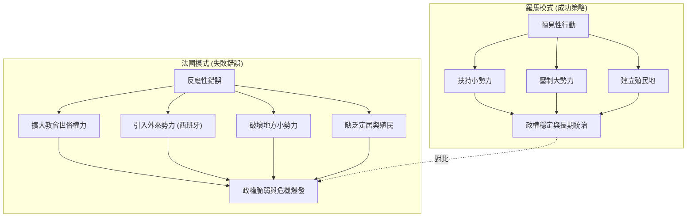

---

## Part 7

Source note: [[The Prince (Part 7)]]

Original range: lines 196-222
Original chars: 45868-54300

<!-- source: The Prince (Part 7).md -->

### 國家的統治難易度不取決於征服者的能力，而取決於被征服國家內部權力結構的統一性（中央集權 vs. 封建分權）。

#### 摘要

本段文本涵蓋了《君主論》中兩個核心的政治論述。首先，作者透過分析法國國王路易十二（Louis XII）在義大利的失敗，提出了政治上的「負面教訓」：即透過削弱小勢力來強化大勢力，最終會導致自身權力的崩潰。第二部分（第四章）則進入了更深層的政治學理論，比較了兩種截然不同的政體結構：一種是高度中央集權、依賴臣屬（如奧斯曼土耳其）的模式，其特徵是「征服難但統治易」；另一種是存在強大封建領主、權力分散（如法蘭西）的模式，其特徵是「征服易但統治難」。這段論述展示了馬基維利對國家穩定性與權力分配結構的深刻洞察。

#### 翻譯內文

##### 關於路易十二的政治失策

在義大利，另一種瓜分行為理應受到指責，因為它並不具備那種「必要性」作為藉口。

因此，路易犯了五個錯誤：他摧毀了小勢力、強化了義大利其中一個大勢力、引進了外國勢力、未在該地定居，且未派遣殖民者。如果他能長久統治，即便沒有犯下第六個錯誤（即剝奪威尼斯人的領地），這些錯誤也不足以對他造成致命傷害；然而，他卻犯下了第六個錯誤。因為，如果他沒有先強化教會的勢力，也沒有將西班牙引進義大利，那麼削弱這些勢力本是相當合理且必要的；但既然他已經先採取了這些步驟，他就不應再同意摧毀他們，因為這些勢力強大，足以阻止他人對倫巴底（Larmardy）圖謀不軌；除非威尼斯人想成為當地的統治者，否則他們絕不會同意。此外，其他勢力也不會為了將倫巴底交給威尼斯人而選擇從法國手中奪取，因為他們沒有勇氣去同時對抗兩者。

若有人辯稱：「路易國王為了避免戰爭，才將羅曼涅（Romagna）讓給亞歷山大，將王國讓給西班牙」，我的回答如前所述：為了避免戰爭而不惜犯下錯誤是不可取的，因為戰爭並不會因此避免，只會被推遲，且是以對你不利的代價。若有人又指稱國王曾向教宗承諾，以換取婚姻解除及魯昂主教冠冕為代價，來協助其事業，對此我將在稍後論述君主如何守信的部分做出回應。

（註：路易十二與布列塔尼的政治聯姻背景略）

路易國王因未能遵循那些征服並試圖保全領土者的條件，最終失去了倫巴底。這其中並無奇蹟，而是完全符合邏輯且自然。我曾在南特與魯昂主教談及此事，當時切薩雷·波吉亞（即以瓦倫提諾之名著稱）正佔領羅曼涅。當魯昂主教對我說義大利人不懂戰爭時，我回答說法國人不懂治國術，意即否則他們就不會容許教會達到如此強大的地位。事實證明，義大利境內教會與西班牙的強大，正是由法國一手造成的，而法國的衰敗亦可歸咎於此。由此可以得出一個幾乎永不失效的普遍法則： **凡是導致他人強大的人，最終必將走向毀滅**；因為這種強大地位，若非透過權謀，便是透過武力取得，而既已掌握權力的人，對這兩者皆充滿戒心。

##### 第四章：為何亞歷山大大帝征服的達里烏斯王國，在其死後未向繼承者反叛

考慮到人們在維持新獲得的國家時所面臨的困難，有些人可能會感到好奇：既然亞歷山大大帝在短短幾年內便統治了亞洲，且在帝國尚未穩固時便已去世（這似乎暗示整個帝國理應發生叛亂），為何他的繼承者卻能維持統治，且除了內部的權力鬥爭外，未遇到其他困難？

我的回答是：我們所知的政體主要分為兩種不同的統治方式：一種是由君主及其僕從統治，這些僕從作為大臣，依賴君主的恩寵與許可來協助治理；另一種則是君主與男爵共同統治，這些男爵憑藉血緣的古老地位而非君主的恩賜來保有尊榮。後者的男爵擁有自己的領地與臣民，臣民認其為領主並對其懷有天然的愛戴。而前者那種由君主及其僕從統治的國家，人民對君主的敬畏程度更高，因為在全國範圍內，沒有任何人的地位高於他；即便人民服從他人，也僅僅是將其視為官員或大臣，而不會對其產生特殊的感情。

我們時代中這兩種政府的典型範例是土耳其與法蘭西國王。土耳其的整個君主制是由單一領主統治，其餘皆為僕從；他將王國劃分為各個「桑賈克」（sanjaks），並派遣不同的行政官員，隨心所欲地調動。然而，法蘭西國王則處於一個由古老領主組成的體系之中，這些領主被其臣民所承認並深受愛戴；他們擁有各自的特權，國王若要剝奪，必須承擔巨大的風險。因此，任何觀察這兩種國家的人都會發現，奪取土耳其王國極其困難，但一旦征服，卻極易統治。征服土耳其的難點在於，篡位者無法獲得國內領主的招攬，也無法指望利用其部屬的叛亂來達成目的。這是因為其大臣皆為奴僕，極難被收買，且即便收買了，也難以從中獲益，因為他們無法帶動人民。因此，攻擊土耳其的人必須記住，他面對的是一個統一的整體，必須更多依賴自身實力而非他人的叛亂；但一旦土耳其被擊敗，其軍隊無法重建，那麼唯一的威脅僅剩該君主的家族，只要將其剷除，便無所畏懼，因為其餘臣民在人民心中已失去威信。

相反的情況發生在像法蘭西這樣的國家，因為透過拉攏國內的某位男爵，便能輕易進入；因為國內總能找到不滿者與渴望變革的人。這些人可以為征服開路，使勝利變得容易；但若你試圖在隨後維持統治，則會面臨來自協助者與被你鎮壓者的無盡困難。僅僅剷除君主的家族是不夠的，因為留存的領主會成為新運動的首領，而由於你既無法滿足他們也無法消滅他們，只要時機成熟，該國便會隨時陷入動盪。

若觀察達里烏斯政體的性質，你會發現它與土耳其王國相似，因此亞歷山大只需先在戰場上擊敗他，隨後奪取領土即可。在勝利之後，隨著達里烏斯的死亡，國家對亞歷山大而言是安全的。如果他的繼承者能保持統一，他們本可以安穩地享受這片土地，因為除了他們自發引起的鬥爭外，國內並無其他動亂。

然而，對於像法蘭西這樣構成的國家，卻無法維持如此平穩的統治。這便是羅馬人在西班牙、法蘭形成及希臘頻繁遭遇叛亂的原因，因為這些國家存在眾多小政權，只要記憶尚存，羅馬人的統治便是不穩固的；但隨著帝國的強大與長久，這些記憶逐漸消逝，羅馬人才成為穩固的統治者。隨後當羅馬人內部發生爭鬥時，每個人都能根據其掌握的權威，將各部分領土據為己有；且隨著舊領主的家族被剷除，除了羅馬人之外，再無人被承認。

回想這些事，便不會對亞歷山大如何輕易統治亞洲帝國感到驚訝，也不會對皮羅（Pyrrhus）等征服者在維持領土時所面臨的困難感到困惑；這並非取決於征服者能力的多少，而是取決於被征服國家內部結構的統一程度。

#### 詞彙與關鍵術語

| 術語 (原文) | 譯文 (繁體中文) | 註解 |
| :--- | :--- | :--- |
| **Sanjaks** | 桑賈克 | 奧斯曼帝國時期的行政區劃單位。 |
| **Statecraft** | 治國術 / 政治手段 | 指運用政治智慧、謀略來管理國家與權力的藝術。 |
| **Barons** | 男爵 / 領主 | 指擁有世襲領地與封建權力的貴族階級。 |
| **Servants / Ministers** | 僕從 / 大臣 | 指地位依賴於君主恩寵、無獨立權力的官僚或官員。 |
| **Unanimity / Uniformity** | 統一性 / 一致性 | 指國家內部結構與意志是否趨於一致，是判斷征服難易的關鍵。 |
| **Romagna** | 羅曼涅 | 義大利中部的一個地區。 |

#### 文化與語境解析

1.  **權力擴張的悖論 (The Paradox of Power Expansion)**：
    馬基維利提出了一個極其冷酷的政治法則：「使他人強大者，必遭毀滅」。這反映了當時義大利城邦間脆弱的勢力平衡。當一個強權（如法國）試圖透過削弱鄰近小國來擴張時，它實際上是在破壞原本能制衡大國的「緩衝帶」，最終導致周邊勢力（如教宗國、西班牙）的壯大，反而威脅到擴張者的地位。

2.  **政體結構的穩定性分析**：
    馬基維利將政治結構分為「依賴個人恩寵的官僚體系」與「依賴血緣權力的封建體系」。
    *   **中央集權型 (The Turk Model)**：權力高度集中於君主，臣民（僕從）沒有獨立政治地位。這種結構的弱點在於君主一旦戰敗，結構會迅速崩潰；但其優點在於缺乏內部反抗的根基。
    *   **分權封建型 (The French Model)**：權力分散於擁有土地與人民忠誠度的領主手中。這種結構的優點在於具備韌性，但對於外來征服者而言，這是一種「易入難守」的噩夢，因為不滿的領主隨時可以成為反抗的火種。

#### 邏輯結構圖

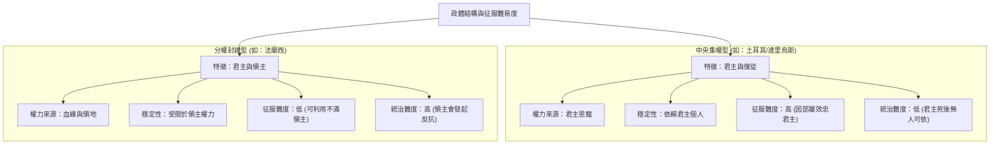

---

## Part 8

Source note: [[The Prince (Part 8)]]

Original range: lines 220-244
Original chars: 53278-62110

<!-- source: The Prince (Part 8).md -->

### 統治者應根據被併吞領土的原有法律性質（自由邦或君主制）採取不同策略，並強調透過「才能」識別「機會」與建立「武裝力量」是維持新政體穩固的關鍵。

#### 摘要

本段文本節選自馬基維利（Niccolò Machiavelli）的經典著作《君主論》（*The Prince*），涵蓋了第五章與第六章的核心論點。

**第五章** 探討了如何治理那些在被併吞前擁有獨立法律與自由的城市或邦國。馬基驗提出了三種策略：徹底摧毀、親自駐守、或建立親近君主的寡頭政體。他特別警示，若不摧毀習慣於自由的城市，最終可能遭到反噬，因為「自由」與「古老特權」是叛亂者永恆的集結號。

**第六章** 則聚焦於憑藉個人才能（*virtù*）而非運勢（*fortuna*）建立的新政體。馬基維利以摩西、賽魯士、羅慕路斯等歷史人物為例，說明成功的關鍵在於如何利用「機會」並將其轉化為「制度」。他深刻地指出，變革者（innovator）面臨的困境在於：舊秩序的既得利益者會激烈反抗，而新秩序的追隨者則往往態度猶豫。最終，他得出了極具爭議性的結論：只有「武裝的先知」才能成功，而「赤手空件的先知」必將失敗。

#### 翻譯內文

（前言部分）
……（如）法國那樣的國家。因此，在西班牙、法國與希臘，頻繁發生針對羅馬人的叛亂，這歸因於這些國家內部存在眾多的小邦；只要這些小邦的記憶尚存，羅馬人的統治便始終是不穩固的；但隨著帝國權力的增強與長久延續，這些記憶逐漸消逝，羅馬人隨之成為穩固的統治者。當後來各方勢力內鬥時，各方都能根據其所掌握的權威，將各自的部分領土併入麾下；由於原領主的家族已被剷除，除了羅馬人之外，再無其他合法統治者可言。

回顧這些往事，人們不會驚訝於亞歷山大大帝如何輕易征服亞洲帝國，也不會驚訝於皮洛士（Pyrrhus）等後繼者在維持領土時面臨的艱難；這並非因為征服者的才能多寡，而是因為被征服國家的缺乏統一性。

##### 第五章：關於如何治理在被併吞前擁有自身法律的城市或邦國

對於那些如前所述、習慣於依循自身法律與自由生活的國家，欲持有者有三種途徑：第一，將其摧毀；第二，親自前往駐守；第三，允許其依循原有法律生活，但徵收貢賦，並在其中建立一個親近你的寡頭政體。因為這種由君主扶持的政府，深知若無君主的友誼與利益支持便無法生存，因此會竭盡全力支持君主；因此，若想維持一個習慣於自由的城市，透過其自身的公民來統治，會比任何其他方式都更為容易。

例如，斯巴達人與羅馬人。斯巴達人曾統治雅典與底比斯，並在當地建立了寡頭政體：然而他們最終失去了這些領土。羅馬人為了統治卡普亞、迦太基與南曼提亞，則採取了拆解（摧毀）的手段，且並未失去領土。他們曾試圖像斯巴達人那樣統治希臘，賦予其自由並允許其法律，但並未成功。因此，為了統治希臘，他們被迫拆解了該國的許多城市；事實上，除了摧毀之外，並沒有其他安全的方法來保有這些城市。因為，任何成為習慣於自由之城市的統治者，若不將其摧毀，便應預期自己會被其摧毀；因為在叛亂中，「自由」與「古老特權」始終是集結的號角，無論時間流逝或恩惠施予，都無法使其忘卻。無論你採取或防範什麼手段，只要他們不分裂或散去，就永遠不會忘記那個名稱或其特權；每當機會出現，他們便會立即重新集結，正如比薩在被佛羅倫斯統治了一百年後所展現的那樣。

然而，當城市或國家習慣於在君主之下生活，且原領主的家族已被剷除時，他們一方面習慣於服從，另一方面又失去了舊有的君主，因此無法從內部推選出新的統治者，也不知如何自我治理。因此，他們拿起武器的速度非常緩慢，君主可以更輕易地將其納入麾下並鞏固統治。相比之下，共和制國家具有更強的生命力、更深的仇恨與更強的復仇欲望，這使得他們絕不會容許昔日自由的記憶沉寂；因此，最安全的方法是摧毛殆骨或親自駐守。

##### 第六章：關於憑藉自身武力與才能所取得的新政體

當我談論全新的政體時，若引用君主與國家的最高典範，請不要感到驚訝；因為人們行走時幾乎總是沿著他人開闢的道路，並透過模仿他人的行為來行動，卻仍無法完全遵循他人的路徑，或達到他們所達到的權力。智者應始終追隨偉人的足跡，並模仿那些曾達到巔峰的人，如此一來，即便其才能無法與之匹敵，至少也能展現出那種氣息。他應效法那些精明的弓箭手：當目標看似遙不可及時，深知弓箭力量的極限，便會瞄準比目標更高的位置，其目的並非要靠力量或箭矢直接達到那樣的高度，而是透過如此高遠的瞄準，來達成擊中目標的願望。

因此我說，在全新的政體中，由於新君主的出現，其維持領土的難度會隨著征服者才能的多寡而有所不同。既然從平民晉升為君主的前提，要麼是憑藉才能，要麼是憑藉運勢，顯然這兩者中的任何一種都能在某種程度上減輕許多困難。儘管如此，最少依賴運勢的人，其地位建立得最為穩固。此外，若君主因別無領土而被迫親自駐守，也會使事情變得容易。

至於那些不靠運勢，而是憑藉自身才能崛起成為君主的人，我說摩西、賽魯士、羅慕路斯、忒修斯之類的人是最卓越的典範。雖然我不便詳談摩西，因為他僅僅是上帝旨意的執行者，但即便如此，他仍值得欽佩，僅僅是因為那份使他配得上與上帝對話的恩寵。但在考慮賽魯士等人建立或開創的王國時，所有人都能發現其卓越之處；若審視其具體行為與操守，他們並不遜色於摩西，即便摩西擁有如此偉大的導師。在檢視他們的行動與生平時，人們不會發現除了「機會」之外，他們對運勢有任何依賴；正是機會提供了素材，讓他們能將其塑造成最理想的形狀。若沒有那種機會，他們的才智將會熄滅；而若沒有那種才智，機會也將徒勞無功。

因此，對摩西而言，必須讓他發現以色列人在埃及受奴役與壓迫，他才能被民眾接受並帶領他們脫離束縛。對羅慕路斯而言，必須讓他不留在阿爾巴，且在出生時被遺棄，他才能成為羅馬之王並開創祖國。對賽魯士而言，必須讓他發現波斯人對米底人統治的不滿，且米底人因長期的和平而變得軟弱與女性化。若非發現雅典人四散流亡，忒修斯也無法展現其才能。因此，這些機會使這些人成為了「幸運兒」，而他們高超的才能使他們能夠識別出能讓國家顯赫與成名的機會。

像這些人一樣，透過英勇手段成為君主的人，雖然取得政體時極其艱難，但維持起來卻非常容易。他們在取得政權時的困難，部分源於為了建立政府與確保安全而不得不引入的新規則與新方法。必須記住的是，沒有任何事情比引入新的秩序更難上手、更危險，或在成功上更具不確定性，因為變革者（innovator）的敵人是所有在舊秩序下生活得很好的人，而其支持者則是那些在新秩序下可能獲益、卻態度猶豫的人。這種冷淡的部分源於對手利用法律優勢所帶來的恐懼，部分源於人們對新事物的懷疑，人們在沒有長期經驗之前，並不輕易相信新事物。因此，每當敵對者有機可乘時，他們會像黨徒一樣發動攻擊，而其他人則防禦得極其消極，以至於君主也隨之陷入危險。

因此，若我們想要徹底討論這個問題，就有必要探究這些變革者是能依靠自己，還是必須依賴他人：也就是說，為了完成其事業，他們是需要依靠祈禱，還是可以依靠武力？在第一種情況下，他們總是失敗，且無法達成任何成就；但當他們能依靠自己並使用武力時，則很少受到威脅。因此，所有的「武裝先知」都成功征服了，而「赤手空拳的先銳」則走向了滅亡。除了上述原因外，民心是多變的，雖然說服他們很容易，但要讓他們堅持這種信念卻很困難。因此，必須採取這樣的措施：當他們不再相信時，仍能透過武力使他們相信。

#### 詞彙與關鍵術語

| 術語 (原文) | 譯文 (繁體中文) | 語境解析 |
| :--- | :--- | :--- |
| **Virtù** (Ability/Power) | **才能 / 德性** | 馬基維利語境下的「才能」，並非道德上的美德，而是指果敢、智慧與政治手腕。 |
| **Fortuna** | **運勢 / 命運** | 指不可控的偶然因素，與 *Virtù* 形成對比。 |
| **Oligarchy** | **寡頭政治** | 指由少數權力精英統治的政體，馬基維利建議在併吞自由邦時建立此類政體以利統治。 |
| **Innovator** | **變革者 / 創新者** | 指試圖改變既有政治秩序、引入新法律或制度的人，通常面臨極大阻力。 |
| **Armed Prophets** | **武裝的先知** | 指不僅有思想（先知）且擁有武力支持（武裝）的領導者，是成功的關鍵。 |
| **Unarmed Prophets** | **赤手空拳的先知** | 僅有思想卻缺乏武力支撐的領導者，最終往往會失敗。 |

#### 邏輯結構分析

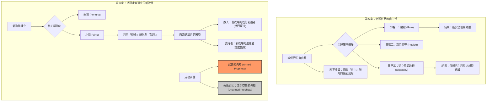

---

## Part 9

Source note: [[The Prince (Part 9)]]

Original range: lines 242-266
Original chars: 61089-69836

<!-- source: The Prince (Part 9).md -->

### 政權的穩定性取決於統治者是否能依靠自身武力與能力建立「根基」，而非僅依賴變幻莫測的運氣或他人的武力。

#### 摘要

本章節深入探討了新政權取得與維持的關鍵因素。馬基維利提出了核心論點：統治者的成敗取決於其是否能「依靠自身」而非「依賴他人」。他透過對比「武裝的先知」（如摩西、西魯士）與「未武裝的先知」（如薩佛拿洛拉）的命運，強調了武力與自身軍隊對於鞏固政權的重要性。此外，章節分析了透過「運氣」或「他人恩賜」取得政權者的脆弱性，指出這類統治者雖能迅速崛起，卻因缺乏根基（Foundations）而在面對危機時難以持久。最後，他以弗朗切斯科·斯福爾扎（依靠能力與武力鞏固）與切薩雷·波吉亞（依賴他人武力卻最終失敗）作為經典案例，說明建立政權根基必須在取得權力後立即著手進行。

#### 翻譯內文

因此，每當敵對者有機可乘時，他們會像游擊隊一樣發動攻擊，而其他人則防禦得力不足，以至於君主也隨之陷入危險。

因此，若要深入探討此議題，必須探究這些革新者（innovators）是能依靠自身，還是必須依賴他人：也就是說，為了完成其事業，他們是需要依靠祈禱，還是可以運用武力？在前者（依靠祈禱）的情況下，他們總是失敗，且從未達成任何成就；但當他們能依靠自身並運用武力時，則鮮少面臨危險。因此，所有武裝過的先知都獲得了成功，而未武裝的先知則走向了滅亡。除了上述原因外，民心的本性是多變的，雖然說服他們很容易，但要讓他們維持這種信念卻很困難。因此，必須採取相應的措施，使得當他們不再相信時，仍能透過武力使他們重新相信。

如果摩西、西魯士、忒修斯和羅慕路斯當初是不帶武力的，他們就無法長久地維持其憲政制度——正如我們時代的弗拉·吉羅拉莫·薩佛拿洛拉（Fra Girolamo Savonarola）所經歷的那樣，一旦群眾不再相信他，他的新秩序便立即瓦解，因為他既沒有手段來留住原有的信徒，也沒有手段讓不信者轉而相信。因此，這類人要完成其事業會面臨極大困難，因為他們所有的危險都存在於上升的過程中；然而，憑藉能力，他們終將克服這些困難；一旦這些困難被克服，且那些嫉妒他們成功的敵人被剷除，他們便會開始獲得尊重，並在隨後繼續保持強大、安全、受人尊敬且幸福的地位。

在這些偉大的典範之外，我想再增加一個較小的例子；儘管規模較小，但仍具備相似性，我希望它足以代表同類案例：那就是敘拉古的希羅（Hiero）。此人從平民地位崛起成為敘拉登的君主，且他並非僅靠運氣，而是靠著機會；因為當時敘拉古人正遭受壓迫，遂選他為隊長，隨後他因功被封為君主。他即便在平民時期就已具備極高的能力，以至於有記載他的人說，他除了需要一個王國之外，別無他求。此人廢除了舊軍隊，組織了新軍隊，放棄了舊盟約，建立了新盟約；由於他擁有自己的士兵與盟友，他便能以此為基礎建立任何宏偉的建築：因此，雖然他在取得權力時歷經磨難，但在維持政權時卻相當輕鬆。

（希羅二世，生於約西元前 307 年，卒於西元前 216 年。）

##### 第七章：關於透過他人武力或運氣所取得的新政權

那些僅憑運氣從平民變為君主的人，在崛起時幾乎沒有困難，但在維持地位時卻面臨巨大挑戰；他們在上升途中並無阻礙，因為他們如飛升般迅速，但一旦到達頂峰，便會遭遇重重困難。這類人包括那些因金錢或恩賜者之恩惠而獲得政權的人；這在希臘的許多城市（如愛奧尼亞與赫勒斯龐特地區）屢見不支，當時的君主是由大流士所任命，目的是為了確保這些城市的安全與其自身的榮耀；同樣的也包括那些因士兵腐敗而從公民變為帝王的統治者。這些人僅僅是依附於提拔他們之人的善意與運氣——而這兩者是最不穩定且易變的。此外，他們也缺乏統治所需的知識；因為除非他們本身是極具價值與能力的人，否則很難期望長期生活在平民狀態下的人懂得如何指揮；此外，他們也無法守住政權，因為他們缺乏能使其維持忠誠與友好的武力。

因此，那些意外崛起的政權，就像自然界中所有快速誕生與成長的事物一樣，無法在最初的風暴襲來時，仍維持其根基與聯繫（foundations and correspondences）的穩固。除非，正如所言，那些意外成為君主的人具備極高的能力，深知必須立即準備好去守護運氣隨手賜予他們的財富，並且必須在成為君主「之後」，去建立那些他人「在之前」就已奠定的根基。

（註1：「Le radici e corrisponden性」，即他們的根基與與其他國家的聯繫或關係——這是 16 與 17 世紀對「correspondence」與「correspondency」的常見用法。）

關於透過能力或運氣這兩種崛起方式，我想舉出兩個我們記憶中近期的例子，分別是弗朗切斯科·斯福爾扎（Francesco Sforza）與切薩雷·波吉亞（Cesare Borgia）。弗朗切斯科透過正當手段與卓越能力，從平民崛起為米蘭公爵，他以千般憂慮換取的政權，在維持上卻相當輕鬆。另一方面，切薩雷·波吉亞（人民稱之為瓦倫提諾公爵）是在其父親權力鼎盛時期取得政權，卻在其父親勢力衰落時失去了政權，儘管他已採取了一切明智且有能力之人應有的措施，試圖在他人武力與運氣所賜予他的政權中深植根基。

（註4：弗朗切斯科·斯福爾扎，生於 1401 年，卒於 1466 年。他娶了米蘭公爵菲利波·維斯康蒂的私生女比安卡·瑪麗亞·維斯康蒂，並在公爵去世後藉此獲得公爵地位。馬基維利曾作為佛羅倫斯共和國的特使，在切薩雷·波吉亞於西尼加利亞暗殺奧爾西尼與維泰利家族的事件中擔任調解人。）

正如前文所述，未能首先奠定根基的人，或許能憑藉卓越能力在事後補救，但這對建築師而言將是勞苦，對建築本身而言則是危險。因此，若審視公爵所採取的每一個步驟，便會發現他為未來的權力奠定了堅實的基礎；我認為討論這些例子並非多餘，因為除了觀察其行為，我不知道還有什麼更好的教誨能給予新君主；即便他的部署最終未能奏效，那也不是他的錯，而是運氣極端惡劣的結果。

亞歷山大六世在試圖擴張其子（公爵）的勢力時，面臨了許多眼前與長遠的困難。首先，他看不出如何讓其子掌握任何不屬於教會的領土；如果他願意掠奪教會，他知道米蘭公爵與威尼斯人不會同意，因為法恩札與里米尼已處於威尼斯人的保護之下。此外，他看到義大利的武力，特別是那些可能提供援助的力量，都掌握在畏懼教宗擴張勢力的勢力手中，即奧爾誠與科隆納家族及其追隨者。因此，他必須顛覆這種局面並製造混亂，以便安全地掌握其中一部分領土。這對他來說並不難，因為他發現威尼斯人出於其他原因，傾向於讓法國人重新回到義大利；他不僅不反對，甚至透過廢除路易國王的先前的婚姻來使之更容易。因此，國王在威尼斯人的協助與教宗亞歷山大的同意下進入了義大利。教宗的士兵一到米蘭，便立即參與了對羅馬涅的進攻，而羅馬涅最終因國王的威名而屈服。因此，公爵在獲得羅馬涅並擊敗科隆納家族後，在渴望守住領土並進一步擴張時，卻受到了兩件事的阻礙：其一，他的武力看起來對他不忠；其二，法國的善意。也就是說，他擔心他所使用的奧爾西尼軍隊不會站在他這邊，不僅可能阻礙他獲得更多領土，甚至可能奪取他已獲得的成果；同時他也擔心法國國王也會採取同樣的行動。當他在征服法恩札並進攻博洛尼亞後，看到奧爾西尼家族極不情願地參與進攻，這給了他一個警示。至於國王，當他自己在奪取烏爾比諾公國後進攻托斯卡尼，卻被國王要求停止時，他便看清了對方的意圖；因此，公爵決定不再依賴他人的武力與運氣。

#### 詞彙與關鍵術語

| 英文原詞 | 繁體中文翻譯 | 語境說明 |
| :--- | :--- | :--- |
| **Innovators** | 革新者 / 變革者 | 指試圖改變既有政治秩序、建立新政權的人。 |
| **Armed prophets** | 武裝的先知 | 象徵不僅有理想（說服力）且擁有實力（武力）的統治者。 |
| **Foundations** | 根基 / 基礎 | 指政權的穩定性來源，如法律、軍隊、盟友與民心。 |
| **Good fortune** | 運氣 / 僥倖 | 指非自身努力、純粹由偶然因素或他人恩賜獲得的權力。 |
| **Correspondencies** | 聯繫 / 關係 | 指政權與周邊國家、盟友或臣民之間的政治關係網絡。 |
| **Private condition** | 平民地位 / 私人狀態 | 指尚未掌握公權力、僅具個人身份的狀態。 |

#### 邏輯結構圖

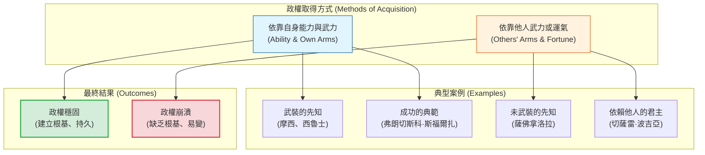

---

## Part 10

Source note: [[The Prince (Part 10)]]

Original range: lines 266-286
Original chars: 68814-77974

<!-- source: The Prince (Part 10).md -->

### 切薩雷·波吉亞透過建立自主武力、收編敵對派系、利用政治替罪羊以及預先佈局教宗繼任者，展現了依靠自身能力（Virtù）而非他人運氣（Fortune）建立政權的極致典範。

#### 摘要

本段文本摘自馬基雅維利的《君主論》，詳細描述了切薩雷·波吉亞（Cesare Borgia）如何透過一系列高超且冷酷的政治手段，在羅曼涅（Romagna）地區建立權威並鞏固勢力。內容涵蓋了他如何處理與法國王室、羅馬貴族家族（如奧爾西與科隆納家族）的關係，以及他利用拉米羅·德·奧爾科（Ramiro d'Orco）作為「政治替罪羊」來平定地方混亂的經典案例。文本最後指出，切薩雷的政治事業之所以未能完成，並非因為缺乏能力或策略，而是受限於教宗亞歷山大六世的逝世以及他自身的重病。

#### 翻譯內文

他甫抵米蘭，教宗便利用他的士兵試圖奪取羅曼涅，而這項行動最終因考量到國王的聲望而向教宗屈服。因此，公爵在獲得羅曼涅並擊敗科隆納家族後，雖然渴望維持現狀並進一步擴張，卻受到了兩件事的阻礙：其一，他的軍隊似乎並不忠誠；其二，法國的意圖——也就是說，他擔心他所使用的奧爾西家族軍隊不會站在他這一邊，不僅可能阻礙他贏得更多領土，甚至可能奪取他已獲得的成果；同時他也擔心國王也會採取同樣的行動。關於奧爾西家族，他曾得到教訓：在攻克費恩扎並進攻博洛尼亞後，他看到該部隊在進攻時表現得極其不情願。至於國王，他在攻克烏爾比諾公國並進攻托斯卡尼後，親自領教了國王的意圖，因為國王迫使他停止了該項行動；因此，公爵決定不再依賴他人的武力與運氣。

為了應對第一項問題，他削弱了羅馬境內的奧爾西與科隆納派系，透過招攬他們所有的紳士成員，將其收編為自己的部屬，給予優渥的薪酬，並根據其地位授予官職與指揮權，如此一來，短短幾個月內，所有對原派系的效忠便被瓦解，轉而完全效忠於公爵。隨後，他等待機會以摧毀奧爾西家族，此時他已瓦解了科隆納家族的追隨者。機會很快到來且被他善加利用；因為奧爾西家族察覺到公爵與教會的壯大將導致他們的滅亡，遂在佩魯賈召開了馬焦內會議。這引發了烏爾比諾的叛亂與羅曼涅的動亂，使公爵面臨無盡的危險，但他最終憑藉法國的援助克服了這些難題。在恢復權威後，為了不因信任法國或其他外部勢力而使權力陷入風險，他採取了謀略，且極擅隱藏意圖；透過帕戈羅先生（Signor Pag碌）的調解——公爵不遺餘力地對其展現關照，贈予金錢、衣物與馬匹——最終在西尼加利亞與奧爾西家族達成和解，利用對方的單純將其納入自己的掌控之中。在剷除領袖並將其黨徒轉化為盟友後，公爵憑藉著羅曼涅與烏爾比諾公國，為自己的權力奠定了堅實的基礎；隨著人民開始感受到繁榮，他也贏得了民心。此點極具參考價值且值得他人效法，因此我不願略過不談。

當公爵佔領羅曼涅時，發現當地由一群軟弱的統治者治理，他們比起治理，更傾向於掠奪臣民，且帶來的分裂多於團結，導致該地區充滿了搶劫、爭鬥與各種暴力；因此，為了恢復和平與對權威的服從，他認為有必要委派一位強力的治理者。於是，他提拔了拉米羅·德·奧爾科，這是一個迅捷且殘暴的人，並賦予他全權。此人短時間內便以極大的成就恢復了和平與統一。隨後，公爵認為不宜賦予如此過度的權力，因為他確信這會導致憎恨，因此他在該地設立了一個由卓越長官主持的審判庭，各城市皆可委派辯護人。由於他深知過去的嚴酷手段已引起部分仇恨，為了洗清自己在人民心中的形象並贏得民心，他希望展示出：即便曾實施過殘暴手段，那也不是源於他，而是源於大臣天生的嚴厲。藉此藉口，他逮捕了拉米羅，並在某個早晨親自處決了他，將其屍體留在切塞納的廣場上，身旁留著斷頭台與一把血淋淋的刀。這場慘劇的野蠻景象，使人民在感到滿意的同時，也深感驚恐。

讓我們回到起點。我說，公爵在發現自己已足夠強大，且透過建立自己的武力，部分地擺脫了眼前的危險，並在很大程度上摧毀了周邊可能威脅其征服進程的力量後，接下來必須考慮法國的問題，因為他知道那位後知後覺的國王不會支持他。從那時起，他開始尋求新的盟友，並在法國向那不勒斯王國進軍（對抗圍攻加埃塔的西班牙人）的過程中採取觀望策略。他的意圖是藉此保護自己，若亞歷山大教宗尚在人世，他本可以迅速達成此目標。

這便是他當時的行動方針。但對於未來，他首先擔心新的教宗繼任者可能對他不友善，並試圖奪走亞歷進教宗賜予他的領土，因此他決定採取四種手段。首先，剷除那些被他剝奪領土的領主家族，以消除教宗反撲的藉口。其次，贏得羅馬紳士的支持，以便利用他們的協助來制衡教宗。第三，爭取對教宗會議（College）的影響力。第四，在教宗逝世前累積足夠的權力，以便能以自己的手段抵禦最初的衝擊。在這四項任務中，在亞歷山大教宗去世時，他已完成了三項。他已盡可能剷除被剝奪領地的領主，幾乎無一倖免；他贏得了羅馬紳士，並在教宗會議中擁有了最龐大的派系。至於新的擴張，他計畫奪取托斯卡尼，因為他已擁有佩魯賈與皮翁比諾，且皮薩正處於他的保護之下。由於他不再需要顧慮法國（因為法國人已被西班牙人逐出那不勒斯王國，雙方都不得不爭取他的好感），他便直取皮薩。隨後，盧卡與錫耶納也因恐懼佛羅倫斯人的報復而紛紛投降；若他繼續壯大，佛羅倫斯人將束手無策，因為在亞歷山大教宗去世那年，他正處於鼎盛時期，其權力與聲望已足以讓他自立，不再依賴他人的運氣與武力，而是完全依靠自身的權力與能力。

然而，亞歷山大在最初揮劍後的五年便去世了。他留下公爵時，羅曼涅的統治僅勉強鞏固，其餘領土則處於懸空中，夾在兩支強大的敵對軍隊之間，且公爵本人也病入膏肓。然而，公爵具備如此的膽識與能力，且深諳如何贏得或失去人心，加上他在短時間內奠定的基礎如此穩固，若非背後有那些軍隊威脅，或是他身體健康，他本可以克服所有困難。事實證明他的基礎是穩固的，因為羅曼涅領地仍維持在他的掌控下超過一個月。在羅馬，儘管他已半身不遂，卻仍能維持安全；雖然巴廖尼、維泰利與奧爾西家族可能進入羅馬，卻無法對他構成威脅。即便他無法扶持心儀的人選成為教宗，至少他所反對的人也不會當選。然而，若亞歷山大去世時他身體健康，一切都會截然不同。在朱利葉斯二世當選之日，他告訴我，他已預料到亞歷山大父親去世後可能發生的所有情況，並為之準備了對策，唯獨他沒料到，當死亡降臨時，他自己也正處於死亡邊緣。

回顧公爵的所有作為，我不認為有什麼可責備之處，反而如我所言，我應將他作為典範，提供給所有那些依靠他人運氣或武力而登上政權的人。因為他具備高尚的精神與遠大的目標，除了如此，他別無其他行事之道；唯有亞歷壇教宗生命的短促與他自身的疾病，挫敗了他的宏圖。因此，任何認為有必要在新的公國中鞏固地位、贏得盟友、透過武力或欺詐來克服障礙、使自己受人愛戴與敬畏、使士兵追隨與崇敬、剷除可能傷害自己的強權、變革舊秩序、在嚴厲與仁慈之間取得平衡、在寬宏與慷慨之間取得平衡、摧毀不忠的軍隊並建立新的、以及與君王維持那種「必須熱忱地幫助他，且必須謹慎地冒犯他」的友誼的人，都無法找到比此人更生動的典範。

#### 詞彙與關鍵術語

| 術語 (原文/意譯) | 繁體中文說明 |
| :--- | :--- |
| **Romagna** | **羅曼涅**：義大利北部的地區，切薩雷·波吉亞擴張勢力的核心地帶。 |
| **Orsini / Colonna** | **奧爾西 / 科隆納家族**：羅馬兩大權勢顯赫的貴族家族，代表了傳統的派系勢力。 |
| **Ramiro d'Orco** | **拉米羅·德·奧爾科**：切薩雷委派的代理人，以殘暴手段平定亂局，後被切薩雷作為政治犧牲品處決。 |
| **Magione Conspiracy** | **馬焦內陰謀**：由奧爾西家族發起的反抗切薩雷的叛亂事件。 |
| **The College (of Cardinals)** | **教宗會議 / 紅衣主教團**：負責選舉教宗的最高宗教與政治決策機構。 |
| **Arms and Luck** | **武力與運氣**：馬基雅維利政治哲學的核心，指依賴他人（傭兵/盟友）與依賴自身能力（軍隊/策略）的對比。 |
| **Virtù (Implied)** | **能力/德性**：文中指切薩雷展現出的政治手腕、果敢與策略性，而非傳統道德上的美德。 |

#### 文化與語境解析

1.  **「殘暴的政治利用」 (The Utility of Cruelty)**：
    文中關於拉米羅·德·奧爾科的描述是政治學上的經典案例。切薩雷利用拉米羅的「殘暴」來建立秩序（建立威懾），隨後利用拉米羅的「死」來建立「仁慈」的形象（平息民怨）。這種「先施暴後平息」的策略，展現了馬基雅維利式「手段與目的」的冷酷邏輯。

2.  **「依賴他人」 vs. 「依賴自身」 (Dependency vs. Autonomy)**：
    文本強調了切 Cesare 意識到依賴法國王室或奧爾西家族軍隊的危險。在馬基雅維利的政治觀中，一個成功的統治者必須建立「自己的武力」（Armi proprie），即不依賴傭兵或他人的盟軍，否則政權將隨時因他人的變心而崩潰。

3.  **教宗權力與世俗權力的交織**：
    切薩雷的權力基礎建立在教宗亞歷山大六世的政治庇護下。文中的策略（如控制紅衣主教團、剷除敵對領主）反映了當時羅馬教廷不僅是宗教中心，更是歐洲政治博弈的核心。

#### 邏輯結構圖

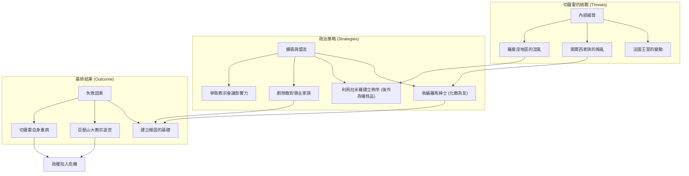

---

## Part 11

Source note: [[The Prince (Part 11)]]

Original range: lines 286-304
Original chars: 76952-85690

<!-- source: The Prince (Part 11).md -->

### 分析透過他人武力或不義手段取得政權的機制，強調政治家雖能透過殘暴手段獲取權力，但若缺乏政治遠見或僅追求權力而捨棄榮耀，最終仍難逃毀滅。

#### 摘要

本段譯文出自馬基維利（Niccolò Machiavelli）的《君主論》，主要探討了兩種取得政權的途徑及其政治後果。第一部分分析了切雷·波吉亞（Cesare Borgia）如何透過卓越的政治手腕建立威信，卻因在教宗選舉中的錯誤判斷（選擇了可能報復自己的紅衣主教）而導致最終的毀滅。第二部分（第八章）則聚焦於「以不義手段取得政權」的案例，透過古希臘的阿加托克利斯（Agathocles）與文藝復興時期的奧利維羅（Oliverotto da Fermo）之例，展示了雖然暴力與背叛可以奪取政權，但這種手段往往只能獲得「權力」而非「榮耀」，且極易因缺乏政治遠見而覆滅。

#### 翻譯內文

（接續前文）……我不知該如何責備他，反而如我所言，我應將他作為榜樣，提供給所有藉由他人之運勢或武力而登上政權的人。因為他擁有高尚的精神與遠大的志向，若非如此，他便無法如此安排自己的行為；唯有亞歷山大的生命短促以及他自身的疾病，挫敗了他的宏圖大志。因此，凡是認為有必要鞏固新政權、贏得盟友、透過武力或欺詐克服障礙、使人民既愛戴又畏懼、使士兵既追隨又敬重、剷除那些有權力或理由傷害自己的人、變革舊秩序以建立新秩序、在嚴厲與仁慈之間取得平衡、在寬大與慷慨之間取得平衡、汰換不忠的士兵並建立新軍、並與君主維持既能獲得熱誠支持又能謹慎應懼怕的關係的人，都無法找到比此人更生動的榜樣。

他唯一可被責備之處，在於對朱利亞斯二世的選擇失誤，因為他做了一個錯誤的選擇；正如所言，既然他無法選出一位符合自己心意的教宗，他本可以阻礙任何其他人的選舉；他絕不應同意任何他曾傷害過、或若成為教宗便會畏懼他的紅衣主教當選。因為人們的傷害通常源於恐懼或仇恨。他所傷害的人當中包括：聖彼得羅·於鎖鏈（San Pietro ad Vincula）、科隆納（Colonna）、聖喬治（San Giorgio）以及阿斯坎齊奧（Ascanio）。其餘的人在成為教宗後都必須畏懼他，除了羅曼（Rouen）與西班牙人，後者是因為親緣與義務，前者則是因為與法國王國的關係而與他保持聯繫。因此，最重要的是，公爵本應創造一位西班牙裔的教宗，若無法達成，也應選擇羅曼而非聖彼得羅·於鎖鏈。凡是相信新的恩惠能讓權貴忘卻舊日仇恨的人，都是自欺欺人。因此，公爵在選擇上犯了錯誤，而這正是他最終毀滅的原因。

[^12]: 聖喬治即拉斐爾·里亞里奧（Raffaello Riario）。阿斯坎齊奧即阿斯坎齊奧·斯福爾札（Ascanio Sforza）。

#### 第八章：論以不義手段取得君主地位者

雖然君主可能從平民地位晉升，且這兩種途徑都不能完全歸功於運勢或天賦，但我認為我必須對此直言，儘管在討論共和國時可以更詳盡地探討。這兩種方法分別是：透過某些邪惡或不義的手段登上政權，或是透過同胞的擁護而成為國家君主。關於第一種方法，我將透過兩個例子來說明——一個是古代的，另一個是近代的——且不作進一步贅述，我認為這兩個例子足以說明那些被迫採取此類手段的人。

西西里的阿加托克利斯（Agath於鎖鏈）不僅從平民，更是從卑微且低賤的地位成為敘拉古之王。此人雖是陶工之子，但在命運的變遷中始終過著聲名狼藉的生活。然而，他將這種惡名與強大的心智與體魄結合，投身於軍事事業，並透過晉升成為敘拉古的執政官。在確立地位後，他決意要透過暴力手段奪取政權，而不依賴他人的恩惠；他曾利用既有的共識，與當時正在西西里作戰的迦太基將領阿米爾卡（Amilcar）達成協議。某天清晨，他召集了敘拉큘的民眾與元老院，假裝要討論共和國事務，隨即發出信號，士兵殺死了所有的元老與最富有的民眾；藉由這場屠殺，他奪取了城池並掌控了政權，且未引起任何內亂。雖然他曾兩度被迦太基人擊敗並最終遭到圍困，但他不僅守住了城市，甚至在留下一部分兵力防守之餘，還率領部隊進攻非洲，並在短時間內解除了敘拉古的圍困。迦太基人陷入極度困境，被迫與阿加托克利斯達成協議，放棄西西里，僅能滿足於保有非洲的領土。

（阿加托克利斯生於西元前 361 年，卒於西元前 289 年。）

因此，凡是觀察此人的作為與天賦的人，會發現其成就幾乎不能歸功於運勢，因為如上所述，他的卓越地位並非靠他人的恩惠，而是透過軍事事業一步步攀升而來的；這些階梯是他在無數磨難與險境中取得的，隨後又在重重危險中大膽地守住地位。然而，屠殺同胞、欺騙友人、背信棄義、缺乏仁慈與宗教信仰，這不能被稱為才華；這些手段或許能贏得帝國，卻無法贏得榮耀。儘然，若考慮到阿加托克利斯在險境中進退自如的勇氣，以及他忍受並克服艱難的宏大心志，不應將其評價低於最著名的將領。儘管如此，他那野蠻的殘暴與非人道的惡行，使他無法被列入最傑出人物之列。他的成就既不能歸功於運勢，也不能歸功於天賦。

在我們這個時代，於第六任教宗亞歷山大統治期間，奧利維羅·達·費爾莫（Oliverotto da Fermo）多年前成為孤兒，由其舅舅喬瓦尼·福利亞尼（Giovanni Fogliani）撫養長大。他在青少年時期被派往波洛·維泰利（Pagolo Vitelli）麾下從軍，藉此接受訓練，以期在軍事事業中取得高位。在波洛去世後，他隨其兄維泰洛佐（Vitellozzo）作戰，憑藉著聰慧與強健的身心，在極短時間內成為該領域的佼佼者。然而，他認為效力於他人是一件微不足道的事，於是決定藉助費爾莫部分愛國公民（那些比起自由更看重國家主權的人）以及維泰萊斯基家族（Vitelleschi）的力量，奪取費爾莫。他寫信給喬瓦尼·福利亞尼，稱自己多年未歸，希望能探望舅舅並巡視家產；雖然他除了名望外未曾積累任何財富，但為了向市民證明自己並未虛度光陰，他希望以榮耀之姿歸來，並請求舅舅安排一百名騎兵（他的親信與隨從）隨行，這不僅是為了他的榮耀，也是為了養育他的喬瓦尼的榮耀。

因此，喬瓦尼竭盡所能地款待這位姪子，並安排費爾莫人隆重接待他，將他安置在自己的家中。幾天後，在安排好一切邪惡計畫後，奧利維羅舉行了一場盛大的宴會，邀請了喬瓦尼與費爾莫的首領。宴會進行到一半，奧利維羅開始巧妙地進行嚴肅的演說，談論教宗亞歷山大及其子切雷的偉大與事業，喬瓦尼等人也隨之回應。此時，奧利維羅突然起身，說這類話題應在更私密的地方討論，並走向一間密室，喬瓦尼與市民們也隨後跟進。然而，他們才剛坐定，士兵便從隱蔽處湧出，屠殺了喬瓦尼與其餘所有人。在完成這場謀殺後，奧利維羅騎馬巡視全城，並圍困了宮殿中的最高行政官，使人民因恐懼而被迫服從他，並建立了一套由他擔任君主的政府。他殺死了所有可能傷害他的不滿者，並透過新的民事與軍事法令鞏固地位，以至於他在統治費爾誠的那一年裡，不僅穩固了城池，更令鄰近地區感到畏懼。如果他不是在隨後被切雷·波吉亞（Cesare Borgia）所算計，在西尼加利亞（Sinigalia）與奧爾西尼（Orsini）及維泰利（Vitelli）一同被擒，他的覆滅本會像阿加托克利斯那樣困難。就此，在他犯下這宗弑親罪行的一年後，他與他所敬仰的勇武與邪惡領袖維泰洛佐一同被勒斃。

#### 詞彙與關鍵術語

| 術語 (Original) | 翻譯 (Traditional Chinese) | 語境說明 |
| :--- | :--- | :--- |
| Principality | 君主國 / 公國 | 指由君主統治的政權或領地。 |
| Fortune (Fortuna) | 運勢 / 命運 | 指不可控的隨機性因素，馬基維利認為政治家需應對此變數。 |
| Arms (Armi) | 武力 / 軍隊 | 指建立與維持政權所需的武裝力量。 |
| Wickedness | 不義 / 邪惡手段 | 指透過背叛、謀殺等違反道德手段獲取權力。 |
| Glory | 榮耀 | 指歷史評價與道德上的崇高地位，與單純的「權力」相對。 |
| Private station | 平民地位 / 私人地位 | 指非貴族、非世襲繼承人的出身。 |

#### 文化解析

1.  **Virtù 與 Fortuna 的辯證**：
    這段文本的核心在於討論「才能」（Virtù，在此指政治手腕與能力）如何與「運勢」（Fortuna）互動。馬基維利並非在讚美邪惡，而是在剖析政治現實。他指出，即便擁有強大的能力（如阿加托克利斯），若缺乏政治預見（如切雷·波吉亞對教宗選舉的判斷失誤），權力仍會崩塌。

2.  **權力與榮耀的斷裂**：
    馬基維利區分了「取得權力」（Acquiring power）與「獲得榮耀」（Achieving glory）的差異。阿加托克利斯與奧利維羅雖然透過殘暴手段成功奪權，但在歷史評價上卻被視為暴君。這反映了文藝復興時期政治思想中，現實主義（Realism）與古典道德（Classical Morality）之間的激烈衝突。

3.  **義大利政治的動盪背景**：
    文中提到的教宗、米蘭、費爾莫等地理與人物，反映了 15-16 世紀義大利半島破碎、充滿傭兵戰爭與教宗權力鬥爭的真實寫照。這種不穩定的政治環境，是馬基維利提出「君主應具備靈活應變手段」這一觀點的根本土壤。

#### 邏輯結構圖

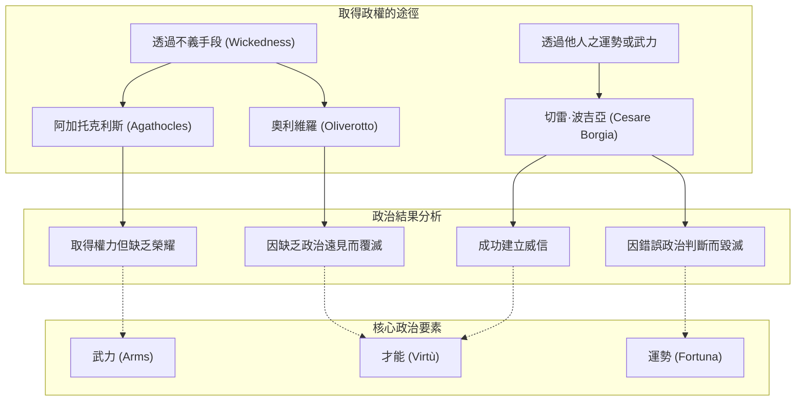

---

## Part 12

Source note: [[The Prince (Part 12)]]

Original range: lines 304-326
Original chars: 84668-93818

<!-- source: The Prince (Part 12).md -->

### 君主應透過「一次性施加必要之惡」與「循序漸進施予恩惠」來鞏固政權，並在公民政體中，透過爭取平民支持而非僅依賴貴族扶持來建立穩固的統治基礎。

#### 摘要

本篇譯文涵蓋了馬基維利《君主論》中關於權力鞏固手段與「公民政體」（Civil Principality）的論述。內容首先接續了關於奧利佛羅托（Oliverotto）透過暴力奪權及其最終毀於切雷·波吉亞（Cesare Borgia）之手的案例，進而提出了極具爭議性的政治原則： **「殘暴的正確使用」**。馬基維利主張，為了確保政權穩定，必要的暴力應「一次性地施加」，以避免長期的動盪；而恩惠則應「循序漸進地給予」。

隨後，文本進入第九章，探討「公民政體」的形成。馬基維利分析了城市中「貴族」與「平民」兩大階級之間永恆的利益衝突。他指出，貴族渴望統治與壓迫，而平民僅渴望不被壓迫。這種權力結構的互動，決定了政體會走向君主制、自治或無政府狀態。

#### 翻譯內文

（接續前文）……他們才剛坐下，士兵便從隱蔽處湧出，屠殺了喬凡尼與其餘眾人。在這些謀殺發生後，奧利佛羅托騎著馬在城內巡視，並圍困了宮殿中的首席長官，使得人民因恐懼而被迫服從他，並建立了一個由他擔任君主的政府。他殺死了所有可能對他造成傷害的不滿者，並透過新的民事與軍事法令來鞏固權力，以至於在他統治該公國的那一年裡，他不僅在費爾莫市（Fermo）站穩了腳跟，甚至令周遭鄰邦都感到畏懼。如果不是因為他讓自己落入了切雷·波吉亞的圈套，他的覆滅本會像阿加托克勒（Agathocles）一樣困難；然而正如前文所述，波吉亞利用奧西尼（Orsini）與維泰利（Vitelli）在西尼加利亞（Sinigalia）將其擒獲。因此，在他犯下這起弑親罪行的一年後，他便與維泰洛佐（Vitellozzo）一同被勒斃，而後者曾是他眼中勇武與邪惡的效法對象。

有些人可能會疑惑，為何阿加托克勒之流在經歷了無數背叛與殘暴之後，仍能在祖國長期安穩地生存，抵禦外敵，且不被國民陰謀篡位；畢竟許多人即便在和平時期也無法維持政權，更遑論在動盪的戰爭時期。我認為，這源於「殘暴」的使用方式是「正當」還是「不當」。所謂「正當使用的殘，（若能美化之）尚可稱之為善」，是指那些為了安全所必需、且一次性施加的嚴厲手段，且事後不再持續使用，除非這些手段能轉化為對臣民有利的益處。而「不當使用的殘」，則是那些在初期雖然規模尚小，卻隨著時間推移而不斷增加而非減少的手段。採取第一種制度的人，能藉由上帝或人的幫助，在一定程度上緩解其統治，正如阿加托克勒所做的那樣；而採取第二種制度的人，則不可能維持政權。

（註：布爾德先生建議，當馬基維利談到「crudeltà」時，其含義可能更接近現代意義上的「殘暴」，而非僅僅是顯而易見的「殘忍」。）

因此必須注意，奪取政權的篡位者應仔細審視所有必要的傷害，並將其「一次性地施加」，以免每天都要重複施暴；如此一來，他便能透過不擾亂人心來安撫人民，並透過恩惠贏得他們的支持。凡是因膽怯或惡意建議而採取其他做法的人，都不得不始終手握利刃；他既無法依靠臣民，臣民也無法效忠於他，因為持續且反覆的傷害會破壞關係。 **傷害應一次性地施害，如此一來，因感受較少，反感也較輕；恩惠則應循序漸進地給予，如此一來，其滋味才能長久留存。**

最重要的是，君主應以一種方式與人民共處，使任何突如其來的變故（無論好壞）都不會導致他改變方針；因為如果在動盪時期才被迫採取嚴厲手段，那就太遲了；而溫和的手段也無濟於事，因為這會被視為被迫之舉，沒有人會因此對你心存感激。

##### 第九章：論公民政體

轉而論及另一個重點——當一位傑出的公民並非透過邪惡或不可忍受的暴力，而是透過同胞的支持而成為國家元首時，這可以被稱為「公民政體」。達成此目標不一定需要天才或運氣，而需要一種「幸運的精明」。我說，這種政體是透過「人民的支持」或「貴族的扶持」而獲得的。因為在所有城市中，都存在著這兩個截然不同的黨派；由此產生了：貴族不願被人民統治或壓迫，而貴族卻渴望統治並壓迫人民。這兩種相反的慾望，在城市中會導致三種結果之一：君主政體、自治或無政府狀態。

君主政體會根據掌握機會的對象，由人民或貴族所建立。貴族因眼見無法抵抗人民，便開始抬高自家成員的聲望，並擁立其為君主，以便在該君主的庇護下實現野心。人民則因發現無法抵抗貴族，也開始抬高自家成員的聲銳，並擁立其為君主，以便透過其權威獲得保護。透過貴族扶持而獲得主權的人，其維持統治的難度比透過人民支持的人更高，因為前者身邊充滿了視自己為對等地位的人，導致他既無法統治也無法按己意管理他們。然而，透過人民支持而獲得主權的人，雖然身邊可能孤立無援或僅有少數追隨者，但這些人都是願意服從他的。

此外，透過公正的手段且不傷害他人，是無法滿足貴族的，但你可以滿足人民，因為人民的目標比貴族更正當——貴族渴望壓迫，而人民僅渴望不被壓迫。此外還應補充的是，君主永遠無法在面對敵對人民時確保安全，因為人民人數過多；但面對貴族時，他卻可以確保安全，因為貴族人數稀少。君主從敵對人民身上能預料到的最壞情況是被拋棄；但面對敵對貴族，他不僅要擔心被拋棄，還要擔心他們會起義反抗；因為貴族在這些事務上更具遠見與精明，他們總能在適當時機挺身而出以自保，並從他預期會獲勝的人手中獲取恩惠。此外，君主被迫必須與同一群人民共處，但他卻可以不依賴同一群貴族，因為他可以隨時更換貴族，並隨心所欲地賦予或剝奪權力。

因此，為了更清楚地說明這一點，我說看待貴族主要有兩種方式：即他們要麼選擇一種將自身命運與你完全綁定的道路，要麼不選擇。那些願意綁定自身且不貪婪的人，應受到尊敬與愛戴；而那些不願綁定自身的人，則有兩種處理方式：他們可能因膽怯或天生缺乏勇氣而未能如此，在這種情況下，你應當利用他們，特別是那些能提供良策的人；如此一來，在繁榮時期你尊重他們，在逆境中你也不必恐懼他們。然而，當他們為了自身的野心而刻意迴避與你綁定，這便是一個信號，表明他們對自身的考量多於對你的考量；君主應對此保持警惕，並像對待公開的敵人一樣恐懼他們，因為在逆境中，他們總是會助長你的毀滅。

因此，透過人民支持而成為君主的人，應致力於維持人民的友好，這對他來說很簡單，因為人民的要求僅是不要被他壓迫。然而，那些與人民對立、透過貴族支持而成為君主的人，首要任務必須是尋求贏得人民的支持，只要他能將人民置於其保護之下，這便能輕易達成。因為當人們從一個他們原先預期會帶來惡果的人身上獲得好處時，他們會與施恩者建立更緊密的紐帶；因此，人民會比原本支持他建立政體的時期更加效忠於他。君主可以透過多種方式贏得人民的愛戴，但由於這些方法隨環境而異，無法給出固定的規則，故我在此略過；但我重申，君主必須讓人民保持友好，否則他在逆境中將毫無安全感。

斯巴達的君主納比斯（Nabis），曾抵禦全希臘與勝利的羅馬軍隊的進攻，並為他的祖國與政權奮戰；要克服這種危險，他僅需確保自己不被少數人威脅，但如果人民是敵對的，這將不足以支撐他的統治。不要讓任何人用那句陳腐的諺語來質疑這點——「建立在人民之上，如同建立在泥淖之上」；這句話只有在私人公民試圖以此為基礎，並幻想在被敵人或官員迫害時人民會救他時才成立。在這種情況下，他往往會發現自己受騙，正如羅馬的格拉古兄弟（Gracchi）與佛羅倫斯的喬治·斯卡利（Giorgio Scali）先生。但如果是一位如前所述，能夠指揮全局、勇於承擔、在逆境中不畏艱難、具備其他必要素質，且能憑藉決斷力與精力激勵全體人民的君主——這樣的人，絕不會在人民身上感到受騙，事實將證明他奠定了堅實的基礎。

#### 詞彙與關鍵術語

| 術語 (原文/概念) | 繁體中文翻譯 | 語境解析 |
| :--- | :--- | :--- |
| **Cruelty well-used** | **正當使用的殘暴** | 指為了建立秩序而一次性、必要且不持續使用的暴力手段。 |
| **Cruelty badly used** | **不當使用的殘暴** | 指隨著時間推移而不斷增加、且造成長期動盪的暴力手段。 |
| **Civil Principality** | **公民政體** | 指領導人透過公民（而非暴力）的支持而取得統治權的政體。 |
| **Nobles** | **貴族** | 在政體結構中，代表渴望統治與壓迫人民的階級。 |
| **The People** | **平民 / 庶民** | 在政體結構中，代表僅渴望不被壓迫的階級。 |
| **One stroke** | **一次性地 / 一舉到位** | 政治行動的策略，強調傷害應一次完成，恩惠應循序漸進。 |
| **Anarchy** | **無政府狀態 / 混亂** | 貴族與平民利益衝突失衡時可能導致的政體崩潰狀態。 |

#### 文化解析

1.  **政治現實主義的道德重構**：
    馬基維利在此處展現了其著名的「政治現實主義」。他並非在宣揚惡行，而是在討論「效率」。他將「殘暴」與「恩惠」視為一種政治工具的分配策略。這種「傷害一次性化，恩惠漸進化」的觀點，反映了對人性本質（易忘恩、易反感）的深刻洞察，試圖從混亂中建立秩序。

2.  **階級鬥爭的政治學**：
    在第九章中，馬基維利對「貴族」與「平民」的描述，實際上是早期現代政治學中關於階級衝突的經典論述。他敏銳地捕捉到，社會穩定不取決於階級的消失，而取決於權力平衡。他對「平民」目標的描述（僅求不被壓迫）與對「貴族」目標的描述（渴望壓迫）形成了強烈的對比，這構成了理解後世民主與威權政體演變的重要基礎。

3. **權力基礎的脆弱性與堅固性**：
    文中提到的「建立在人民之上如同建立在泥淖之上」是一句常見的政治警句，意指民粹主義的不可靠。然而，馬基維利提出了反論：若領導者具備足夠的「勇氣」與「決斷力」，人民的基礎可以非常堅固。這強調了「領導者素質」與「政治制度設計」之間的互動關係。

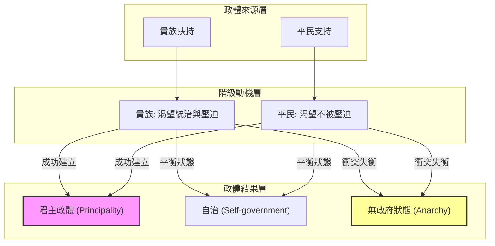

---

## Part 13

Source note: [[The Prince (Part 13)]]

Original range: lines 326-350
Original chars: 92796-102312

<!-- source: The Prince (Part 13).md -->

### 透過分析政權的權力基礎（人民 vs. 官員）、資源自給能力（自身資源 vs. 城鎮防禦）以及宗教權威的特殊性，建立一套衡量政權穩定性與強度的標準。

#### 摘要

本段文本摘自馬基維利（Niccolò Machiavelli）的《君王論》（*The Prince*），主要探討了政權穩定性的三個核心維度：
1. **民意與官僚體系的權衡**：探討君主應建立在「人民」而非「官員」之上的政治邏輯，並批判了過度依賴官僚體系所導致的政權脆弱性。
2. **政權強度的衡量標準**：提出了透過「自身資源（人力與財力）」或「城鎮防禦（工事與物資）」來衡量政權強度的標準，並以德國城邦的防禦機制作為正面範例。
3. **教會政體的特殊性**：分析了教會政體如何透過宗教傳統與神聖權威，在不依賴武力防禦的情況下實現長期的政治穩定，同時也揭示了教宗世俗權力受制於羅馬貴族派系鬥爭的歷史現狀。

#### 翻譯內文

（承接前文）……他保衛了自己的國家與政府；而要克服這種危險，他僅需確保自己不被少數人威脅，但若人民心懷敵意，僅靠此舉便不足夠。切莫讓任何人用那句陳腐的諺語來質疑這番話，即「以民為基，如築於泥」；這句話僅在私人公民以此為基礎，並幻想在被敵人或官員迫害時，人民能解救他時才成立；在這種情況下，他往往會發現自己受騙，正如羅馬的格拉古兄弟（Gracchi）與佛羅倫斯的喬治·斯卡利（Messer Giorgio Scali）先生一樣。然而，若一位君主已確立了上述地位，具備統治能力，且為勇猛之人，在逆境中不畏艱難，且具備其他必要素質，並能憑藉其決斷力與活力激勵全體人民——那麼，他絕不會在人民身上失望，且事實將證明他奠定了堅實的基礎。

*註：斯巴達暴君納比斯（Nabis）於西元前 195 年被羅馬將領弗拉米尼努斯（Flarriminus）征服；於西元前 192 年被殺。*
*註：喬治·斯卡利先生。此事件見於馬基維利之《佛羅倫薩史》第三卷。*

當政體從「公民政體」轉向「絕對政體」時，這些君主領地容易面臨危險，因為此類君主若非親自統治，便是透過官員來統治。在後者的情況下，其政權較為脆弱且不穩固，因為政權完全仰賴那些被提拔為官員的公民之善意；而這些官員在動盪時期，極易透過陰謀或公開反抗來摧毀政權；且君主在混亂中往往沒有機會行使絕對權力，因為習慣於聽從官員指令的公民與臣民，在混亂中並不願意服從他，且在動盪時期，他能信任的人才總是匱乏。因為這樣的君主無法依賴平時觀察到的現象——即在太平盛世，臣民需要國家時，每個人都與他一致，承諾效忠，且在死亡尚遠時，每個人都願為他而死；但在動盪時期，國家需要臣民時，他卻發現能依靠的人寥寥無幾。這種嘗試極其危險，因為它只有一次機會。因此，明智的君主應採取一種策略，使他的臣民在任何種類與情境下，始終都覺得需要國家與他，如此一來，他才能始終獲得他們的忠誠。

#### 第十章：論如何衡量所有政體的強度

在檢驗這些政體的性質時，必須考慮另一個要點：即一位君主是否擁有足夠的權力，在必要時能依靠自身資源自保，還是始終需要他人的援助。為了清楚說明，我認為那些能靠自身資源自保的人，是指能透過充足的人力或財力，召集足夠的軍隊來對抗任何入侵者的人；而我認為那些始終需要他人的人，是指無法在戰場上對抗敵人，只能躲在城牆後進行防禦的人。前者已在討論中提及，若後續有涉及，我們將再次討論。對於後者，除了鼓勵此類君主儲備物資並加固城鎮外，別無他法，且絕不應僅靠防禦來保衛國家。任何能妥善加固城務、且能如前文所述妥善處理臣民事務的人，敵人絕不敢輕易進攻，因為人們對於能預見困難的事業總是持反對態度；事實證明，要攻擊一個城鎮防禦完備且不被人民憎恨的人，絕非易事。

德國的城市是絕對自由的，它們周邊領土狹小，僅在符合自身利益時才向皇帝效忠；它們既不畏懼鄰近的權力，也不畏懼任何威脅，因為其防禦極其嚴密，任何人都認為強攻是既乏味又艱巨的任務——因為它們擁有完善的壕溝與城牆、充足的火炮，且公共倉庫中始終儲備著足以維持一年飲食與彈藥的物資。除此之外，為了維持人民安寧且不損害國家利益，它們總能透過那些支撐城市生命與強大力量的公共工程來為社群提供工作，而人民也藉此維持生計；它們也非常重視軍事演習，且擁有多項維持秩序的法令。

因此，一位擁有強大城鎮且不致招致怨恨的君主，是不會受到攻擊的；即便有人發動攻擊，也只會被羞辱地擊退。再者，由於世事變幻莫測，幾乎不可能在不受到干擾的情況下，讓一支軍隊在野外駐紮整整一年。若有人反駁說：「如果人民在城外有土地，看到土地被焚燒，他們將無法忍受，長期的圍城與個人利益會使他們忘記君主」，對此我的回答是：一位強大且勇猛的君主，能透過交替使用「給予臣民災難不會持續太久的希望」與「施加對敵人殘暴行為的恐懼」來克服所有此類困難，並巧妙地防範那些顯得過於大膽的臣民。

此外，敵人抵達時，自然會立即焚燒並破壞鄉村，此時人民的鬥志正高昂且準備防禦；因此，君主絕不應猶豫；因為隨著時間推移，當鬥志消退，損害已經造成，災難已經發生，且已無藥可救；屆時，人民反而更傾向於與君主團結，因為他們的房屋被焚、財產被毀，都是為了保衛君主而造成的。因為人的本性是，對於自己所獲得的恩惠，與對於自己所施予的恩惠，同樣會感到受制於人。因此，如果一切考慮周全，一位明智的君主若能確保始終支持並保衛臣民，那麼要使臣民的心志始終如一，並非難事。

#### 第十一章：論教會政體

現在僅剩教會政體需要討論，其取得領土的困難主要在於佔領過程，因為它們是透過能力或運氣獲得的，且即便不具備這兩者也能保有；因為它們受宗教古老律法的支撐，這些律法如此強大且具備某種特性，使得無論君主如何行事或生活，政體皆能維持。這些君主唯獨擁有國家卻不防禦；他們擁有臣民卻不統治；國家雖然無人看守卻不被奪走；臣民雖然未受統治卻不在意，且既無欲望也無能力背離。唯有此類政體才是安全且幸福的。但由於其支撐力量超乎人類心智所能及，我不再多言，因為既然它們是由神所提升與維護，討論這些政體將是狂妄且魯莽之舉。

然而，若有人問我，既然自亞歷山大大帝以來，義大利的統治者（不僅是那些被稱為統治者的人，而是每一位男爵與領主，哪怕是最微小的）對世俗權力的重視極低，為何教會卻能取得如此巨大的世俗權力？如今法國國王甚至在它面前顫抖，它甚至能將他驅逐出義大利，並能摧毀威尼斯——雖然這顯而易見，但我認為適度地回顧一下並非多餘。

在法國國王查理進入義大利之前，這片土地處於教宗、威尼斯、那不勒斯國王、米蘭公爵與佛羅倫斯人的統治之下。這些統治者有兩個主要的憂慮：一是擔心外國武裝部隊進入義 पॉलिटी；二是擔心彼此之間會奪取更多領土。最令他們擔憂的是教宗與威尼斯人。為了制衡威尼斯，所有其他勢力的聯合是必要的，正如為了保衛費拉拉（Ferrara）一樣；而為了壓制教宗，他們利用了羅馬的男爵，這些男爵分為奧西尼（Orsini）與科隆納（Colonnesi）兩大派系，始終有藉口製造混亂，且在教宗的注視下手握武裝，使教廷顯得軟弱無力。雖然偶爾會出現像錫克圖斯（Sixtus）這樣勇猛的教宗，但無論是運氣還是智慧，都無法使他擺脫這些困擾。教宗短暫的任期也是軟弱的原因；因為在教宗平均十年的任期內，他很難削弱其中一個派系；且如果說某個民族幾乎消滅了科隆納派，另一個敵對奧西尼派的勢力就會興起，即便他們支持對手，卻也來不及摧毀奧西尼派。這就是為什麼教宗在義大利的世俗權力並不受尊崇的原因。

#### 詞彙與關鍵術語

| 術語 (English) | 繁體中文翻譯 | 文化/語境解析 |
| :--- | :--- | :--- |
| **Civil to absolute order** | 從公民政體轉向絕對政體 | 指政權從由法律與官員制衡的狀態，轉向君主個人掌握最高權力的過程。 |
| **Magistrates** | 官員 / 執政官 | 在此語境下指代中間階層的官僚，他們的權力可能威脅君主的穩定性。 |
| **Building on the people is building on the mud** | 以民為基，如築於泥 | 引用格拉古兄弟的教訓，指若君主僅靠人民的「自發性解救」來建立權力，基礎極不穩固。 |
| **Ecclesiastical principalities** | 教會政體 | 指由教會領袖（如教宗）統治的政體，其穩定性來自宗教傳統而非武力。 |
| **Temporal power** | 世俗權力 | 指教會在世俗政治、領土與法律上的統治權，與宗教精神權力相對。 |
| **Orsini and Colonnesi** | 奧西尼與科隆納 | 羅馬兩大權勢家族，其長期的派系鬥爭是導致教廷政治不穩的關鍵因素。 |

#### 邏輯結構圖

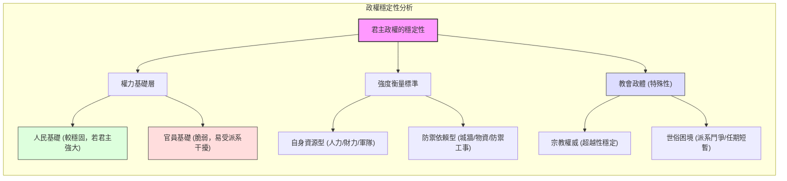

---

## Part 14

Source note: [[The Prince (Part 14)]]

Original range: lines 350-376
Original chars: 101290-109623

<!-- source: The Prince (Part 14).md -->

### 國家穩定依賴於良好的法律與精良的武裝，而依賴傭兵或增援軍等非自有武裝將導致政權的脆弱與毀滅。

#### 摘要

本段文本節選自馬基維利的《君王論》，涵蓋了兩個核心主題：首先是教宗權力在義大利政治版圖中的不穩定性，特別是羅馬貴族派系（奧爾西尼與科隆納）對教廷權威的削弱；其次是關於國家防禦基礎的論述，馬基維利嚴厲批判了「傭兵」制度的不可靠性，主張國家必須依賴自身的武裝（正規軍）來維持主權與法律的穩定。

#### 翻譯內文

最令人不安的莫過於教宗與威尼斯人。為了制衡威尼斯人，必須聯合其他所有勢力，正如為了保衛費拉拉（Ferrara）所必需的一樣；而為了壓制教宗，則利用了羅馬的男爵們，因為他們分裂為奧爾西尼（Orsini）與科隆納（Colonnesi）兩個派系，始終有藉口製造動亂，且在教宗的注視下手握武力，使得教廷顯得軟弱無力。即便偶爾會出現像錫克圖斯（Sixtus）這樣勇敢的教宗，但無論是命運還是智慧，都無法使他擺脫這些困擾。教宗短暫的任期也是造成弱點的原因；因為在教宗平均十年的任期內，他很難削弱其中一個派系；而且，如果說某個民族幾乎消滅了科隆納派，另一個敵對奧爾西尼的派系又會隨之興起，而新派系甚至還沒有時間去摧毀奧爾西尼。這便是教宗的世俗權力在義大利鮮少受到尊重的理由。

1494 年，查理八世入侵義大利。

隨後，亞歷山大六世崛起，他向世人展示了擁有金錢與武力的教宗如何能夠取勝；透過瓦倫提諾公務（Duke Valentino）的手段，以及法國人的進入，他實現了我在上述關於公爵行動中所討論的一切。儘管他的意圖並非擴張教會，而是為了擴張公爵的勢力，然而他的所作所為卻促成了教會的偉大，在公爵去世及其勢力崩潰後，教會成為了他所有功績的繼承者。

隨後的朱利葉斯教宗接手時，發現教會已趨強大，擁有了整個羅馬涅（Romagna）地區，羅馬男爵的勢力已被削弱，且透過亞歷山大的懲戒，派系鬥爭已趨於平息；他也發現了像亞歷山大時代之前從未有過的斂財途徑。朱利必須不僅繼承了這些做法，更加以改進，他意圖奪取博洛尼亞（Bologna）、摧毀威尼斯人的勢力，並將法國人驅逐出義大利。所有這些事業在他任內都取得了成功，且更值得稱道的是，他所做的一切都是為了強化教會而非個人私利。他也將奧爾西尼與科隆銳派系維持在原有的限度內；儘管其中仍有人企圖製造動亂，但他牢牢掌握了兩點：一是利用教會的偉大來威懾他們；二是不允許他們擁有各自的樞機主教，因為正是樞機主教導致了派系間的混亂。因為每當這些派系擁有自己的樞機主教時，便無法長久安寧，因為樞機主教會在羅馬境內外扶持派系，而男爵們被迫支持他們，因此，來自聖職者的野心導致了男爵間的動亂與騷亂。基於這些原因，利奧教宗發現教廷權力極其強大，並希望若他人是以武力使其壯大，他將能憑藉其仁德與無盡的美德，使其更加偉大且受人景仰。

利奧十世教宗即是美第奇家族的樞機主教。

#### 第十二章：兵種之多樣性，以及關於傭兵之論述

在詳細討論了最初提議討論的各類君主政體特徵、在一定程度上考慮了其好壞之因，並展示了許多人尋求獲取與維持政體的方法後，現在我將廣泛討論屬於各類政體的進攻與防禦手段。

我們在前文已見，君主必須打好基礎，否則必然走向毀滅。所有國家（無論是新建立的、舊有的還是複合型的）的主要基礎在於良好的法律與精良的武裝；由於在國家武裝不力之處不可能有良好的法律，因此可以推論，在武裝精良之處，必然擁有良好的法律。我將不再討論法律，而僅談論武裝。

因此，我說，君主用來保衛國家的武裝，要麼是自有的，要麼是傭兵、增援軍或混合部隊。傭兵與增援軍既無用且危險；如果一個人依靠這些武裝來維持政體，他將既不穩固也不安全；因為他們渙散、野心勃勃且缺乏紀律，不忠誠，對朋友勇猛，對敵人膽怯；他們既沒有對上帝的敬畏，也沒有對人的忠誠，毀滅的威脅僅僅被推遲到了進攻發生之時；因為在和平時期，人民會被他們掠奪，而在戰爭時期，則會被敵人掠害。事實上，除了微薄的酬金外，他們沒有其他留守戰場的動力或理由，而這點酬金不足以讓他們願意為你赴死。當你不打仗時，他們很樂意當你的士兵，但一旦戰爭爆發，他們便會撤離或向敵人逃竄；這點我並不難證明，因為義大利多年的毀滅，正是因為長期將希望寄託在傭兵身上，儘管他們以前曾展現出一些威風，在內部看起來很勇猛，但當外敵入侵時，他們便顯露了真面目。因此，法國國王查理得以「手持粉筆」奪取義大利；那位告訴我們罪孽是禍端的人說的是實話，但那些罪孽並非他所想像的那樣，而是我所敘述的這些。既然這是君主的罪孽，那麼君主也承擔了代價。

「手持粉筆」（col gesso），這是亞歷山大六世的一句妙語，指的是查理八世奪取義大利之輕易，暗示他只需要派遣他的後勤官員去為士兵標記住宿地點（用粉筆劃線）即可征服該國。

我希望進一步證明這些武裝的不幸。傭兵隊長要麼是能人，要麼不是；如果是能人，你無法信任他們，因為他們總是追求自身的偉大，要麼透過壓迫身為主人的你，要麼透過違背你的意圖去對付他人；但如果隊長不精明，你則會以常規的方式走向毀滅。

如果有人辯稱，無論是否為傭兵，任何武裝起來的人都會採取同樣的行動，我的回答是：當君主或共和國必須動用武力時，君主應親自擔任隊長；共和國則必須派遣其公民，若派遣的人不盡如人意，應將其召回；若派遣的人才華橫溢，則應透過法律約束他，使其不脫離指揮。經驗表明，單打獨鬥的君主與共和國能取得最大的進展，而傭兵除了造成破壞外別無他用；一個擁有自身武裝的共和國，要被其公民之一統治，比一個依賴外來武裝的共和國更為困難。羅馬與斯巴達曾憑藉武裝自由地存在了許多個世紀。瑞士人則完全依靠武裝且非常自由。

以古代傭兵為例，迦太基人在與羅馬的第一場戰爭後，便受到其傭兵士兵的壓迫，儘管迦太基人擁有自己的公民擔任隊長。在伊帕米諾達（Epaminondas）去世後，馬其頓的腓力被塞比亞人（Thebans）任命為其士兵的隊長，他在勝利後卻奪取了他們的自由。

費利波公爵去世後，米蘭人僱用了弗朗切斯科·斯福爾扎（Francesco Sforza）來對抗威尼斯人，而他在卡拉瓦喬（Caravaggio）擊敗敵人後，卻與威尼斯人結盟來摧毀他的雇主——米蘭人。他的父親斯福爾扎曾受僱於那不勒斯的約翰娜女王，卻讓她處於無防禦狀態，以至於她被迫投向阿拉貢國王的懷抱，以保全她的王國。

#### 詞彙與關鍵術語

| 術語 (原文) | 繁體中文翻譯 | 說明 |
| :--- | :--- | :--- |
| Orsini and Colonnesi | 奧爾西尼與科隆納家族 | 羅馬兩大敵對貴族派系，其鬥爭削弱了教廷權力。 |
| Duke Valentino | 瓦倫提諾公務 | 指切雷·波吉亞（Cesare Borgia），亞歷山大六世之子。 |
| Mercenaries | 傭兵 | 為了酬金而戰的僱傭軍，馬基維利認為其極度不可靠。 |
| Auxiliaries | 增援軍 / 外援部隊 | 來自他國的軍隊，同樣被視為危險且不穩定的武裝。 |
| Good laws and good arms | 良好的法律與精良的武裝 | 國家穩定與存在的兩大核心支柱。 |
| "With chalk in hand" | 「手持粉筆」 | 隱喻入侵極其輕易，只需標記住宿地點即可征服。 |

#### 文化與語境解析

1.  **教廷政治的派系鬥爭**：
    文中提到的 Orsini 與 Colonnesi 家族的鬥爭，反映了文藝復興時期羅馬教廷權力結構的脆弱。教宗的權威不僅受到外部勢力（如威尼斯、法國）的威脅，更受到內部貴族派系利用宗教職位進行政治角力的干擾。

2.  **「手持粉筆」的隱喻**：
    這是一個極具諷刺意味的歷史典故。當查理八世入侵義大利時，義大利各城邦的防禦幾乎形同虛設。亞歷山大六世用「粉筆」來形容，意指法國軍隊不需要用劍戰鬥，只需要用粉筆在牆上標記士兵的住宿位置即可完成征服。這強調了當時義大利政治與軍事體系的崩潰。

3.  **武裝的哲學觀**：
    馬基維利在此建立了一個重要的政治邏輯： **武裝（Arms）是法律（Laws）的保障**。他認為法律的有效性取決於是否有足夠的武力來執行。而他對傭兵的批判，核心在於「動機」與「忠誠度」的缺失——傭兵的動機是金錢而非國家利益，因此在危機時刻必然潰散。

#### 邏輯結構圖

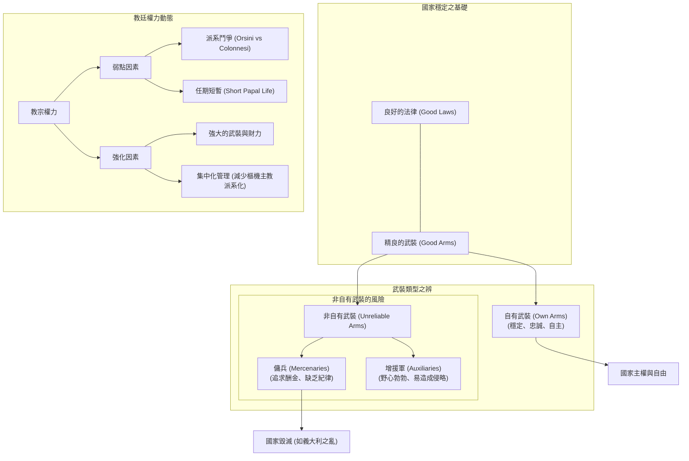

---

## Part 15

Source note: [[The Prince (Part 15)]]

Original range: lines 372-402
Original chars: 108600-117353

<!-- source: The Prince (Part 15).md -->

### 政權的穩定與自由取決於其武裝來源；依賴自有武裝（Own Arms）能保障主權，而依賴傭兵（Mercenaries）或增援軍（Auxiliaries）則會使政權陷入被動、易受操縱甚至走向滅亡。

#### 摘要

本篇文本節選自馬基維利（Machiavelli）的《君主論》（The Prince），核心議題在於探討軍事力量的來源及其對政權穩定性的影響。作者透過對古代迦太基、斯巴達、瑞士，以及近代義大利各城邦（如威尼斯、米蘭、佛羅倫斯）的歷史案例分析，提出了極具警示性的結論：依賴「自有武裝」是自由與穩定的基石；而依賴「傭兵」（Mercenaries）與「增援軍」（Auxili於aries）則會導致政權陷入被動、甚至走向滅亡。文中特別揭示了傭兵首領如何透過改變兵種結構（減少步兵、增加騎兵）來規避風險並謀取私利，進而導致義大利國力的衰落。

#### 翻譯內文

##### 第十三章：論增援軍、混合部隊與自有武裝

擁有自己的武裝，比起依賴外來武裝，更能讓公民受其統治；依賴外來武裝的政權，反而更容易受外國人之支配。羅馬與斯巴達在漫長的歲月中，皆因擁有武裝而保持自由。瑞士人亦是武裝精良且享有高度自由。

以古代傭兵為例，迦太基人在與羅馬的第一場戰爭後，便遭受其傭兵士兵的壓迫，儘管迦太基人本身也有本國公民擔任隊長。在伊帕米諾達（Epaminondas）逝世後，馬其頓的腓力（Philip of Macedon）被底比斯人委任為其士兵的隊長，然而在勝利之後，他卻奪走了他們的自由。

當杜克·菲利波（Duke Filippo）去世後，米蘭人僱用了弗朗切斯卡·斯福爾扎（Francesco Sforza）來對抗威尼斯人；斯福爾扎在卡拉瓦喬（Caravaggio）戰役中擊敗敵人後，反而與敵人結盟，用以摧毀他的雇主——米蘭人。他的父親斯福爾扎曾受聘於那不勒斯的約翰娜女王（Queen Johanna），卻使她陷入無防備的境地，迫使她不得不投向阿拉貢國王的懷抱，以保全她的王國。如果說威尼斯人和佛羅倫斯人過去曾透過這些武裝擴張領土，卻未讓其隊長篡位為君，反而守護了領土，我必須回答：佛羅倫斯人在這方面僅是僥倖。因為在那些令他們感到威脅的能幹隊長中，有人未能獲勝，有人遭到反對，而其他人則將野心轉向他處。喬凡尼·阿庫托（Giovanni Acuto）雖未獲勝，因此其忠誠度無從考證；但每個人都會承認，若他當年獲勝，佛羅倫斯人將受制於他的意志。斯福爾扎始終與布拉切斯基（Bracceschi）勢不兩立，雙方互相監視。弗朗切斯科將野心轉向倫巴第；而布拉喬（Braccio）則針對教會與那不勒斯王國。

讓我們回到不久前發生的事。佛羅倫斯人委任帕奧羅·維泰利（Pagolo Vitintelli）為隊長，他是一位極其謹慎、且從平民地位躍升至顯赫地位的人物。如果此人成功奪取比薩，無庸置疑，佛羅倫斯人必須與他維持良好關係；因為一旦他轉而效力於敵人，佛羅倫斯人將毫無抵抗之力；而若要與他維持關係，則必須服從他。

若觀察威尼斯人的成就，會發現只要他們派遣自己的部隊作戰，便能行動安全且成就輝煌，其部隊由武裝紳士與平民組成，展現了英勇。這是在他們尚未轉向陸地擴張之前；然而，當他們開始在陸地作戰時，便背棄了這種美德，轉而效法義大利的習俗。在陸地擴張初期，由於領土尚不多且聲望極高，他們並不需要對隊長感到恐懼；但隨著領土擴張，例如在卡米尼奧拉（Carmignuola）時期，他們便嚐到了這種錯誤的滋味。因為他們發現他是一位極其英勇的人（在他的領導下擊敗了米蘭公爵），但另一方面，由於深知他在戰爭中的態度猶豫不決，他們擔心在這種情況下無法再取得勝利，因此既不願也不敢放他離開；為了不失去已取得的成果，他們被迫為了自保而謀殺了他。隨後，他們又僱用了巴托洛梅奧·達·貝爾加莫（Bartolomeo da Bergamo）、羅伯托·德·聖塞維里諾（Roberto da San Severino）、皮蒂利亞諾伯爵（count of Pitigliano）等人，在這些人麾下，他們面對的不再是勝利，而是對損失的恐懼，正如後來在維拉（Vaila）戰役中所發生的那樣——在一次戰役中，他們失去了八百年來艱苦換來的成就。因為依賴這類武裝，征服的過程緩慢、遲滯且微不足道，但損失卻是突然且災難性的。

（註：卡拉瓦喬戰役，1448年9月15日；那不勒斯女王約翰娜二世，拉迪斯勞國王的遺孀；喬凡尼·阿庫托，即英國騎士約翰·霍克伍德爵士；卡米尼奧拉，弗朗切斯科·布索內；……）

正如上述例子，我觀察到義大利多年來一直由傭兵統治，因此我希望更嚴肅地討論這些問題，以便在看清他們的崛起與進展後，能更好地準備對抗他們。你們必須明白，義，帝國權力近期在義大利遭到排斥，教宗獲得了更多世俗權力，且義大利分裂成更多國家。其原因是許多大城市對抗其貴族，這些貴族原受皇帝支持，卻在壓迫城市；而教會則支持這些貴族，以換取世俗權力的威信。在許多其他地方，其公民則變成了君主。因此，義大利部分落入了教會與共和國手中，而教會由教士組成，共和國由不習慣戰爭的公民組成，兩者皆開始招募外國人。

首位為這種兵種帶來聲望的是羅曼尼亞的阿爾貝里戈·達·科尼奧（Alberigo da Conio）。從此人的流派中，誕生了布拉喬與斯福爾扎等人在其時代左右義大利局勢的人物。隨後便是所有至今主導義大利武裝的隊長；而他們所有勇武的最終結果，是導致義大利被查理（Charles）侵略、被路易（Louis）掠奪、被斐迪南（Ferdinand）蹂躪，並受到瑞士人的侮辱。他們遵循的原則是：首先，降低步兵的地位，以增加自身的權力。他們之所以這樣做，是因為依靠薪水且沒有領土，無法供養大量士兵，且少量的步兵無法賦予他們權威；因此，他們傾向於僱用騎兵，僅需適度的兵力即可維持並獲得榮耀。事態發展到如此地步，在一個兩萬人的軍隊中，竟然找不到兩千名步兵。此外，他們還使用了一切手段來減少自身與士兵的疲勞與危險：不在戰鬥中殺戮，而是捕捉俘虜並在不付贖金的情況下釋放。他們不在夜間進攻城鎮，城鎮守軍也不在夜間襲擊營地；他們不使用木柵或壕溝圍繞營地，也不在冬季作戰。所有這些都是根據他們的軍事規則所允許且設計的，目的是為了避免我所說的疲勞與危險；因此，他們將義大利帶向了奴役與輕蔑。

（註：阿爾貝里戈·達·科尼奧，即阿爾貝里科·達·巴里亞諾，羅曼尼亞的庫尼奧伯爵……）

##### 第十三章：論增援軍、混合部隊與自有武裝（續）

增援軍（Auxiliaries）是另一種無用的武裝，當君主為了援助與防禦而召集其部隊時便會使用，正如最近教宗朱利奧二世所做的那樣；因為他在對抗費拉的行動中，發現其傭兵表現不佳，於是轉而求助於增援軍，並與西班牙國王斐迪華（Ferdinand）協商提供人力與武裝。這些武裝本身可能有用且優秀，但對於召集他們的人來說，卻始終是不利的：因為戰敗，你將毀滅；而戰勝，你則成了他們的俘虜。

儘管古代史中充滿了例子，但我不想略過教宗朱利奧二世這個近期的案例，其危險性是不言而喻的；因為他為了奪取費拉，完全將自己置於外國人之手。然而，他的好運帶來了第三種結果，使他未能收穫其冒險選擇的果實：因為他的增援軍在拉文納（Ravenna）被擊潰，而瑞士人起兵驅逐了征服者（這出乎他與所有人的預期），結果他既沒有成為敵人的俘虜（因為敵人逃跑了），也沒有成為增援軍的俘虜（因為他透過其他武裝取得了勝利）。

#### 詞彙與關鍵術語

| 術語 (原文)                  | 繁體中文翻譯        | 語境說明                            |
| :----------------------- | :------------ | :------------------------------ |
| **Arms (Armies/Forces)** | **武裝 / 軍隊**   | 在此指代政權所依賴的軍事力量來源。               |
| **Mercenaries**          | **傭兵**        | 受僱於他人、以利潤為目的的職業軍人，文中視為不穩定因素。    |
| **Auxiliaries**          | **增援軍 / 輔助軍** | 指由盟友（如其他君主）提供的部隊，與傭兵不同，但同樣具危險性。 |
| **Own Arms**             | **自有武裝**      | 指由本國公民或正規部隊組成的軍隊，象徵主權與自由。       |
| **Temporal Power**       | **世俗權力**      | 指教會在政治、領土與行政上的實際統治權力。           |
| **Infantry**             | **步兵**        | 文中提到傭兵首領刻意減少步兵比例以降低風險。          |
| **Cavalry**              | **騎兵**        | 傭兵首領增加的兵種，因其成本較低且能快速撤退。         |

#### 文化與語境解析

1.  **軍事結構的政治經濟學**：
    馬基維利在此展現了深刻的「成本效益」分析。他指出傭兵首領（如 Alberigo da Conio）之所以減少步兵、增加騎兵，並非單純的戰術選擇，而是一種 **商業策略**。步兵需要大量的後勤與領土支撐，且在戰鬥中風險高、消耗大；騎兵則能以較少的成本維持威懾力，且在戰局不利時能迅速脫身。這種「降低風險、追求利潤」的邏輯，正是導致義大利政權無法建立長期穩定防禦的根本原因。

2.  **「增援軍」的悖論**：
    文中對「增援軍」（Auxiliaries）的定義非常精準。雖然增援軍看似強大，但其本質是「他人的力量」。馬基維利指出了一個致命的邏輯：如果你依賴他人的武裝來獲勝，你便在精神與政治上依賴了對方，最終淪為對方的附庸（Captive）。

3.  **義大利的衰落背景**：
    文本描述了義大利從「封建/帝國秩序」轉向「破碎化城邦」的過程。隨著教宗權力擴張與城市共和國興起，各方勢力為了填補武力真空，大量引入外國傭兵。這種權力結構的變動，使得義大利成為了歐洲強權（如法國、西班牙、瑞士）的戰場與掠奪對象。

#### 邏輯結構圖

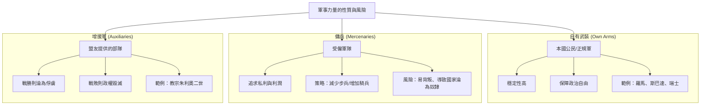

---

## Part 16

Source note: [[The Prince (Part 16)]]

Original range: lines 398-432
Original chars: 116331-125804

<!-- source: The Prince (Part 16).md -->

### 君主必須建立由臣民或公民組成的「自有武力」，因為依賴傭兵或增援軍會因其各自的特性（懦弱或勇猛）而導致政權不穩，且精通戰爭藝術是維持統治與避免被輕視的唯一途徑。

#### 摘要

本段文本摘自馬基維利《君王論》關於軍事力量來源的討論。核心論點在於區分三種軍事力量： **傭兵 (Mercenaries)** 、 **增援軍 (Auxiliaries)** 以及 **自有軍隊 (One's own forces)**。

馬基維利指出，依賴他人的武力（無論是付錢雇用的傭兵，還是盟友提供的增援軍）都是極其危險的。傭兵的危險在於其「懦弱」（戰敗時會拋棄你），而增援軍的危險在於其「勇猛」（勝利時會反過來統治你）。他透過教宗朱利奧二世、切雷·波吉亞、以及法國國王查理七世等歷史案例，證明了唯有建立基於本國臣民或公民的「自有軍隊」，才能確保政權的長治久安。最後，他在第十四章強調，戰爭藝術是君主必須精通的核心技能，忽視戰爭規律將導致統治地位的喪失與威信的崩解。

#### 翻譯內文

##### 關於武力來源的風險

對於提供兵員與武力之協助，（某人）依賴於此。這些武力本身可能有用且優良，但對於召集他們的人來說，卻始終是不利的；因為一旦失敗，便會招致滅亡；而即便勝利，你也將成為他們的俘虜。

（案例：斐迪南五世，阿拉貢與西西里之費迪南二世，那不勒斯之費迪南三世，誕生於 1452 年，卒於 1516 年，被譽為「天主教國王」。）

儘管古代史充滿了實例，但我不想略過教宗朱利奧二世這件近期的案例，其危險性是不言而喻的；因為他為了奪取費拉，將自己完全置於外國人之手。雖然他的好運帶來了第三種結果，使他未能在魯莽的選擇中收穫果實；因為他的增援軍在拉文誠被擊潰，而瑞士兵卻出乎意料地起義並驅逐了征服者（無論是對他還是對他人而言皆如此），以至於他既沒有成為敵人的俘虜（因為敵人已逃散），也沒有成為增援軍的俘虜（因為他透過非其所屬的武力取得了勝利）。

佛羅倫斯人因完全缺乏武力，派遣了一萬名法國人去奪取比薩，這使他們陷入了比以往任何時期都更危險的困境。

君士坦丁堡皇帝為了對抗鄰國，派遣了一萬名土耳其人進入希臘，戰爭結束後，這些人卻不願撤離；這便是希臘淪為異教徒奴役的開端。

（案例：約翰尼斯·坎塔庫曾，誕生於 1300 年，卒於 1383 年。）

因此，對於不求征服的人，可以使用這些武力，因為它們比傭兵更危險，因為使用它們幾乎注定了滅亡；因為增援軍是團結一致的，且全都服從於他人；但傭兵在征服之後，還需要更多時間與更好的機會才能傷害你；因為傭兵並不屬於同一個共同體，他們是由你尋找並支付酬勞的，且你所扶持的第三方法（即增援軍的首領）無法立即掌握足夠的權力來傷害你。總而言的說，在傭兵身上，最危險的是其「懦弱」；而在增援軍身上，最危險的是其「勇猛」。因此，明智的君主始終避免使用這些武力，轉而建立自己的部隊；他寧願在自己的部隊中戰敗，也不願透過他人的武力獲得勝利。

我絕不會猶豫引用切雷·波吉亞及其行動。這位公爵帶著增援軍進入羅馬涅，僅使用了法國士兵，並藉此奪取了伊莫拉與福利；但隨後，由於這些部隊顯得不可靠，他轉向了傭兵，認為其中的危險較小，並招募了奧爾西尼與維泰利；然而不久後，他發現這些人疑慮重重、不忠且危險，於是將其剷除並改用自己的部隊。這兩種部隊的差異，可以從公爵名望的變化中輕易看出：當他擁有法國部隊時、當他擁有奧爾西尼與維泰利時，以及當他依賴自己那隨時可信且忠誠度不斷提升的士兵時，其名望各不相同；當世人看到他完全掌控自己的部隊時，他的威望達到最高峰。

我本不打算超出義大利與近期的案例，但我也不願略過敘拉古的希羅，他是上述我所提到的人物之一。如前所述，此人曾領導敘拉組軍隊，但他很快發現像我們義大利傭兵首領（condottieri）那樣的傭兵部隊毫無用處；由於他發現既無法留住他們也無法放任他們離開，於是將他們全部剷除，隨後以自己的部隊進行戰爭，而非依賴外人。

我也想回想起舊約聖經中適用於此主題的一個例子。大衛向掃羅提議去對抗非利士人的勇士歌利亞，為了給他勇氣，掃羅用自己的武器武裝了他；但大衛一背上這些武器便拒絕了，說他無法使用，且希望用自己的投石索與短刀來面對敵人。總而言之，他人的武力若非從你背上掉落，便是讓你負重不堪，或是將你束縛得死死的。

法國的查理七世，路易十一世之父，憑藉好運與勇氣將法國從英國手中解放出來，他意識到必須擁有自己的武力，並在王國內建立了關於重裝步兵與步兵的法令。隨後，他的兒子路易國王廢除了步兵並開始招募瑞士兵，這個錯誤（以及後續者的錯誤）如現在所見，已成為王國的危機來源；因為他提升了瑞士兵的聲望，卻完全削弱了自己武力的價值，因為他徹底摧毀了步兵；且他的重裝部隊已依附於他人，因為他們已習慣與瑞士兵並肩作戰，以至於現在若沒有瑞士兵，他們似乎無法取勝。因此，法國人無法抵禦瑞士兵，而若沒有瑞士兵，他們在面對他人時也無法取勝。法國的軍隊因此變得混雜，部分是傭兵，部分是國民軍，這兩種武力結合起來雖比單純的傭兵或單純的增援軍要好，但仍遠遜於自有部隊。這個例子證明了，如果查理的法令能得到擴大或維持，法國王國將是不可征服的。

（案例：法國查理七世，「勝利者」，誕生於 1403 年，卒於 1461 年。其子路易十一世，誕生於 1423 年，卒於 14 83 年。）

但人類的智慧是匱乏的，在進入一樁起初看似美好的事務時，無法察覺其中隱藏的毒素，正如我前文所說的癰疽熱病。因此，如果統治公國的人直到災難臨頭才能辨識惡行，那他並非真正的智者；而這種洞察力是極少數人擁有的。若檢視羅馬帝國最初的災難，會發現其衰落始於招募哥德人；因為從那時起，羅馬帝國的活力開始衰退，所有曾建立起帝國的勇氣都轉移到了他人手中。

「前幾晚在關於削減軍備辯論中的許多演說者，似乎對大英帝國維持生存的條件表現出極其悲哀的無知。當巴爾福回應關於羅馬帝國在軍事義務重擔下沉淪的指控時，他說這是『完全不符合史實的』。他本可以補充說，當每一位公民都承認自己有義務為國家戰鬥時，羅馬的力量正處於巔峰；但一旦這種義務不再被認可，帝國便開始衰落。」——《倫敦晨報》（Pall Mall Gazette），1906 年 5 月 15 日。

因此，我得出結論：沒有自有武力的公國是不安全的；相反地，它完全依賴於好運，且缺乏在逆境中捍衛自己的勇氣。歷代智者的觀點與判斷始終一致：沒有建立在自身力量基礎上的名聲或權力，是極其不確定且不穩定的。而所謂的「自有武力」，是指由臣民、公民或依附者所組成的部隊；其餘的皆為傭兵或增援軍。只要反思我所提出的規則，並思考亞歷山大大帝之父腓力，以及許多共和國與君主是如何武裝與組織自己的，便能輕易找到建立自有武力的途徑，而我完全信奉這些規則。

##### 第十四章：關於君主在戰爭藝術方面的論述

君主不應有其他的目標或思考，也不應選擇其他事物作為研究，除了戰爭及其規律與紀律；因為這是統治者唯一擁有的藝術，且其力量之大，不僅能鞏固天生的君主，往往還能使平民從私人的地位晉升到那樣的地位。相反地，我們可以看到，當君主比起武力更注重安逸時，他們便失去了國家。你們失去國家的首要原因就是忽視這門藝術；而能讓你們獲得國家的，則是精通這門藝術。弗朗切斯科·斯福爾扎，憑藉其軍事才能，從一個平民變成了米蘭公爵；而後來的子嗣，由於逃避戰爭的艱辛與麻煩，從公爵變回了平民。因為不武裝所帶來的惡果之一，就是會讓你被輕視，而這是君主應當防範的恥辱之一，正如後文所示。因為武裝者與不武裝者之間不存在對等關係；一個武裝的人不應心甘情願地服從一個不武裝的人，一個不武裝的人在武裝的僕從之中也不應感到安全。因為，一方存在著蔑視，另一方存在著猜忌，兩者是不可能良好合作的。因此，一個不精通戰爭藝術的君主，除了前述的其他不幸外，還無法獲得士兵的尊重，也無法依賴他們。因此，君主絕不應將戰爭這個主題從腦海中抹去，在和平時期，他對其練習的投入程度應比在戰爭時期更甚；他可以透過兩種方式做到這一點：一種是透過行動，另一種是透過研究。

#### 詞彙與關鍵術語

| 術語 (原文) | 繁體中文翻譯 | 語境說明 |
| :--- | :--- | :--- |
| **Auxiliaries** | **增援軍 / 盟軍** | 指由盟友提供、而非本國招募的部隊，其危險在於「勇猛」可能導致政權易主。 |
| **Mercenaries** | **傭兵** | 指受僱於君主的職業軍人，其危險在於「懦弱」且缺乏忠誠度。 |
| **One's own forces** | **自有武力 / 本國部隊** | 由本國臣民、公民或依附者組成的部隊，是政權穩定的基礎。 |
| **Art of War** | **戰爭藝術** | 指掌握戰爭的規律、紀律與軍事技術，是君主統治的核心技能。 |
| **Condottieri** | **傭兵首領** | 義大利語，特指當時義大利常見的僱傭軍指揮官。 |
| **Dastardy** | **懦弱 / 膽怯** | 用於描述傭兵在戰敗時不負責任、隨時可能拋棄雇主的行為。 |

#### 邏輯結構圖

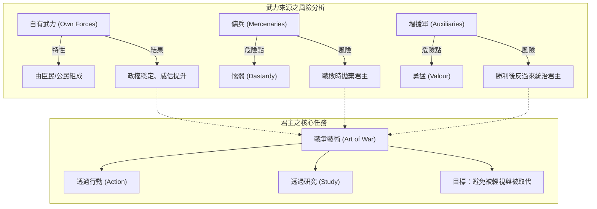

---

## Part 17

Source note: [[The Prince (Part 17)]]

Original range: lines 432-450
Original chars: 124782-133068

<!-- source: The Prince (Part 17).md -->

### 君主必須透過軍事研習與政治現實主義的靈活應用，在「實然」而非「應然」的現實中，透過掌握戰爭藝術與適時運用惡行來保全政權。

#### 摘要

本段文本摘自馬基維利《君主論》的關鍵章節，探討了君主維持政權穩定的兩大支柱： **軍事素養** 與 **道德的現實主義應用**。

首先，作者強調君主絕不能逃避戰爭的艱辛，必須透過「行動」（地形勘察與部隊訓練）與「研控」（研讀歷史與偉人事蹟）來磨練軍事才能。其次，馬基維利提出了著名的政治現實主義觀點：君主不應盲目追求道德上的完美，而應具備「懂得如何作惡」的能力，以便在必要時透過不道德的手段來保全國家。最後，他批判了過度追求「慷慨」名聲的危險性，指出這種行為最終會導致財政枯竭與民怨四起。

#### 翻譯內文

##### 第十四章（續）：關於戰爭的藝術

為了逃避武裝帶來的艱辛與麻煩，公爵們變成了平民。因為在不具武裝所帶來的種種弊端中，最嚴重的便是會讓你被輕視，而這正是君主應當防範的恥辱之一，正如後文所示。因為武裝者與不具武裝者之間不存在對等的關係；一個武裝者不應理所當然地向不具武裝者效忠，而一個不具武裝者在武裝僕從之中也無法獲得安全。由於前者存在輕蔑，後者存在猜忌，兩者之間是不可能良好協作的。因此，一位不懂戰爭藝術的君主，除了前述的種種不幸外，更無法贏得士兵的尊敬，也無法依靠他們。因此，他絕不應將戰爭這個主題從腦海中抹去；在和平時期，他對此的研習應比在戰爭時期更加投入，這可以透過兩種方式達成：一是透過「行動」，二是透過「研習」。

在 **行動** 方面，他首要任務是保持部隊的組織與訓練，並持續進行狩獵，藉此使身體適應艱辛，並學習地形的特性，了解山脈的起伏、谷地的開闊、平原的佈局，以及河流與沼澤的性質，並在所有這些方面保持高度警覺。這種知識有兩方面的用途：首先，他能了解自己的國家，從而更好地承擔其防禦任務；其次，透過對該地區的知識與觀察，他能輕易理解未來可能需要研究的其他地區；因為例如在托斯卡尼的丘陵、谷地、平原、河流與沼澤，與其他國家的地形具有一定的相似性，因此掌握了一國的地貌，便能輕易掌握他國。缺乏這種技能的君主，便缺乏一名指揮官應具備的核心素養，因為這能教導他如何奇襲敵人、選擇駐地、率領軍隊、佈置戰陣以及有效地圍攻城鎮。

阿凱亞人的首領菲洛波美納（Philopoemen），在文人給予他的眾多讚譽中，因其在和平時期心中從不忘卻戰爭準則而受到稱頌。當他與朋友們在鄉間時，常會停下來與他們討論：「如果敵人佔據那座山丘，而我們的軍隊位於此處，哪一方佔優勢？我們應如何保持隊形並最佳地進攻？如果我們需要撤退，又該如何追擊？」他在行進途中會向他們闡述軍隊可能遇到的所有變數；他會傾聽他們的意見並提出自己的見解，並以理據來支持，如此透過這些持續的討論，在戰爭時期便絕不會出現他無法應對的突發狀況。

（菲洛波美納，「希臘最後的英雄」，生於西元前 252 年，卒於西元前 183 年。）

在 **研習** 方面，君主應閱讀歷史，研究名人的事蹟，觀察他們在戰爭中的表現，檢視其勝利與失敗的原因，以便避免後者並模仿前者；最重要的是，應效法那些在自己之前已受人讚譽且名聲顯赫的偉人，並將其成就與事蹟銘記於心，正如所說的，亞歷山大大帝效法阿基里斯，凱撒效法亞歷山大，士平愷效法居魯士。任何閱讀過色諾芬所著《居魯士生平》的人，都能在士平愷的生平中發現，這種模仿如何成就了他的榮耀；在貞潔、親和、仁慈與慷慨方面，士平愷都與色諾芬筆下的居魯士相契合。一位明智的君主應遵循此類準則，絕不應在和平時期懈怠，而應透過勤奮來增加資源，使其在逆境中可用，如此當命運降臨時，他能發現自己已做好抵抗衝擊的準備。

##### 第十五章：關於人們（尤其是君主）受人讚揚或指責的事物

現在，我們需要探討君主對待臣民與盟友應遵循的行為準則。我深知已有許多人就此點撰寫過文章，因此在再次提及時，我預期會被認為有些冒失，特別是因為我在討論時將偏離他人的方法。然而，既然我的意圖是寫出一篇對讀者有用的著作，我認為遵循事物的「真實情況」比遵循「想像」更為適切；因為許多人描繪的共和國與君主政體在現實中從未存在過，因為人的生存方式與應有的生存方式相去甚平，以至於那些忽視「實然」而追求「應然」的人，其滅亡的速度會快於其保全的速度；因為一個想要完全符合其美德宣言的人，很快就會在重重惡行中遭遇毀滅。

因此，一位希望保全政權的君主，必須懂得如何「作惡」，並根據必要性來決定是否使用這種手段。因此，撇開關於君主的虛幻想像，討論真實的情況，我說，當人們談論所有人（尤其是地位較高的君主）時，他們之所以引人注目，是因為具備了某些帶來指責或讚譽的特質。因此，有人被譽為慷慨，有人被稱為吝嗇（使用托斯卡尼的說法，因為在我們的語言中，貪婪者是指透過掠奪來獲取財富的人，而我們稱吝嗇者為過度剝奪自己使用權利的人）；有人被譽為大方，有人被稱為掠奪；有人被視為殘酷，有人被視為仁慈；有人被視為背信，有人被視為忠誠；有人被視為柔弱與懦弱，有人被視為大膽與勇敢；有人被視為親和，有人被視為傲慢；有人被視為淫蕩，有人被視為貞潔；有人被視為真誠，有人被視為狡詐；有人被視為嚴厲，有人被輕浮；有人被視為虔誠，有人被視為不信等等。我深知每個人都會承認，若君主能展現上述所有被視為「美德」的特質，那將是最值得稱讚的；但由於人類的條件不允許君主完全擁有或實踐這些特質，因此他必須具備足夠的審慎，以便知道如何避免那些會導致他失去政權的惡行；並在可能的情況下，遠離那些不會導致他失去政權的惡行；但若這無法做到，他也可以毫不猶豫地投身於其中。此外，他不必為了承擔那些「若不實施，政權將難以保全」的惡名而感到不安；因為如果仔細考慮，會發現某些看似美德的行為，若盲目追求，反而會導致滅亡；而某些看似惡行、實則遵循卻能帶來安全與繁榮的手段，亦是如此。

##### 第十六章：關於慷慨與吝嗇

首先從上述特質的第一項開始說起，我認為被譽為「慷慨」是件好事。然而，若這種慷慨的實踐方式無法為你帶來名聲，反而會傷害你；因為如果一個人實踐得太過誠實且符合常規，這可能不會為人所知，你也就無法避免被指責為其反面特質。因此，任何想要在世人面前維持「慷慨」名聲的人，都必須避免展現出「揮霍無度」的特徵；因此，一位傾向於此的君主會為了這些行為耗盡所有財產，最終為了維持慷慨的名聲，被迫沉重地課稅於人民，並竭盡所能地籌集金錢。這很快就會讓他受到臣民的厭惡，且隨著財力枯竭，他將不再受人重視；因此，憑藉著他的慷慨，他既得罪了眾多臣民，又僅獎賞了少數人，這使他陷入了最先面的困境，並面臨任何可能的威脅。當他意識到這一點並想要退縮時，他又會立刻陷入被指責為「吝嗇」的窘境。

#### 詞彙與關鍵術語

| 術語 (原文) | 譯文 (繁體中文) | 註釋 |
| :--- | :--- | :--- |
| **Art of war** | 戰爭藝術 | 指君主對軍事策略、地形與部隊指揮的掌握能力。 |
| **Action and Study** | 行動與研習 | 君主磨練軍事能力的兩大途徑：實地訓練與歷史研究。 |
| **Liberality** | 慷慨 / 大方 | 指君主對臣民或盟友的財政與物質饋贈。 |
| **Miserly / Meanness** | 吝嗇 / 小氣 | 慷慨的相反面，指過度節省以至於不願支出的行為。 |
| **Real truth vs. Imagination** | 真實情況 vs. 想像 | 馬基維利政治現實主義的核心：關注「事實如何」而非「理想如何」。 |
| **Virtue vs. Vice** | 美德 vs. 惡行 | 在此語境下，指政治上的手段（手段的成敗）而非純粹的道德善惡。 |

#### 文化解析

1.  **政治現實主義的轉向 (Realism vs. Idealism)**：
    馬基維利在第十五章中提出了極具爭議的觀點。他挑戰了中世紀以來「君主必須是道德楷模」的傳統觀念。他認為，政治的最高目標是「保全政權」（Preservation of the state），為了這個目標，君主必須具備靈活切換道德立場的能力。這種「實然」（What is）與「應然」（What ought to be）的辯證，是現代政治學的基石。

2.  **語言與文化的細微差別 (Linguistic Nuance)**：
    文中提到「吝嗇」在托斯卡尼語中的特殊含義。馬基維利特別註明，在他們的語言中，「貪婪者」（Avaricious）是指透過掠奪獲取財富的人，而「吝嗇者」（Miserly）是指過度剝奪自己使用權利的人。這反映了馬基維利對語言精確性的追求，以及他試圖從經濟行為的角度來分析政治特質。

3.  **古典範例的運用 (Classical Exemplars)**：
    馬基維利大量引用希臘與羅馬的歷史人物（如菲洛波美納、亞歷山大、凱撒、士平愷）。這不僅是為了增加權威性，更是在建立一種「歷史循環論」的觀點：歷史的規律是重複的，透過研究過去的成功與失敗，可以預判未來的政治走向。

#### 邏輯結構圖

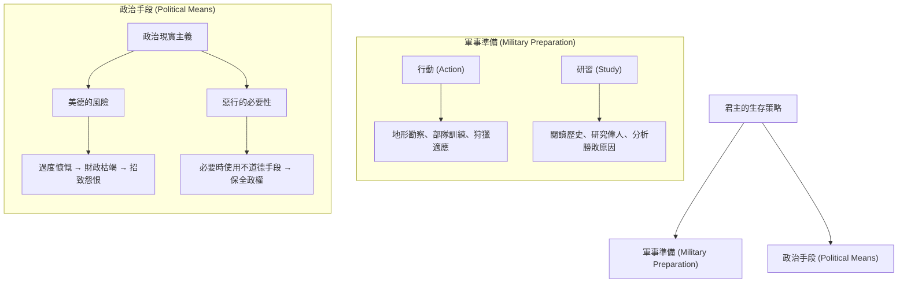

---

## Part 18

Source note: [[The Prince (Part 18)]]

Original range: lines 450-482
Original chars: 132046-140652

<!-- source: The Prince (Part 18).md -->

### 君主應透過策略性的「吝嗇」與「殘酷」來維持政權穩定，避免因追求「慷慨」或「仁慈」的名聲而導致財政枯竭、人民怨恨或社會動亂。

#### 摘要

本篇譯文涵蓋了馬基維利《君主論》中關於君主美德與權力維護的核心辯證。內容主要分為兩個層面：首先是關於 **財政美德** 的辯證，探討「慷慨」（Liberality）與「吝嗇」（Parsimony/Meanness）的權衡，指出過度慷慨會導致財政枯竭與人民怨恨，而策略性的節儉反而能鞏固政權；其次是關於 **統治手段** 的辯證，探討「仁慈」（Clemency）與「殘酷」（Cruelty）的運用，以及「被愛」與「被怕」哪種狀態對君主更安全。譯文精準捕捉了馬基維利冷峻、現實主義的語氣，特別是其對於「為了維持秩序而必要地使用惡行」的政治邏輯。

#### 翻譯內文

擁有慷慨的名聲是件好事。然而，若這種慷慨的實踐方式無法為你贏得名聲，反而會對你造成傷害；因為如果一個人誠實地、依循應有的方式行事，卻不為人知，他便無法避免被指責為相反的特質（即吝嗇）。因此，任何想要在世人面前維持「慷慨」之名的人，都必須不避諱任何宏大的表現；如此一來，傾向於此的君主將會為了這些行為耗盡所有財產，並且最終，如果他仍想維持慷慨之名，將被迫沉重地課稅於人民，並竭盡所能地籌集金錢。這很快就會使他被臣民所憎恨，且隨著財力枯竭，他將不再受人重視；因此，憑藉著他的慷顯，他既得罪了眾多的人，卻僅獎賞了少數人，這使他在面對任何最初的麻煩或危險時，都顯得脆弱不堪；當他意識到這一點並試圖退縮時，又會立刻陷入被指責為吝嗇的困境。

因此，一位君主若無法以一種不損及自身利益、且能被大眾認可的方式來實踐慷慨的美德，那麼，若他足夠聰明，就不應畏懼被指責為吝嗇。因為隨著時間推移，他會比慷慨的君主更受尊重，因為透過他的節儉，財政收入足以支應開支，他能抵禦所有攻擊，並能在不加重人民負擔的情況下展開事業；如此一來，他對那些「不向其索取」的無數人展現了慷慨，而對那些「不向其施予」的少數人展現了吝嗇。

在我們的時代，除了那些被視為吝嗇的人之外，我們尚未見過偉大的成就；其餘的人都失敗了。教宗朱利葉二世曾憑藉慷慨的名聲輔助其登上教宗寶座，但他隨後在對抗法國國王時，並未致力於維持這種名聲；他發動了多次戰爭，卻未向臣民徵收任何特別稅收，因為他利用長期的節儉來支應額外的開支。現任西班牙國王，若他被視為慷慨，便不會承擔或征服如此多的事業。因此，一位君主，只要他不必掠奪臣民、能自保、不會變得貧困與卑微、且不必被迫變得貪婪，對於「吝嗇」的指責應當不以為意，因為這是能讓他成功治理的一種美德。

若有人說：「凱撒透過慷慨獲得了帝國，許多人也透過慷慨及其名聲達到了最高地位」，我會回答：「你要麼是一位真正的君主，要麼正處於成為君主的過程中。」在第一種情況下，這種慷慨是危險的；在第二種情況下，被視為慷慨則是極其必要的。凱撒是那些渴望在羅馬脫穎而出的人之一；但如果他在成就地位後仍未節制開支，他將摧毀自己的政權。若有人反駁：「許多君主曾以軍隊成就偉業，且被視為非常慷慨」，我會回答：「君主所花的錢，要麼是自己的，要麼是臣民的，要麼是別人的。在第一種情況下，他應該節儉；在第二種情況下，他不應錯過任何慷慨的機會。至於那些帶著軍隊出征、依靠掠奪、洗劫與勒索來維持軍隊、動用他人財產的君主，慷慨是必要的，否則士兵不會追隨他。對於那些既非你所有也非臣民所有的財富，你可以大方施捨，正如居魯士、凱誠與亞歷山大一樣；因為揮霍他人的財富不會損害你的名聲，反而能增加名聲；唯有揮霍自己的財富才會傷害到你。」

沒有什麼比慷慨消耗得更快的了，因為即便你在實踐慷慨，你也同時失去了繼續實踐的能力，從而變得貧困或受人輕蔑；或者為了避免貧困，變得貪婪且受人憎恨。君主應當首要防範的是被輕蔑與被憎恨；而慷慨會同時導致這兩者。因此，擁有一個「只招致指責而不招致仇恨」的吝嗇名聲，比起為了追求慷慨名聲而陷入「招致仇恨且伴隨指責」的貪婪名聲，顯然是更明智的選擇。

***

#### 第十七章章：論殘酷與仁慈，以及被愛戴還是被畏懼更好

現在談到上述的其他特質。我認為每一位君主都應該渴望被視為仁慈而非殘酷。然而，他必須小心不要濫用這種仁慈。切雷·波吉亞曾被視為殘酷；儘管如此，他的殘酷卻使羅馬涅地區重歸統一，並恢復了和平與忠誠。如果從正確的角度來看，他會被發現比佛羅倫斯人民更為仁慈，因為佛羅倫斯人民為了避免殘酷的名聲，竟任由皮斯托亞被摧毀。因此，只要君主能保持臣民的團結與忠誠，就不必在意殘酷的指責；因為透過少數的懲戒手段，他會比那些因過度仁慈而導致動亂、進而引發謀殺或搶劫的人更為仁慈；因為這些動亂會傷害全體人民，而君主發起的處決僅僅傷害個人。

（註：此處提及 1502 年至 1503 年間 Cancellieri 與 Panciatichi 派系之間的暴動。）

對於所有君主而言，新政權的建立者由於新政權充滿危險，因此不可能避免被指責為殘酷。維吉爾曾透過狄多之口，為其統治的非人道性辯解，稱其是因為政權新創，並說道：

「事態艱難，且政權新創，迫使我必須採取如此手段，以守護疆界並防範外敵。」

然而，君主在相信與行動時應保持審慎，不應表現出恐懼，而應以一種兼具謹慎與人道精神的溫和方式行事，以免過度的自信導致疏忽，或過度的猜忌導致不可容忍。

……
「非我所願，命運使然，
動盪的王座，初生的國度，
命令我用盡全力捍衛疆土，
用這些嚴厲手段守護海岸。」
—— 克里斯托弗·皮特

由此產生了一個問題：被愛戴更好，還是被畏懼更好？或者，被畏懼更好，還是被愛戴更好？可以回答說，一個人應該渴望兩者兼具；但由於很難在一個人身上同時實現這兩者，若必須捨棄其一，那麼被畏懼比被愛戴更安全。因為對於人性而言，普遍的論點是：人類是忘恩負義、反覆無常、虛偽、懦弱且貪婪的；只要你成功，他們就完全屬於你；當危難尚遠時，他們會承諾獻出血液、財產、生命與子女；但當危難臨頭，他們便會轉而對抗你。那種完全依賴承諾而忽視其他防範措施的君主，必將走向滅亡；因為透過金錢而非偉大或高尚品格所獲得的友誼，雖然可以贏得，卻無法鞏固，且在危難時刻無法依靠；人們在冒犯一個被愛戴的人時，比冒犯一個被畏懼的人更不具罪惡感；因為愛是用義務的紐帶維繫的，而由於人性的卑劣，這種紐帶會在任何有利於自己的機會面前斷裂；但恐懼是透過對懲罰的畏懼來維持你的，而這種畏懼永不失效。

然而，君主應當以一種「即使不贏得愛戴，也能避免招致仇恨」的方式來激發恐懼；因為只要他不去侵犯臣民的財產與妻女，他完全可以忍受被畏懼而不被憎恨。但當他必須對某人的生命採取行動時，他必須基於正當的理由與明顯的因由，且最重要的是，他必須遠離他人的財產，因為人們忘記父親之死的速度，遠比忘記失去家產的速度要快。此外，奪取財產的藉口從不缺乏；一旦有人開始靠掠奪維生，他總能找到藉口奪取他人的東西；相反地，奪取生命的理由卻更難尋找且更容易過時。但當君主與軍隊在一起，並掌控著眾多士兵時，他非常有必要忽視殘酷的名聲，因為若沒有這種威懾，他將無法維持軍隊的團結或履行職責。

#### 詞彙與關鍵術語

| 英文原文 | 繁體中文翻譯 | 語境說明 |
| :--- | :--- | :--- |
| **Liberality** | 慷慨 / 大方 | 指在財政上的大方支出，或對人施予恩惠。 |
| **Parsimony / Meanness** | 吝嗇 / 節儉 | 在此脈絡下指策略性的節制開支，以維持政權穩定。 |
| **Clemency** | 仁慈 / 寬大 | 指對罪犯或臣民的寬容與寬大處理。 |
| **Cruelty** | 殘酷 / 嚴酷 | 指透過懲罰或武力手段來維持秩序的手段。 |
| **Reputation** | 名聲 / 聲譽 | 君主在世人眼中建立的形象。 |
| **Rapacious / Robbery** | 貪婪 / 掠奪 | 指君主為了財富而侵犯臣民財產的行為。 |
| **Patrimony** | 家產 / 遺產 | 臣民傳承下來的財產，是君主不應侵犯的底線。 |

#### 邏輯結構分析

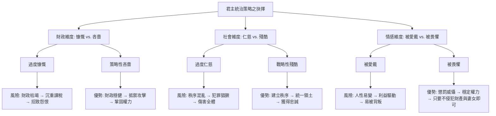

---

## Part 19

Source note: [[The Prince (Part 19)]]

Original range: lines 482-509
Original chars: 139630-148324

<!-- source: The Prince (Part 19).md -->

### 君主應建立在自己能掌控的「恐懼」而非他人意志的「愛戴」之上，並應具備運用「狐狸與獅子」雙重本性的能力，透過展現美德的表象來維持政權，而非盲目追求道德實踐。

#### 摘要

本篇譯文涵蓋了馬基維利《君主論》中極具爭議性的兩個核心議題：第一，君主如何在「受人愛戴」與「受人恐懼」之間取得平衡，並強調避免「招致憎恨」是維持政權穩定的底線；第二，探討君主在履行承諾（保持信義）時的策略，提出了著名的「狐狸與獅子」論點，主張君主必須具備在法律（人性）與武力（獸性）之間切換的能力，並強調「展現美德的表象」比「實際擁有美德」在政治實務上更為重要。

#### 翻譯內文

##### 第十七章（續）：關於恐懼與愛戴

若君主無法贏得愛戴，則應設法避免招致憎恨；因為只要不被憎恨，君主即便處於被恐懼的狀態也是可以忍受的。只要君主不侵犯臣民的財產與妻女，這種狀態便能長久維持。然而，若必須對某人採取致命手段，則必須基於正當理由與明顯的動機，且最重要的一點是，君主必須遠離他人的財產；因為人們忘記父親之死，遠比忘記失去祖產要快得多。此外，掠奪財產的藉口永遠不缺；一旦有人開始靠掠奪維生，便會不斷找到藉口來侵吞他人的財產；相反地，剝奪生命的理由卻較難尋找，且容易失效。

然而，當君主親臨軍隊、掌控大批士兵時，便非常有必要展現出「殘酷」的名聲；若缺乏這種威懾，他將無法維持軍隊的團結與職責。

在漢尼拔（Hannibal）的偉業中，有一項值得銘記：他率領一支由多種族組成的龐大軍隊遠征異邦，無論是在順境或逆境中，部隊內部或對君主本身，都未曾發生分裂。這完全歸功於他那近乎非人的殘酷；這種殘酷配合他無比的勇氣，使他在士兵眼中既受敬畏又令人畏懼。若缺乏這種殘益，他的其他美德不足以產生這種效果。一些目光短淺的史學家從單一角度讚美他的功績，卻從另一角度譴責其核心原因。事實證明，若僅憑其他美德，他將無法達成此成就；看看西庇阿（Scipio）的案例便一目了然——這位不僅在當時、甚至在人類記憶中都極其卓越的人物，其軍隊卻在西班牙發生了叛變。這純粹是因為他過於寬容，給予士兵過多的自由，以至於破壞了軍紀。法比烏斯·馬克西穆（Fabius Maximus）曾在元老院指責他，稱其為「羅馬士兵的腐蝕者」。西庇阿的一名副官蹂躪了洛克里人（Locrians），但他既未報復，也未懲處該副官的傲慢，這完全是因為他性格過於仁慈。甚至有人在元老院為其辯解，稱許多人雖然懂得如何避免錯誤，卻不擅長糾正他人的錯誤。如果西庇阿能繼續掌權，這種性格終將毀掉他的名聲與榮耀；但由於他受制於元老院，這種缺陷反而被掩蓋，並轉化為他的榮耀。

回到「受恐懼還是受愛戴」的問題，我的結論是：由於人們的愛戴取決於其自身意志，而恐懼則取決於君主之手，因此，一個明智的君主應建立在自己能掌控的基礎上，而非他人能掌控的基礎上；如前所述，他應致力於避免招致憎恨。

##### 第十八章：關於君主應如何守信

每個人都承認，君主守信、正直且不玩弄手段是值得稱讚的。然而，我們的經驗顯示，那些成就偉業的君主，往往對信義不以為重，且懂得如何運用手段來規避他人的智謀，最終戰勝了那些僅僅依賴諾言的人。你必須明白，爭奪權力有兩種方式：一種是透過法律，另一種是透過武力；前者屬於人類，後者屬於野獸；但由於前者往往不夠奏效，因此必須求助於後者。因此，君於必須懂得如何同時運用「野獸」與「人」的特質。古代作家曾以隱喻的方式教導君主，他們描述阿基里斯（Achilles）等許多古代君主是由半人半獸的肯塔羅（Chiron）撫養長大的；這僅僅意味著，既然他們的老師是半人半獸，君主也必須懂得如何運用這兩種本性，且兩者缺一不可。

因此，當君主被迫採取野獸手段時，應選擇「狐狸」與「獅子」；因為獅子無法應對陷阱，而狐狸無法抵禦狼群。因此，必須像狐狸一樣去發現陷阱，像獅子一樣去威懾狼群。僅僅依賴獅子的人並不明白自己在做什麼。因此，一位明智的君主，當守信可能對自己不利，或者導致承諾的理由已不復存在時，他既不能、也不應該繼續守信。如果人類全然善良，這條準則便不成立；但正因為人類是邪惡的，且他們不會對你守信，你也沒有義務對他們守信。君主對於不守信的行為，永遠能找到正當的藉理由。現代的例子不勝枚舉，展示了多少條約與承諾因君主的背信而失效；而那些最擅長運用狐狸手段的人，往往獲得了最大的成功。

然而，君主必須懂得如何偽裝這種特質，成為一名偉大的偽裝者與偽裝高手；因為人類是如此單純，且如此容易受當下的需求所左右，以至於任何尋求欺騙的人，總能找到願意被騙的人。有一個近期的例子我不能略過：亞歷山大六世（Alexander VI）除了欺騙他人之外別無他法，且從不打算改變，他總能找到受害者；因為從來沒有人的權力比他更大，或者在宣誓時比他更慷瞞，但他卻極少遵守誓言；儘管如此，他的欺騙總能如願達成，因為他深刻洞察了人性的一面。

（義大利諺語：亞歷山大從不言行一致，切雷從不言行一致。）

因此，君主不需要具備我所列舉的所有美德，但非常有必要「表現出」擁有這些美德。我甚至敢說，擁有這些美德並始終遵守，反而有害；而「表現出」擁有這些美德則是極其有益的。應表現得仁慈、忠誠、仁愛、虔誠、正直，但必須具備一種心態，即當你需要不這麼做時，你能夠且懂得如何轉向相反的方向。

你必須明白，君主（尤其是新君主）無法始終遵守那些受人尊敬的特質，因為為了維持政權，他時常被迫做出違背忠誠、友誼、仁愛與宗教的行為。因此，他必須具備一種隨機應變的心態，隨著命運的風向與變遷而調整；但如我前文所述，只要能避免，就不應背離善道；但若被迫，則必須懂得如何應對。

---

#### 詞彙與關鍵術語

| 英文原文 (或概念) | 繁體中文譯名 | 註釋 |
| :--- | :--- | :--- |
| **Prince** | **君主** | 指掌握最高權力的統治者。 |
| **Fear vs. Love** | **恐懼與愛戴** | 馬基維利政治哲學的核心矛盾。 |
| **Hatred** | **憎恨** | 君主應竭力避免的狀態，源於侵犯財產與妻女。 |
| **The Fox and the Lion** | **狐狸與獅子** | 象徵「智謀（察覺陷阱）」與「武力（威懾強敵）」的雙重特質。 |
| **Law vs. Force** | **法律與武力** | 分別代表「人性（人）」與「獸性（獸）」的政治手段。 |
| **Dissemble / Pretend** | **偽裝 / 表現出** | 強調政治上的「形象管理」優於「道德實踐」。 |
| **Property / Patrimony** | **財產 / 祖產** | 指臣民的私有財產，是觸發憎恨的關鍵因素。 |
| **Centaur Chiron** | **肯塔羅·奇龍** | 象徵結合人與獸特質的教育範例。 |

#### 邏輯架構

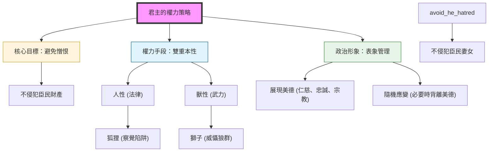

---

## Part 20

Source note: [[The Prince (Part 20)]]

Original range: lines 507-537
Original chars: 147303-155896

<!-- source: The Prince (Part 20).md -->

### 君主應透過精準的形象管理與維護臣民基本利益，來降低被憎恨與輕蔑的風險，從而鞏固政權穩定並防範內部陰謀。

#### 摘要

本段文本包含兩部分內容：首先是針對馬基維利（Niccolò Machiavelli）著作中關於「忠誠」（fede）與「宗教」（religione）等詞彙在不同版本（如 Testina 版）中細微差異的學術評論；其次是《君主論》第十九章的核心論述。馬基維利在此章節提出了君主維護權力的關鍵策略：如何透過塑造特定的政治形象，來避免臣民對其產生「憎恨」（hatred）與「輕蔑」（contempt）之情。他強調，君主應致力於展現仁慈、忠誠、仁厚、正直與虔誠的表象，並透過不侵犯臣民財產與婦女，以及展現決斷力與勇氣，來鞏固其統治的合法性與穩定性。

#### 翻譯內文

（接續前文）……如何著手進行。

在下一段中出現了「與忠誠背道而馳」（“Contrary to fidelity”）或「背信」（“faith”），即 “contro alla fede”，以及 “tutto fede”，意為「完全忠誠」。值得注意的是，在獲得教廷批准出版的 Testina 版本中，這兩個短語 “contro alla fede” 與 “tutto fede” 都被刪除了。這或許是因為 “fede” 一詞在此處的含義是指「宗教信仰」（即天主教教義），而非如這裡所譯的「忠誠」與「忠實」。請注意，在 Testina 版本中，"religione"（宗教）一詞被允許保留，其用法泛指任何形式的信仰，例如文中提到的「該宗教」，此處必然是指胡格諾派（Huguenot）的異端。South 在其 11843 年版的第九篇講義（第 69 頁）中，對此段落評論如下：「這位此類群體的偉大贊助人與領袖——尼科洛·馬基維利，在其政治計畫中制定了一條基本準則：『宗教的表象對政治家是有益的，但宗教的實質卻是有害且具毀滅性的。』」

因此，君主應當謹慎，確保其出口之言皆包含上述五種特質，以便在觀看與聽聞他的人眼中，顯得完全仁慈、忠實、仁厚、正直且虔誠。在所有特質中，最不需要真正擁有、只需要「顯得」擁有的是最後一種（虔誠），因為人們對人的判斷，通常更多是基於視覺而非觸覺；因為每個人都能看見你的形象，但極少有人能真正與你接觸。每個人都能看見你「表現出來」的樣子，但極少人能真正了解你的本質；而那些極少數的人，也不敢反對大多數人的輿論，因為大多數人背後有國家的威嚴作為支持；而在所有人的行為中，特別是君主的行為中——這是不智之舉所能挑戰的——人們是根據結果來進行判斷的。

因此，只要君主能獲得征服與保全國家的功績，其手段將永遠被視為正當，且會受到所有人的讚揚；因為大眾（庸人）總是容易被事物的表象及其結果所左右；而在這個世界上，存在的只有大眾，因為唯有當大多數人失去立足之地時，極少數的人才能找到地位。

當代有一位君主（不便具名），他從不宣揚除了和平與誠信以外的任何教義，然而他對這兩者都極其敵對；若他曾恪守這些原則，多次都可能導致他失去名望與王位。

（註：阿拉貢的斐迪南。馬基維利撰寫《君主論》時，若在此提及斐迪南的名字，顯然會引起冒犯。見 Burd 之《Il Principe》，第 308 頁。）

#### 第十九章：應避免被輕蔑與憎恨

現在，關於前述的特質，我已談及了較為重要的部分，其餘的部分我希望在總體原則下進行簡要討論，即：如前所述，君主必須考慮如何避免那些會使他被憎進或被輕蔑的事物；只要他能多次成功地做到這一點，他便完成了他的職責，且無需擔心其他指責所帶來的危險。

正如我所說，最會使他被憎恨的，莫過於貪婪，以及侵犯臣民的財產與婦女，君主必須克制這兩點。只要不觸及他們的財產與尊嚴，大多數人都能安居樂業，君主僅需應對少數野心家的挑戰，而他可以透過許多方法輕易地遏制他們。

最會使他被輕蔑的，是被人認為是反覆無常、輕浮、懦弱、卑劣、優柔寡斷，君主應如防範磐石般防範這些特質；他應致力於在行動中展現偉大、勇氣、莊重與堅韌；在與臣民的私下往來中，應展現其判斷是不可撤回的，並維持其名聲，使任何人都不敢奢望能欺騙他或規避他。

一位能展現出這種形象的君主會受到高度尊敬，而受到高度尊敬的人不容易遭到陰謀對抗；因為只要眾人知曉他是一位卓越的人且受人民愛戴，攻擊他便會變得極其困難。因此，君誠主應有兩種恐懼：一種來自內部，源於臣民；另一種來自外部，源於外力。對於後者，他可以透過武裝精良與結交盟友來防禦；若他武裝精良，便能擁有良好的盟友，且只要外部局勢平穩，內部事務也將始終保持平靜，除非內部已先因陰謀而動盪；即便外部局勢動盪，只要他已做好準備並如我所言地生活，只要他不放棄，他就能抵抗任何攻擊，正如斯巴達的納比斯（Nabis）所做的那樣。

但關於臣民，當外部局勢動盪時，他唯一需要擔憂的是臣民會暗中結黨，而君主可以透過避免被憎恨與輕蔑，並讓人民對他感到滿意，來輕易地確保自身安全，這正是如我前文詳述所必需達成的。對抗陰謀最有效的手段之一，就是不被人民憎恨與輕蔑；因為陰謀者在推翻君主時，總是期望能藉此討好人民；但當陰謀者發現其行為只能導致人民的反感時，他便不敢採取這種行動，因為陰謀者所面臨的困難是無窮無盡的。經驗顯示，陰謀雖多，但成功的極少；因為陰謀者無法單打獨鬥，他也無法找尋同謀，除非是那些他認為心懷不滿的人；而一旦你向心懷不滿者敞開心扉，你就給了他可以利用你的素材，因為透過揭發你，他可以獲得任何利益；因此，既然他看見走這條路獲利無虞，而另一條路卻充滿變數與危險，除非他是君主極其罕見的朋友，或是極其頑固的敵人，否則他不可能與你保持忠誠。

簡而言之，我說，在陰謀者的一方，除了恐懼、猜忌與受罰的預期外，別無他物；但在君主的一方，則有領地的威嚴、法律、盟友與國家的保護；再加上大眾的善意，任何人都不可能如此魯莽地去發動陰謀。因為一般而言，陰謀者在陰謀執行前必須恐懼，而在這種情況下，他還必須恐懼罪行後的後果；因為這會使他與人民為敵，從而無法尋求任何逃脫的可能。

關於這個主題可以舉出無數例子，但我僅以一個發生在我們父輩記憶中的例子為止。博洛尼亞的君主安尼巴萊·本蒂沃利（Messer Annibale Bentivogli，現任安尼巴萊之祖父）被結黨謀害，兇手是卡恩奇家族（Canneschi）；其家族中僅剩幼年的喬萬尼（Messer Giovanni）倖存。在刺殺發生後，民眾立即起義並殺死了所有的卡恩奇家族成員。這源於本蒂沃利家族當時在博洛尼亞享有的極高民望；其聲望之大，以至於在安尼巴萊死後，雖然沒有能統治國家的家族成員留下來，但博洛尼亞人得知本蒂沃利家族中有一人在佛羅倫斯（當時被視為鐵匠之子），便派人前往佛羅倫斯接他回來並交予其統治權，直到喬萬尼成年後接掌政權。

（註：喬萬尼·本蒂沃利，1438年出生於博洛尼亞，1508年卒於米蘭。他於1462年至1506年間統治博洛尼亞。馬基維利對陰謀的強烈譴責，可能源於他自己極其近期的經歷（1513年2月），當時他因涉嫌參與博斯科利陰謀而被捕並遭受酷刑。）

因此，我認為當人民敬重君主時，他可以認為陰謀微不足道；但當人民對其敵視並懷有恨意時，他必須恐懼一切與所有人。而秩序良好的國家與明智的君主，都已盡力避免將貴族逼入絕境，並致力於讓人民感到滿意與安適，因為這是君主最重要的目標之一。

#### 詞彙與關鍵術語

| 術語 (原文) | 譯文 (繁體中文) | 語境說明 |
| :--- | :--- | :--- |
| **Fede / Contro alla fede** | 忠誠 / 背信 | 在文中具有「宗教信仰」與「政治忠誠」的雙重含義。 |
| **Religione** | 宗教 / 虔誠 | 指涉宗教信仰的表象，常用於政治手段。 |
| **The Vulgar** | 大眾 / 庸人 | 指代容易被表象與結果所左右的廣大平民階層。 |
| **Rapacious** | 貪婪 | 指君主侵犯臣民財產的行為，是導致憎恨的主因。 |
| **Contemptible** | 被輕蔑的 | 指君主因性格缺陷（如輕浮、懦弱）而失去威信。 |
| **Conspiracy** | 陰謀 / 結黨 | 指臣民內部策劃推翻統治的行為。 |

#### 文化解析

1.  **政治表象學 (Politics of Appearance)**：馬基維利的核心觀點在於「形象管理」。他區分了「真實的德性」與「展現出的德性」。在政治語境下，由於大眾無法深入了解統治者的本質，因此「展現出」仁慈與虔誠比「實際具備」這些特質更具戰略價值。
2.  **社會階層的心理學**：文中對「大眾」（the vulgar）與「少數精英」（the few）的觀察，反映了馬基維利對社會結構的深刻理解。他認為大眾的判斷標準是「結果」與「視覺」，這使得統治者可以透過控制「結果」來操縱「輿論」。
3.  **權力平衡的邏輯**：君主面臨的威脅分為「外部（武力）」與「內部（民怨）」。對抗外部威脅需要硬實力（武裝、盟友），而對抗內部威脅則需要軟實力（避免被憎恨、維持民心）。

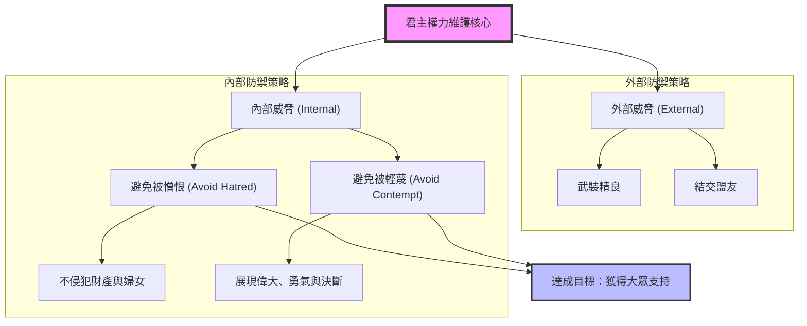

---

## Part 21

Source note: [[The Prince (Part 21)]]

Original range: lines 533-555
Original chars: 154875-164150

<!-- source: The Prince (Part 21).md -->

### 君主應透過建立「調停者」制度以轉嫁政治責難，並在面對貴族、平民與士兵三方衝突時，運用「狐狸與獅子」的特質來維持權威與避免被憎恨。

#### 摘要

本段文本深入探討了君主在面對不同社會階層（貴族、平民、軍隊）時的權力平衡策略。馬基維利透過分析波隆尼亞的班提沃萊家族、法國的議會制度，以及羅馬帝國歷代皇帝的興衰，提出了核心政治邏輯：君主必須避免被任何強大勢力所憎恨，並應利用「調停者」的角色來轉嫁政治責難。文中特別強調了「狐狸與獅子」的雙重特質，並以塞維魯皇帝如何運用欺瞞與武力來鞏固政權作為經典案例。

#### 翻譯內文

（接續前文）

……曾是佛羅倫採班提沃萊家族的一員，當時他被視為鐵匠之子，被派往佛羅倫採辦，並賦予其城市治理權，直到喬凡尼先生按部就班地接掌政權。

喬凡尼·班提沃萊（Giovanni Bentivogli）生於 1438 年的波隆尼亞，卒於 1508 年的米蘭。他於 1462 年至 1506 年間統治波隆尼亞。馬基維利對陰謀的強烈譴責，或許源於他自身極其近期的慘痛經驗（1513 年 2 月）：當時他因涉嫌參與「博斯科利陰謀」（Boscoli conspiracy）而被捕並遭受酷刑。

因此，我認為，若人民對君主懷有敬意，君主應將陰謀視為微不足道；但若人民對其心懷敵意且充滿恨意，則君的必須對任何人和事都保持戒備。一個秩序良好且明智的君主，應竭盡全力避免將貴族逼入絕境，並讓人民感到滿足與安適，因為這是君主能追求的最重要目標之一。

在我們這個時代，治理最完善的王國之一是法國，其中擁有許多維繫國王自由與安全的優良制度；其中首要的是議會及其權威，因為王國的建立者深知貴族的野心與狂妄，認為必須給予他們一點「餌料」以加以制衡；另一方面，他深知人民對貴族懷有基於恐懼而產生的恨意，因此希望保護人民，但他並不希望這成為國王的專責事項；因此，為了避免因偏袒人民而遭到貴族責難，或因偏袒貴族而遭到人民抨擊，他設立了一個「調停者」，此人可以打擊權貴、扶持弱勢，而不會讓國王背負惡名。對於國王與王國而言，沒有比這更優良、更審慎的安排，也沒有比這更強大的安全來源了。由此可以得出另一個重要結論：君主應將招致責難之事交由他人處理，而將施予恩惠之事留於自己手中。此外，我認為君主應愛護貴族，但不應因此而招致人民的恨意。

對於某些研究過羅馬皇帝生平與死亡的人來說，或許會發現許多皇帝的例子與我的觀點相左，因為有些人雖然生活高尚且展現了偉大的精神素養，卻仍失去了帝國，或被謀反的臣民所殺害。為了回應這些質疑，我將回顧部分皇帝的性格，並證明其覆滅的原因與我所主張的並無二致；同時，我僅會提出對研究該時代事務者具有參考價值的事實。

對我而言，只需選取從哲學家馬可·奧勒留到馬克西米努斯這段期間繼承帝國的皇帝即可：包括馬可、其子康茂德、佩提納克斯、朱利安、塞維魯及其子安東尼·卡拉卡拉、馬克里努斯、海吉巴盧斯、亞歷山大，以及馬克西米努斯。

首先需要注意的是，在其他政體中，君主只需應對貴族的野心與人民的狂妄；然而，羅馬皇帝還面臨第三種困境，即必須忍受士兵的殘暴與貪婪，這是一個極其困難的問題，導致了許多人的覆滅。因為要同時滿足士兵與人民是非常艱難的：人民渴望和平，因此他們喜愛不求功名的君主；而士兵則喜愛勇猛、殘暴且貪婪的戰士型君主，且士兵非常樂意讓君主對人民施展這些特質，以便他們能獲得雙倍的薪酬並宣洩自身的貪婪與殘暴。因此，那些無論出身或訓練都缺乏強大威信的皇帝總是會被推翻；其中大多數人，特別是新上任的君主，意識到這兩種對立情緒的難處，因此傾向於滿足士兵，而不太在意傷害人民。這種做法是必要的，因為既然君主無法避免被某些人憎恨，那麼首要任務就是避免被「所有人」憎害；若無法做到這一點，則應竭盡全力避免被「最強大者」所憎恨。因此，那些因缺乏經驗而需要依賴特殊恩寵的皇帝，比起人民，更傾向於依附士兵；這種做法是否有利，取決於君主是否懂得如何維持對士兵的統治權。

基於這些原因，馬可、佩提納克斯與亞歷山大，皆為生活節制、崇尚正義、厭惡殘暴、仁慈且寬厚之人，除了馬可之外，皆落得悲慘的結局；唯有馬可因世襲繼承王位，不需依賴士兵或人民，且因具備受人尊敬的美德，在位期間始終能使兩大階層各安其位，既不被恨也不被輕視。

然而，佩提納克斯是在違背士兵意願的情況下被擁立為帝的，因為士兵在康茂德統治下已習慣放蕩生活，無法忍受佩提納克斯想要推行的嚴明生活；因此，他因製造了恨意，加上其年邁遭到輕視，在執政初期便被推翻。在此應注意，恨意的產生與善行的建立同樣容易；因此，如我前文所述，君主若想維持政權，往往被迫行惡；因為當你認為必須依賴的力量（無論是人民、士兵或貴族）變得腐敗時，你必須順從其情緒並滿足其慾望，此時，善行反而會對你造成傷害。

接著看亞歷山大，他是一個極其仁善的人，其美名之一是在他統治帝國的十四年間，從未有過未經審判便處死的人；然而，由於他被視為柔弱且受母親左右，導致他遭到輕蔑，軍隊謀反並殺害了他。

現在轉向與之相反的人物：康茂德、塞維魯、安東尼·卡拉卡拉與馬克西米努斯，你會發現他們皆殘暴且貪婪——這些人為了滿足士兵，不惜對人民犯下各種罪行。除了塞維魯之外，其他人都落得悲慘的結局；但在塞維魯身上，他展現了極大的勇武，透過維持士兵的忠誠，儘管人民受其壓迫，他仍成功統治。他的勇武使他在士兵與人民眼中都備受景仰，後者因敬畏而保持沉默，前者則因滿足而感到尊重。由於他作為新君主的作為極其重大，我希望簡要展示他如何精通「狐狸」與「獅子」的偽裝，而這兩種特質正是君主必須模仿的。

他深知皇帝朱利安的怠惰，便說服當時擔任斯克拉沃尼部隊隊長的軍隊，主張前往羅馬為被禁衛軍殺害的佩提倫納克斯復仇；他以此為藉口，在不顯露野心的情況下，率領軍隊向羅馬進軍，並在行蹤曝光前抵達義大利。抵達羅馬後，元老院因恐懼而擁立他為帝，隨後朱利安被殺。此後，塞維魯在試圖統治全帝國的過程中面臨兩個難題：一是亞洲地區，由亞洲軍隊首領尼格爾自立為帝；二是西方地區，由阿爾比努斯威脅王位。由於他認為同時與兩者為敵極其危險，因此決定攻擊尼格爾並欺騙阿爾比努斯。他寫信給後者，稱自己已獲元老院認可，願意與其共享尊榮，並封其為凱撒，同時宣稱元老院已任命阿爾比努斯為其夥伴，而阿爾比努斯信以為真。然而，在塞維魯征服並擊殺尼格爾、平定東方事務後，他回到羅馬向元老院控訴，稱阿爾比努斯不思感恩，反而企圖背叛謀害，因此他不得不處置此人不義之徒。隨後，他追蹤至法國，剝奪了其統治權並取其性命。因此，任何仔細研究此人行為的人都會發現，他是一位極其勇猛的「獅子」，也是一位極其狡黠的「狐狸」；他受人敬畏，且不被軍隊憎恨。不難理解為何他作為一個「新進者」能如此穩固地統治帝國，因為他卓越的聲望始終保護著他，使其免於因暴力行為而招致人民的恨意。

#### 詞彙與關鍵術語

| 英文原文 | 繁體中文翻譯 | 語境說明 |
| :--- | :--- | :--- |
| Arbiter | 調停者 / 仲裁者 | 指在貴族與平民衝突中，負責承擔責任或進行裁決的中間力量。 |
| Reproach | 責難 / 抨擊 | 指政治上的負面評價或社會輿論的抨擊。 |
| Grace | 恩惠 / 恩寵 | 指君主對臣民施予的善意或獎勵。 |
| Fox and Lion | 狐狸與獅子 | 馬基維利著名的政治隱喻，代表「狡詐」與「勇猛」兩種必要的統治特質。 |
| Avarice | 貪婪 | 指士兵或權貴對財富的無止盡追求。 |
| Pretext | 藉口 / 偽裝 | 指政治行動中用來掩蓋真實意圖的表面理由。 |

#### 邏輯架構圖

```mermaid
graph TD
    subgraph "政治勢力衝突層"
        A["貴族 (Nobles)"] -- "野心與狂妄" --> B["君主 (Prince)"]
        C["平民 (People)"] -- "恨意與不滿" --> B
        D["士兵 (Soldiers)"] -- "殘暴與貪婪" --> B
    end

    subgraph "治理策略層"
        B --> E["策略一：利用調停者"]
        E --> E1["轉嫁責難 (Reproach)"]
        E --> E2["保留恩惠 (Grace)"]

        B --> F["策略二：特質模擬"]
        F --> F1["獅子 (勇猛/威懾)"]
        F --> F2["狐狸 (狡詐/偽裝)"]
    end

    subgraph "歷史案例分析"
        G["失敗案例 (如 Pertinax)"] --- H["原因：過於正直/破壞既有利益"]
        I["成功案例 (如 Severus)"] --- J["原因：平衡衝突/運用狐狸與獅子特質"]
    end

    E1 -.-> G
    F2 -.-> I
```

---

## Part 22

Source note: [[The Prince (Part 22)]]

Original range: lines 555-573
Original chars: 163129-172621

<!-- source: The Prince (Part 22).md -->

### 君主政權的穩定取決於避免「憎恨」與「輕蔑」，並應根據政權性質（新舊、世襲或選舉）與時代背景（士兵與人民的力量比例）靈活調整武裝與統治策略。

#### 摘要

本段文本節選自馬基維利的《君主論》，深入探討了君主如何透過「避免被憎恨」與「避免被輕蔑」來維持政權穩定。作者透過分析羅馬歷代皇帝（塞維魯、安東尼努斯、康茂德、馬克西米努斯）的興衰，揭示了權力運用的核心邏輯：
1. **權力特質**：成功的君主需兼具「獅子」的勇猛與「狐狸」的狡黠。
2. **致命缺陷**：過度的殘暴會導致「憎恨」（如安東尼努斯），而失節與腐敗則會導致「輕蔑」（如康茂德）。
3. **時代變遷**：作者指出，相較於羅馬時代需取悅士兵，現代君主（除土耳其與蘇丹外）應優先取悅人民，因為人民的力量已日益壯大。
4. **武力管理**：在章節二十中，作者探討了臣民武裝化的策略，主張新君主應透過賦予武裝來建立忠誠，但在併吞新領土時則應解除其武裝以防叛亂。

#### 翻譯內文

（承接前文）……元老院封他為皇帝，他亦願意與其分享這份尊榮，並授予他「凱撒」的頭銜；此外，元老院還封阿爾比努斯為他的副手；阿爾比努斯對此皆全盤接受。然而，在塞維魯征服並擊殺尼格爾、平定東方事務後，他回到羅馬，向元老院控訴阿爾比努斯不思報恩，反而企圖透過陰謀謀害他，因此他不得不對此背信棄義之舉進行懲罰。隨後，他前往高盧追擊，剝奪了他的統治權並處決了他。因此，凡仔細審視此人之行徑者，必能發現他既是極其勇猛之獅，亦是極其狡黠之狐；他會發現他受人敬畏，且深受軍隊愛戴，並非被其所恨；這並不令人驚訝，因為身為「新人」，他能如此穩固地掌控帝國，全因其卓越的聲望保護了他，使他免於因行事暴力而招致人民的憎恨。

然而，他的兒子安東尼努斯是一位極其傑出的人物，擁有卓越的品質，使他在人民眼中令人欽佩，在士兵眼中令人信賴；他是一名好戰之士，能忍受極度疲勞，且不嗜美食與奢華，這使得軍隊非常愛戴他。儘管如此，他的殘暴與暴行卻是如此巨大且聞所未聞，在無止盡的暗殺之後，他殺害了大量羅馬人民及所有亞歷山大城的居民。他變得受全世界憎恨，且身邊的人也對他充滿恐懼，以至於他在軍隊之中被一名百夫長刺殺身亡。在此必須指出，這種帶著決然與拚死勇氣發動的蓄意暗殺，是君主無法避免的，因為任何不畏死亡的人都能發動此類攻擊；但君主不必過於恐懼，因為這類事件非常罕見；他唯一需要小心的是，不要對那些為國家服務、為自己效力的人造成重大傷害。安東務努斯並未做到這一點，他竟羞辱性地殺害了該百夫長的兄弟，且每天都威脅著這名仍留在其護衛隊中的百夫長；事實證明，這種魯莽之舉最終導致了皇帝的覆滅。

接著我們談談康茂德，對於他來說，維持帝國本應非常容易，因為作為馬可·奧勒留之子，他繼承了帝國，只需追隨父親的足跡便能取悅人民與士兵；然而，由於他天性殘暴且粗野，他沉溺於取悅士兵並腐蝕他們，好藉此對人民進行掠奪；另一方面，他未能維持尊嚴，頻繁下到劇院與角鬥士競爭，並從事其他不配於帝國威嚴的卑劣行為，這使他在士兵中失去了威信。由於被一方所恨，又被另一方所輕蔑，他最終遭到陰謀暗殺並被殺害。

現在來討論馬克西米努斯的性格。他是一名極其好戰的人，而軍隊因厭惡亞歷珊德羅的軟弱，殺死了他並推舉馬克西米努斯登基。但他統治的時間並不長，因為有兩件事讓他備受憎恨與輕蔑：其一，他在色雷斯放羊，這使他蒙受恥辱（眾人皆知，且視之為極大的屈辱）；其二，他在即位之初延宕前往羅馬並接管帝位。此外，他透過在羅馬及帝國各地的長官實施多種暴行，贏得了極大的殘暴名聲，使得全世界因其出身卑微而憤怒，因其野蠻而恐懼。首先是非洲起義，接著是元老院與羅馬全體人民，以及整個義大利都對他發動陰謀，此外還有他自己的軍隊；後者在圍攻阿奎萊亞並遭遇困難時，因厭惡他的殘暴，且發現眾人皆反對他時，對他的恐懼減輕，最終將其謀殺。

我不打算討論希利奧加巴盧斯、馬克里努斯或朱利安，因為他們極其卑劣，很快便被剷除；我將以這句話來結束這段論述：現代的君主在滿足士兵過度需求方面，難度已遠不及以往。雖然仍需給予一定的恩惠，但這事很容易辦到；這些君主麾下的軍隊，不像羅馬帝國的軍隊那樣在行省管理與行政方面擁有豐富經驗。且在當時，滿足士兵比滿足人民更為必要；但在現代，除了土耳其人和蘇丹，所有君主都必須優先滿足人民，因為人民的力量更為強大。

從上述內容中，我排除了土耳其人，因為他始終在身邊維持著一萬二千名步兵與一萬五千名騎兵，帝國的安全與強大全繫於此，因此他必須撇開對人民的考量，致力於與士兵結盟。蘇丹的政權亦然；由於權力完全掌握在士兵手中，因此他同樣必須不顧人民，致力於與士兵結盟。但必須注意，蘇丹的政權與所有其他君主國不同，因為它類似於基督教會的教廷，既不能稱為世襲政權，也不能稱為新建立的政權；因為舊君主的兒子並非繼承人，而是由有權威者選出的繼承人，而兒子們僅僅是貴族。由於這是一種古老的慣例，因此不能稱之為新政權，因為它不存在新政權所面臨的那些困難；儘管君主是新的，但國家體制是古老的，且其架構設計得彷彿接受他為世襲領主一般。

回到我們論述的主題，我說，任何仔細思考的人都會承認，上述皇帝的覆滅皆源於「憎恨」或「輕蔑」；人們也會發現，儘管他們採取了不同的手段，但每一種方式都僅有一位君主獲得了幸福的結局，其餘皆走向了悲劇。對於像佩爾蒂納克斯和亞歷山德羅這樣的「新人」來說，模仿身為繼承人的馬可·奧勒留是徒勞且危險的；同樣地，對於卡拉卡拉、康茂德和馬克西米努斯來說，模仿塞維魯則是毀滅性的，因為他們缺乏足以追隨其足跡的勇氣。因此，一個初掌政權的新君主，既不必模仿馬可·奧勒留的作為，也不必盲目追隨塞維魯；他應該從塞維魯身上汲取建立國家的必要特質，並從馬可·奧勒留身上學習如何維護一個已經穩定且堅固的國家。

#### 第二十章：君主經常採取的堡壘及其他手段，是有利還是有害？

1. 一些君主為了穩固政權，會解除臣民的武裝；另一些則透過派系鬥爭使臣民的城鎮陷入混亂；另一些則扶植針對自己的敵意；另一些則在統治初期致力於贏得那些最初令其不信任的人的心；有些君主建造堡壘，有些則拆除並摧毀它們。雖然除非掌握了具體國家的細節，否則無法對所有這些手段做出最終判斷，但我仍將盡可能全面地論述。

2. 從來沒有哪位新君主會解除臣民的武裝；相反地，當他發現臣民已解除武裝時，他反而會為他們配備武器；因為透過賦予武裝，這些武器便成了你的武器，那些原本不被信任的人會變得忠誠，而那些原本忠誠的人則會繼續保持忠誠，你的臣民也因此成為你的支持者。雖然不能讓所有臣民都擁有武裝，但當你賦予武裝的人獲得利益時，其他的人便能更容易地被管理；這種待遇上的差異，臣民心知肚明，這會使前者成為你的依附者，而後者會認為，既然最危險、最需要服務的人應獲得最多的回報，因此也會對你的做法表示理解。然而，如果你解除他們的武裝，你便立即因表現出不信任（無論是出於懦弱還是缺乏忠誠）而激怒了他們，而這兩種觀點都會滋生對你的憎恨。由於你自身不能處於無武裝狀態，因此你不得不轉向傭兵，而傭兵的特性正如前文所述；即便他們是好的，也不足以在面對強大的敵人與不信任的臣民時保護你。因此，如我所言，在新政權中的新君主總是會分配武裝。史書中充滿了這樣的例子。但是，當一位君主獲得一個新領土並將其併入舊領土作為行省時，就有必要解除該領土臣民的武裝，除了那些在征服過程中支持他的臣民之外；而這些人，應隨著時間與機會的推移，逐漸使其變得軟弱與溫順；且應透過管理手段，使該領土內所有的武裝力量，最終都成為你在舊領土中親近的士兵。

#### 詞彙與關鍵術語

| 術語 (原文) | 繁體中文翻譯 | 文化/語境解析 |
| :--- | :--- | :--- |
| **Lion and Fox** | **獅子與狐狸** | 馬基維利最著名的隱喻，象徵君主需具備強大的武力（獅子）與靈活的謀略（狐狸）。 |
| **New Man (Novus Homo)** | **新人 / 新貴** | 指在羅馬社會中，出身於非貴族家庭，透過個人成就獲得政治地位的人。 |
| **Hatred and Contempt** | **憎恨與輕蔑** | 君主維持權力的兩大天敵。憎恨源於暴行，輕蔑源於失節與軟弱。 |
| **Soldan (Sultan)** | **蘇丹** | 指奧斯曼帝國的統治者，馬基維利以此作為「依賴軍事力量」的極端案例。 |
| **Disarm his subjects** | **解除臣民武裝** | 政治策略之一，用於防止新併領土的臣民利用武力反叛。 |
| **Centurion** | **百夫長** | 羅馬軍隊中的中級軍官，此處用以象徵即使是基層官員也可能因憤怒而刺殺君主。 |

#### 邏輯結構分析

```mermaid
graph TD
    root["君主權力維護之成敗因素"]

    subgraph "失敗路徑 (導致憎恨或輕蔑)"
        fail1["過度殘暴 (Antoninus)"]
        fail2["腐敗與失尊 (Commodus)"]
        fail3["出身卑微與暴行 (Maximinus)"]
    end

    subgraph "成功路徑 (建立穩定性)"
        success1["兼具獅子之勇與狐狸之智 (Severus)"]
        success2["透過分配武裝建立忠誠 (新君主策略)"]
    end

    subgraph "時代策略差異"
        ancient["古代羅馬：取悅士兵"]
        modern["現代國家：取悅人民"]
        special["特殊政權 (土耳其/蘇丹)：取悅士兵"]
    end

    root --> fail1
    root --> fail2
    root --> fail3
    root --> success1
    root --> success2
    root --> ancient
    root --> modern
    root --> special
```

---

## Part 23

Source note: [[The Prince (Part 23)]]

Original range: lines 573-587
Original chars: 171599-181061

<!-- source: The Prince (Part 23).md -->

### 君主應透過建立自有武裝、避免煽動派系、利用曾不信任之臣子，並透過偉大事業建立名望，以達成政權的長期穩定與不可撼動性。

#### 摘要

本段文本節錄自馬基維利（Niccolò Machiavelli）的經典著作《君主論》，探討了新君主在鞏固政權時面臨的軍事、政治與心理挑戰。內容涵蓋了三個核心維度：
1. **軍事自主性**：強調解除舊臣武裝的風險，並主張建立由君主直接掌控的正規軍，而非依賴不可靠的傭兵。
2. **政治穩定性**：批判透過煽動地方派系（如教皇派與皇帝派）來統治的「分而治之」策略，認為這在戰爭時期會導致政權崩潰；同時提出利用曾對自己不信任的臣子來建立忠誠。
3. **名望與民心**：探討了要塞（Fortresses）的實用性，結論是「不被人民憎恨」才是最強大的防禦；並以阿拉貢的斐迪南國王為例，說明透過偉大的事業與宗教藉口來建立不可撼動的威望。

#### 翻譯內文

（接續前文）
……（解除武裝的臣民）理應獲得最大的回報，但當你解除他們的武裝時，你立即便透過表現出不信任來冒犯了他們，這種不信任若非出於膽怯，便是出於對忠誠的懷疑，而這兩種觀點都會滋生對你的仇恨。由於你本身亦無法處於無武裝狀態，因此你必然會轉向傭兵，而傭兵正是前文所述的那種性格；即便他們是優秀的，也不足以在面對強大的敵人與不信任的臣民時保護你。因此，正如我所言，新君主在新的領地中必須始終配置武裝。史書中充滿了這樣的例子。然而，當君主獲得一個新的國家，並將其作為舊領地的省份時，則必須解除該國人民的武裝，除了那些在奪取過程中支持他的追隨者之外；而這些人隨著時間與機會的成熟，也應被逐漸軟化與去武裝化；且應透過管理手段，使該國境內所有的武裝力量，都變為在舊領地中親近於你的士兵。

3. 我們的祖先，以及那些被視為智者的人，習慣於說：統治皮斯托亞（Pistoia）需要依靠派系，而統治比薩（Pisa）則需要依靠要塞；透過這種想法，他們在某些附庸城鎮中煽動爭端，以便更輕易地維持統治。在義大利尚能維持某種平衡的時代，這種做法或許尚可；但我認為這不能作為今日的準則，因為我不相信派系鬥爭能有任何益處；相反地，可以肯定的是，當敵人入侵分裂的城市時，你將迅速覆滅，因為最弱小的一方總會協助外來勢力，而另一方則無法抵抗。威尼斯的統治者，我認為是基於上述理由，在他們的附庸城市中扶持教皇派（Garrph) 與皇帝派（Ghibelline）的鬥爭；儘管他們從未允許這些鬥爭演變成流血衝突，卻在其中滋養了爭端，使公民因分歧而無法團結起來對抗他們。然而，正如我們所見，結果並未如預期，因為在維拉（Vaila）的潰敗之後，一方立即振作精神並奪取了政權。因此，這種手段說明了君主的軟弱，因為在一個強大的政體中，是不允許存在這種派系的；這種用來更輕易管理臣民的方法，僅在和平時期有用，一旦戰爭來臨，這種政策便會顯得謬誤。

4. 毫無疑問，君主在克服所面臨的困難與障礙時，會變得偉大。因此，命運（Fortune）——特別是當她想要成就一位新君主時——會製造敵人並策劃陰謀來對抗他，好讓他有機會克服這些困難，並藉此攀升更高，如同敵人為他搭建的階梯一般。因此，許多人認為，一位明智的君主應當在機會出現時，巧妙地培養一些針對自己的敵意，以便在粉碎敵意後，他的名望能攀升得更高。

5. 君主，特別是新君主，在統治初期曾被不信任的人當中，比在最初被信任的人當中，發現了更多的忠誠與協助。錫耶納（Siena）的君主潘多爾福·佩特魯奇（Pandolfo Petru誠）是透過那些最初不被信任的人來統治他的國家的。但在這個問題上，不能一概而論，因為因人而異；我只能說，那些在君主政權開始時持有敵意的人，如果他們屬於需要協助才能自立的類型，則總能以最大的難度被收服，並且會緊密地效忠於君主，因為他們深知必須透過行動來消除最初對君主留下的壞印象；因此，君主從他們身上獲得的利益，總是比從那些因過於安全而可能怠慢政務的人身上獲得的更多。既然情勢如此，我必須警告那些透過秘密恩惠獲得新政權的君主，必須仔細考慮那些支持他的人之所以支持他的原因；如果這並非出於對他的天然情感，而僅僅是對前任政府的不滿，那麼要維持他們的友好將會非常艱難且困難，因為這是不可能滿足的。透過審視古代與現代事務中的例子，我們會發現，與那些因不滿前任政府而支持他、進而成為他敵人的臣民相比，與那些因滿意前任政府而成為他敵人的臣民相比，讓前者成為朋友要容易得多。

6. 君主為了更穩固地保全領地，有一種慣例是建造要塞，作為約束那些企圖反抗者的韁繩與銜鐵，並作為抵禦初次攻擊的避難所。我讚賞這種制度，因為過去曾被運用過。儘管如此，我們時代的尼科洛·維泰利（Nic用 Nicolo Vitelli）曾被發現拆除了切塔迪卡斯特洛（Citta di Castello）的兩座要塞，以期保住該地；烏爾比諾公爵圭多·烏巴爾多（Guido Ubaldo）在回到被切薩雷·波吉亞（Cesare Borgia）驅逐的領地後，將該省的所有要塞夷為平地，認為沒有要塞反而更難失去領地；博洛尼亞的本蒂沃利（Bentivogli）回歸時也做出了類似的決定。因此，要塞是否有用，取決於具體情況；如果它們在某方面對你有益，在另一方面也可能傷害你。這個問題可以這樣推理：如果君主更害怕人民而非外敵，則應建造要塞；但如果君主更害怕外敵而非人民，則應放棄建造。由弗朗切斯科·斯福爾扎（Francesco Sforza）建造的米蘭城堡，為斯福爾扎家族帶來了比國內任何動亂都更多的麻煩，且未來也將如此。因此，最理想的要塞莫過於——不被人民憎恨；因為即便你掌握了要塞，若人民憎恨你，它們也無法救你，因為對於拿起武器反抗你的人民來說，外來勢力永遠不缺。在我們時代，除了弗羅利女伯爵（Countess of Forli）那裡，尚未見過此類要塞對任何君主有用，當時她的丈夫吉羅拉莫伯爵（Count Girolamo）被殺；透過這種手段，她得以抵禦民眾的攻擊並等待米蘭的援助，從而收復領地；當時的情勢使得外來勢力無法協助人民。但此後當切薩雷·波吉亞進攻她，且人民（她的敵人）與外敵結盟時，要塞對她的價值便微乎其微。因此，對她而言，無論當時或先前，不被人民憎恨都比擁有要塞更安全。綜合考慮以上所有因素，我將讚美那些既建造要挾塞也未建造要塞的人，但我將譴責那些僅僅依賴要塞而忽視是否被人民憎恨的人。

（註釋：卡特琳·斯福爾扎，蓋萊佐·斯福爾扎之女，生於1463年，卒於1509年。1499年，馬基維利被派往弗羅利女伯爵處擔任使節……）

#### 第二十一章：君主應如何行事以獲得名望

沒有什麼比偉大的事業與樹立良好的典範更能讓君主受到尊崇。在我們時代，有阿拉貢的斐迪南（Ferdinand of Aragon），現任西班牙國王。他幾乎可以被稱為一位新君主，因為他透過名聲與榮耀，從一位微不足道的國王崛起為基督教世界最傑出的國王；如果你觀察他的事蹟，你會發現它們都非常偉大，有些甚至非同尋器。在他統治初期，他進攻了格拉納達（Granada），這項事業奠定了他的領土基礎。起初，他行動隱密且不懼阻礙，因為卡斯提亞（Castile）男爵們的心思都集中在戰爭上，而未預料到任何變革；因此，他們未察覺到他正透過這些手段奪取對他們的權力與威信。他利用教會與人民的資金來維持軍隊，並透過這場長期戰爭，為他後來引以為傲的軍事才能奠定了基礎。此外，他始終以宗教為藉口，去承擔更宏大的計畫，以虔誠且殘酷的手段驅逐並清除王國內的摩爾人；沒有比這更令人欽睞、更罕見的典範了。在同樣的掩護下，他進攻非洲，南下義大利，最後進攻法國；因此，他的成就與計畫始終是偉大的，使人民的心思始終處於懸念與欽佩之中，並專注於這些計畫的結果。他的行動環環相扣，使得人們從未有機會能穩定地對他進行反擊。

#### 詞彙與關鍵術語

| 英文原文 | 繁體中文翻譯 | 語境說明 |
| :--- | :--- | :--- |
| Mercenaries | 傭兵 | 指受僱於君主但缺乏忠誠度的職業軍人，馬基維利極力反對其存在。 |
| Factions | 派系 / 黨派 | 指城鎮內分裂的政治勢力（如教皇派與皇帝派）。 |
| Ghibelline / Guelph | 皇帝派 / 教皇派 | 中世紀義大利典型的政治派系，分別支持神聖羅馬帝國與教宗。 |
| Renown | 名望 / 聲譽 | 君主透過偉大事業所建立的社會地位與威信。 |
| Fortresses | 要塞 / 堡壘 | 指防禦性的軍事建築，馬基維利認為其效用取決於民心。 |
| Fortune | 命運 / 運勢 | 指不可控的外部力量，君主應善用其帶來的挑戰來提升地位。 |
| New Prince | 新君主 | 指透過非繼承手段（如武力或陰謀）取得政權的統治者。 |

#### 邏輯結構分析

```mermaid
graph TD
    root["君主權力鞏固核心策略"]

    subgraph "軍事防禦層"
        military["軍事自主性"]
        disarm["解除舊臣武裝<br>(風險：引發仇恨)"]
        mercenary["避免依賴傭兵<br>(風險：不忠與無力)"]
        national_army["建立自有正規軍<br>(目標：建立忠誠與力量)"]
    end

    subgraph "政治統治層"
        political["政治穩定性"]
        factions["避免扶持派系<br>(風險：分裂導致易受攻擊)"]
        distrust["利用曾不信任之臣子<br>(策略：透過回報建立忠誠)"]
    end

    subgraph "心理與名望層"
        psychology["心理與名望"]
        fortress["要塞的辯證"]
        hate["避免被人民憎恨<br>(核心：最強大的防禦)"]
        enterprise["透過偉大事業<br>(手段：建立不可撼動的聲望)"]
    end

    root --> military
    root --> political
    root --> psychology

    military --> disarm
    military --> mercenary
    military --> national_army

    political --> factions
    political --> distrust

    psychology --> fortress
    psychology --> enterprise
    fortress --> hate
```

---

## Part 24

Source note: [[The Prince (Part 24)]]

Original range: lines 587-607
Original chars: 180039-188323

<!-- source: The Prince (Part 24).md -->

### 君主應透過積極的政治參與、明確的外交立場、對經濟與社會組織的贊助，以及精準的人才選拔，來鞏固權威並建立卓越聲譽。

#### 摘要

本段文本摘自馬基維利（Niccolò Machiavelli）的《君主論》，深入探討了君主在鞏固權力、處理外交關係以及管理內政時的戰略思維。核心觀點包括：
1. **權力擴張的隱蔽性**：透過戰爭與宗教議題分散貴族的注意力，使其在不知不覺中接受權力集中的事實。
2. **外交決斷的重要性**：批判「中立」政策的危險性，主張君主應在強權衝突中明確表態，以避免成為勝利者的獵物。
3. **內政與經濟的治理**：鼓勵透過獎勵卓越行為來樹立典範，並透過支持商業與農業來促進國家繁榮。
4. **人才選拔的關鍵性**：強調臣屬（大臣）的素質是衡量君主智慧與能力的直接標準。

#### 翻譯內文

（他）使卡斯提亞的男爵們的心思都集中在戰爭上，而不去預料任何變革；因此，他們沒有察覺到他正藉此手段奪取對他們的權力與威信。他能利用教會與人民的財富來支撐他的軍隊，並透過那場長期的戰爭，為他日後顯著的軍事才能奠定基礎。此外，他始終以宗教作為藉口，去承擔更宏大的計畫，並以一種「虔誠的殘酷」致力於驅逐並清空其王國內的摩爾人；這絕不會有比這更令人欽佩、更罕見的典範了。在同樣的掩護下，他進軍非洲，南下義大利，最終進攻法國；因此，他的成就與計畫始終是宏大的，並使他人民的心思始終處於懸念與欽佩之中，並專注於這些計畫的結果。他的行動環環相扣，使人們從未有機會能穩定地對他採取反抗。

此外，君主在內政事務中樹立不尋常的典範，對其大有裨益。這類典範類似於米蘭的貝爾納博（Bernabo da Milano）先生，他只要發現平民百姓中有人做了某些非凡之事（無論好壞），便會採取某種獎懲手段，使其廣為人知。君主最重要的是，在每一項行動中都應始終致力於為自己贏得一個偉大且卓越人物的聲譽。

當君主成為真正的盟友或徹頭徹尾的敵人時，亦能贏得尊重；也就是說，當他毫無保留地表明自己支持一方而非另一方時。這種做法總是比保持中立更有利；因為當你的兩個強大鄰國發生衝突時，他們的性格決定了：若其中一方獲勝，你不是要畏懼他，就是不畏懼他。在任何一種情況下，表明立場並奮力作戰對你而言總是更有利；因為在第一種情況下，如果你不表明立場，你必然會成為勝利者的獵物，並成為戰敗者的慰藉與滿足，且你將無從辯解，也無物可供保護或庇護自己。因為勝利者不想要那些在危難時刻不願提供援助的可疑盟友；而戰敗者也不會庇護你，因為你沒有自願地手持利劍，與他共擔命運。

安提阿古斯（Antiochus）受埃托利亞人（Ætolians）之託進入希臘，以驅逐羅馬人。他向親羅馬的阿凱亞人（A於Achaeans）派遣使者，勸誡他們保持中立；而另一方面，羅馬人則敦促他們拿起武器。此議題曾在阿凱亞人的議會中討論，安提阿古斯的使者敦促他們保持中立。對此，羅馬使者回答道：「關於所說的，即不干涉我們的戰爭對你們國家更有利且更具優勢，這絕非事實；因為如果不干涉，你們將在勝利者的賞賜中，被視為既無恩惠也無考慮的對象。」因此，情況總是如此：不當你的朋友的人會要求你保持中立，而你的朋友則會懇求你拿起武器表明立場。而意志不堅定的君主，為了規避眼前的危險，通常會選擇中立之路，並最終走向毀滅。但當君主英勇地表明支持其中一方時，若他所結盟的一方獲勝，儘管勝利者可能強大且能隨意支配他，但勝利者仍欠他一份恩義，且雙方建立了一種友誼的紐帶；人們在壓迫你時，絕不會厚顏無恥到成為忘恩負義的典範。畢竟，勝利絕不會徹底到讓勝利者不必顧及正義的程度。但如果他所結盟的一方戰敗，你仍可尋求其庇護，只要他尚有能力，他便能援助你，使你們成為命運共同體，等待時機再次崛起。

在第二種情況下，當戰鬥雙方的性格讓你無需擔心誰會獲勝時，結盟更顯得明智，因為你透過援助另一方，協助了對另一方的摧毀——而如果那一方原本是明智的，他本該救助前者；且由於你的協助，勝利是必然的，因此勝利者將處於你的支配之下。在此必須注意，除非必要（如前所述），君主應謹慎避免為了攻擊他人而與比自己更強大的勢力結盟；因為如果對方獲勝，你將受其支配，而君主應盡可能避免受制於任何人。威尼斯人曾與法國結盟對抗米蘭公爵，這種盟約導致了他們的滅亡，本是可以避免的。但當盟約無法避免時，例如佛羅倫斯人在教宗與西班牙派遣軍隊攻擊倫巴底時，在這種情況下，基於上述理由，君主應支持其中一方。

切莫讓任何政權幻想自己能選擇完美的、絕對安全的道路；相反地，應預期必須承擔極具疑慮的抉擇；因為在常規事務中，人們發現從未能在一種麻煩中脫身而不陷入另一種麻煩；而真正的智慧在於懂得如何辨別麻煩的性質，並在抉擇時選擇「較小的惡」。

君主亦應展現出對才華的贊助，並尊重各領域的專業人士。同時，他應鼓勵公民在商業、農業及其他各行各業中和平地從事其業，使人不會因為擔心財產被奪走，或擔心因開拓貿易而面臨稅收，而不敢致力於改善其資產。君主應向任何願意透過任何方式榮耀其城市或國家的人提供獎勵。

此外，他應在一年中的適當季節，以節慶與盛事款待人民；由於每個城市都分為行會或社團，他應重視這些團體，有時與之交往，並展現出禮貌與慷慨的典範；然而，必須始終維持其地位的威嚴，在任何方面都絕不應允許其削弱。

（註釋部分：關於「行會或社團」的學術討論，提及了佛羅倫斯的行會以及俄羅斯的「artel」制度，強調其核心概念皆為由誓言凝聚而成的群體。）

#### 第二十二章：論君主之臣屬

對於君主而言，選擇僕從（臣屬）具有極大的重要性，其好壞取決於君主的辨別力。一個人對君主及其才幹的第一印象，便是觀察他身邊的人。當其臣屬既有能力又忠誠時，君主始終可被視為睿智，因為他懂得如何辨識人才並保持其忠誠。然而，若臣屬並非如此，則無法對其抱持好感，因為他犯下的首要錯誤，便是在選擇臣屬上。

#### 詞彙與關鍵術語

| 英文原文 | 繁體中文譯名 | 語境說明 |
| :--- | :--- | :--- |
| Innovations | 變革 / 創新 | 在此指改變既有政治秩序的行為 |
| Pious cruelty | 虔誠的殘酷 | 指利用宗教名義進行殘忍的政治行動 |
| Neutrality | 中立 | 指在強權衝突中不採取任何立場 |
| Lesser evil | 較小的惡 | 政治決策中，在兩難困境下選擇傷害較輕的一方 |
| Guilds or societies | 行會或社團 | 指城市中基於職業或血緣組織的團體 |
| Discretion | 支配 / 裁決 | 指強者對弱者擁有隨意處置的權力 |
| Servants / Ministers | 臣屬 / 大臣 | 指君主身邊的官員或執行者 |

#### 邏輯結構圖

```mermaid
graph TD
    subgraph "外交決策邏輯"
        A["外交立場抉擇"] --> B["選擇中立"]
        A --> C["選擇盟友"]

        B --> B1["風險：成為勝利者的獵物"]
        B --> B2["風險：戰敗者不予庇護"]

        C --> C1["若盟友獲勝"]
        C1 --> C1_1["建立恩義與友誼"]
        C1 --> C1_2["受其支配的風險"]

        C --> C2["若盟友戰敗"]
        C2 --> C2_1["尋求庇護的機會"]
        C2 --> C2_2["與之共謀復興"]
    end

    subgraph "內政治理策略"
        D["君主治理手段"] --> E["分散注意力"]
        E --> E1["利用戰爭與宗教議題"]

        D --> F["建立聲譽"]
        F --> F1["獎勵非凡的行為"]

        D --> G["經濟與社會發展"]
        G --> G1["支持商業與農業"]
        G --> G2["尊重與款待行會社團"]
    end

    subgraph "人才管理標準"
        H["臣屬素質"] --> I["判斷君主智慧的指標"]
        I --> J["優秀：具能力且忠誠"]
        I --> K["劣等：選才失當"]
    end
```

---

## Part 25

Source note: [[The Prince (Part 25)]]

Original range: lines 603-639
Original chars: 187301-197230

<!-- source: The Prince (Part 25).md -->

### 君主之智慧體現於其辨識臣僚、管理顧問及預防危機的能力，而非僅依賴外部運勢或他人的建議。

#### 摘要

本節內容摘自馬基維利（Niccolò Machiavelli）的經典著作《君主論》（*The Prince*），涵蓋了第 22、23 與 24 章。內容核心圍繞著君主在政治治理中的「決策品質」與「自我防禦」。

1.  **第 22 章**：強調君主選擇臣僚（Secretaries/Servants）的重要性。馬基維利提出了智力的三種層次，並指出君主若能識別並留住優秀的臣僚，本身即展現了智慧。
2.  **第 23 章**：探討如何防範諂媚者（Flatterers）。他建議採取「第三種策略」：不應禁止真話，但應限制真話的來源，僅允許受選的智者在受詢時直言，以避免因過度開放而導致的輕視。
3.  **第 24 章**：分析義大利諸侯喪失政權的原因。他批判了那些因怠惰（Sloth）而未能在平穩時期做好防範，並在危機來臨時僅寄望於運勢（Fortune）或外援的統治者。

#### 變更與對照翻譯

##### 第二十二章：論君主的臣僚

對於君主而言，選擇僕從（臣僚）並非小事，其好壞取決於君主自身的辨別能力。一個人對君主及其才智的第一印象，往往取決於他身邊的人；當臣僚既有能力又忠誠時，君主總能被視為睿智，因為他懂得如何辨識人才並留住忠誠。反之，若臣僚不佳，則無法對君主給予好評，因為他犯下的首要錯誤就在於選人。

在潘多夫·佩特魯奇（Pandolfo Petrucc）統治錫耶納期間，沒有人不認為他是一位極其聰明的君主，因為他擁有安東尼奧·達·維納夫羅（Antonio da Venafro）作為臣僚。這是因為智力存在三種層次：第一種是能自主理解者；第二種是能理解他人所理解者；第三種則是既無法自主理解，也無法透過他人啟發而理解者。第一種最卓越，第二種尚可，第三種則毫無用處。因此，若潘多夫不屬於第一層次，他也必然屬於第二層次；因為只要具備判斷是非的能力，即便他自己不具備主動洞察力，他也能辨識出臣僚的好壞，進而給予讚賞或進行糾正；如此一來，臣僚便不敢心懷欺瞞，從而保持誠實。

然而，要測試臣僚是否可靠，有一種測試法永不失靈：當你發現臣僚比起你的利益更看重其自身利益，且在任何事情中都暗自謀求私利時，這樣的人絕不會是好的臣僚，你也永遠無法信任他；因為掌管他人政權的人，不應考慮自身，而應始終以君主為念，不應關注任何與君主利益無關之事。

另一方面，為了保持臣僚的忠誠，君主應當研究其性格、給予榮譽、使之富足、施以恩惠，並與其分享榮耀與責任；同時，也要讓他明白他無法獨自生存，以免過多的榮譽使他產生更進一步的慾望，過多的財富使他心生貪念，或過多的壓力使他畏懼變故。因此，當臣僚與君主能建立這樣的關係時，雙方才能互信；若非如此，最終的結局對雙方而言都將是災難性的。

##### 第二十三章：應如何防範諂媚者

我不願略過這個重要課題，因為這對君主而言是一項難以規避的危險，除非他們極其謹慎且具辨別力。那就是諂媚者的威脅，宮廷中充斥著這種人，因為人們在處理自身事務時往往過於自滿且容易受騙，因此很難從這種弊病中解脫；若想自衛，又面臨被輕視的風險。因為防範諂媚者別無他法，除非讓臣民明白：告訴你真相並不會冒犯你；但若每個人都能隨意告訴你真相，你對他們的尊重便會消減。

因此，睿智的君主應採取「第三種策略」：在國家中選拔賢能之士，僅賦予他們在受詢時直言不諱的權利，且僅限於針對君主所詢問的事項；但他應針對一切事物進行詢問並傾聽意見，隨後再形成自己的結論。對於這些顧問，無論是個別還是集體，君主應以一種方式與他們互動，讓每個人都明白：說得越自由，受到的器重就越多。除此之外，他不應聽信他人，應堅持既定的決策並貫徹執行。凡是反其道而行者，不是被諂媚者推翻，就是因意見反覆而陷入輕視。

我想舉一個現代的例子。現任皇帝馬克西米利安一世的幕僚弗拉·盧卡（Fra Luca）在談到皇帝時說：皇帝從不諮詢他人，卻從未在任何事上如願以償。這是因為他採取了與上述策略相反的做法；因為皇帝是一個守口如瓶的人——他不向任何人透露其計畫，也不接受意見。然而，由於計畫在執行過程中必然會暴露，他的意圖立刻會遭到身邊人的阻撓，而他性格優柔，最終被他人左右。因此，他今天所做的決定，明天就會被推翻，無人能理解他的意圖，也無人能依賴他的決策。

因此，君主應始終諮詢意見，但僅限於他想諮詢的時候，而非他人想諮詢的時候；他應當阻止他人主動提供建議，除非他主動詢問；然而，他應當成為一個持續的詢問者，並在詢問後成為一個耐心的傾聽者；此外，一旦發現有人因任何理由隱瞞真相，他應當展現出憤怒。

如果有人認為，一個展現智慧的君主並非依靠自身能力，而是依靠身邊優秀的顧問，那麼他們無疑是被誤導了。因為這是一個永恆的公理：一個本身不具智慧的君獲得好建議的可能性極低，除非他偶然將政務完全委託給了一位極其謹慎的人。在這種情況下，政權或許能維持，但不會太久，因為這樣的代理人很快就會奪走他的政權。

但如果一個經驗豐富的君主諮詢多位顧問，他將無法獲得統一的意見，也無法學會如何整合。每位顧問都會考慮自身利益，而君主既無法控制也無法看穿他們。事實也確實如此，除非透過強制手段使臣僚保持誠實，否則人們永遠會背叛你。因此可以推斷：好的建議，無論來源為何，皆源於君主的智慧，而非君主的智慧源於好的建議。

##### 第二十四章：為何義大利的君主會喪失領土

若能謹慎實行前述建議，新君主將能建立穩固的地位，且比長期統治者更迅速地獲得安全與穩定。因為新君主的行為受到更嚴密的觀察，當他們展現出能力時，比起古老的血統，更能吸引臣民並建立更緊密的紐帶；因為人們更受當下的吸引而非過去，當他們發現現狀良好時，便會享受現狀而不再尋求變革；只要君主在其他方面不辜負他們，他們也會竭力捍衛君主。因此，建立新政權並以良好的法律、武力、盟友與典範來裝飾並強化它，對君主而言是雙重的榮耀；而對於那些生而為君主、卻因缺乏智慧而喪失政權的人來說，則是雙重的恥辱。

若觀察當代在義大利喪失政權的領主，如那不勒斯國王、米蘭公爵等，可以發現他們首先在武力方面存在共同缺陷（如前文所述）；其次，他們要麼無法贏得人民的支持，要麼即便贏得了人民，卻無法穩固貴族階層。若能克服這些缺陷，擁有足以維持軍隊的政權是不會丟失的。

馬其頓的腓力（非亞歷山大大帝之父，而是被提圖斯·昆提烏斯征服的那位），與攻擊他的羅馬與希臘相比，領土並不算宏大，但他是一位善於戰爭、懂得吸引人民並穩固貴族的統治者，因此他成功地與敵人抗衡多年；即便最終失去了部分城市，他仍保住了王國。

因此，切莫讓我們的君主在擁有多年的統治後，將領土的喪失歸咎於運勢，而應歸咎於自身的怠惰。因為在平穩時期，他們從未想過變故會發生（人在平靜時不為風暴做準備，是人類常見的缺陷）；當惡劣時期來臨時，他們只想到逃避而非防禦，並寄望於征服者的高傲會讓人民憤怒進而迎回他們。這種做法在別無他法時或許可行，但若僅依賴此法而放棄其他手段，則是極其錯誤的，因為你絕不希望因為寄望於日後有人能復興你而導致失敗。這種復興要麼不會發生，要麼即便發生了，也無法保障你的安全，因為不依賴於自身力量的救贖是徒勞無功的；唯有依賴自身力量與勇氣所建立的，才是可靠、確定且持久的。

#### 詞彙與關鍵術語

| 原文 (English) | 譯文 (Traditional Chinese) | 註釋 (Notes) |
| :--- | :--- | :--- |
| Secretaries / Servants | 臣僚 / 幕僚 / 僕從 | 在此語境下指代政治上的顧問與大臣，而非僅是家僕。 |
| Flatterers | 諂媚者 / 佞臣 | 指那些為了私利而對君主說好話的人。 |
| Three classes of intellects | 三種層次的智力 | 馬基維利對認知能力的分類。 |
| Sloth | 怠惰 / 懈怠 | 指統治者在平穩時期缺乏預防意識的行為。 |
| Fortune | 運勢 / 命運 | 指不可控的外部變數或隨機的政治變動。 |
| Arms | 武力 / 軍備 | 指國家的軍事力量與防禦能力。 |
| Self-complacent | 自滿 / 自以為是 | 描述人們在處理自身事務時容易陷入的心理狀態。 |

#### 邏輯結構圖

```mermaid
graph TD
    subgraph "君主治理核心策略"
        direction TB
        A["睿智君主 (Wise Prince)"] --> B["臣僚管理 (Managing Servants)"]
        A --> C["防範諂媚 (Avoiding Flatterers)"]
        A --> D["政權穩固 (Securing the State)"]
    end

    subgraph "臣僚管理邏輯"
        B1["辨識能力: 識別有能且忠誠者"]
        B2["測試方法: 觀察其是否先謀私利"]
        B3["留人手段: 施以榮譽與恩惠，但使其依賴君主"]
        B --> B1
        B --> B2
        B --> B3
    end

    subgraph "防範諂媚策略"
        C1["錯誤做法: 隨意聽取所有人的真話 (導致輕視)"]
        C2["正確做法: 僅限於受選智者在受詢時直言"]
        C3["決策流程: 詢問 → 傾聽 → 自行判斷"]
        C --> C1
        C --> C2
        C --> C3
    end

    subgraph "政權喪失原因分析"
        D1["武力缺陷 (Lack of Arms)"]
        D2["失去民心或貴族支持 (Loss of People/Nobles)"]
        D3["怠惰與依賴運勢 (Sloth & Reliance on Fortune)"]
        D --> D1
        D --> D2
        D --> D3
    end

    style A fill:#f9f,stroke:#333,stroke-width:4px
    style B fill:#e1f5fe,stroke:#01579b
    style C fill:#fff3e0,stroke:#e65100
    style D fill:#f1f8e9,stroke:#33691e
```

---

## Part 26

Source note: [[The Prince (Part 26)]]

Original range: lines 637-663
Original chars: 196208-204496

<!-- source: The Prince (Part 26).md -->

### 政治成敗取決於個人能力（Virtù）能否透過預防機制與靈活調整，與變幻莫測的命運（Fortune）及時代精神（Spirit of the times）達成契合。

#### 摘要

本段文本出自馬基維利（Niccolò Machiavelli）名著《君主論》（*The Prince*）的第二十五章與第二十六章。核心議題圍繞著「命運」（Fortune/Fortuna）與「人的能力/意志」（Virtù/Human Agency）之間的辯證關係。馬基維利提出，雖然命運主宰了人類事務的一半，但人仍能透過預見與適應「時代精神」（Spirit of the times）來掌控另一半。他以狂暴的河流為喻，強調建立防禦機制（如堤壩）的重要性，並透過教宗朱利亞二世的實例，論證果敢的行動在特定時代背景下能取得成功。最後，他在第二十六章中發出了政治號召，呼籲建立新的秩序以解放義大利。

#### 翻譯內文

##### 第二十五章：命運在人類事務中的作用，以及如何對抗它

對於某些城邦，儘管如此，他仍保住了王國。

因此，不要讓我們的君主在失去了經營多年的領地後，將責任歸咎於命運，而應歸咎於自身的怠惰；因為在太平盛世，他們從未想過變局可能發生（人在平靜時不為風暴做準備，是人類常見的缺陷）；而當災難隨之而來時，他們想到的卻是逃避而非防禦，並寄望於人民因厭惡征服者的傲慢而重新擁護他們。這種做法在他人失敗時或許尚可，但若僅以此作為唯一的手段，則是極其錯誤的，因為你絕不希望因為寄望於日後有人能復興你，而導致自身的崩潰。這種復興若非源於自身，即便發生了，也無法保障你的安全；唯有依賴自身力量與勇氣所取得的救贖，才是可靠、確定且持久的。

我並不陌生，有多少人認為世界事務是由命運與上帝主宰，以至於人類的智慧無法左右，甚至無人能提供協助；因此，他們讓我們相信，在事務中無需過度勞力，只需聽任偶然。這種觀點在我們這個時代更受認可，因為我們每天都能見證超出人類想像的劇烈變遷。有時深思此事，我也在某種程度上傾向於這種觀點。然而，為了不抹殺我們的自由意志，我認為：命運主宰了我們一半的行為，但她仍留給我們去主導另一半，或者說稍微少一點。

腓特烈大帝曾說：「年歲漸長，人便越發確信，這位『機會國王』陛下承擔了這個可悲宇宙中四分之三的業務。」

我將命運比作狂暴的河流，當洪水泛濫時，它會沖刷平原，席捲樹木與建築，將土壤從一處帶往另一處；萬物在其暴戾面前皆束手無策，無法抵抗。然而，儘管其本性如此，並不代表人在天氣轉晴時，不應修築防禦與屏障，使洪水再次漲起時，能透過水渠引流，使其力量不至於如此失控且危險。命運亦是如此，當勇氣未曾做好抵抗準備時，她便展現威能；當她發現沒有屏障與防禦來約束她時，她便會轉向攻擊。

若你觀察作為變遷中心的義大利，你會發現它是一個缺乏屏障與防禦的開放地帶。若它能像德國、西班牙和法國那樣擁有適當的防禦，這次入侵就不會造成如此巨大的變遷，甚至根本不會發生。關於如何對抗命運，這點已足以說明。

具體而言，我認為一位君主可能今日顯得幸福，明日便陷入毀滅，而其性格與特質並未改變。我認為這首先源於前述原因：依賴命運的君主在命運變遷時必將覆滅。我也相信，凡能根據「時代精神」來指導行動的人將會成功，而行動與時代不符的人則不會。因為在追求榮耀與財富的過程中，人們會採用各種方法：有人謹慎，有人急躁；有人靠武力，有人靠謀略；有人靠耐心，有人靠其反面；每個人都能透過不同的方法達成目標。你也會看到，兩個謹慎的人，一個成功，另一個失敗；同樣地，兩個遵循不同原則的人，也可能同樣成功。這一切皆源於其方法是否符合「時代精神」。這印證了我所說的：兩個人以不同方式工作卻能達成同樣的效果；而兩個人以相同方式工作，一人成功，另一人卻失敗。

地位的變遷也源於此。若一個人的治理隨著時代與事務的變遷而調整，他便能成就功業；但若時代變遷，而他卻不改變行動方針，他便會走向毀滅。然而，人往往不夠審慎，不知如何適應變遷，這既是因為他無法背離天性，也是因為他習慣了舊有的成功模式，不願改變。因此，謹慎的人在需要冒險時不知如何行動，因而毀滅；但若他能隨時代改變行為，命運便無法改變他的命運。

教宗朱利亞二世在所有事務中皆採取果敢衝動的作風，且時代與環境恰好與此行動方針契合，因此他總能取得成功。考慮他對抗博洛尼亞的初次行動，當時喬凡尼·本蒂沃利尚在人世。威尼斯人不贊成，西班牙國王也不贊成，且他正與法國國王商討此事；然而，他憑藉慣有的大膽與精力親自發起遠征，此舉使西班牙與威尼斯人陷入猶豫與被動——威尼斯人因恐懼，西班牙人因渴望奪回那不勒斯王國。另一方面，他吸引了法國國力，因為法國國王觀察到此舉，且渴望與教宗結盟以制衡威尼斯，因此無法拒絕。因此，朱利亞憑藉果敢的行動，完成了任何僅憑人類智慧的教宗都無法完成的事；若他像其他教宗那樣留在羅馬等待計畫周全，他絕不會成功，因為法國國王會找出一千個藉口，而其他人會提出一千種恐懼。

我不再多談他的其他行動，因為那些行動皆如出一轍且皆獲成功，僅因他壽命短促，未曾體驗過反面案例；但若出現需要謹慎應對的局面，他必將毀滅，因為他絕不會背離天性所傾向的方式。

因此我的結論是：命運是多變的，而人類的行事方式是固定的；當兩者契合時，人便成功；當兩者衝突時，人便失敗。就我個人而言，我認為冒險勝過謹慎，因為命運是一位女性，如果你想駕馭她，就必須以強硬且不屈的手段去對待她；可以看到，她更傾向於被冒險者所征服，而非那些行事冷靜的人。因此，她始終帶有女性特質，偏愛年輕人，因為年輕人較少謹慎，更具衝勁，且能以更具膽識的方式去掌控她。

##### 第二十六章：呼籲將義大利從蠻族手中解放出來

在仔細思考上述論述後，我自問當前的時代是否有利於一位新君主，是否存在某些元素，能讓一位睿智且有德的君主引入新的秩序，從而為自己贏得榮耀並造福此地人民。在我看來，有如此多的因素趨向於支持一位新君主，我從未見過比現在更合適的時機。

#### 詞彙與關鍵術語

| 術語 (原文) | 譯文 (繁體中文) | 詮釋與語境 |
| :--- | :--- | :--- |
| **Fortune (Fortuna)** | 命運 / 運勢 | 在馬基維利語境中，指不可預測、具破壞性的外部力量，常被擬人化。 |
| **Virtù** | 勇氣 / 能力 / 德性 | 並非現代意義上的「道德」，而是指君主應具備的果敢、才幹與掌控局勢的能力。 |
| **Spirit of the times** | 時代精神 | 指當下的政治、社會與文化趨勢，成功的關鍵在於行動與此趨勢的契合。 |
| **Barbarians** | 蠻族 | 指當時侵入義大利半島的外國勢力（如法國、西班牙等）。 |
| **Impetuous** | 果敢的 / 衝動的 | 這裡指一種不顧後患、迅速出擊的政治手段，在特定時機下極具威力。 |
| **Provision** | 預防措施 / 準備 | 指在平靜時期為未來可能的災難（如洪水或戰爭）所做的防禦建設。 |

#### 文化與語境解析

1.  **河流的隱喻 (The River Metaphor)**：
    馬基維利將「命運」比作洪水，這不僅是文學修辭，更是一種政治哲學。他強調政治領導力不在於「預測」災難，而在於「預防」災難。堤壩與水渠的建設象徵著制度、軍隊與外交手段的建立，目的是在環境變遷時，將衝擊力引導至可控的範圍。

2.  **性別化的命運觀 (Gendered Metaphor of Fortune)**：
    文中提到「命運是一位女性，若要駕馭她，必須以強硬手段」。這反映了文藝復興時期的一種常見修辭，雖然在現代觀點下具有爭議，但在當時的語境下，其核心意涵是強調「主動性」與「冒險精神」對於應對變幻莫測的政治局勢至關重要。他主張「冒險」優於「謹慎」，是因為冒險者更具侵略性，能更有效地在混亂中建立秩序。

3.  **時代精神與適應力 (Adaptability to the Spirit of the Age)**：
    這是全書最深刻的洞見之一。馬基維利認為，政治成敗不在於一套永恆不變的道德準則，而在於「適應力」。一個成功的政治人物必須具備觀察時代趨勢並隨之調整策略的能力。教宗朱利亞二世的例子說明了，當個人的行動風格（果敢）與時代的動盪（需要強勢領導）吻合時，即便不符合傳統道德，也能取得巨大的政治成就。

#### 邏輯結構圖

```mermaid
graph TD
    subgraph "核心衝突層"
        A["命運 (Fortuna)<br/>不可預測、具破壞性"]
        B["人的能力 (Virtù)<br/>意志、才幹、防禦"]
    end

    subgraph "互動模式"
        C["模式一：缺乏準備"] --> D["命運如洪水<br/>摧毀政權"]
        E["模式二：建立防禦<br/>(堤壩與水渠)"] --> F["命運受控<br/>政治穩定"]
        G["模式一：僵化守舊"] --> H["與時代精神衝突<br/>走向毀滅"]
        I["模式二：適應時代"] --> J["與時代精神契合<br/>取得成功"]
    end

    A --> C
    B --> E
    B --> G

    style A fill:#f96,stroke:#333,stroke-width:2px
    style B fill:#6cf,stroke:#333,stroke-width:2px
    style D fill:#ff9999,stroke:#333
    style J fill:#99ff99,stroke:#333
```

---

## Part 27

Source note: [[The Prince (Part 27)]]

Original range: lines 659-697
Original chars: 203474-212028

<!-- source: The Prince (Part 27).md -->

### 翻譯與對註報告

#### 摘要

本篇文本出自馬基維利（Niccolò Machiavelli）名著《君主論》（*The Prince*）的結尾章節（第二十六章）。這是一個從政治理論轉向政治行動的關鍵轉折點。馬基維利在此章節中，不再僅僅討論如何獲取與維持權力，而是發出了一種激昂的政治號召，呼籲美第奇家族（Medici）利用當前義大利混亂、受外敵（蠻族）侵略的契機，建立新的秩序，實現義大利的統一與解放。

譯文力求保留原文那種充滿激情、帶有古典英雄主義色彩且具備強烈說服力的語氣，同時精準呈現馬基進利對「命運」（Fortuna）與「能力/德性」（Virtù）之間辯證關係的深刻理解。

#### 翻譯內文

（前文銜接）……雖然有時能成功，但若失足便會失敗。對我而言，我認為冒險勝過謹慎，因為命運是一位女性，若想駕馭她，必須去衝擊與征服她；顯而易見，她更傾向於被冒險者所征服，而非那些行事過於冷靜的人。因此，她一如女性般，偏愛年輕人，因為年輕人較不謹慎，更具衝勁，且能以更強大的膽識來掌控她。

#### 第二十六章：號召將義大利從蠻族手中解放出來

在仔細審視了上述論述的主題後，我心中一直在思忖，當前的時代是否為新君主的崛起提供了契機？是否存在某些元素，能讓一位睿智且具備德性的統治者，藉此引入一套新的秩序，既能為其贏得榮耀，也能為這個國家的人民帶來福祉？在我看來，有如此多的因素正匯聚在一起，促成新君主的誕生，我從未見過比現在更合適的時機。

正如我所說，若以色列人必須經歷被俘虜的磨難，才能彰顯摩西的神蹟；波斯人必須受美德人的壓迫，才能顯露居魯士大帝的高尚靈魂；雅典人必須經歷流散，才能展現忒修斯的才幹；那麼在當前，為了發掘義出義大利精神的德性，義大利必須陷入如今日般的極端境地——必須比希伯來人更受奴役，比波斯人更受壓迫，比雅典人更顯破碎；失去首領、失去秩序、遭受毆打、被掠奪、被撕裂、被侵略；必須承受各種形式的荒蕪。

雖然近期可能有人展現出了一絲火花，讓我們以為他是上帝派來救贖我們的，但隨後在事業的高峰期，我們看到命運拒絕了他；因此，義大利如同失去了生命一般，正等待著那位能醫治她的傷口、終結倫巴底掠奪與劫掠、終結王國與托斯卡尼詐欺與徵稅，並清除那些長期潰爛之瘡痍的人。我們看見義大利如何祈求上帝派遣某人，將她從這些不義與蠻族的傲慢中解救出來。我們也看見，只要有人能舉起旗幟，她已準備好且渴望追隨。

目前，義大利在您的顯赫家族中，找不到比這更值得寄予厚望的人了。您的家族擁有勇氣與運勢，深受上帝與現任教宗所屬教會的眷顧，足以成為這場救贖運動的領袖。若您回想起我所提到的那些人物的行徑與生平，這並非難事。儘管他們是偉大且令人驚嘆的人物，但他們終究也是凡人，且每個人所擁有的機會都不比現在更多；因為他們的事業既不如今日這般正義，也不如今日這般容易，上帝對他們的眷顧也不如對您的眷顧。

（註：朱利亞諾·德·美第奇，曾被利奧十世封為樞機主教。1523年，朱利亞諾當選教宗，取名為克雷曼七世。）

我們擁有的正義是巨大的，因為唯有必要的戰爭才是正義的，且當除了武力之外別無他望時，武力便是神聖的。我們擁有的意願是極大的，而只要您能追隨我所提及的那些人，當意願強大時，困難便不會成為障礙。此外，上帝的旨意展現得如此非凡，堪稱前所未有：海水分開、雲霧引路、岩石湧出泉水、降下曼那……一切都在助長您的偉大；您只需完成剩下的部分。上帝不願包辦一切，以免剝奪了我們的自由意志，以及那份屬於我們的榮耀。

因此，若上述義大利人未能完成對您顯赫家族的期望，也不足為奇；若義大利在如此多的變革與戰役中，軍事德性似乎已消耗殆盡，這也是因為舊有的秩序並不好，且我們中沒有人知道如何建立新秩序。對於一個新崛起的人來說，沒有什麼比建立新的法律與規範更能增添榮耀的事了。當這些制度建立得穩固且莊嚴時，將使他受到敬畏與景仰；而在義大利，隨處都能找到實踐這些制度的機會。

這裡的肢體（部隊）擁有極大的勇氣，但頭腦（統帥）卻顯得匱乏。請仔細觀察單挑與白刃戰，義大利人在力量、靈巧與技巧上是多麼卓越。然而，一旦涉及到正規軍，卻完全無法相提並論，這完全源於領導層的不足，因為那些有能力的人不服從，每個人都自以為是，因為至今還沒有任何一位統帥能因勇武或運勢而脫穎而出，令他人心悅誠服。因此，在過去二十年的戰火中，每當出現純義大利組成的軍隊，其表現總是差強人意；最初的見證包括：塔羅河、亞歷山卓、卡普阿、熱那亞、瓦伊拉、博洛尼亞、梅斯特里。

因此，若您的顯赫家族希望追隨這些救贖國家的卓越人物，首要任務——作為一切事業的堅實基礎——必須建立您自己的軍隊，因為沒有比這更忠誠、更真實、更好的士兵了。雖然單兵作戰固然優秀，但當他們在君主的指揮下、受到君主的尊重並由君主供養時，集體戰力將會強大得多。因此，必須準備好這樣的武裝，以便能以義大利人的勇氣來抵禦外敵。

雖然瑞士與西班牙的步兵可被視為非常強大，但兩者皆存在缺陷，憑藉這些缺陷，第三種兵種不僅能與之抗衡，甚至能依靠其來擊敗他們。因為西班牙人無法抵禦騎兵，而瑞士人在近身戰中遇到步兵時會感到恐懼。正因如此，正如過去所見，西班牙人無法抵禦法國騎兵，而瑞士人則被西班牙步兵擊敗。雖然後者的證據尚不完全，但在拉維納戰役中已有端倪：當時西班牙步兵面對的是採用與瑞士人相同戰術的德國步兵團；西班牙人利用身體的靈活性與盾牌的掩護，鑽入德國長矛兵的防禦圈內並在安全處進行攻擊，而德國人卻束手無策；若非騎兵衝入，德國人恐怕已全軍覆沒。因此，透過了解這兩種步兵的缺陷，是有可能發明一種新的兵種，既能抵禦騎兵，又不懼步兵；這不需要創造全新的兵器體系，只需對舊有體系進行改良。而這類型的改良，正是能為新君主帶來聲望與權力的關鍵。

因此，不應讓這個機會流逝，應讓義大利終於見證她的解放者出現。對於那些長期遭受外敵蹂躪的省份，人們對這位解放者的愛戴、復仇的渴望、堅定的信仰、忠誠與淚水，是無法用言語形容的。有哪扇大門會對他關閉？有誰會拒絕服從他？有什麼嫉妒能阻礙他？哪位義大利人會拒絕向他效忠？對我們所有人而言，這種蠻族的統治令人作嘔。因此，請您的顯赫家族以所有正義事業所具備的勇氣與希望來承擔這項使命，讓我們在您的旗幟下使祖國高貴，並在您的庇護下，使彼特拉克的那句詩言成真：

*「德性對抗狂怒，將會推進戰鬥，*
*並在戰鬥中迅速擊潰敵軍：*
*因為古羅馬的勇氣尚未消亡，*
*亦未在義大利人的胸膛中熄滅。」*

#### 詞彙與關鍵術語

| 術語 (原文) | 譯文 (繁體中文) | 詮釋與背景 |
| :--- | :--- | :--- |
| **Fortuna** | **命運 / 運勢** | 在馬基維利語境中，指不可預測的外部力量，常以女性或河流來比喻，強調需以「能力」去駕馭。 |
| **Virtù** | **德性 / 能力 / 勇氣** | 非指傳統道德上的「美德」，而是指統治者展現出的才幹、果敢、力量與政治手腕。 |
| **Barbarians** | **蠻族** | 指當時侵入義大利半島的強權，主要是法國（瓦盧瓦王朝）與西班牙（哈布斯堡王朝）。 |
| **New Order** | **新秩序** | 指打破舊有的封建或混亂狀態，建立一套基於新法律與新軍隊制度的政治結構。 |
| **Illustrious House** | **顯赫家族** | 此處特指美第奇家族（House of Medici），馬基維利以此作為政治訴求的對象。 |

#### 文化解析

1.  **命運與能力的辯證法**：
    馬基維利在文首提到的「命運是一位女性」是其最著名的隱喻之一。這反映了他的政治觀：政治並非全然由道德決定，而是由「如何應對變動的局勢」決定。他主張統治者不應被動等待好運，而應透過積極的、甚至具備侵略性的行動（冒險、衝擊）來主導局勢。

2.  **義大利民族主義的萌芽**：
    雖然馬基維利並非現代意義上的民族主義者，但他對「義大利人」身分認同的呼籲，以及對外來勢力（蠻族）的厭惡，展現了強烈的愛國情懷。他將義大利的混亂描述為一種「必要的痛苦」，認為這種極端狀態是為了催生英雄、建立新秩序的催化劑。

3.  **軍事技術的創新思維**：
    文中對瑞士與西班牙步兵缺陷的分析，展現了馬基維利作為戰略家的觀察力。他主張的「第三種兵種」概念，實際上是政治改革與軍事改革的結合——他認為政治上的「新秩序」必須建立在「新武裝」的基礎之上，這與他一貫主張「武力是政治基石」的觀點相符。

```mermaid
graph TD
    subgraph "Current State (Chaos)"
        A["義大利現狀：破碎、受壓迫、蠻族侵擾"]
    end

    subgraph "The Opportunity (Catalyst)"
        B["極端困境 → 催生英雄的契機"]
        C["命運 (Fortuna) 的變動"]
    end

    subgraph "The Solution (Action)"
        D["美第奇家族 (New Prince)"]
        E["建立新秩序 (New Laws/Order)"]
        F["軍事改革 (New Infantry Type)"]
    end

    subgraph "Ultimate Goal (Vision)"
        G["義大利解放與統一"]
        H["恢復羅馬榮光 (Roman Valor)"]
    end

    A --> B
    C --> B
    B --> D
    D --> E
    D --> F
    E --> G
    F --> G
    G --> H
```

---

## Part 28

Source note: [[The Prince (Part 28)]]

Original range: lines 685-721
Original chars: 211006-220004

<!-- source: The Prince (Part 28).md -->

### Duke Valentino (Cesare Borgia) employed extreme political dissembling and psychological manipulation to neutralize a coalition of powerful rivals (Vitelli and Orsini) through a facade of reconciliation.

#### 摘要

本段文本摘錄自馬基維利（Niccolò Machiavelli）關於瓦倫提諾公爵（Duke Valentino，即切薩雷·波吉亞）政治手段的記述。內容描述了公爵如何運用極致的「偽裝術」（dissembling）來應對維泰利（Vitelli）與奧爾．西尼（Orsini）家族的陰謀。面對敵對勢力的聯合與叛亂，公爵並未採取硬碰硬的武力，而是透過假裝和解、支付金錢、承諾利益，最終將敵人誘騙至西尼加利亞（Sinigalia），為後續的政治清洗鋪路。這段文字生動地展現了馬基維利筆下「政治現實主義」的核心：利用欺瞞與策略來鞏固權力。

#### 翻譯內文

（接續前文）……他將受到歡迎的程度，無法用言語表達。在那些深受外來掠奪之苦的省份，人們將帶著復仇的渴望、頑強的信仰、虔誠的心與淚水迎接他。有哪扇大門會對他關閉？有誰會拒絕服從他？有哪種嫉妒能阻礙他？又有哪位義大利人會拒絕向他效忠？對我們所有人而言，這種蠻橫的統治簡直令人作嘔。因此，請您顯赫的家族帶著所有正義事業所具備的勇氣與希望，承擔起這項使命，好讓我們的祖國能在您的旗幟下獲得榮耀，並在您的庇護下，驗證彼得拉克（Petrarch）的這句名言：

「美德對抗狂怒，
將推進戰鬥，並在戰鬥中迅速擊潰敵軍：
因為古羅馬的勇武並未消亡，
亦未在義大利人的心中熄滅。」

——愛德華·戴克（Edward DDacre），1640年。

***

##### 關於瓦倫提諾公爵在謀殺維泰洛佐·維泰利、奧利維羅托·達·費爾莫、西尼戈爾·帕戈洛及奧爾西尼公爵·格拉維納時所採用的手段說明

**作者：尼科洛·馬基維利**

瓦倫提諾公爵已從倫巴登歸來，他在那裡向法國國王澄清了佛羅倫斯人對他的誹謗——即關於阿雷佐（Arezzo）及查里亞河谷（Val di Chiana）其他城鎮叛亂的指控。他抵達了伊莫拉（Imola），並打算率領軍隊對博洛尼亞的暴君喬凡尼·本蒂沃利（Giovanni Bentivogli）展開戰役，意圖將該城納入其統治，使其成為羅曼涅公國的首府。

當這些事傳到了維泰利、奧爾西諾家族及其追隨者耳中時，他們認為公爵將變得過於強大，並擔心一旦他奪取博洛尼亞，便會為了在義大利稱霸而圖謀剷除他們。於是，在佩魯賈（Perugia）地區的馬焦內（Magione）召開了一場會議，出席者包括樞機主教、帕戈洛、格拉維納公爵·奧爾西尼、維泰洛佐·維泰利、奧利維羅托·達·費爾莫、佩魯賈的暴君詹帕戈洛·巴廖尼，以及由錫耶納親王潘多爾福·佩特魯奇（Pandolfo Petrucci）派遣的安東尼奧·達·維納夫羅。會議討論了公爵的權力與勇氣，以及遏制其野心的必要性，否則其野心可能導致眾人覆滅。他們決定不拋棄本蒂沃利，而是努力爭取佛羅倫斯人的支持；他們派人奔走於各地，向一方承諾援助，向另一方提供鼓勵，試圖聯合起來對抗共同的敵人。此會議的消息隨即傳遍義大利，那些對公爵不滿的人（包括烏爾比諾人民）看到了發動革命的希望。

因此，在人心動盪之際，烏爾比諾的部分人士決定奪取由公爵掌控的聖萊奧（San Leo）要塞，並透過以下手段成功奪取。當時要塞守軍正在加固岩石防禦並運送木材；陰謀者們伺機而動，當一批樑柱正運過橋時，由於橋樑無法從內部拉起，他們趁機跳上橋樑，隨後衝入要塞。要塞陷落後，整個州都發起了叛亂，並召回了舊公爵；而支撐這場叛亂的動力，並非僅僅來自要塞的失守，而是來自馬焦內會議帶來的希望，他們期望從中獲得援助。

那些聽聞烏爾比諾叛亂的人認為不應錯失良機，立即集結部隊，準備奪取該州任何仍掌握在公爵手中的城鎮；他們再次致信佛羅倫斯，請求該共和國加入他們，共同摧毀這個共同的禍根，並表明風險已降低，不應再等待其他機會。

然而，佛羅倫斯人出於對維泰利與奧爾西尼家族的多種仇恨，不僅拒絕結盟，反而派遣其秘書尼科洛·馬基維利前往，向公爵提供庇護與援助，以對抗他的敵人。公爵在伊莫拉感到極度恐懼，因為出乎所有人預料，他的士兵竟立即倒戈向敵方，使他陷入無兵可用的境地，且戰火已逼近家門。但在得到佛羅倫斯支持的鼓舞後，他決定在僅存的少量士兵面前採取拖延戰術，尋求談判和解，並設法尋求援助。後者他透過兩種方式達成：一是向法國國王求援徵兵，二是以金錢招募傭兵並將其轉化為某種騎兵部隊。

儘管如此，敵人仍逼近他，並在福索布羅內（FFossombrone）與他的部隊遭遇，在奧爾西尼與維泰利家族的協助下，敵軍擊潰了他的部隊。事發後，公爵決定嘗試透過和解協議來平息事端；他是一位極其完美的偽裝者，不遺餘力地讓叛軍相信，他希望任何獲得利益的人都能保留原狀，因為對他而言，僅僅擁有「親王」的頭銜便已足夠，至於王國本身，其他人也可以擁有。

公爵的策略非常成功，叛軍甚至派帕戈洛前來談判和解，其軍隊也因此停下了進攻。但公爵並未停止準備，他竭力增強騎兵與步兵的實力，且為了不讓他人察覺，他將部隊分散部署在羅曼涅的各處。與此同時，五百名法國槍騎兵也加入了他的行列。雖然他已具備在公開戰爭中報復敵人的實力，但他認為採取智取手段更為安全且有利，因此他並未停止和解的偽裝工作。

為了達成此目的，公爵與他們簽署了一份和平協議，確認了先前的盟約；他立即支付了四千杜卡特（ducats）；他承諾不傷害本蒂獲得；他與喬凡尼結成了同盟；此外，除非對方自願，否則他不會強迫他們親自出席。另一方面，對方承諾將烏爾比諾公國及其他被奪取的領地歸還給他，並在所有遠征中為他效力，且未經他許可，不得與任何人開戰或結盟。

和解達成後，烏爾比諾公爵圭多·烏巴爾多（Guido Ubaldo）首先摧毀了領地內所有的要塞，隨後逃往威尼斯；因為他信任人民，不希望那些他認為無法防禦的要塞落入敵手，以免以此威脅他的盟友。然而，瓦倫提諾公爵在完成協議並將部隊分散於羅曼涅後，於十一月底與他的法國傭兵一同前往伊莫拉；隨後前往切塞納（Cesena），在那裡停留了一段時間，與維泰利與奧爾西尼的使者商討接下來的行動；但由於未能達成共識，奧利維羅托·達·費爾莫受命提出：若公爵欲對托斯卡尼發動遠征，他們已準備就緒；若不，則他們將圍攻西尼加利亞（Sinigalia）。公爵回答說，他不願與托斯卡尼開戰，以免與佛羅倫斯交惡，但他非常願意進攻西尼加利亞。

不久之後，該城投降了，但要塞卻未能投降，因為守軍表示除非公爵親自到場，否則不願交出要塞。這對公爵來說是一個絕佳的機會，因為既然是受邀前往而非出於自願，便不會引起任何懷疑。為了進一步安撫敵人，他讓隨行的所有法國傭兵（除其姐夫蒙斯·迪·坎德萊斯麾下的百名槍騎兵外）全部撤離。他在十二月中旬離開切塞納，前往法諾（FFano），並以極致的狡黠與精明，說服維泰利與奧爾西尼家族在西尼加利亞等候他，並向他們強調，任何不配合的行為都會令和解的誠意與持久性遭受質疑，且他是一個渴望利用盟友武力與謀略的人。儘管如此，維泰洛佐仍非常頑固，因為他哥哥的死曾警告過他，不應冒犯一位親王隨後又寄望於他的仁慈；然而，在被公爵用金錢與承諾收買的帕戈洛·奧爾西尼說服後，他最終同意等待。

#### 詞彙與關鍵術語

| 英文原詞 | 繁體中文譯名 | 語境說明 |
| :--- | :--- | :--- |
| Dissembler | 偽裝者 / 善於掩飾真情的人 | 指公爵利用欺騙手段隱藏真實意圖的政治手腕。 |
| Calumnies | 誹謗 / 誣告 | 指佛羅倫斯人對公爵進行的政治抹黑。 |
| Tyrant | 暴君 | 指當時統治博洛尼亞的本蒂沃利。 |
| Reconciliation | 和解 | 指公爵表面上與敵對家族達成的和平協議。 |
| Lancers | 槍騎兵 | 指具備高度機動性的精銳騎兵部隊。 |
| Virtu | 美德 / 勇武 / 才能 | 在馬基維利語境下，指政治家應具備的果敢與謀略。 |

#### 文化解析

1.  **政治現實主義的極致表現**：這段文字展示了馬基衛利式「政治藝術」的精髓。公爵並非依靠傳統的道德（Morality）來統治，而是依靠「偽裝」（Dissembling）與「利益交換」。他深知在政治鬥爭中，誠信往往是弱點，而利用對方的貪婪與疑慮來進行陷阱佈置，則是強者的手段。
2.  **「美德」與「狂怒」的辯證**：開篇的詩句引用了羅馬的傳統價值觀（Roman Valour），將政治鬥爭比作一種對抗「狂怒」（Fury/Chaos）的「美德」（Virtue/Skill）。這反映了文藝復興時期，義大利精英階層試圖透過重塑古典英雄主義，來應對當時義大利破碎、動盪的政治現狀。
3.  **權力的心理戰**：公爵的策略不僅是軍事上的，更是心理上的。他利用「承諾」來降低對方的戒心，利用「金錢」來腐蝕對方的意志，並利用「受邀」來消除對方的疑慮。這種對人性弱點（貪婪、疑慮、自負）的精準掌握，是理解此段歷史文本的關鍵。

#### 邏輯流程圖

```mermaid
graph TD
    subgraph "Conspiracy Phase (陰謀階段)"
        A["Vitelli & Orsini Alliance<br>(維泰利與奧爾西尼聯盟)"] --> B["Magione Meeting<br>(馬焦內會議)"]
        B --> C["Plan to Curb Duke's Power<br>(計劃遏制公爵權力)"]
        C --> D["Incite Rebellion in Urbino<br>(煽動烏爾比諾叛亂)"]
    end

    subgraph "Duke's Counter-Strategy (公爵的反制策略)"
        E["Duke's Deception<br>(公爵的偽裝術)"] --> F["Pretend Reconciliation<br>(假裝和解)"]
        F --> G["Pay Off Enemies & Promises<br>(支付金錢與承諾利益)"]
        G --> H["Lure Enemies to Sinigalia<br>(誘騙敵人前往西尼加利亞)"]
    end

    subgraph "The Trap (陷阱執行)"
        D -.->|Conflict| E
        H --> I["Assassination/Elimination<br>(剷除敵對勢力)"]
    end

    style E fill:#f96,stroke:#333,stroke-width:2px
    style I fill:#f66,stroke:#333,stroke-width:4px
```

---

## Part 29

Source note: [[The Prince (Part 29)]]

Original range: lines 721-747
Original chars: 218982-227881

<!-- source: The Prince (Part 29).md -->

### This part illustrates the ruthless application of political deception to eliminate rivals and introduces the philosophical interplay between Fortune and Virtù in the rise of great individuals.

#### 摘要

本段文本包含兩個截然不同的歷史敘事。第一部分詳細描述了切薩雷·波吉亞（瓦倫提諾公爵）於 1502 年在西尼加利亞（Sinigalia）精心策劃的伏擊行動，透過欺騙與背叛，成功除掉了威泰利（Vitelli）與奧爾西尼（Orsini）家族的政治對手。第二部分則是馬基維利關於盧卡（Lucca）的卡斯特魯喬·卡斯特拉卡尼（Castruccio Castracani）生平的序言，探討了偉大人物如何從卑微的出身中，透過「命運」（Fortune）與「德性/能力」（Virtue）的交織，成就其不朽的功業。

#### 翻譯內文

##### 關於西尼加利亞的伏擊

（公爵）並非親自前往，因此他們勸說他前往該地。對公爵而言，這似乎是一個絕佳的機會，因為既然是受邀前往而非出於自願，便不會引起任何懷疑。為了進一步安撫他們，他允許隨行在倫巴登地區的所有法國傭兵撤離，唯獨留下由其姻弟蒙斯·迪·坎達萊斯（Mons. di Candales）率領的一百名槍兵。他於十二月中旬離開切塞納（Cesena），前往法諾（Fano），並以極其狡黠與精明的手段說服威泰利與奧爾西尼家族在西尼加利亞等待他；他向他們指出，任何不配合的行為都會使和解的誠意與持久性遭受懷疑，且他是一個渴望利用盟友之武力與謀略的人。然而，威泰洛佐（Vitellozzo）依然非常頑固，因為他哥哥的死曾警告過他，不應冒犯一位君主隨後又試圖信任他；儘不過於受賄賂與承諾誘惑的帕戈洛·奧爾組尼（Pagolo Orsini），他最終還是同意等待。

因此，在公爵於 1502 年 12 月 30 日離開法諾之前，他向八位最信任的追隨者透露了他的計畫，其中包括米凱萊·唐（Don Michele）以及後來成為樞機主教的蒙西尼·德·尤納（Monsignor d’Euna）。他下令，一旦威泰洛佐、帕戈洛·奧爾西尼、格拉維納公爵（Duke di Gravina）與奧利維羅（Oliverotto）抵達，他的追隨者便應兩人一組，逐一接應他們，並委派特定人員負責招待，直到他們抵達西尼加利亞的公爵營帳；在抵達之前，不得允許他們離開，屆時便可將其逮捕。

隨後，公爵命令他所有的騎兵與步兵（其中包含兩千多名騎兵與一萬名步兵）在黎明時分於梅塔羅河（Metauro）集結，該河距離法諾五英里。因此，他在十二月的最後一天與部隊抵達梅塔務河，並派遣了一支約兩百人的騎兵部隊先行，隨後他親自率領步兵與其餘的武裝部隊前進。

法諾與西尼加利亞是位於亞德里亞海沿岸的兩座城市，彼此相距十五英里。前往西尼加利亞者，右手邊是山脈，山腳在某些地方與海相連。西尼加利亞城距離山腳僅一箭之地，距離海岸約一英里。城市另一側有一條小河，沖刷著面向法諾方向的城牆。因此，接近西尼加利亞的人會沿著山路行進一段距離，抵達流經該城的河流。若沿著河岸向左轉，行進一箭之地，便會到達橫跨河流的橋樑；此時幾乎與通往西尼加利亞的大門齊平（並非直線，而是橫向抵達）。在大門前有一片房屋群，其廣場的一側由河岸構成。

威泰利與奧爾西尼家族在接到要求親自迎接公爵的命令後，已將部隊撤往西尼加利亞六英里外的各個城堡，以便為公爵的部隊騰出空間；他們僅在西尼加利亞留下了奧利維羅及其部隊，其中包括一千名步兵與一百五十名騎兵，駐紮在上述的郊區。在安排妥當後，瓦倫提諾公爵前往西尼加利亞；當騎兵領袖抵達橋樑時，他們並未通過，而是開啟了橋樑，使一部分向河側轉動，另一部分向陸地轉動，留下中間的通道讓步兵不間斷地進入城內。

威泰洛佐、帕戈洛與格拉維納公爵騎著騾馬，在少數騎兵的陪同下前往公爵處；威泰洛佐赤手空拳，披著綠色內襯的斗篷，顯得非常沮喪，彷彿意識到死亡將至——鑑於此人的能力與昔日的輝煌，這情景令人驚訝。據說，在前往西尼加利亞與公爵會面之前，他在與部隊告別時，表現得彷彿是最後一次告別。他將家產與財富託付給部隊長，並告誡姪子們，應銘記的是家族的德性而非運勢。因此，這三人來到公爵面前並恭敬地向他致意，並受到了公爵的善意接待；隨即他們被安置在受命照看他們的人員之間。

然而，公爵注意到留在西尼加利亞營帳附近的奧利維羅失蹤了——因為奧利維羅正在河邊廣場督導部隊。公爵用眼神示意負責照看奧利維羅的米凱萊·唐，要求他採取措施防止奧利維羅逃脫。於是，米凱萊·唐騎馬前往與奧利維羅會合，告訴他不該讓部隊留在營帳外，因為可能會被公爵的部隊接管；他建議奧利維羅立即讓部隊回營，並親自前來迎接公爵。奧利維羅採納了建議，來到公爵面前，公爵見到他後便向他招手；奧利維羅行禮後，便加入了其他人。

於是，全體人員進入西尼加利亞，在公爵的營帳卸下武器，並隨他進入一間密室，公爵在此將他們囚禁。隨後，公爵重新上馬，下令奧利維羅與奧爾西尼部隊的士兵繳械。由於奧利維誠的部隊就在附近，很快就被處理掉了；但奧爾西尼與威泰利部隊因距離較遠，且預感到領袖即將遭遇不幸，加上其家族的勇武與紀律，他們集結起來對抗敵對勢力並成功脫身。

然而，公爵的士兵在劫掠了奧利維羅部隊後仍不滿足，開始洗劫西尼加利亞；若非公爵透過處決部分士兵來制止這種暴行，城市將會被徹底洗劫。入夜後，騷亂平息，公爵準備處決威泰洛佐與奧利維羅；他將他們帶入一間房間並將其絞殺。兩人表現出的言行皆與其往昔的身份不符：威泰洛佐祈求教宗能赦免他的罪孽；奧利威羅則畏縮地將所有傷害歸咎於威泰洛佐。帕戈洛與格拉維納公爵則被留待活命，直到公爵從羅馬得知教宗已逮捕了奧爾西尼樞機主教、佛羅倫斯大主教與雅科波先生。收到此消息後，於 1502 年 1 月 18 日，在皮耶韋城堡（Pieve），他們也以同樣的方式被絞殺。

##### 卡斯特魯喬·卡斯特拉卡尼之生平
**作者：尼科洛·馬基維利**
**致友人：贊諾比·布翁德爾蒙蒂與路易吉·阿拉曼尼**

##### 卡斯特魯喬·卡斯特拉卡尼 (1284-1328)

親愛的贊諾比與路易吉，對於那些審視過此事的人來說，一件令人驚嘆的事實是：世上所有成就偉業、在時代中出類拔萃的人，其出身往往卑微且默默無聞；或者曾遭受命運極其殘酷的磨難。他們或是暴露於野獸的威脅之下，或是出身如此卑微，以至於在羞愧中不得不自稱為朱庇特或其他神祇之子。要列舉這些人是多麼乏味，因為他們人盡皆知，且此類故事對讀者而言並無太大的教益，故在此略過。我相信，這些偉人的低微開端，是因為「命運」渴望向世人展示，這些人對命運的依賴遠大於對智慧的依賴；因為當智慧在他們的事業中無法發揮作用時，命運便開始展露其手段。因此，所有的成功都必須歸功於命運。盧卡的卡斯特魯喬·卡務恰尼便是這樣一位成就偉業的人，若以他所處的時代與出生的城市來衡量；但正如後文所示，與許多人一樣，他的出身既不顯赫也不幸運。回顧他的事蹟是有必要的，因為我在他身上看到了足以作為後世典範的勇武與命運的跡象。我也認為我應該引起你們的注意，因為我知道你們是最熱愛英雄壯舉的人。

#### 詞彙與關鍵術語

| 術語 (原文) | 繁體中文翻譯 | 語境說明 |
| :--- | :--- | :--- |
| **Fortune (Fortuna)** | **命運 / 運勢** | 馬基維利哲學的核心，指不可控的偶然性與變幻莫測的力量。 |
| **Virtue (Virtù)** | **德性 / 能力 / 勇武** | 並非現代道德意義上的「美德」，而是指個人果敢、智慧與達成政治目標的手段。 |
| **Duke Valentino** | **瓦倫提諾公爵** | 指切薩雷·波吉亞（Cesare Borgia），此處使用其封號。 |
| **Baseness and obscurity** | **卑微與默默無聞** | 描述偉人出身低微、不為人知的狀態。 |
| **Strangled** | **絞殺 / 勒斃** | 描述政治暗殺中極其殘忍且直接的手段。 |
| **Reconciliation** | **和解** | 在文中指政治對手之間虛假的和平協議。 |

#### 文化解析

1.  **政治權謀的極致（Machiavellianism）**：
    文中描述的西尼加利亞伏擊案，是「馬基維利主義」最生動的實例。切薩雷·波吉亞利用「受邀前往」而非「主動前往」的偽裝來消除疑慮，並利用盟友的信任進行背叛。這種將欺騙作為政治工具、以達成政權穩定為目的的手段，正是馬基維利在《君主論》中所探討的核心議題。

2.  **命運與德性的辯證**：
    在關於卡斯特魯喬的論述中，馬基維利提出了著名的哲學觀點：偉大的成就往往始於「卑微」（Baseness）。他認為，當一個人的「智慧」（Wisdom/Virtù）無法左右局勢時，「命運」（Fortune）會介入並賦予其機會。這種觀點挑戰了傳統認為「高貴出身決定成就」的史觀，強調了個人能力與機遇結合的可能性。

3.  **政治暗殺的冷酷性**：
    文本中對絞殺過程的描述極其冷靜且細節化（如描述地理位置、橋樑構造、甚至死前的祈禱），這種寫實主義（Realism）反映了文獻作者試圖透過客觀紀錄歷史事實，來剖析權力運作邏輯的意圖。

```mermaid
graph TD
    subgraph "切薩雷·波吉亞的伏擊計畫"
        A["偽造和解 (Fake Reconciliation)"] --> B["誘使對手前往西尼加利亞"]
        B --> C["安排追隨者接應 (Ambush Setup)"]
        C --> D["利用地理優勢 (Bridge/River Control)"]
        D --> E["逮捕與絞殺 (Execution)"]
    end

    subgraph "偉人的崛起邏輯"
        F["卑微的出身 (Lowly Origins)"] --> G["命運的介入 (Intervention of Fortune)"]
        G --> H["展現勇武與能力 (Display of Virtù)"]
        H --> I["成就偉業 (Great Deeds)"]
    end

    E -.->|政治手段| H
```

---

## Part 30

Source note: [[The Prince (Part 30)]]

Original range: lines 747-755
Original chars: 226859-235493

<!-- source: The Prince (Part 30).md -->

### The rise of Castruccio Castracani serves as a historical exemplar of how 'Fortune' initiates a path through random events, while 'Virtù' (talent and prowess) enables an individual to seize and consolidate power.

#### 摘要

本段文本節選自馬基維利的《君主論》，描述了卡斯特拉卡尼（Castruccio Castracani）從一名被遺棄的嬰兒，透過「命運」（Fortune）的安排，從神職人員的養育環境轉向軍事領袖的訓練，最終崛起為盧卡（Lucca）重要政治人物的過程。文中深刻探討了個人天性（Virtù）與命運（Fortuna）之間的互動，以及權力崛起過程中伴隨而來的政治嫉妒與敵對。

#### 翻譯內文

有些人之所以不被記載，或許是因為他們家喻戶曉，且這類故事對於讀者而言並不具備太大的教益，因此被省略了。我認為，這些偉人卑微的出身，正是因為「命運」渴望向世人展示，此類人物對命運的依賴遠大於對智慧的依賴；當智慧在他們的生涯初期完全無法發揮作用時，命運便開始展露其手段：因此，所有的成功都必須歸功於命運。盧卡的卡斯特拉卡尼（Castruccio Castracani）便是這樣的人物之一，若以他所處的時代與出生的城市來衡量，他曾成就過偉大的事業；但正如歷史所示，他與許多人一樣，出身既不顯赫，亦無運氣扶持。我認為有必要重提他的事蹟，因為我在他身上看到了足以作為後世典範的勇氣與運勢的徵兆。同時，我也認為必須引起您的注意，因為在座各位是最熱衷於探討高尚事蹟的人。

卡斯特倫家族（Castracani）曾是盧卡的貴族家族之一，但在我所說的那個時代，由於世事變遷，其家道已有些衰落。這個家族誕生了一名兒子，名為安東尼奧（Antonio），他成為了盧卡聖米凱萊修會的一名神父，因此被尊稱為安東尼奧先生（Messer Antonio）。他有一名獨生姊妹，曾嫁給布奧納科索·切納米（Buonaccorso Cenami），但在丈夫去世後成為寡婦，因不願再嫁，便與哥哥一同生活。安東尼奧先生在住所後方擁有一片葡萄園，四周皆由花園環繞，任何人都能輕易進出。某天清晨，旭日初升後不久，安東尼奧先生的姊妹迪亞諾拉（Dianora）照例前往葡萄園採集晚餐用的香料，卻在藤蔓葉片間聽到輕微的沙沙聲，她循聲望去，聽到一聲類似嬰兒的啼哭。她帶著驚訝與恐懼，卻又心生憐憫，將嬰兒抱起帶回屋內，依慣例清洗乾淨並穿上潔淨的亞麻布，隨後向歸家的安東尼奧先生展示。安東尼奧先生見到這孩子，其驚訝與憐憫之情絲毫不亞於他的姊妹。他們商量該如何處理，見到他身為神父且姊妹膝下無子，最終決定將其撫養長大。他們聘請了奶媽，將他視如己出地撫育與疼愛。他們為他施洗，並以其祖父之名命名為卡斯特拉卡尼。隨著歲月流逝，卡斯特拉卡尼長得非常英俊，並展現出超越年齡的聰慧與沉穩，他迅速掌握了安東尼奧先生傳授給他的教誨。安東尼．奧留原計畫讓他成為神父，並在未來將他引入教職與其他恩惠中，所有的教導皆以此為目的；然而，安東尼奧發現卡斯特拉卡尼的性格完全不適合從事神職。年滿十四歲後，卡斯特拉卡尼開始不再理會安東尼奧先生與迪亞諾拉女士的訓誡，也不再畏懼他們；他停止閱讀教會書籍，轉而投身於武藝，沉迷於學習兵器用法、奔跑、跳躍與摔跤。在所有體能鍛鍊中，他的勇氣與體魄皆遠超同儕；即便偶爾拿起書本，他也只對那些記述戰爭與英雄事蹟的書感興趣。安東尼奧先生看著這一切，只能感到憂心與悲哀。

當時盧卡城內有一位金尼吉家族（Guinigi）的紳士，名為弗朗切斯科先生（Messer Francesco），他以武藝為業，在財富、體魄與勇氣方面皆冠絕盧卡。他曾多次在米蘭維斯孔蒂家族（Visconti）的麾下作戰，且身為吉伯林派（Ghibelline）的領袖，在盧卡極具影響力。這位紳士常在清晨與傍晚聚集在聖米凱萊廣場（San Michele）頂端的行政長官（Podesta）露臺下，他常看見卡斯特種與街頭其他孩童嬉戲。弗朗切斯科先生注意到卡斯特拉卡尼遠超其他男孩，且展現出一種如同王權般的威信，眾人皆愛戴並服從他，因此非常渴望了解他的身世。在得知卡斯特拉卡尼的養育背景後，他更渴望能將其收留身邊。於是，他某日召見卡斯特拉卡尼，詢問他更願意住在一位紳士家中學習騎術與武藝，還是住在神父家中僅學習彌撒與教會儀式。弗朗切斯科先生看出，儘管卡斯特拉卡尼羞澀地沉默著，但聽到馬匹與兵器時，眼神中流露出極大的喜悅；在弗朗切斯科先生的鼓勵下，他回答說，只要主人允許，沒有比放棄神職研究、投身軍旅更令他快樂的事了。這個回答令弗朗切斯科先生大為欣喜，並在短時間內獲得了安東尼奧先生的同意——安東尼奧深知男孩的天性，且擔心自己已無法繼續管教他，只能被迫讓步。

就此，卡斯特拉種從神父安東尼奧的家中，轉移到了士兵弗朗切斯科·金尼吉的家中。令人驚訝的是，他在極短的時間內便展現出所有與真正的紳士相稱的品德與氣度。首先，他成為了一名卓越的騎手，能輕易駕馭最狂躁的戰馬；在所有的比武與錦標賽中，儘管尚屬少年，他仍表現得卓爾不群，在力量與敏捷性的競賽中皆出類拔萃。更為加分的是，他在這些成就中展現了一種迷人的謙遜，使他在言行舉止中都能避免冒犯他人：對長輩恭敬，對同儕謙遜，對下屬禮貌。這些天賦使他不僅深受金尼吉家族的愛戴，更贏得了全盧卡人的心。當卡斯特拉卡尼十八歲時，吉伯林派在帕維亞（Pavia）被教皇派（Guelphs）驅逐，弗朗切斯科先生受命隨維斯孔蒂家族前往支援吉伯林派，卡斯特拉卡尼也隨行並負責部隊。在這次遠征中，卡斯特拉卡尼充分證明了自己的沉著與勇氣，其名聲比任何其他隊長都更加響亮，他的名聲不僅在帕維亞，更傳遍了整個倫巴底（Lombardy）。

卡斯特拉卡尼回到盧卡時，其地位已遠高於離開時。他竭盡所能地廣結善緣，運用一切必要的手段來擴展人脈。此時，弗朗誠斯科先生去世，留下了一名十三歲的兒子帕戈洛（Pagolo），並委託卡斯特拉卡尼擔任其子的導師及遺產管理人。弗朗切斯科臨終前召見卡斯特拉卡尼，懇求他對帕戈洛展現出當年他對待卡斯特拉卡尼般的善意，並請他代為照顧帕戈洛，以報答卡斯特拉卡尼對其父的恩情。弗朗切斯科去世後，卡斯特拉卡尼成為帕戈洛的監護人與導師，這極大地提升了他的權力與地位，卻也引發了盧卡人心中的嫉妒，取代了原有的普遍好感，因為許多人懷疑他懷有篡奪權力的野心。其中最主要的對手便是教皇派的首領喬治·德·奧皮齊（Giorgio degli Opizi）。此人原本希望在弗朗切斯科去世後成為盧卡的首領，但他認為卡斯特拉卡尼憑藉其卓越能力與監護人地位，奪走了他的機會；因此，他開始播下足以摧毀卡斯特拉卡尼聲望的種子。卡斯特拉卡尼起初對此嗤之以鼻，但隨後感到警覺，擔心喬治可能會透過那不勒斯國王魯伯托（King Ruberto）的副官來陷害他，並將他逐出盧卡。

#### 詞彙與關鍵術語

| 術語 (原文/意譯) | 繁體中文解釋 | 語境說明 |
| :--- | :--- | :--- |
| **Fortune (Fortuna)** | **命運 / 運勢** | 馬基維利的核心概念，指不可控的外部力量，能隨機改變人的命途。 |
| **Wisdom (Virtù/Prudence)** | **智慧 / 才幹** | 指個人透過努力、勇氣與謀略所展現出的能力，用以對抗命運的變遷。 |
| **Ghibelline** | **吉伯林派** | 義大利中世紀支持神聖羅馬帝國皇帝的政治派系。 |
| **Guelph** | **教皇派** | 義大利中世紀支持教宗權威的政治派系。 |
| **Podesta** | **行政長官 / 執政官** | 義大利城邦中負責行政與司法職能的高級官員。 |
| **Benefices** | **教職 / 恩惠** | 教會中帶有收入來源的職位或土地分配。 |
| **Messer** | **先生 / 騎士** | 當時對有地位的紳士或神職人員的尊稱。 |

#### 文化與語境解析

1.  **命運與才幹的辯證**：
    這段文字完美詮釋了馬基維利對「命運」（Fortuna）與「才幹」（Virtù）的看法。卡斯特拉卡尼的出身極其卑微（被遺棄的嬰兒），這象徵了命運的隨機性；但他隨後透過軍事訓練與個人特質（謙遜、勇氣、敏捷）將命運轉化為權力。

2.  **社會階級的流動性**：
    故事展示了中世紀義大利城邦中，透過軍事功勳與政治聯姻/委託，一個人可以從神職人員的養子轉變為掌握實權的統治者。這種「向上流動」的過程是馬基維利研究政治權力演變的重要案例。

3.  **派系鬥爭的政治邏輯**：
    文中提到的吉伯林派（Ghibelline）與教皇派（Guelph）的衝突，是當時義大利政治的底色。權力的爭奪不僅是武力的較量，更是透過「播種惡意」（如奧皮齊的手段）來進行的政治抹黑與輿論戰。

#### 邏輯流程圖

```mermaid
graph TD
    subgraph "命運的初始階段 (Fortuna)"
        A["卡斯特拉卡尼被遺棄"] --> B["安東尼奧與迪亞諾拉收養"]
        B --> C["神職環境的養育"]
    end

    subgraph "天性的轉變 (Virtù 的萌芽)"
        C --> D["展現武藝天賦與勇氣"]
        D --> E["弗朗切斯科先生發現其潛力"]
        E --> F["轉入軍事環境訓練"]
    end

    subgraph "權力的崛起與挑戰"
        F --> G["在軍事遠征中建立聲望"]
        G --> H["擔任帕戈洛的監護人"]
        H --> I["權力擴大引發政治嫉妒"]
        I --> J["教皇派首領奧皮齊的政治敵對"]
    end

    style A fill:#f9f,stroke:#333,stroke-width:2px
    style G fill:#bbf,stroke:#333,stroke-width:2px
    style J fill:#fbb,stroke:#333,stroke-width:2px
```

---

## Part 31

Source note: [[The Prince (Part 31)]]

Original range: lines 755-761
Original chars: 234471-243242

<!-- source: The Prince (Part 31).md -->

### The consolidation of Castruccio's power through military innovation and the exploitation of political instability, contrasted with the downfall of Uguccione caused by jealousy and political volatility.

#### 摘要

本篇文本描述了卡特魯喬·卡斯特拉卡尼（Castruccio Castracani）在義大利托斯卡尼地區權力崛起的關鍵歷史過程。內容涵蓋了他在弗朗切斯科死後接掌權力，隨之而來的政治嫉妒（以圭爾夫黨領袖喬治·德利·奧皮齊為代表），以及他與比薩領主烏古丘內（Uguccione）之間錯綜複雜的盟友與背叛關係。文本重點記錄了一場決定性的戰役：卡特魯喬如何利用精妙的戰術（將精銳部署於兩翼，弱兵置於中央）擊敗了因輕敵而自大的圭爾夫聯軍。最後，文本以烏古丘內因嫉妒而企圖暗殺卡特魯喬，最終卻因政治動盪而落得流亡貧困之死的悲劇收場。

#### 翻譯內文

（原文片段）……向其子表達他無法向其父償還的感激之情。在弗朗切斯科去世後，卡特魯喬成為了帕戈洛的總督與導師，這極大地增加了他的權力與地位，但也導致他在盧卡（Lucca）失去了原有的普遍好感，轉而引發了某種程度的嫉妒，因為許多人懷疑他懷有獨裁的企圖。其中最主要的領袖是圭爾夫黨的首領喬治·德利·奧皮齊（Giorgio degli Opizi）。此人希望在梅塞·弗朗切斯科死後成為盧卡的首領，但在他看來，卡特魯喬憑藉已展現出的卓越能力並掌握總督之位，剝奪了他的機會；因此，他開始播下足以掠奪卡特魯喬顯赫地位的種子。卡特魯喬起初對此不屑一顧，但隨後變得警覺，認為喬治可能會在拿坡里國王魯貝托的副官面前毀掉他的名聲，並將他逐出盧卡。

當時的比薩領主是阿雷佐的烏古丘內·德·法喬拉（Uguccione of the Faggiuola of Arezzo），他最初是以隊長身份被選出，隨後成為了領主。當時有一些流亡盧卡的吉伯林黨人居住在巴黎，卡特魯喬與他們保持聯繫，意圖藉助烏古丘內的力量實現他們的復權。卡特魯喬的計劃中還包含了來自盧卡、不願屈從於奧皮齊權威的朋友。在制定好行動計劃後，卡特魯喬謹慎地加固了奧內斯蒂家族的塔樓，並在其中儲備了糧草與戰爭物資，以便在必要時能抵禦數日的圍城。當與烏古丘內約定的夜晚到來時——當時烏古丘內已率領大軍佔領了山脈與比薩之間的平原——信號發出，在未被察覺的情況下，烏古誠接近了聖皮耶羅城門並縱火燒毀了閘門。卡特魯喬在城內發起大聲號召，召集人民拿起武器，並從他那一側強行打開城門。烏古丘內率軍進入，席捲全城，並殺害了喬治及其全家以及許多朋友與支持者。總督被驅逐，政府根據烏古丘內的意願進行了重組，這對該市造成了損害，因為當時發現有超過一百個家族被迫流亡。在逃亡者中，一部分去了佛羅倫斯，另一部分去了皮斯托亞，後者是圭爾夫黨的大本營，因此該市變得對烏古丘內和盧卡人極其敵視。

由於佛羅倫斯人和其他圭爾夫黨人發現吉伯林黨在托斯卡尼勢力過大，他們決定恢復被流放的圭爾夫人在盧卡的地位。他們在尼沃萊谷（Val di Nievole）集結了大軍，並奪取了蒙特卡蒂尼；隨後從那裡進軍蒙特卡洛，以確保進入盧卡的自由通道。對此，烏古丘內集結了他的比薩與盧卡部隊，並帶領一批從倫巴底調來的德意志騎兵，向佛羅倫斯人的陣地進攻。佛羅倫斯人在敵軍出現後從蒙特卡洛撤退，並駐紮在蒙特卡蒂尼與佩夏之間。烏古丘內此時在距離敵人約兩英里的蒙特渡口附近駐紮，兩黨的騎兵每天都會發生小規模衝突。由於烏古丘內病重，比薩與盧卡部隊推遲了與敵人的交戰。烏古丘內發現病情惡化，前往蒙特卡洛療養，並將軍隊指揮權交給了卡特魯喬。這一變動導致了圭爾夫黨的潰敗，因為他們認為敵軍失去了指揮官便失去了靈魂，因而變得過於自大。卡特魯喬觀察到了這一點，並刻意放任數日，以鼓勵這種想法；他甚至表現出恐懼的跡象，且不允許使用營地中的任何彈藥。另一方面，圭爾夫黨人看到這些恐懼的跡象後變得更加狂妄，每天都在卡特魯喬的軍隊面前排開陣勢。不久，卡特魯喬認為敵軍已足夠受鼓舞且掌握了戰術，決定與之交戰。首先，他對士兵進行了簡短的激勵，並指出只要服從命令，勝利便指日可待。卡特魯喬注意到敵軍將所有精銳部隊都部署在戰線中央，而將較不可靠的部隊部署在兩翼；於是，他採取了完全相反的策略，將最勇猛的部隊部署在兩翼，而將較不可靠的部隊移至中央。觀察到這種陣型後，他走出陣線，迅速與敵軍相遇，而敵軍一如既挾著狂妄之氣前來挑釁。隨後，他命令中央小隊緩慢前進，而快速推進兩翼部隊。因此，當雙方接觸時，僅有兩軍的兩翼發生了交戰，而中央部隊則因間距過長而無法參與戰鬥。透過這種策略，卡特魯喬部隊中較勇猛的部分對抗了敵軍較弱的部分，而敵軍最強大的部隊則被隔離開來；因此，佛羅倫斯人既無法與面對的部隊戰鬥，也無法向自己的兩翼提供援助。因此，卡特魯喬毫不費力地擊潰了敵軍兩翼，而中央部隊在發現自己暴露於攻擊之下且無從展現勇氣時也隨之潰散。戰敗是慘重的，傷亡極大，托斯卡尼的圭爾夫黨有超過一萬人戰死，包括許多軍官與騎士，還有許多前來援助他們的王公，其中包括國王魯貝托的兄弟皮耶羅、其侄子卡洛，以及塔蘭托領主菲利波。卡特魯喬方面的損失不超過三百人，其中包括烏古丘內的兒子弗朗切斯科，他因年輕魯莽，在第一波衝鋒中便戰死了。

這次勝利極大地提升了卡特魯喬的聲望，以至於烏古丘內對他產生了嫉妒與猜疑，因為在烏古丘內看來，這次勝利不僅沒有增加他的權力，反而削弱了他的地位。懷著這種心思，他只是在等待一個機會。這個機會出現在盧卡聲望卓著且有能力的皮耶·安尼洛·米凱利（Pier Agnolo Miche誠）遇害時，兇手逃往卡特魯喬家尋求庇護。當隊長的手下前去逮捕兇手時，被卡特魯喬驅逐，兇手得以逃脫。此事傳到當時身在比薩的烏古丘內耳中，他認為這是懲罰卡特魯喬的絕佳機會。因此，他召見了當時擔任盧卡總督的兒子內里（Neri），授權他在宴會上逮捕卡特魯喬並將其處死。卡特魯喬毫無懼色，以友好的態度前往總督處，並在晚餐時受到款待，隨後被投入監獄。但內里擔心處死他會激怒人民，因此將他留了下來，以便向其父進一步了解意圖。烏古丘內咒罵兒子的猶豫與懦弱，隨即率領四百名騎兵從比薩出發前往盧卡，準備親自了結此事；然而，他尚未抵達浴場，比薩人便發動叛亂，殺死了他的副官，並擁立加多·德拉·蓋拉德斯卡伯爵為領主。在烏古丘內抵達盧卡之前，他聽聞了比薩發生的事，但他認為不宜折返，以免盧卡人效法比薩，對他關閉城門。然而，盧卡人聽聞了比薩發生的事，便藉此機會要求釋放卡特銳喬，儘管烏古丘內已抵達該城。他們起初在私下討論，隨後在廣場與街道上公開叫囂；接著他們發起騷亂，手持武器走向烏古丘內，要求釋放卡特魯喬。烏古丘內擔心事態惡化，遂釋放了他。隨即，卡特魯喬召集了他的盟友，並在人民的幫助下攻擊烏古丘內；烏古丘內發現除了逃亡別無他法，只能帶著友人逃往倫巴底的斯卡萊領主處，最終在貧困中死去。

#### 詞彙與關鍵術語

| 術語 (Original) | 繁體中文翻譯 | 說明 |
| :--- | :--- | :--- |
| **Guelph party** | 圭爾夫黨 | 義大利中世紀支持教宗權威的政治派系。 |
| **Ghibellines** | 吉伯林黨 | 義大利中世紀支持神聖羅馬帝國皇帝的政治派系。 |
| **Governor** | 總督 / 行政長官 | 在此指代卡特魯喬在盧卡所擔任的統治職位。 |
| **Tutor** | 導師 / 監護人 | 指卡特魯喬對帕戈洛（Pagolo）的監護責任。 |
| **Siege** | 圍城 / 圍困 | 指軍隊包圍城市以迫使其投降的戰術。 |
| **Skirmishes** | 小規模衝突 / 遭遇戰 | 指軍隊之間不具規模、零星的武裝衝突。 |
| **Deploy (on flanks/center)** | 部署 (於兩翼/中央) | 描述軍事陣型中部隊位置的配置。 |

#### 文化與語境解析

1.  **圭爾夫與吉伯林之爭 (Guelphs vs. Ghibellines)**：
    這是理解此文本的核心背景。這不僅是兩派政治勢力的鬥爭，更代表了中世紀歐洲兩種權力來源的衝突：教宗的宗教權威與皇帝的世俗權威。文本中提到的盧卡、比薩、佛羅倫斯之間的紛爭，本質上都是這兩大派系在托斯卡尼地區爭奪地緣政治影響力的體現。

2.  **傭兵將領的政治邏輯 (The Logic of Condottieri)**：
    卡特魯喬與烏古丘內的行為展現了典型的「傭兵將領」（Condottieri）特徵：權力建立在個人軍事才能與盟友關係之上，而非穩定的制度。他們的政治行動（如背叛、結盟、利用家族關係）極具個人色彩，且極易受到軍事成敗的影響。

3.  **戰術智慧與「命運」 (Tactical Genius and Fortune)**：
    卡特魯喬在戰場上「反其道而行」的部署（將精銳置於兩翼），是典型的以「智謀」（Virtù）克服「命運」（Fortuna）的案例。這種戰術上的創新，是馬基維利式政治思想中，個人能力如何改變歷史走向的具體寫照。

#### 邏輯結構圖

```mermaid
graph TD
    subgraph "權力崛起階段"
        A["卡特魯喬接掌權力"] --> B["引起盧卡舊勢力嫉妒"]
        B --> C["與烏古丘內建立初步盟友關係"]
    end

    subgraph "衝突與戰爭階段"
        C --> D["烏古丘內攻佔盧卡"]
        D --> E["圭爾夫聯軍反擊"]
        E --> F["卡特魯喬運用戰術大勝"]
    end

    subgraph "政治崩潰與結局"
        F --> G["烏古丘內的嫉妒與暗殺企圖"]
        G --> H["盧卡人民與卡特魯喬聯手"]
        H --> I["烏古丘內流亡並貧困而死"]
    end

    style F fill:#f9f,stroke:#333,stroke-width:2px
    style I fill:#ccc,stroke:#333,stroke-width:2px
```

---

## Part 32

Source note: [[The Prince (Part 32)]]

Original range: lines 761-769
Original chars: 242220-252383

<!-- source: The Prince (Part 32).md -->

### 卡斯特銳丘·卡斯特拉卡尼透過軍事征服、利用派系鬥爭、策略性仁慈與極端殘酷手段的交替使用，實現了從囚犯到托斯卡尼強大領主的政治轉型。

#### 摘要

本段文本描述了卡斯特魯喬·卡斯特拉卡尼（Castruccio Castracani）如何從一名囚犯轉變為托斯卡尼地區強大領主的過程。內容涵蓋了他利用軍事征服（如奪取塞雷扎納、馬薩、卡拉拉等）建立威望，並透過與神聖羅馬帝國皇帝腓特烈（Frederick of Bavaria）結盟，獲得「帝國副官」地位的政治手腕。此外，文本深刻揭示了馬基維利式的政治手段：一方面利用仁慈（如赦免波焦家族）來平息叛亂，另一方面則採取極端殘酷的手段（如剷除政敵並用其塔樓殘骸築城）來鞏固政權，以及利用派系鬥爭（如皮斯托亞的白黨與黑黨）來擴張領土。

#### 翻譯內文

他（烏古喬內）致使副官死亡，並扶植加多·德拉·蓋拉德斯卡為其領主。在烏古喬內抵達盧卡之前，他已聽聞比薩發生的事變，但他認為此時折返並不明智，以免盧卡人在比薩的先例影響下，對他也關閉城門。然而，盧卡人在聽聞比薩的變故後，便趁機要求釋放卡斯特銳丘，即便烏古喬內當時已抵達其城。他們起初先在私下圈子討論，隨後在廣場與街道上公開宣揚；接著發起騷亂，手持武器走向烏古喬內，要求釋放卡斯特銳丘。烏古喬內因恐懼事態惡化，遂釋放了他。隨即，卡斯特銳丘召集親信，並在民眾的協助下攻擊烏古喬內；烏古喬內發現別無他法，只能帶著部屬逃往倫巴第的斯卡萊領主處，最終在貧困中死去。

然而，卡斯特銳丘從一名囚犯變成了幾乎等同於盧卡親王的地位，他與親信及民眾相處極其圓融，以至於他們任命他為為期一年的軍隊隊長。獲得此職後，為了在戰爭中贏得聲望，他計畫收復在烏古喬內離開後叛亂的眾多城鎮；憑藉與已簽訂條約的比薩人的協助，他進軍塞雷扎納。為了攻佔此地，他建造了一座要塞，即今日的塞雷扎內洛；在兩個月內，卡斯特銳丘成功奪取了該鎮。憑藉此圍城戰所獲得的聲望，他迅速奪取了馬薩、卡拉拉與拉文扎，並在短時間內橫掃整個盧尼里亞尼。為了封鎖從倫巴第通往盧尼里亞尼的通道，他圍攻了蓬特雷莫利，並從領主安納斯塔吉奧·帕拉維奇尼手中奪回。勝利後他返回盧卡，受到全城人民的歡迎。此時，卡斯特銳丘認為若再延遲稱王便不再明智，於是透過腐敗了帕齊諾·德爾·波焦、普奇內洛·達爾·波爾蒂科、弗朗切斯科·博卡桑基與切科·圭尼吉等人，使自己成為盧卡領主；隨後，他經由人民莊嚴且慎重地選舉為親王。此時，羅馬人的國王巴伐利亞的腓特烈來到義大利繼承帝國皇位，卡斯特，為了與其結好，率領五百名騎兵前往迎接。卡斯特銳丘在盧卡留下了帕戈洛·圭尼吉擔任副官，因其父的聲望，帕戈洛深受民眾愛戴。卡斯特銳丘受到腓特烈的盛情接待，獲得了許多特權，並被任命為皇帝在托斯卡尼的代理人。此時，比薩人因擔心曾被他們驅逐出比薩的加多·德拉·ሳሪያ斯卡，轉而向腓特烈尋求援助。腓特烈任命卡斯特銳丘為比薩領主，而比薩人因恐懼圭爾甫黨，特別是佛羅倫斯人的威脅，被迫接受他作為領主。

腓特烈在羅馬任命了一名總督來監督其義大利事務後，便返回了德國。所有追隨帝國領導的托斯卡尼與倫巴第吉伯林黨人都向卡斯特銳丘尋求援助與建議，並承諾若能在他協助下收復領地，將授予他該地的總督職位。這些流亡者中包括馬特奧·圭迪、納多·斯考拉里、拉波·烏貝爾蒂、傑羅佐·納爾迪與皮耶羅·布奧納科西，他們皆是流亡的佛羅倫斯吉伯林黨人。卡斯特銳丘暗中計畫藉由這些人與自身武力成為托斯卡尼的主宰；為了在政務中獲得更大的影響力，他與米蘭親王馬特奧·維斯孔蒂結盟，並為其組織了城鎮與鄉村的軍隊。由於盧卡有五座城門，他將領地劃分為五部分，並配備武裝，在各隊長與旗手麾下招募士兵，使得他無需仰賴比薩的支援，便能迅速在戰場上調動兩萬名士兵。正當他周旋於這些盟友與軍隊之間時，馬特銳·維斯孔蒂遭到了皮亞琴察的圭爾甫黨襲擊，後者在佛羅倫斯軍隊與魯伯托國王的協助下驅逐了吉伯林黨。馬特銳隨即要求卡斯特銳丘入侵佛羅倫斯領地，好讓對方在本土受挫，被迫從倫巴第撤軍防禦。卡斯特銳丘進攻了瓦爾達爾諾，佔領了富切基奧與聖米尼亞托，對該地造成了巨大破壞。隨後，佛羅倫斯人召回了幾乎尚未抵達托斯卡尼的軍隊，而卡斯特銳丘也因其他必要因素被迫返回盧卡。

盧卡城內居住著波焦家族，其勢力強大到不僅能扶持卡斯特銳丘，甚至能將他推向親王的地位；然而，當他們認為自身的服務未獲得應有的回報時，便煽動其他家族叛亂，企圖將卡斯特銳丘逐出盧卡。某日清晨，他們找到了機會，武裝起來襲擊了卡斯特銳丘留下來維持秩序的副官並將其殺害。他們試圖煽動民眾起義，但身為和平派且未參與叛亂的長者斯泰法諾·迪·波焦介入，憑藉其威望迫使他們放下武器，並提議擔任與卡斯特與之間的調解人，以爭取他們所求。因此，他們放下武器的程度與拿起武器時一樣缺乏智慧。卡斯特銳丘聽聞盧卡發生的事變後，立即派遣帕戈洛·圭尼吉指揮軍隊，率領騎兵部隊返鄉。出乎他意料，他發現叛亂已經結束，但他仍將部隊部署在全城最有利的位置。斯泰法諾認為卡斯特銳丘應對他深表感激，於是主動尋找他，且未為自己辯解（因為他認為無須辯解），僅請求卡斯特銳丘考慮到其家族年輕成員、昔日情誼以及卡斯特銳丘對其家族的義務，赦免其家族成員。卡斯特銳丘大方地回應，並請斯泰型放心，聲稱比起聽到騷亂的消息，他更欣慰於騷亂的平息。他鼓勵斯泰法諾帶領家族成員前來，並表示感謝上帝給了他展現仁慈與慷慨的機會。在斯泰法諾與卡斯特銳丘的承諾下，叛軍投降，而斯泰法諾本人隨即被投入監獄處死。與此同時，佛羅倫斯人奪回了聖米尼亞托，卡斯特銳丘認為此時與之媾和是明智之舉，因為他覺得自己在盧卡尚未穩固到可以離開。他向佛羅倫斯人提出停戰提議，對方欣然接受，因為他們已厭倦戰爭且不願再承擔開支。雙方達成了一份為期兩年的條約，約定各自保留已取得的領土。卡斯特銳丘從這場麻煩中解脫後，將注意力轉向盧卡的內部事務；為了不再遭受剛才那樣的威脅，他以各種藉口與理由，首先剷除了所有可能因野心而覬覦親位的人，不遺餘力，不僅剝奪了他們的領地與財產，甚至處決了那些掌握在手中的人，聲稱他透過經驗發現其中無一人值得信任。隨後為了進一步鞏固安全，他利用那些被他殺害或驅逐出境者的塔樓殘骸，在盧卡築起了一座要塞。

在與佛羅倫斯人媾和並鞏固盧卡地位的同時，卡斯特銳丘不放過任何能增加自身影響力的機會（除了公開戰爭）。他認為，若能奪取皮斯托亞，便能一腳踏入他極度渴望的佛羅銳斯。因此，他透過各種手段與山區居民結交，並在皮斯托亞內部的運作，使得雙方都向他吐露秘密。皮斯托亞一如既往地分為白黨與黑黨；白黨的首領是巴斯蒂安·迪·波森特，黑黨的首領是雅各布·達·吉亞。這兩個人都與卡斯特銳丘保持著秘密聯繫，且都渴望將對方驅逐出城；在多次威脅之後，雙方爆發了衝突。雅各布在佛羅倫斯門一側築防，巴斯蒂安則在盧卡門一側築防；兩人比起佛羅倫斯人，更信任卡斯特銳丘，因為他們相信卡斯特銳丘比佛羅倫斯人更果敢且更願意戰鬥，因此雙方都向他尋求援助。他對雙方都給予了承諾：對巴斯蒂安說他會親自前往，對雅各布則說他會派他的門生帕戈洛·圭尼吉前往。在約定的時間，他派遣帕戈洛經由比薩前往，而他本人則直接前往皮斯托亞；午夜時分，兩人在城外會合，雙方皆被視為盟友進入城內。隨後，在卡斯特銳丘的一個信號下，其中一人殺死了雅各布·達·吉亞，另一人殺死了巴斯蒂安·迪·波森特，雙方皆俘虜或殺害了對方的黨徒。在沒有進一步抵抗的情況下，皮斯托亞落入了卡斯特銳丘手中；他強迫議會離開宮殿，並透過許下諸多承諾與減免舊債，迫使人民服從於他。鄉村的人民紛紛湧入城市瞻仰這位新親王，在受到他卓越勇氣的感召下，眾人充滿希望，秩序迅速恢復。

#### 詞彙與關鍵術語

| 術語 (Original) | 譯文 (Traditional Chinese) | 語境說明 (Contextual Note) |
| :--- | :--- | :--- |
| Ghibellines | 吉伯林黨 | 支持神聖羅馬帝國皇帝的派系。 |
| Guelphs | 圭爾甫黨 | 支持教宗權威的派系。 |
| Lieutenant | 代理人 / 副官 | 此處指受委派執行皇帝或領主權力的官員。 |
| Prince / Lord | 親王 / 領主 | 描述卡斯特銳丘從地方軍事首領向主權統治者的地位提升。 |
| Bianchi and Neri | 白黨與黑黨 | 皮斯托亞內部的兩個政治派系。 |
| Clemency | 仁慈 / 寬赦 | 卡斯特銳構築政治合法性時使用的戰略手段。 |

#### 邏輯結構分析

```mermaid
graph TD
    subgraph "卡斯特銳丘的權力演變"
        A["囚犯時期 (Prisoner)"] --> B["軍事首領 (Captain)"]
        B --> C["盧卡領主 (Lord of Lucca)"]
        C --> D["帝國代理人 (Imperial Lieutenant)"]
        D --> E["區域強權 (Regional Power)"]
    end

    subgraph "政治手段分析"
        F["軍事征服 (Military Conquest)"] --> G["建立威望 (Prestige)"]
        H["政治腐敗 (Corruption)"] --> I["鞏固統治 (Consolidation)"]
        J["策略性仁慈 (Strategic Clemency)"] --> K["平息叛亂 (Quelling Revolt)"]
        L["極端殘酷 (Ruthlessness)"] --> M["剷除政敵 (Eliminating Rivals)"]
    end

    subgraph "皮斯托亞奪取策略"
        N["利用派系鬥爭 (Exploiting Factions)"] --> O["雙向承諾 (Double Promises)"]
        O --> P["果斷行動 (Decisive Strike)"]
        P --> Q["成功奪權 (Seizure of Power)"]
    end

    G --- I
    K --- M
    I --- Q
```

---

## Part 33

Source note: [[The Prince (Part 33)]]

Original range: lines 769-775
Original chars: 251361-261500

<!-- source: The Prince (Part 33).md -->

### 透過戰略性的資源分配、地形利用與奇襲戰術，卡斯特魯喬展示了如何利用「能力」（Virtù）在極端不利的兵力差距下，透過政治手段與軍事機動性來擴張領土並重塑權力版圖。

#### 摘要

本段文本描述了卡斯特魯喬·卡斯特拉卡尼（Castruccio Castracani）如何透過軍事手段、政治手腕與戰略性的資源分配，在義大利北部的權力版圖中擴張勢力。內容涵蓋了三個關鍵層面：首先是透過武力與民粹手段（免除債務）奪取皮斯托亞（Pistoia）；其次是透過解決羅馬的糧食危機，成功介入教廷勢力範圍並獲得羅馬元老院的地位；最後則是描述在塞拉瓦萊（Serravalle）隘口，卡斯特魯喬如何利用地形優勢與奇襲戰術，擊敗人數佔優的佛羅倫斯軍隊。這段歷史生動地展示了馬基維利所關注的「能力」（Virtù）如何轉化為政治權力。

#### 翻譯內文

卡斯特魯喬比佛羅倫斯人更渴望且更願意投入戰鬥，因此雙方都向他尋求援助。他對雙方皆許下諾言：對巴斯蒂亞諾（Bastiano）表示他將親自前往；對雅科波（Jac𝗼po）則表示他會派遣他的門生帕格洛·圭尼吉（Pagolo Guinigi）。在約定的時間，他派遣帕格洛經由比薩前往，而自己則直接前往皮斯托亞；半夜時分，兩人於城外會合，並皆以友誼之名獲准進入。隨後，兩位領袖進入城內，在卡斯特魯喬的一聲信號下，其中一人殺死了雅科波·達·賈（Jacopo da Gia），另一人則殺死了巴斯蒂亞諾·迪·波森特（Bastiano di Possente），雙方皆俘虜或殺害了對立派系的黨徒。在沒有進一步抵抗的情況下，皮斯托亞落入了卡斯特魯喬手中。他強迫執政委員會（Signoria）離開宮殿，並迫使人民臣服於他，同時給予人民諸多承諾並免除舊債。鄉間的人民紛紛湧向城市，前來瞻仰這位新君主，在感受到他巨大的勇武後，眾人皆充滿希望並迅速安定下來。

此時，羅馬發生了巨大的動亂，原因是教宗不在羅馬而在阿維尼翁，導致生活成本高昂。德國總督恩里科（Enrico）因這場動亂而備受指責——謀殺與騷亂接連不斷，他卻無法平息。這讓恩里諾深感焦慮，唯恐羅馬人會招引那不勒斯的國王魯伯托（Ruberto）前來，屆時國王將把德國人驅逐出城並迎回教宗。恩里科除了向卡斯特魯喬求助外，別無親近之友可以依賴，因此他致信卡斯特魯喬，不僅懇求援助，更請求他親自前往羅馬。卡斯特魯喬認為他不應猶豫為皇帝提供這項服務，因為他相信若皇帝失去對羅馬的控制，他自己也將無法安全。卡斯特魯喬在盧卡（Lucca）留下了帕格洛·圭尼吉負責指揮，自己則率領六百名騎兵前往羅馬，並受到了恩里科最隆重的接待。短時間內，卡斯特魯喬的存在為皇帝贏得了極大的尊重，且在沒有流血或暴力衝突的情況下，秩序得以恢復，這主要是因為卡斯特魯喬從比薩周邊的領地經由海路運送了大量穀物，從而消除了動亂的根源。在懲戒了一些羅馬領袖並告誡其他人之後，恩里科獲得了人民自願的服從。卡斯特魯Ꮯ喬受到了許多榮譽，並被任命為羅馬元老院議員。他以極其華麗的儀式承擔了這一尊榮，身著錦緞長袍，袍身前方繡著：「我即神之所願」；而背後則繡著：「神之所欲，必將成就」。

在此期間，佛羅倫斯人對卡斯特longrightarrow 在停戰期間奪取皮斯托亞感到極其憤怒，他們思考如何誘使該城叛變，並認為趁卡斯特魯喬不在時進行此舉並不困難。在流亡佛羅倫斯的皮斯托亞人中，有巴爾多·切基（Balစွာ Cecchi）和雅科波·巴爾迪尼（Jacopo Baldini），兩人皆是勇於面對危險的領袖人物。這些人與皮斯托亞的朋友保持聯繫，並在佛羅倫斯人的協助下於夜間進入城市，在驅逐了卡斯特魯喬的部分官員與黨徒並殺害了另一部分人之後，他們恢復了城市的自由。此消息令卡斯特魯喬大怒，他向恩里科告別，火速趕往皮斯托亞。佛羅倫斯人聽聞他即將歸來，深知他不會浪費時間，因此決定在尼耶沃萊谷（Val di Nievole）攔截他的部隊，認為這樣可以切斷他前往皮斯托亞的道路。佛羅倫斯人集結了一支龐大的教皇派（Guelph）支持軍隊，進入了皮斯托亞領地。另一方面，卡斯特魯喬率軍抵達蒙特卡洛（Montecarlo）；在得知佛羅倫斯人的部署後，他決定不與對方在皮斯托亞平原交戰，也不在佩奇亞（Pescia）平原等待，而是盡可能大膽地在塞拉瓦萊隘口（Pass of Serravalle）發動進攻。他相信如果此計成功，勝利便指日可待，儘管他被告知佛羅倫斯人擁有三萬人，而他僅有一萬兩千人。雖然他對自己的能力和部隊的勇武充滿信心，但仍猶豫是否要在開闊地帶與敵人交戰，以免被敵軍數量壓垮。塞拉瓦挾是一座位於佩奇亞與皮斯托亞之間的城堡，坐落在阻擋尼耶沃萊谷的山丘上，雖不在精確的隘口處，但在箭矢射程之外；隘口本身部分地段狹窄且陡峭，雖然整體呈緩坡上升，但依然狹窄，特別是在水源分流的山頂處，寬度僅容二十人並排通過。塞拉瓦的領主是德國人曼弗雷德（Manfred），在卡斯特魯喬成為皮斯托亞領主之前，他一直被允許保有這座城堡，因為這座城堡由盧卡與皮斯托亞共同擁有，且雙方都未提出領主權——只要他遵守中立承諾且不依附於任何人，雙方都不願驅逐曼弗雷德。基於這些原因，加上城堡防禦堅固，他始終能維持其地位。卡斯特魯喬正是決定在此襲擊敵人，因為在此處他較少的兵力將具備優勢，且不必擔心在交戰前看到敵軍大部隊時部隊會潰散。一旦佛羅挾羅斯問題發生，卡斯特魯喬便看到了佔領此城堡帶來的巨大優勢；他利用與城堡內一名居民的親密關係，成功安排在進攻佛羅倫斯的前夜，讓四百名部隊進入城堡，並處決了城堡守將。

卡斯特魯喬部署妥當後，必須鼓勵佛羅倫斯人堅持將戰場從皮斯托亞移至尼耶沃萊谷的意圖，因此他並未將部隊從蒙特卡洛撤離。於是，佛羅倫斯人匆忙前進直到抵達塞拉瓦下的營地，打算在次日早晨翻越山丘。與此同時，卡斯特魯喬已在夜間奪取了城堡，並從蒙特卡洛移動部隊，於午夜在極度靜默中行軍，抵達了塞拉瓦山腳；因此，他與佛羅倫斯人在清晨同時開始攀登山丘。卡斯特魯喬派遣步兵沿主路前進，並派遣四百名騎兵沿著左側通往城堡的小徑行軍。佛羅倫斯人則派遣四百名騎兵在部隊前方開路，完全沒料到卡斯特魯喬已佔領山丘，也未察覺他已奪取城堡。因此，當佛羅倫斯騎兵登上山丘時，發現卡斯特魯喬的步兵，瞬間陷入驚愕，甚至來不及拉下頭盔面罩。這是一場「未準備之兵」遭到「已準備之兵」襲擊的典型案例，敵軍攻勢如此猛烈，使得佛羅倫斯人即便有少數人突圍，也難以支撐。當戰鬥的喧囂傳到下方的佛羅倫斯營地時，全營陷入混亂。騎兵與步兵交織在一起，無法分辨；由於隘口狹窄，指揮官們無法命令部隊後撤或前進，在這一片混亂中，無人知曉該如何應對。在短時間內，與敵方步兵交戰的騎兵因處境不利，即便拼死抵抗，也紛紛潰散或被殺。由於兩側皆是山脈，前方是敵人，後方是友軍，撤退已成不可能。當卡斯特誠丘看到部隊無法發動決定性一擊並擊潰敵人時，他派遣了一千名步兵繞道城堡，命令他們與先前派遣的四百名騎兵會合，並指揮全軍從側翼襲擊敵人。這些命令被執行得極其兇猛，佛羅倫斯人無法承受這波攻擊，紛紛潰敗，隨即陷入全面潰逃——他們的失敗更多是源於不利的地形，而非敵人的勇武。後方的人轉向皮斯托亞，散落在平原各處，每個人都只求自保。戰敗極其慘烈，血流成河。許多指揮官被俘，其中包括班迪尼·德·羅西（Bandini dei Rossi）、弗朗切斯科·布魯內萊斯基（Francesco Brunelleschi）和喬瓦尼·德拉·托薩（Giovanni della Tosa）等佛羅倫斯貴族，還有許多隨那不勒斯國王魯伯托前來援助教皇派的托斯卡尼與那不勒斯士兵。皮斯托亞人一聽聞此戰敗訊，立即驅逐了教皇派的黨徒，並向卡斯特挾丘投降。卡斯特魯喬並不滿足於佔領普拉托（Prato）及阿諾河（Arno）兩岸平原的所有城堡，他甚至率軍進入距離佛羅倫斯僅兩英里的佩雷托拉平原（Peretola）。他在此駐紮多日，瓜分戰利品，並透過宴會與遊戲慶祝勝利，舉辦了男女馬賽與跑步比賽。他甚至鑄造了紀念擊敗佛羅倫斯人的勳章。他曾試圖收買部分佛羅倫斯市民，企圖讓他們在夜間開啟城門；但陰謀被識破，參與者被捕並處決，其中包括托馬索·盧帕奇（Tommaso Lupacci）和蘭伯圖喬·弗雷斯科巴爾迪（Lambertuccio Frescobaldi）。此戰敗北令佛羅倫斯人深感焦慮，在對保衛自由感到絕望之際，他們向那不勒斯的國王魯伯托派遣使者，提議將城市的主權交予他；而國王深知維持教皇派勢力對他的重要性，欣然接受。他與佛羅倫斯人達成協議，每年接受二十萬弗羅林（florins）的貢賦，並派遣其子卡洛（Carlo）率領四千名騎兵前往佛羅倫斯。

#### 詞彙與關鍵術語

| 術語 (Original) | 繁體中文翻譯 | 語境說明 |
| :--- | :--- | :--- |
| Signoria | 執政委員會 / 統治委員會 | 義大利城邦常見的共和制政府機構。 |
| Guelph | 教皇派 / 縛利派 | 義大利中世紀支持教宗權威的政治派系。 |
| 騎兵 | Cavalry | 戰場上的核心機動力量。 |
| Castellan | 城堡守將 | 負責城堡防禦與管理的官員。 |
| Remitting debts | 免除債務 | 卡斯特魯喬用來贏得民心的政治手段。 |
| Brocaded toga | 錦緞長袍 | 象徵權力與神聖地位的華麗服飾。 |
| Virtù | 勇武 / 能力 | 馬基維利的核心概念，指領袖達成目標的才幹與果敢。 |

#### 邏輯流程圖

```mermaid
graph TD
    subgraph "卡斯特魯喬的權力擴張策略"
        A["奪取皮斯托亞"] --> B["利用民粹手段: 免除債務"]
        A --> C["武力鎮壓對立派系"]

        D["介入羅馬局勢"] --> E["解決糧食危機: 運送穀物"]
        D --> F["獲得政治地位: 羅馬元老院議員"]

        G["塞拉瓦萊戰役"] --> H["戰術奇襲: 奪取城堡"]
        G --> I["地形優勢: 利用狹窄隘口"]
        G --> J["側翼包抄: 擊潰佛羅倫斯軍"]
    end

    subgraph "結果與影響"
        B --> K["鞏固地方統治"]
        F --> L["提升國際政治影響力"]
        J --> M["擴張領土至阿諾河平原"]
        M --> N["佛羅倫斯向那不勒斯求援"]
    end

    style A fill:#f96,stroke:#333,stroke-width:2px
    style D fill:#f96,stroke:#333,stroke-width:2px
    style G fill:#f96,stroke:#333,stroke-width:2px
    style N fill:#f66,stroke:#333,stroke-width:2px
```

---

## Part 34

Source note: [[The Prince (Part 34)]]

Original range: lines 775-781
Original chars: 260478-269820

<!-- source: The Prince (Part 34).md -->

### 透過精確的地形利用、心理戰與預備隊調度，卡斯特魯喬·卡斯特拉卡尼在阿爾諾河戰役中以極小代價擊潰了規模龐大的佛羅倫斯聯軍，進一步鞏固了其在托斯卡尼的統治地位。

#### 摘要

本段文本描述了 14 世紀初義大利中部極具影響力的統帥卡斯特魯喬·卡斯特拉卡尼（Castruccio Castracani）的軍事行動及其對佛羅倫斯政權的威脅。內容涵蓋了卡斯特銳喬在佩雷托拉平原的勝利、佛羅倫斯因恐懼失去自由而向那不勒斯王室投誠的政治決策，以及隨後在比薩發生的陰謀與報復。

文本的核心在於 1328 年 6 月 10 日發生在阿爾諾河畔的決定性戰役。透過精湛的戰術運用——利用地形（泥濘的河床）、心理戰（利用士兵對戰場的恐懼）以及靈活的預備隊調度——卡斯特魯喬成功擊潰了規模龐大的佛羅倫斯聯軍。這場戰役不僅展現了中世紀戰場上地形與戰術機動的重要性，也記錄了極其慘重的傷亡數字，反映了當時義大利城邦間殘酷的政治與軍事競爭。

#### 翻譯內文

卡斯特魯喬的軍隊並未停留在阿爾諾河畔，而是進軍至距離佛羅倫斯約兩英里的佩雷托拉平原。他在那裡駐紮了多日，分配戰利品，並透過舉辦盛宴、競技、賽馬以及男女田徑比賽來慶祝勝利。他甚至鑄造了紀念擊敗佛羅倫斯人的勳章。他曾試圖收買部分佛羅倫斯市民，企圖讓他們在夜間開啟城門；然而陰謀被揭發，參與者隨即被捕並處決，其中包括托馬索·盧帕奇（Tommaso Lupacci）與蘭伯圖喬·弗雷斯科波爾迪（Lambertuccio Frescobaldi）。這次失敗令佛羅倫斯人陷入極大焦慮，在對保衛自由感到絕望之際，他們派遣使節前往那不勒斯的魯伯托國王（King Ruberto）面前，提議將城市的統治權獻給他；而國王深知維持教皇派（Guelph）勢力的重要性，遂接受了這項提議。他與佛羅倫斯人達成協議，每年收取二十萬弗羅林（florins）的貢金，並派遣其子卡洛（Carlo）帶著四千名騎兵前往佛羅倫斯。

不久之後，由於卡斯特魯喬被迫離開佛羅倫斯前線，轉向比薩以鎮壓由比薩名流貝內德托·蘭弗蘭奇（Benedintetto Lanfranchi）發起的陰謀，佛羅倫斯人從卡斯特魯喬軍隊的壓力中得到了一定程度的緩解。蘭弗蘭奇因無法忍受家鄉受盧卡（Lucca）統治而發起叛亂，意圖奪取要塞、刺殺卡斯特魯喬的黨羽並驅逐駐軍。然而，陰謀行動若要保持秘密，人數稀少是關鍵，僅靠少數人不足以執行；在尋求更多盟友的過程中，蘭弗蘭奇遇到了一名向卡斯特魯喬洩露計畫的人。這場背叛行為，使得身在比薩流亡的兩位佛羅倫斯流亡者——博尼法喬·切爾基（Bonifacio Cerchi）與喬瓦尼·圭迪（Giovanni Guidi）承受了嚴厲的譴責。隨後，卡斯特魯喬逮捕了貝內德托並處決，同時斬首了許多其他貴族公民，並將其家屬驅逐出境。此時卡斯特魯喬意識到比薩與皮斯托亞（Pistoia）都已徹底倒戈；他投入大量心力與精力以鞏固當地的地位，這也為佛羅倫斯人提供了重組軍隊並等待那不勒斯王子卡洛抵達的機會。當卡洛抵達時，佛羅倫斯人決定不再拖延，召集了一支由超過三萬步兵與一萬騎兵組成的龐大軍隊——幾乎動員了義大利境內所有的教皇派勢力。他們商議應先攻擊皮斯渡亞還是比薩，最終決定進攻後者——因為受近期陰謀影響，此舉更有成功機會且更具優勢，因為他們相信拿下比薩後，皮斯托亞亦會隨之投降。

1328 年 5 月初，佛羅倫斯軍隊開始行動，迅速佔領了拉斯特拉（Lastra）、西尼亞（Signa）、蒙特盧波（Montelupo）與恩波利（Empoli），並沿途推進至聖米尼亞托（San Miniato）。當卡斯特魯喬得知佛羅倫斯正向他派來如此龐大的軍隊時，他絲毫沒有驚慌，反而認為命運（Fortune）已將托斯卡尼的統治權交到他手中，因為他認為敵人的戰鬥力或成功前景，都不會比在比薩或塞拉瓦萊（Serravalle）時更好。他集結了兩萬步兵與四千騎兵，率領這支軍隊前往富切基奧（Fucecchio），同時派遣帕戈洛·圭尼吉（Pagolo Guinigi）率領五千步兵前往比薩。富切基奧因地處阿爾諾河與古斯恰納河之間，且地勢略高於周邊平原，其防禦地位優於比薩地區任何城鎮。此外，除非敵軍分散兵力，否則無法阻斷其糧食供應，且敵軍若從盧卡或比薩方向進攻，或試圖切斷卡斯特魯喬與比薩間的聯繫，都將處於劣勢。在某些情況下，敵軍甚至會陷入卡斯特魯喬兩路軍隊（一支由他親自指揮，另一支由帕戈洛指揮）的夾擊之中；若要靠近戰鬥，則必須橫渡阿爾諾河，這是一項極高風險的行動。為了誘使佛羅倫斯人採取後者，卡斯特魯喬將部隊從河岸撤回，駐紮在富切基奧城牆下，在部隊與河流之間留出了一大片開闊地。

佛羅倫斯人在佔領聖米尼亞托後，召開軍事會議討論應攻擊比薩還是卡斯特魯喬的軍隊；在權衡兩者的難度後，他們決定選擇後者。當時阿爾諾河水位較低，尚可涉水，但河水已及步兵的肩膀與騎兵的馬鞍。13228 年 6 月 10 日早晨，佛羅倫斯軍隊發動了戰鬥，命令大量騎兵與一萬步兵向前推進。卡斯特魯喬計畫周密，深知應對之道，他立即率領五千步兵與三千騎兵發動衝擊，在敵軍完全渡河前便發起突襲；他還派遣了一千名輕步兵沿河岸與河道兩側包抄。佛羅倫斯步兵因裝備與河水阻礙，無法登上河岸；而騎兵的渡河行為更因部分馬匹踩踏河床導致泥濘不堪，導致許多馬匹與騎士翻倒，甚至深陷泥濘無法動彈。當佛羅倫斯將領看到部隊陷入困境時，便命令部隊撤回並向河流下游移動，希望能找到較平緩的河床與更適合登岸的岸邊。然而，這些部隊在岸邊遭遇了卡斯特銳喬早已部署的部隊，對方手持圓盾與標槍，伴隨著震天動地的吶喊衝向騎兵陣面。馬匹因噪音與傷勢驚惶失措，導致混亂踩踏。卡斯特魯喬的部隊與成功渡河的敵軍之間展開了慘烈的肉搏，雙方皆拼死抵抗，互不退讓。卡斯特魯喬的士兵致力於將敵軍推回河中，而佛羅倫斯士兵則努力在陸地上站穩腳步，以便後方湧入的部隊能有空間戰鬥。卡斯特魯喬對部下大喊，這些正是他們曾在塞拉瓦萊擊敗過的敵人；而佛羅倫斯士兵則互相責備，認為不該讓少數人擊敗多數人。最終，卡斯特魯喬見戰事膠著且雙方皆精疲力竭、傷亡慘重，便增派了一支步兵預備隊部署在戰鬥部隊後方；隨後他命令前線部隊做出撤退的假象，並讓部隊向左右兩側散開。佛羅倫斯人立即利用這個空隙試圖推進，卻在與卡斯特魯喬的預備隊近身對抗時潰敗，被迫退回河中。雙方的騎兵尚未取得決定性優勢，因為卡斯特魯喬深知自身騎兵劣勢，命令部隊僅作防禦，等待擊潰步兵後再一舉解決騎兵。果不其然，當他看到佛羅倫斯軍隊被趕回河對岸時，立即命令剩餘步兵發動衝擊。他們利用長槍與標槍，配合自家騎兵，以極大威力擊潰並驅散了敵軍。佛羅騎將領原想從河流下游包抄卡斯特魯喬的側翼，但該處岸邊陡峭且已被卡氏部隊佔據，此舉徒勞無功。最終，佛羅倫斯軍隊在各處全面潰敗，僅有不到三分之一的人得以逃脫，卡斯特魯喬再次贏得了輝煌的勝利。許多將領淪為俘虜，那不勒斯王子卡洛、佛羅倫斯特使米凱蘭傑洛·法爾科尼（Michelagnolo Falconi）與塔德奧·德利·阿爾比齊（Taddeo degli Albizzi）則逃往恩波利。雖然戰利品豐厚，但傷亡卻極其慘烈。佛羅倫斯方面陣亡了 22,231 人，而卡斯特魯喬方面僅損失 1,570 人。

#### 詞彙與關鍵術語

| 術語 (原文) | 繁體中文翻譯 | 語境說明 |
| :--- | :--- | :--- |
| **Guelph** | 教皇派 | 中世紀義大利政治派系，支持教宗權威。 |
| **Dominion** | 統治權 / 主權 | 指對領土或城市的政治支配權。 |
| **Conspiracy** | 陰謀 / 叛亂 | 指文中提到的暗中策劃推翻統治或改變政權的行為。 |
| **Tribute** | 貢金 / 稅收 | 臣屬領地向宗主國支付的定期款項。 |
| **Infantry** | 步兵 | 戰場上的地面作戰部隊。 |
| **Cavalry** | 騎兵 | 利用馬匹進行突擊或機動的部隊。 |
| **Citadel** | 要塞 / 城堡 | 城鎮中防禦功能最強的核心堡壘。 |
| **Fortune** | 命運 | 在馬基雅維利主義語境下，指不可控的隨機變量。 |

#### 邏輯結構分析

```mermaid
graph TD
    subgraph "政治局勢與陰謀"
        A["卡斯特魯喬勝利"] --> B["佛羅倫斯恐懼失去自由"]
        B --> C["向那不勒斯獻上統治權"]
        D["比薩反叛陰謀"] --> E["卡斯特魯喬轉向鎮壓"]
    end

    subgraph "軍事行動與戰術"
        F["佛羅倫斯集結大軍"] --> G["進攻比薩計畫"]
        G --> H["阿爾諾河戰役"]
        H --> I["利用地形與泥濘"]
        H --> J["利用預備隊與假退兵"]
    end

    subgraph "戰役結果"
        I --> K["佛羅倫斯軍隊潰敗"]
        J --> K
        K --> L["慘重傷亡 (22,231 vs 1,570)"]
        K --> M["卡斯特魯喬威名大振"]
    end

    E -.-> G
```

---

## Part 35

Source note: [[The Prince (Part 35)]]

Original range: lines 781-789
Original chars: 268798-276992

<!-- source: The Prince (Part 35).md -->

### The transition of power from the exceptional, meritocratic leader Castruccio to his less capable successor Pagolo illustrates the fragility of political stability when 'virtù' (ability) is replaced by reliance on inheritance and the unpredictable whims of 'Fortune'.

#### 摘要

本段文本描述了偉大的傭兵首領卡斯特魯喬·卡斯特拉卡尼（Castruccio Castracani）在軍事勝利後的死亡，以及他對繼承人帕戈洛·圭尼吉（Pagolo Guinigi）的臨終教誨。內容涵蓋了戰鬥的慘烈、命運（Fortune）對英雄的無情，以及卡斯特魯喬對政治權力運用的深刻反思。他強調了「了解自身能力」的重要性：若缺乏武力征服的才能，則應學習以「和平的藝術」來治理。這段文字展現了馬基維利式關於「個人能力（Virtù）」與「命運（Fortuna）」之間糾葛的核心思想。

#### 翻譯內文

長矛與標槍交織，隨後騎兵加入戰局，以極大的怒火衝向敵軍，並迅速使其潰散。佛羅倫斯將領見到其騎兵渡河遭遇困難，企圖讓步兵從河流下游渡河，以攻擊卡斯特務奇奧（Castruccio）軍隊的側翼。然而，此處河岸同樣陡峭，且已被卡斯特務奇奧的部隊駐守，此舉完全徒勞。因此，佛羅倫斯軍在各處皆遭潰敗，僅有不到三分之一的人得以逃脫，而卡斯特務奇奧再次贏得了榮耀。許多將領被俘，佛羅倫斯委員卡洛（King Ruberto 之子）、米凱蘭傑洛·法爾科尼（Michelagnolo Falconi）與塔德奧·德利·阿爾比齊（Taddeo degli Albizzi）則逃往恩波利（Empoli）。若說戰利品是豐厚的，那麼傷亡則遠比戰利品更加慘重，這在如此規模的戰鬥中實屬預料之中。佛羅倫斯方面陣亡了 22,231 人，而卡斯特務奇奧方面僅損失 1,570 人。

然而，命運（Fortune）因嫉妒卡斯特務奇奧的榮耀，在他即將成就大業之際奪走了他的生命，從而摧毀了他長期以來致力於實現的所有計劃；若非死亡，沒有任何力量能阻擋他完成這些事業。卡斯特．務奇奧整日都在戰鬥最激烈的中心；當戰鬥結束時，儘管他疲憊不堪且體溫升高，仍站在富切奇奧（Fucecchio）城門口，迎接勝利歸來的部下並親自向他們致謝。他同時也警惕著敵人是否有任何奪回戰果的企圖；因為他認為，一位優秀的將領，其職責應當是第一個跨上馬鞍，也是最後一個離開戰場的人。此時，卡斯特務奇奧暴露在阿諾河（Arno）岸邊常在正午升起的寒風中，這種風往往帶有病氣；他因此受了寒，但他對此並不在意，因為他早已習慣了此類困擾；然而，這卻成了他死亡的原因。次日深夜，他開始發高燒，病情惡化之快令醫生斷定必死無疑。於是，卡斯特務奇奧召見了帕戈洛·圭尼吉（Pagolo Guinigi），並對他說道：

「若我早知命運會在我事業巔峰時將我攔截，那時我的所有成功都預示著榮耀即將到來，我當會減少勞碌，並讓你接手一個敵人較少、危險較小的國家，因為我原本滿足於盧卡（Lucca）與比薩（Pisa）的統治權。我既不會征服皮斯托亞（Pistoia）人，也不會因如此多的傷害而激怒佛羅倫斯人。相反地，我會讓這兩支人民成為我的盟友，即使不再長壽，我也能活得更和平，並留給你一個雖然規模較小，但更穩固且根基更深的國家。然而，命運女神（Fortune）堅持要主宰人類事務，她既未賦予我最初察覺此點的判斷力，也未給我克服此困境的時間。你一定聽說過——許多人都告訴過你，而我也從未隱瞞——我如何在一介少年時便進入你父親的家門，當時我對那些高尚靈魂應有的野心一無所知；我如何受他撫養，並被他視如親生子般疼愛；在他的治理下，我如何學會了勇猛，並學會如何利用命運賦予的一切，這點你都見證過。當你仁慈的父親臨終時，他將你與他所有的產業都託付給我，我以應有的愛心撫養你，並以應有的責任擴張了你的產業。為了讓你不僅能擁有你父親留下的產業，還能擁有我透過命運與能力所獲得的成果，我終身未娶，以免子女之情分散了我對你父親子嗣應盡的感激之心。因此，我留給你一份龐大的產業，我對此深感欣慰，但也深感憂慮，因為我留給你的政權是不穩定的、不安全的。你手握盧卡，但它在你的統治下永不平靜。你還有比薩，那裡的人民變幻莫測且不可靠，雖然有時能將其降服，但他們永遠會輕視受盧卡人統治。皮斯托亞對你也不忠，她正因近期的傷害而深陷派系鬥爭，並對你的家族憤恨不已。你的鄰居是受了委屈的佛羅倫斯人，我們在千種層面上傷害了他們，但尚未將其徹底摧毀，他們聽到我死訊時的喜悅，恐怕會超過獲得整個托斯卡尼（Tuscany）的喜悅。至於皇帝與米蘭的諸侯，你無法寄予厚望，因為他們遠在天邊，行動遲緩，援助極其難及。因此，你除了依靠自身的才能、對我勇氣的記憶，以及這場最新勝利帶來的威望之外，別無希望；既然你知道如何審慎地運用威望，這將幫助你與佛，倫斯人達成協議，因為他們正承受著慘敗之苦，理應願意傾聽你的訴求。雖然我曾試圖使他們成為敵人，因為我認為與他們交戰能增進我的權力與榮耀，但你卻有充分的理由與他們結盟，因為他們的盟約將為你帶來利益與安全。在世間，一個人了解自身、衡量自己的力量與手段，是至關重要的一環；凡是深知自己缺乏戰爭天賦的人，必須學會透過和平的藝術來治理。你應當遵循我的建議來規範你的行為，並藉此學會享受我畢生事業與冒險所換來的成果；只要你學會相信我所言皆為真理，你便能輕易成功。你將加倍地感激我，因為我不僅留給你這片領土，還教會了你如何守護它。」

說完這番話後，曾與卡斯特務奇奧並肩作戰的皮薩、皮斯托亞與盧卡公民紛紛來到他身邊。在向他們推薦帕戈洛並要求他們向他這位繼承人宣誓效忠後，卡斯特務奇奧溘然長逝。他給予所有認識他的人一個美好的回憶，當時的君主中，沒有人能像他那樣受到如此虔誠的愛戴。他的葬禮舉行了最高規格的哀悼儀式，他被安葬在盧卡的聖方濟各教堂（San Francesco）。命運女神對帕戈洛並不比對卡斯特務奇奧友善，因為他缺乏那種才能。卡斯特務奇奧去世後不久，帕戈洛失去了比薩，接著失去了皮斯托亞，僅憑艱難之力勉力維持著盧卡。後者在圭尼吉家族中一直統治到帕戈洛的曾孫時代。

從此處所述可知，卡斯特從不僅僅是當代人所稱讚，即便在更早的時代，他也是一位擁有卓越才能的人物。他的身材高大且比例完美。他舉止優雅，待人彬彬有禮，與他交談的人很少會感到不悅。他的頭髮偏紅，剪得短於耳際，無論風吹雨打，他從不戴帽。對朋友而言，他是令人愉悅的；對敵人而言，他是可怕的。對臣民而言，他隨時準備對不忠者施以欺詐，並願意透過手段征服那些他想要降服的人，因為他常說，帶來榮耀的是勝利本身，而非達成勝利的手段。在面對危險時，沒有人比他更勇敢；在脫離困境時，沒有人比他更精明。他習慣說，人應當嘗試一切且不畏懼任何事；上帝是強者的愛好者，因為人們總能看到弱者被強者懲戒。他的回答雖然客氣，卻異常犀利且具穿透力；由於他不指望他人以這種說話方式對他寬容，因此當他人未對他展現寬容時，他也不會因此動怒。

#### 詞彙與關鍵術語

| 術語 (原文) | 繁體中文翻譯 | 文化/語境解析 |
| :--- | :--- | :--- |
| **Fortune** | 命運 / 命運女神 | 在馬基維利思想中，指代不可控的偶然性與變幻莫測的外部環境。 |
| **Virtue (Ability/Valour)** | 才能 / 勇猛 / 德行 | 此處非指道德上的美德，而是指個人達成目標的意志、能力與政治手腕。 |
| **Condottiero** | 傭兵首領 | 指義大利文藝復興時期，受僱於城邦進行戰爭的專業軍事指揮官。 |
| **Subjugate** | 征服 / 降服 | 指透過武力或政治手段使他國或他族臣服於統治之下。 |
| **Factions** | 派系 / 黨派 | 指城邦內部因利益衝突而分裂的政治勢力，是政權不穩定的主因。 |
| **Urbanity** | 彬彬有禮 / 優雅 | 指卡斯特務奇奧在外交與社交上的修養，用以掩飾其強硬的政治手段。 |
| **Prudence** | 審慎 / 精明 | 指在政治決策中，能夠根據局勢變化做出正確判斷的智慧。 |

#### 邏輯結構圖

```mermaid
graph TD
    subgraph "卡斯特務奇奧的統治與終局"
        A["軍事勝利 (佛羅倫斯大敗)"] --> B["命運的干預 (疾病與死亡)"]
        B --> C["臨終遺言 (政治教誨)"]
    end

    subgraph "政治哲學核心"
        C --> D["了解自身能力 (知己知彼)"]
        C --> E["和平的藝術 (外交與盟約)"]
        C --> F["勝利重於手段 (結果論)"]
    end

    subgraph "後續影響"
        D --> G["帕戈洛·圭尼吉的繼承"]
        G --> H["缺乏才能導致領土喪失 (比薩、皮斯托亞)"]
    end

    style A fill:#f9f,stroke:#333,stroke-width:2px
    style B fill:#ff9,stroke:#333,stroke-width:2px
    style C fill:#9ff,stroke:#333,stroke-width:2px
    style H fill:#f66,stroke:#333,stroke-width:2px
```

---

## Part 36

Source note: [[The Prince (Part 36)]]

Original range: lines 789-791
Original chars: 275970-284764

<!-- source: The Prince (Part 36).md -->

### 透過一系列充滿機智、辛辣且務實的軼事，展現卡斯特拉卡尼（Castruccio Castracani）作為一名強人，其核心價值在於追求勝利的榮耀而非手段的道德，並展現出對力量的崇拜與對傳統道德規範的蔑視。

#### 摘要

本段文本生動地描繪了卡斯特拉卡尼（Castruccio Castracani）的性格特質。透過一系列充滿智慧、辛辣且有時極其務實的軼事，文本展現了一位典型的文藝復興時期強人形象：他舉止優雅卻對敵人冷酷，崇尚力量，且認為達成勝利的手段並不重要，重要的是勝利本身所帶來的榮耀。文中大量的對話展現了他應對挑戰、應對宗教威權以及應對政治盟友時的機智與不屈。

#### 術語與對照

| 原文 (English) | 譯文 (Traditional Chinese) | 註釋 |
| :--- | :--- | :--- |
| Urbanity | 彬彬有禮 / 儒雅 | 指其社交上的優雅與得體。 |
| Fraud | 欺詐 / 手段 | 在此語境下指為了達成政治目的而不擇手段。 |
| Ducat | 杜卡特 | 當時歐洲流通的金幣。 |
| Flatterer | 諂媚者 / 奉承者 | 指那些為了利益而討好權力者的人。 |
| Sumptuously | 奢華地 | 指其生活方式極其考究、耗費鉅資。 |
| Adversity | 逆境 / 艱難 | 指其政治生涯中遭遇的困頓時期。 |
| Condottiero (Contextual) | 傭兵首領 | 雖然文中未直接出現，但背景為此類人物。 |

#### 翻譯內文

他舉止優雅，待人彬彬有禮，以至於與他交談的人鮮少感到不悅。他的頭髮偏紅，修剪得短於耳際，無論風吹雨打或大雪紛飛，他總是從不戴帽子。他在朋友面前討人喜歡，對敵人則令人畏懼；對於臣民，他隨時準備對不忠誠者施以欺詐，並願意透過手段來征服他想要降服的人，因為他常說，帶來榮貴的是勝利，而非達成勝利的手段。在面對危險時，沒有人比他更勇敢；在脫身困境時，沒有人比他更審慎。他習慣說，人應該嘗試一切且無所畏懼；上帝是強者的愛好者，因為人們總能看到弱者被強者懲戒。他的回答雖然彬彬有禮，卻也異常犀利或刻薄；由於他不期望他人以這種說話方式對待他，因此當他人未對他如此時，他也不會因此動怒。

曾多次發生他靜靜聆聽他人對他言語刻薄的情況，例如以下幾次：他曾為了買一隻山鶉而支付了一枚杜卡特，遭到一位朋友的責難，卡斯特拉卡尼對該友人說：「你當時也不過只願意出一便士。」友人回答：「確實如此。」接著卡斯特拉卡尼說：「但一枚杜卡特對我而言微不足道。」他身邊有一位他曾以唾棄來表示蔑視的諂媚者，該諂媚者對他說：「漁夫甘願讓海水浸透全身，只為了捕獲幾條小魚；而我甘願被唾液弄濕，是為了捕獲鯨魚。」卡斯特拉務不僅耐心地聽完，甚至還給予了獎賞。當一位神父告訴他，他生活如此奢華是邪惡的，卡斯特拉卡尼說：「如果那是種罪惡，那麼你們在聖人節的盛宴上也不該吃得如此豐盛。」

穿過街道時，他看到一名年輕男子從一間妓院走出來，因被卡斯特拉卡尼看見而臉紅，並對他說：「你不該在走出來時感到羞愧，而是在進入這種地方時感到羞愧。」一位朋友給了他一個打結極其複雜的結讓他解開，並說：「傻瓜，你以為我想要解開一個費盡心思才綁好的東西嗎？」卡斯特拉卡尼對一位自詡為哲學家的人說：「你就像那些總是追逐能提供最好食物的狗。」對方回答：「我們更像是那些奔向最需要我們之人的醫生。」

乘船從比薩前往萊科，卡斯特拉卡尼因突如其來的險惡風暴而深感不安，隨行的一人指責他膽怯，說他並不畏懼任何事。卡斯特拉卡尼回答說，他並不驚訝於此，因為每個人對自己靈魂價值的衡量各不相同。當被問及如何獲得尊重時，他說：「當你參加宴會時，要小心不要讓一塊木頭疊在另一塊木頭上。」對一個吹噓讀過很多書的人，卡斯特拉卡尼說：「他很清楚不該吹噓自己記得很多事情。」有人吹噓自己可以豪飲而不醉，卡斯特拉卡尼回覆道：「公牛也是如此。」

卡斯特務與一名女子有親密關係，被一位朋友責備說被女人玩弄於股掌之間有失尊嚴，他回答說：「她並沒有玩弄我，是我佔有了她。」他因吃精緻美食而受責，他回答：「你的花費不比我多嗎？」當對方承認確實如此時，他接著說：「那麼你比我更貪婪，而非更貪食。」受盧卡一位非常富有且華麗的市民塔德奧·貝爾納迪之邀參加晚宴，他來到該宅邸，塔德奧帶他進入一間掛滿絲綢、鋪著精美石材（呈現美麗花卉與葉片色彩）的房間。卡斯特拉卡尼在口中收集了一些唾液並吐在塔德奧身上，見對方大為震驚，他對他說：「我不知道該往哪裡吐，才能對你造成的冒犯較小。」

被問及凱撒是如何死亡時，他說：「上帝保佑，我願死得像他一樣。」某夜，他在一位部下的家中，席間聚集了許多貴婦，一位朋友責備他跳舞與嬉鬧過度，不符合其身份，他便說：「白天被視為智者的人，在夜晚不會被視為愚者。」有人前來向卡斯特拉卡尼請求恩惠，認為他沒在聽，便跪倒在地，遭到卡斯特拉卡尼嚴厲斥責後，那人說：「你就是我之所以這樣做的原因，因為你的耳朵長在腳上。」隨後，他獲得了比原先請求更多的恩惠。

卡斯特拉卡尼常說，通往地獄的路很簡單，因為它是向下延伸且你是在蒙眼行進。當被一個言辭冗長的人請求恩惠時，他對他說：「如果你還有另一個請求，請派別人來說。」被一個同樣冗長、最後以「或許我說了這麼久讓你疲憊了」結尾的人累壞後，卡斯特拉卡尼說：「你沒有，因為我一句話都沒聽進去。」對於一個幼年美貌、成年英俊的人，他曾說此人很危險，因為他先是從妻子手中奪走了丈夫，現在又從丈夫手中奪走了妻子。對於一個嘲笑他的嫉妒者，他問：「你笑是因為你成功了，還是因為他人不幸？」

當他仍受雇於他的同伴梅塞·弗朗切斯科·圭尼吉時，其中一人問他：「如果你讓我打一下你的鼻子，我該給你什麼？」卡斯特拉的回答是：「一個頭盔。」在處決了一位曾協助他掌權的盧卡市民後，被指責殺害老友是不義之舉，他回答說人們都在自欺欺人；他只是殺死了一個新敵人。卡斯特拉卡尼非常讚揚那些打算娶妻卻最終放棄的人，說他們就像那些說要去航海，到了時候卻拒絕出海的人。他說，他一直感到驚訝，人們在購買陶器或玻璃瓶時會先敲擊以確認品質，但在選擇妻子時，卻滿足於僅僅是看一眼。

曾有人問他死後希望如何安葬，他回答：「臉朝下埋葬，因為我知道我死後，這個國家將會天翻地覆。」當被問及是否考慮過成為修士以拯救靈魂時，他回答說沒有，因為在他看來，拉扎羅內修士能上天堂，而烏戈尼科能下地獄，這顯得很奇怪。曾有人問他為了健康應如何進食，他回答：「如果人富有，就餓了再吃；如果人貧窮，就有的吃才吃。」看到一位部下讓家屬為其繫帶，他對他說：「我祈求上帝，也讓你讓他為你餵食。」看到有人在房屋上用拉丁文寫著「願上帝保佑此屋免受惡人侵害」，他說：「屋主絕對不能進去。」穿過街道時，他看到一間門口極大的小房子，並評論道：「那間房子會從門裡飛出去。」

他正與那不勒斯國王的大使討論一些被流放貴族的財產，雙方產生爭議，大使問他是否不怕國王。「你的這位國王是好人還是壞人？」卡斯特的詢問，得到的回答是好人，於是他說：「既然如此，你為何要建議我害怕一個好人呢？」

我可以敘述許多其他既風趣又沉重的言論，但我認為上述內容已足以證明他的高尚品質。他活了四十四年，在各方面都像一位君主。既然他的一生被許多好運所環繞，他也渴望在身邊留下一些不幸的紀念；因此，他被囚禁時使用的手銬至今仍固定在他住所的塔樓中，由他親自放置，用以永遠見證他那段艱難的歲月。正如他在生前既不遜於亞歷山大大帝之父腓力，也不遜於羅馬的西庇阿，他在同一年也以同樣的年齡去世；如果命運決定他不是出生在盧卡，而是出生在馬其頓或羅馬，他無疑將超越這兩位偉人。

---

### 視覺化邏輯結構

```mermaid
graph TD
    subgraph "卡斯特拉卡尼的性格核心"
        A["處世哲學 (Philosophy)"]
    end

    subgraph "面對不同對象的策略"
        B["對敵人: 威懾與手段"]
        C["對盟友/朋友: 機智與幽默"]
        D["對宗教/道德: 務實與反諷"]
    end

    subgraph "核心價值觀"
        E["勝利即榮耀 (Victory over Method)"]
        F["力量至上 (Strength over Weakness)"]
        G["不畏艱難 (Resilience in Adversity)"]
    end

    A --> B
    A --> C
    A --> D
    B --> E
    C --> E
    D --> F
    E --> G
    F --> G
```

---

## Part 37

Source note: [[The Prince (Part 37)]]

Original range: lines 789-809
Original chars: 283742-292836

<!-- source: The Prince (Part 37).md -->

### The stability of a principality depends on whether its foundations were laid through personal ability (virtù) before or after the acquisition of power, and whether the ruler relies on their own arms or the fickle fortune of others.

#### 摘要

本段文本節選自馬基維利（Niccolò Machiavelli）的經典著作《君主論》。內容主要探討了權力獲取與鞏固的兩種截然不同的模式：一種是透過自身能力（Virtù）建立穩固根基的模式（如 Francesco Sforza）；另一種則是依賴運氣（Fortuna）與他人的權力，卻因缺乏根基而最終崩潰的模式（如 Cesare Borgia）。

文中詳細分析了切雷·波吉亞（Cesare Borgia）如何利用教宗亞歷山大六世的權力進行擴張，以及他如何運用極端的政治手段——包括收編敵對貴族、利用法國武力，以及最著名的「犧牲代理人」策略（利用拉米羅·德·模來平定亂象，隨後處決他以轉移民怨——即「拉米羅·德·奧爾科的政治利用」）。這段文字深刻揭示了權力運作中「根基」的重要性，以及如何透過操弄大眾感知來維持統治的合法性。

#### 翻譯內文

「你的國王是個壞人還是好人？」卡斯特魯喬（Castruccio）問道。得到的回答是好人。於是他說：「既然是好人，我為何要害怕他呢？」

我可以敘述許多其他既風趣又深沉的言論，但我認為上述例子已足以證明他的高尚品質。他活了四十四歲，在各方面都展現了君主的風範。由於他一生深受好運眷顧，他也渴望身邊能有一些見證他不幸時期的紀念物；因此，他當年被囚禁時所使用的手銬，至今仍釘在他在住所塔樓中，由他親手放置，用以永遠見證他度過的逆境歲月。正如他在生前既不遜於亞歷山大大帝之父馬其頓的腓力，也不遜於羅馬的西庇阿，他在同年也與他們一同離世；若命運（Fortune）能讓他出生在馬其頓或羅馬而非盧卡，他無疑將超越這兩位偉人。

[^1]: 指那些突如其來興起的政權，就像自然界中所有快速生長的事物一樣，若缺乏穩固的基礎與聯繫，第一場風暴便會將其摧毀；除非，正如所言，那些意外成為君主的人具備極高的能力，能立即準備好承接命運拋給他們的一切，並在成為君主之後，去建立那些他人「在成為君主之前」就已奠定的基礎。

[^2]: 「根基與聯繫」（Le radici e corrisponden lệ），即其根基（基礎）以及與其他國家的聯繫或關係——這是十六與十七世紀「correspondence」與「correspondency」的常見含義。

[^3]: 關於透過能力或運氣這兩種手段興起成為君主，我想舉出兩個我們記憶中的例子，分別是弗朗切斯科·斯福爾扎（Francesco Sforza）與切雷·波吉亞（Cesare Borgia）。弗朗切斯科透過正當手段與卓越能力，從平民躍升為米蘭公爵，他以千般憂慮換取的地位，後來卻能輕鬆地維持。另一方面，被人民稱為瓦倫提諾公爵（Duke Valentino）的切雷·波吉亞，是在其父權力鼎盛時期獲得領地的，卻在權力衰落時失去了它，儘管他已採取了一切明智且有能力的人應採取的措施，試圖在他人的武力與運氣所賜予的領地中，牢牢地建立自己的根的根基。

[^4]: 弗朗切斯科·斯福爾扎，生於 1401 年，卒於 1466 年。他娶了米蘭公爵菲利波·維斯康蒂的私生女比安卡·瑪麗亞·維斯康蒂，在其父去世後，他藉此獲得了公爵地位。馬基維利在導致奧西尼（Orsini）與維泰利（Vitelli）家族在西尼加利亞（Sinigalia）遇刺的事件期間，曾擔任佛羅倫斯共和國駐切雷·波吉亞的特使（1478-1507）。除了寫給佛羅倫斯上級的信件外，他在《君主論》出版十年前，還撰寫了一份關於公爵行動的紀錄，即《瓦倫提諾公爵殺害維泰洛佐·維泰利之法》等，該文的譯文附於本書末尾。

因為，如前所述，未能先奠定基礎的人，或許能憑藉卓越的能力在事後建立基礎，但這對建築師而言將是艱辛的，對建築物而言則是危險的。因此，若審視公爵所採取的每一個步驟，便會發現他為未來的權力奠定了堅實的基礎，我認為討論這些基礎並非多餘，因為我不知道還有什麼比他的行動範例更能給予新君主更好的教誨；即便他的部署最終徒勞無功，那也不是他的錯，而是命運極端且異常的惡意。

亞歷山大六世在希望擴張其子（公爵）的領地時，面臨許多眼前與長遠的困難。首先，他看不出如何讓其子掌控任何不屬於教會的領地；如果他打算掠奪教會領地，他知道米蘭公爵與威尼斯人不會同意，因為費恩扎與里米尼已處於威尼斯人的保護之下。此外，他看到義大利的武力，特別是可能協助他的武力，都掌握在畏懼教宗擴張勢力的勢力手中，即奧西尼家族、科隆納家族及其追隨者。因此，他必須顛覆這種局面並使各方勢力陷入混亂，以便安全地掌控其中一部分領地。這對他來說並不難，因為他發現威尼斯人出於其他原因，傾向於引進法國勢力回到義大利；他不僅不反對，還透過解除路易國王的先前的婚姻來使之更容易。因此，國王在威尼斯人的協助與亞歷山大的同意下進入義大利。國王一到米蘭，教宗便利用其兵力試圖奪取羅曼涅，而這項行動因國王的聲望而成功。因此，公爵在獲得羅曼涅並擊敗科隆納家族後，在渴望維持領地並進一步擴張時，受到了兩件事的阻礙：一是他的軍隊對他顯得不忠；二是法國的意圖。也就是說，他擔心他所使用的奧西銳部隊不會支持他，不僅可能阻礙他獲得更多領地，甚至可能奪取他已獲得的成果；同時，國王也可能採取同樣的行動。關於奧西尼家族，他在奪取費恩扎並進攻博洛尼亞後，看到他們極不情願地參與攻擊，便得到了警示。至於國王，他在奪取烏爾比諾公爵領地後進攻托斯卡尼時，得知了國王的真實意圖，國王迫使他停止了該行動；因此，公爵決定不再依賴他人的武力與運氣。

[^5]: 首先，他削弱了羅馬境內的奧西尼與科隆納派系，透過招攬他們所有的紳士成員，使他們成為自己的臣屬，給予優厚的薪酬，並根據其地位，以官職與指揮權來向他們致敬，如此一來，在短短幾個月內，所有對原派系的依附都消失了，轉而完全效忠於公爵。隨後，他等待著摧毀奧西尼家族的機會，此時他已瓦解了科隆納家族的追隨者。機會很快降臨，且他利用得非常好；因為奧西尼家族意識到公爵與教宗的擴張對他們而言是災難，便在佩魯賈召開了馬焦內會議（Magione）。這引發了烏爾比諾的叛亂與羅曼涅的動亂，給公爵帶來了無盡的危險，但他皆藉助法國人之力克服了。在恢復權威後，為了不因信任法國或其他外力而使權力陷入風險，他採取了謀略，且極擅隱藏意圖；透過帕戈洛先生（Signor Pagolo）的調解——公爵對其不遺餘力地款待，贈送金錢、衣物與馬匹——奧西尼家族得以和解，以至於他們的單純使他們在西尼加利亞落入了公爵的陷阱。在消滅了領袖並將其黨徒轉化為自己的朋友後，公爵憑藉著羅曼涅與烏爾比諾公爵領地，為其權力奠定了足夠良好的基礎；而人民也開始體會到繁榮，進而全心支持他。由於這一點值得注意且值得他人效法，我不願略過不提。

[^6]: 西尼加利亞，11502年12月31日。

[^7]: 當公爵佔領羅曼涅時，發現該地正由軟弱的統治者統治，他們比起治理，更傾向於掠奪臣民，且帶來的分裂遠多於團結，導致該地充滿了搶掠、爭鬥與各種暴力；因此，為了恢復和平與對權威的服從，他認為有必要委派一位優秀的治理者。於是，他提拔了拉米羅·德·奧爾科（Messer Ramiro d’Orco）——一位迅捷且殘酷的人，並賦予他極大的權力。此人在短時間內以極大的成功恢復了和平與統一。隨後，公爵認為不宜授予如此過度的權力，因為他毫不懷疑此人會變得令人厭惡，因此他在該地設立了一個由優秀主席領導的審判庭，各城市皆有其辯護人。由於他深知過去的嚴厲手段已引起部分仇恨，為了在人民心中洗清自己，並贏得全體支持，他希望展示任何殘暴行為並非源於他，而是源於大臣天生的嚴厲。在這種藉口下，他逮捕了拉米羅，並於某天清晨將其處決，將其屍體留在切塞納（Cesena）的廣場上，身旁放著斷頭台與一把帶血的刀。這幅景象的野蠻，令人民瞬間既感到滿足又感到驚恐。

#### 詞彙與關鍵術語

| 術語 (原文) | 繁體中文翻譯 | 語境說明 |
| :--- | :--- | :--- |
| **Fortune (Fortuna)** | 運氣 / 命運 | 指不可控的外部環境與偶然性，是政權不穩定的主因。 |
| **Ability (Virtù)** | 能力 / 德性 | 指君主個人的政治手腕、勇氣與建立根基的才幹。 |
| **Foundations** | 根基 / 基礎 | 指政權的合法性、軍事力量與對人民的控制力。 |
| **Arms** | 武力 / 兵力 | 指軍隊或武裝力量，馬基維利強調不應依賴他人的武力。 |
| **Adversity** | 逆境 / 苦難 | 指君主在權力尚未穩固或遭遇挫折時的艱難時期。 |
| **Scapegoat (Contextual)** | 替罪羊 | 指拉米羅·德·奧爾科在文中扮演的角色，用以轉移政治責任。 |

#### 文化與語境解析

1.  **「根基」的政治哲學**：
    馬基維利在此強調了一個核心觀點：權力的「獲取」與「維持」是兩種不同的技能。依靠「運氣」獲取的權力（如波吉亞）若沒有在獲取後迅速建立「根基」（如建立自己的軍隊、收編地方勢力），則極易在運氣消逝時崩潰。

2.  **拉米羅·德·奧爾科的政治利用**：
    這段歷史描述了極其冷酷的政治操弄。拉米羅被委派去執行「必要的暴力」以恢復秩序，但他同時也因此成為了公眾憤怒的目標。波吉亞透過處決拉米羅，完成了一次完美的「政治洗白」：他既解決了地方動亂（透過拉米羅），又消除了民怨（透過處決拉米羅），並將暴力責任推卸給了「殘暴的代理人」。

3.  **權力與形象的辯證**：
    文中提到卡斯特魯喬對「好人」的看法，反映了馬基維利式的現實主義：在政治領域，一個人的道德品質（好人或壞人）往往不如其展現出的穩定性與對秩序的維護能力重要。

#### 邏輯結構圖

```mermaid
graph TD
    subgraph "權力獲取模式"
        A["能力模式 (Virtù)"] --> B["建立穩固根基"]
        B --> C["長期穩定 (如 Sforza)"]

        D["運氣模式 (Fortuna)"] --> E["依賴他人武力/權力"]
        E --> F["權力脆弱 (如 Borgia)"]
    end

    subgraph "波吉亞的擴張策略"
        G["利用教宗權力"] --> H["擴張領地"]
        H --> I["面臨威尼斯與法國威脅"]
        I --> J["策略一：收編敵對貴族"]
        I --> K["策略二：利用代理人 (Ramiro)"]
        K --> L["處決代理人以轉移民怨"]
        L --> M["達成政治洗白與秩序恢復"]
    end

    style A fill:#f9f,stroke:#333,stroke-width:2px
    style D fill:#f9f,stroke:#333,stroke-width:2px
    style L fill:#ff9,stroke:#333,stroke-width:2px
```

---

## Part 38

Source note: [[The Prince (Part 38)]]

Original range: lines 809-827
Original chars: 291814-299123

<!-- source: The Prince (Part 38).md -->

### The analysis of Cesare Borgia's political actions as a model of 'virtù' (skill/ability) that ultimately failed due to 'fortuna' (uncontrollable circumstances) and a single strategic error in papal election.

#### 摘要

本段文本節錄自馬基亞維利《君主論》的結尾部分，重點描述了切雷·模（Cesare Borgia）如何運用極端且務實的政治手段來鞏固其在羅曼涅地區的統治。文中詳細分析了他如何利用拉米羅·德·奧爾科（Ramiro d’Orco）作為「替罪羊」來轉移人民對其殘暴統治的仇恨，以及他為了應對教宗更迭所制定的四項預防策略。儘管切雷·模展現了卓越的政治才幹（Virtù），但最終因教宗亞歷山大六世的去世、自身的重病以及在教宗選舉中錯誤地支持了潛在敵人（尤里烏斯二世），導致其政治藍圖崩潰。這段文字被馬基銳維利視為新任統治者在面對變局時應效仿的經典範例。

#### 翻譯內文

隨後，他提拔了拉米羅·德·奧爾科（Ramiro d’Orco）先生，此人行事迅速且殘暴，切雷·模賦予了他極大的權力。此人在短時間內便成功地恢復了和平與統一。隨後，公爵認為不宜授予如此過度的權力，因為他深信這會使自己變得令人憎恨，因此他在該地區設立了一個審判法庭，並由一位極其優秀的長官主持，各城市皆設有辯護人。由於他深知過去的嚴酷手段已引起部分人對他的仇恨，為了在人民心中洗清自己並贏得他們的完全支持，他刻意表現出：若有任何殘暴行為發生，那並非源於他，而是源於大臣天生的嚴厲。藉著這個藉口，他逮捕了拉米羅，並在某個早晨將其處決，隨後將其屍體棄置於切雷納（Cesena）的廣場上，身旁留著斷頭台與一把血淋淋的刀。這場慘劇的野蠻景象，令人民在瞬間既感到滿足，又感到畏懼。

但讓我們回到起點。我說，公爵發現自己現在已足夠強大，且透過以自己的方式武裝自己，已在一定程度上擺脫了眼前的威脅；他亦在很大程度上摧毀了周邊可能威脅其征服進程的力量。接下來，他必須考慮法國，因為他深知法國國王（雖已太遲察覺錯誤）不會支持他。從那時起，他開始尋求新的盟友，並在法國向那不勒斯王國進軍（旨在對抗圍困加埃塔的西班牙人）之際，採取觀望與周旋的策略。他的意圖是為了防範這些勢力，若亞歷誠能長壽，他本可以迅速達成此目標。

就當時的局勢而言，這便是他的行動方針。但對於未來，他首先擔心新的教宗繼任者可能對他不友善，並試圖奪走亞歷山大曾賜予他的權力，因此他決定採取四種手段：第一，剷除那些被他剝奪了領地的領主家族，以此消除教宗反撲的藉口；第二，贏得羅馬所有紳士的支持，以便能藉助他們的力量來制衡教宗，正如前文所述；第三，使樞機主教團更傾向於他；第四，在教宗去世前積累足夠的權力，以便能靠自己的手段抵禦最初的衝擊。在這四項任務中，在亞歷山大去世時，他已完成了三項。他盡可能地剷除了那些被剝奪領地的領主，幾乎無人能逃脫；他贏得了羅馬紳士的支持，且在樞機主教團中擁有了最龐大的派系。至於新的領土擴張，他打算成為托斯卡尼的主宰，因為他已擁有佩魯賈（Perugia）和皮翁比諾（Piombino），且比薩（Pisa）正處於他的保護之下。由於他不再需要顧及法國（因為法國人已被西班牙人趕出那不勒斯王國，雙方都不得不爭取他的好感），他便猛攻比薩。隨後，盧卡（Lucca）和錫耶納（Siena）因恐懼佛羅倫斯人的報復或仇恨而紛紛投降。若他能持續壯大，佛羅倫斯人將束手無策，因為在亞歷山大去世那年，他正處於上升期，他已積累了足夠的權力與聲望，足以依靠自身的力量與能力，而非依賴他人的運氣或武力。

然而，亞歷山大在最初揮劍之後五年便去世了。他留下公爵面對的是一個僅部分鞏固的羅曼涅，其餘領地則處於兩個強大敵對軍隊的夾擊之中，且正處於病入膏肓的狀態。然而，公爵具備如此的膽識與才幹，且深諳如何贏得或失去人心，他所奠定的基礎如此穩固，以至於若非背後有敵軍壓迫，或若他身體健康，他本可以克服所有困難。事實證明他的基礎是堅實的，因為羅曼涅領地仍能維持他的統治一個多月。在羅馬，儘管他已半死不活，卻仍能維持安全；即便巴里奧尼（Baglioni）、維泰利（Vitelli）和奧爾西尼（Orsini）家族進入羅馬，也無法對他造成任何威脅。即便他無法扶植自己心儀的人當教宗，至少他也不會讓他不想要的人當選。然而，若他在亞歷山大去世時身體健康，一切都會截然不同。在尤里烏斯二世當選之日，他告訴我，他已預料到亞歷山大父親去世後可能發生的一切，並為所有情況準備了對策，唯獨他沒料到，當死亡降臨時，他自己也正處於死亡邊緣。

回顧公爵的所有作為，我不禁要說，我無法指責他，反而認為我應該向所有依靠他人運氣或武力而掌權的人，推薦他作為效法的榜樣。因為他擁有高尚的精神與遠大的目標，除了如此，他別無他法來規範自己的行為；唯有亞歷顯六世生命的短促與他自身的疾病挫敗了他的宏圖。因此，任何認為有必要在新的公國中鞏固地位、贏得盟友、透過武力或欺詐來克服障礙、使自己受人愛戴與畏懼、使士兵追隨與敬重、剷除威脅自己的權力者、變革舊秩序、在嚴厲與仁慈之間取得平衡、在慷慨與大度之間游走、摧毀不忠的軍隊並建立新的軍隊、以及與國王和親王維持一種「必須熱誠地幫助他，卻又必須謹慎地冒犯他」的友誼的人，都無法從他的行動中找到比他更生動的範例。

他唯一可以被指責的地方，是在選舉尤里烏斯二世時做出了錯誤的選擇。因為正如前文所述，由於他無法扶植自己心儀的教宗，他本可以阻止任何其他教宗的誕生；他絕不應該同意任何他曾傷害過、或因他而感到恐懼的樞機主教當選教宗。因為人們傷害他人，要麼出於恐懼，要麼出於仇恨。他所傷害的人中，包括聖彼得·於鎖鏈（San Pietro ad Vincula）、科隆納（Colonna）、聖喬治（San Giorgio）和阿斯坎尼奧（Ascanio）。其餘的人若成為教宗，除了羅埃恩（Rouen）與西班牙人外，都會對他感到恐懼；西班牙人是因為關係與義務，羅埃恩則是因其受其影響，因為法國王國與他有往來。因此，最重要的是，公爵本應扶植一位西班牙人當教務，若無此人，也應支持羅埃恩而非聖彼得·於鎖鏈。任何相信新的恩惠能讓人忘卻舊恨的人都是被騙了。因此，公爵在選擇上的失誤，正是導致他最終覆滅的原因。

#### 詞彙與關鍵術語

| 術語 (原文)                  | 繁體中文翻譯    | 語境說明                         |
| :----------------------- | :-------- | :--------------------------- |
| **Ramiro d’Orco**        | 拉米羅·德·奧爾科 | 切雷·模的部屬，後被用作政治替罪羊。           |
| **Scapegoat / Pretence** | 藉口 / 替罪羊  | 指切雷·模利用處決大臣來轉移大眾仇恨的策略。       |
| **Virtù**                | 才幹 / 能力   | 馬基維利的核心概念，指統治者應有的政治智慧與行動力。   |
| **Fortuna**              | 運勢 / 命運   | 指不可控的外部因素（如教宗去世、疾病）對政治計畫的干擾。 |
| **College of Cardinals** | 樞機主教團     | 教廷的核心決策機構，切雷·模試圖滲透與控制的對象。    |
| **New Prince**           | 新任君主      | 指透過非傳統繼承（如武力或機遇）獲得政權的統治者。    |
| **Pretext**              | 藉口 / 理由   | 指利用既定事實（如處決大臣）來達成政治目的的手段。    |
|                          |           |                              |

#### 邏輯結構圖

```mermaid
graph TD
    subgraph "切雷·模的權力鞏固策略"
        A["確立統治地位"] --> B["利用暴力建立秩序"]
        B --> B1["委任拉米羅·德·奧爾科"]
        B1 --> B2["建立和平與統一"]
        B1 --> B3["處決拉米羅以轉移仇恨"]

        A --> C["應對教宗更迭的四項預防措施"]
        C --> C1["剷除敵對領主家族"]
        C --> C2["爭取羅馬貴族支持"]
        C --> C3["控制樞機主教團"]
        C --> C4["建立個人武力與威望"]
    end

    subgraph "失敗的關鍵因素"
        D["命運的衝擊 (Fortuna)"] --> D1["教宗亞歷山大六世去世"]
        D --> D2["切雷本人身患重病"]
        D --> D3["教宗選舉錯誤 (支持了敵人)"]
    end

    B3 --> E["政治成就的巔明"]
    C4 --> E
    E --> F["最終覆滅"]
    D1 --> F
    D2 --> F
    D3 --> F
```

---