## Part 1

Source note: [[妙法蓮華經 (Part 1)]]

Original range: lines 1-397
Original chars: 0-8192

<!-- source: 妙法蓮華經 (Part 1).md -->

title: "翻譯與比較報告：妙法蓮華經"
tags: ["翻譯", "佛教經典", "梵文"]
type: "translation"

---

### 總結 (Summary)

本文件是對《妙法蓮華經》的結構化翻譯與文化詮釋。此經文被譽為大乘佛教的集大成之作，內容宏大，涵蓋了佛陀的教法、諸天眾生的匯聚、以及從過去無量劫到當下的法脈傳承。

文本從「弘傳序」開始，闡述了經文的傳承歷史與重要性；隨後進入「序品」和「方便品」，描繪了佛陀在耆闍崛山與王舍城的開示場景。核心內容圍繞著「白毫相光」的顯現，展現了佛法光明的無邊無際，並透過文殊師利菩薩的提問，引導出佛法「方便」的深奧義理，即教法應當因應眾生根機，層層遞進，直至最終的「實相義」。

### 翻譯主體 (Translation Body)

#### 妙法蓮華經 (The Wonderful Dharma Lotus Sutra)

**譯者：** 鳩摩羅什 (Kumārajīva)

##### 📜 弘傳序 (Preface to the Transmission)

**【核心觀點】**
此序文強調了《妙法蓮華經》的傳承歷程，指出其經旨是「統諸佛降靈之本致」，即匯集了諸佛教法的核心精髓。它論述了佛法教義的層層遞進，從「機分小大之別」到「化城引昔緣之不墜」，體現了佛法教義的圓滿性與不間斷性。

##### 🌸 序品第一 (Chapter 1: The Introduction)

**【場景描繪】**
故事開於王舍城耆闍崛山，佛陀與大比丘、阿羅漢、二千學無學人、八萬菩薩（如文殊、觀世音、彌勒等）、諸天神、龍王、緊那羅等無數眾生齊聚。

**【核心事件】**
佛陀為諸菩薩說「無量義」大乘經。隨後，佛陀放開眉間的「白毫相光」，光芒照耀東方萬八千世界，無所不周遍。眾生皆見諸佛國、六道眾生、諸菩薩道行，體會到佛法的宏大與莊嚴。

**【提問與解答】**
彌勒菩薩以偈問文殊師利：何因緣使佛放此光？
文殊師利回問：此光照耀，是為了讓眾生見到「生死業報處」的諸相，以及諸佛的教法。
佛陀隨後闡釋了佛法教義的層次：
1. **為求聲聞者**：說四諦法，度脫生死。
2. **為求辟支佛者**：說十二因緣法。
3. **為諸菩薩**：說六波羅蜜，以求阿耨多羅三藐三菩提。

##### 🌿 方便品第二 (Chapter 2: The Principle of Convenience)

**【核心教義】**
世尊向舍利弗闡述了佛法的「方便」智慧。佛陀指出，世間一切眾生（聲聞、辟支佛）的智慧，皆無法完全測量佛的「甚深微妙法」。

**【關鍵論點】**
佛陀的教法是「因應眾生根機」的，體現了「方便知見波羅蜜」。佛法真義（如諸法實相、如是性）是極難體悟的，只有「佛與佛」之間才能究盡。世尊告誡眾生，應當相信佛陀的教法，因為這才是「真實」的法。

### 術語對照 (Glossary & Key Terms)

| 梵文/梵語 (Original Term) | 繁體中文翻譯 (Translation) | 釋義與文化背景 (Interpretation) |
| :--- | :--- | :--- |
| **妙法蓮華經** | 妙法蓮華經 (Lotus Sutra) | 佛教經典，意指蓮花盛開的智慧與教法，代表圓滿的真理。 |
| **鳩摩羅什** | 鳩摩羅什 (Kumārajīva) | 印度著名譯師，將大量大乘經典譯入中土，其譯本影響深遠。 |
| **阿羅漢 (Arhat)** | 阿羅漢 | 證悟心性，圓滿了個人煩惱，達到解脫境界的修行者。 |
| **菩薩 (Bodhisattva)** | 菩薩 | 尚未成佛，但發願度化一切眾生，延後自身成佛的修行者。 |
| **白毫相光** | 白毫相光 | 佛陀眉間自然發出的光芒，象徵佛法的智慧光輝，無所不在。 |
| **無量義** | 無量義 | 指教法深奧、義理無邊，無法用語言完全描述的真理。 |
| **方便 (Upāya)** | 方便 | 指根據眾生的能力、根機和心性，適時、適度地引導其修行的智慧與方法。 |
| **阿耨多羅三藐三菩提** | 阿耨多羅三藐三菩提 | 意指「最究竟、最完美、最無上」的覺悟，即成佛的境界。 |

### 文化解析 (Cultural & Contextual Analysis)

1.  **「方便」的體現：** 佛教教義中，「方便」是理解此經的關鍵。它打破了「一法萬用」的單一理解，強調了佛陀的教法不是一套僵硬的教條，而是==如同醫生看病一樣，需要根據病患（眾生）的體質和病症（根機）來量身定製的治療方案==。
2.  **層級結構的展示：** 經文詳細列舉了從阿羅漢到菩薩，再到諸天神、龍王等眾生群體。這不僅是描繪一個盛大的場景，更是為了確立「大乘佛教」的宏大敘事背景——即只有菩薩的願力，才能承載和弘揚這部經文的法義。
3.  **「白毫相光」的象徵意義：** 光芒的顯現，在東方文化中常與「真理的揭示」掛鉤。它象徵著佛法本自具足的、無法被遮蔽的本體光輝，是打破無明（黑暗）的終極力量。

### 邏輯流程圖 (Logic Flow Diagram)

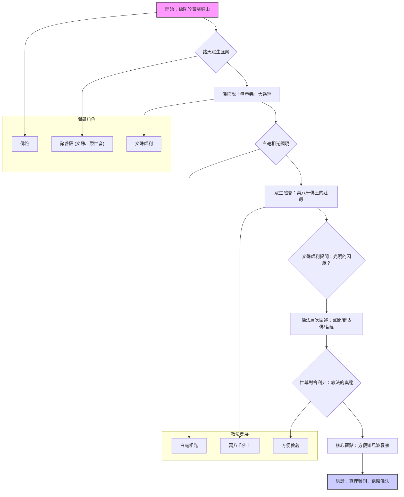

---

## Part 2

Source note: [[妙法蓮華經 (Part 2)]]

Original range: lines 399-819
Original chars: 8194-16421

<!-- source: 妙法蓮華經 (Part 2).md -->

### 翻譯與比較報告

#### 摘要

本段落是《妙法蓮華經》中極為核心的教義闡述，主要圍繞著「唯一佛乘」的教義展開。文本描繪了諸阿羅漢、聲聞、天人等眾生對究竟法（如涅槃、阿耨多羅三藐三菩提）的疑惑，並藉由舍利弗的多次請教，引導世尊闡明：所有諸佛所說的法，無論表象是「小乘」還是其他教法，其本體和終極目標，皆指向唯一的、不可思議的「佛知見」和「佛乘」。世尊強調，教法多用方便（Skillful Means）和譬喻（Analogy）來引導眾生，其目的始終是讓眾生體悟到「一切種智」的圓滿境界。

#### 翻譯內容

**（【譯文】將根據原文內容進行專業翻譯，力求保留佛教語境的莊重與哲學深度。）**

禪定解脫等，乃是不可思議的法。道場所證的法，是無能發問者所能了悟的。

我心難測，亦無能詢問者。若不問而自行說，稱讚所行的道，此智慧極為微妙，是諸佛所證的境界。無漏的阿羅漢，乃至求取涅槃的眾生，如今皆墮入了疑網之中。佛陀為何要說這番話呢？那些求取緣覺的比丘、比丘尼，諸天、龍、鬼、神，乃至乾闥婆等，彼此之間懷著猶豫不定的心緒，仰望兩足的尊者，這件事究竟是怎麼回事？願佛陀為我們解說。

於諸聲聞眾，佛陀說我第一。我現在對於「智慧」與「疑惑」無法了悟，究竟的法是甚麼？所行的道又是甚麼？

佛陀開口說出「子」字，合掌仰望，期盼能說出微妙的聲音，以便如實地闡述。

諸天、諸龍、諸神等，數量如恆沙般多；求法的諸菩薩，數量有八萬，還有諸萬億的國度，轉輪聖王也到來，合掌以敬心，渴望聆聽圓滿的教法。

這時佛陀告誡舍利弗：「住，住，不必再說了。如果說了這件事，世間的一切天人，都會感到驚疑。」

舍利弗再次向佛陀稟報：「世尊，唯願您能說，唯願您能說。這是因為，在這一會會中，無數百千萬億的阿僧祇眾生，曾親見諸佛，諸根猛利，智慧明了。當他們聽聞佛陀所說，便能夠心懷敬信。」

舍利弗本想再次闡述此義，便說了偈頌：
法王無上尊，唯說願勿慮。
是會無量眾，有能敬信者。

佛陀再次制止舍利弗：「如果說了這件事，一切世間的天人、阿修羅，都會感到驚疑，增上慢的比丘，甚至會墜入大坑。」

這時世尊又說了偈頌：
住止不須說，我法妙難思。
諸增上慢者，聞必不敬信。

舍利弗再次懇切稟報佛陀：「世尊，唯願您能說，唯願您能說。在這一會會中，像我等比丘，百千萬億，世世都曾從佛陀接受過教化。像這樣的人，一定能夠敬信，安穩度過漫漫長夜，並且能獲得無數的利益。」

舍利弗本想再次闡述此義，便說了偈頌：
無上兩足尊，願說第一法。
我為佛長子，惟垂分別說。
是會無量眾，能敬信此法，
佛已曾世世，教化如是等。

皆一心合掌，渴望聆聽佛語。我等千二百，以及其他求法者，
願為此眾故，惟垂分別說。
是等聽聞此法，則生大歡喜。

這時世尊告誡舍利弗：「你已經殷勤地請求了三次，豈能不說呢？你現在仔細聽，深切思念，我當為你分別解說。」說出這句話時，會場中有比丘、比丘尼、優婆塞、優婆夷，五千人等，立刻從座位上起身，向佛陀禮拜退去。這是因為什麼呢？這群人罪根深重，而且有增上慢心，尚未達到「未得」的境界，尚未證到「證」的境界，卻有這樣的失誤，所以無法安住。世尊只是默默地沒有阻止他們。

這時佛陀告誡舍利弗：「我現在的這群眾，沒有任何枝葉，純粹只有誠實。舍利弗，像這樣有增上慢心的人，退去也是好的。你現在仔細聽，我當為你說。舍利弗說：『唯、然，世尊，願能聆聽。』」

佛陀告誡舍利弗：
「這樣的妙法，諸佛如來，只有在適當的時機才會說出來，就像優曇花一樣，只有偶爾才會現身。舍利弗，你們當相信佛陀所說的，絕非虛妄。舍利弗，諸佛隨時宜說法，其意趣難以解開。這是因為什麼呢？我以無數的方便、各種的因緣、譬喻的言辭，演說諸法。這些法，並非思量分別所能了悟，只有諸佛才能了知。這是因為什麼呢？諸佛世尊，唯獨以一個「大因緣」故出世。舍利弗，什麼叫做諸佛世尊唯獨以一個大因緣故出世呢？諸佛世尊是為了讓眾生開悟佛的智慧，使眾生清淨，才出世。為了示現眾生佛的智慧，才出世。為了讓眾生覺悟佛的智慧，才出世。為了讓眾生進入佛的智慧之道，才出世。舍利弗，這就是諸佛以一個大因緣故出世。」

佛陀告誡舍利弗：「諸佛如來只是教化菩薩，諸所作，始終都是一件事，唯是以佛的智慧，示悟眾生。舍利弗，如來只是以『一佛乘』故為眾生說法，沒有其他乘法，既沒有二乘，也沒有三乘。舍利弗，一切十方的諸佛，教法也是如此。」

「舍利弗，過去的諸佛，以無量無數的方便、各種的因緣、譬喻的言辭，為眾生演說諸法，這些法，皆為『一佛乘』故。是諸眾生，從諸佛聽聞法，究竟皆能獲得一切種智。舍利弗，未來的諸佛，當出世時，亦是以無量無數的方便、各種的因緣、譬喻的言辭，為眾生演說諸法，這些法，皆為『一佛乘』故。是諸眾生，從佛聽聞法，究竟皆能獲得一切種智。舍利弗，現在十方無量百千萬億佛土中的諸佛世尊，為了利益安樂眾生，亦是以無量無數的方便、各種的因緣、譬喻的言辭，為眾生演說諸法，這些法，皆為『一佛乘』故。是諸眾生，從佛聽聞法，究竟皆能獲得一切種智。舍利弗，諸佛只是教化菩薩，為了以佛的智慧示悟眾生，為了讓眾生悟到佛的智慧，為了讓眾生進入佛的智慧之道。舍利弗，我現在也是如此，知道諸眾生有各種的慾望，深處所執著的本性，便以各種的因緣、譬喻的言辭、方便的力量，為說法。舍利弗，這些，都是為了達到『一佛乘』和『一切種智』的境界。」

「舍利弗，十方世界中，尚沒有二乘，更何況有三乘。舍利弗，諸佛出於五濁惡世，所謂劫濁、煩惱濁、眾生濁、見濁、命濁。像這樣的舍利弗，在劫濁亂世時，眾生積累的污垢極重，貪婪、嫉妒，成就了諸不善的根基。所以諸佛以方便的力量，在『一佛乘』的層面，分別說出了三乘的法。舍利弗，如果我的弟子，自稱已經是阿羅漢、辟支佛，卻不知道諸佛如來，只是教化菩薩的本意，這不是佛弟子，不是阿羅漢，也不是辟支佛。」

「又，舍利弗，這些自稱已經是阿羅漢的比丘，是最後的生命，究竟證得涅槃，便不再有追求『阿耨多羅三藐三菩提』的志向，要知道，這類人都是增上慢心的人。這是因為什麼呢？如果真有比丘能證到阿羅漢，若不相信此法，就沒有安身之處。在佛陀的度化之後，現在沒有佛了。這是因為什麼呢？在佛陀度化之後，像這類依持的經文、受持讀誦解義的人，是很難成功的。若遇到其他佛，在這方面，就能得到圓滿的了悟。舍利弗，你們當一心相信、接受並持誦佛陀的言教。諸佛如來所說的，絕非虛妄，沒有其他乘法，只有唯一的佛乘。」

世尊本想再次闡述此義，便說了偈頌：
比丘比丘尼，有懷增上慢。
優婆塞我慢，優婆夷不信。
如是四眾等，其數有五千，
不自見其過，於戒有缺漏，護惜其瑕疵。
是小智已出，眾中之糟糠，
佛威德故去，斯人鮮福德，不堪受是法。
此眾無枝葉，唯有諸貞實。
舍利弗善聽，諸佛所得法，無量方便力，為眾生說。
眾生心所念，種種所行道，若干諸欲性，先世善惡業。
佛悉知是已，以諸緣譬喻、言辭方便力，令一切歡喜。
或說修多羅、伽陀及本事、本生未曾有。亦說於因緣，
譬喻並祇夜、優波提舍經。鈍根樂小法，貪著於生死，
於諸無量佛，不行深妙道，眾苦所惱亂，為是說涅槃。
我設是方便，令得入佛慧，未曾說汝等、當得成佛道。
所以未曾說，說時未至故，今正是其時，決定說大乘。
我此九部法，隨順眾生說，入大乘為本，以故說是經。
有佛子心淨，柔軟亦利根，無量諸佛所，而行深妙道。
為此諸佛子，說是大乘經。我記如是人，來世成佛道，
以深心念佛，修持淨戒故。此等聞得佛，大喜充遍身，
佛知彼心行，故為說大乘。聲聞若菩薩，聞我所說法，
乃至於一偈，皆成佛無疑。十方佛土中，唯有一乘法，
無二亦無三。除佛方便說，但以假名字，引導於眾生，
說佛智慧故。諸佛出於世，唯此一事實，餘二則非真，
終不以小乘、濟度於眾生。佛自住大乘，如其所得法，
定慧力莊嚴，以此度眾生。自證無上道，大乘平等法，
若以小乘化、乃至於一人，我則墮慳貪，此事為不可。
若人信歸佛，如來不欺誑，亦無貪嫉意，斷諸法中惡。
故佛於十方，而獨無所畏。我以相嚴身，光明照世間，
無量眾所尊，為說實相印。
舍利弗當知，我本立誓願，
欲令一切眾、如我等無異。如我昔所願，今者已滿足，
化一切眾生，皆令入佛道。若我遇眾生，盡教以佛道，
無智者錯亂，迷惑不受教。我知此眾生，未曾修善本，
堅著於五欲，癡愛故生惱。以諸欲因緣，墜墮三惡道，
輪迴六趣中，備受諸苦毒，受胎之微形，世世常增長。
薄德少福人，眾苦所逼迫，入邪見稠林，若有若無等。
依止此諸見，具足六十二，深著虛妄法，堅受不可捨，
我慢自矜高，諂曲心不實，於千萬億劫、不聞佛名字，
亦不聞正法，如是人難度。
是故舍利弗，我為設方便，
說諸盡苦道，示之以涅槃。我雖說涅槃，是亦非真滅，
諸法從本來，常自寂滅相。佛子行道已，來世得作佛，
我有方便力，開示三乘法。一切諸世尊，皆說一乘道，
今此諸大眾，皆應除疑惑，諸佛語無異，唯一無二乘。
過去無數劫，無量滅度佛，百千萬億種，其數不可量。
如是諸世尊，種種緣譬喻，無數方便力，演說諸法相。
是諸世尊等，皆說一乘法，化無量眾生，令入於佛道。
又諸大聖主，知一切世間、天人群生類，深心之所欲，
更以異方便，助顯第一義。若有眾生類，值諸過去佛，
若聞法布施，或持戒忍辱、精進禪智等，種種修福慧。
如是諸人等，皆已成佛道。諸佛滅度已，若人善軟心，
如是諸眾生，皆已成佛道。諸佛滅度已，供養舍利者，
起萬億種塔，金銀及玻璃、硨磲與瑪瑙、玫瑰琉璃珠，
清淨廣嚴飾，莊校於諸塔。或有起石廟，栴檀及沈水，
木蜜並餘材，塼瓦泥土等。若於曠野中，積土成佛廟。
乃至童子戲，聚沙為佛塔。如是諸人等，皆已成佛道。
若人為佛故，建立諸形像，刻雕成眾相，皆已成佛道。
或以七寶成，鋀石赤白銅、白鑞及鉛錫，
鐵木及與泥，或以膠漆布、嚴飾作佛像，如是諸人等，皆已成佛道。
彩畫作佛像，百福莊嚴相，自作若使人，皆已成佛道。
乃至童子戲，若草木及筆、或以指爪甲，而畫作佛像，
如是諸人等，漸漸積功德，具足大悲心，皆已成佛道。
但化諸菩薩，度脫無量眾。若人於塔廟、寶像及畫像，
以華香幡蓋、敬心而供養。若使人作樂，擊鼓吹角貝，
簫笛琴箜篌、琵琶鐃銅鈸，如是眾妙音，盡持以供養。
或以歡喜心，歌唄頌佛德，乃至一小音，皆已成佛道。
若人散亂心，乃至以一華，供養於畫像，漸見無數佛。
或有人禮拜，或復但合掌，乃至舉一手，或復小低頭，
以此供養像，漸見無量佛。自成無上道，廣度無數眾，
入無餘涅槃，如薪盡火滅。若人散亂心，入於塔廟中，
一稱南無佛，皆已成佛道。於諸過去佛，在世或滅後，
若有聞是法，皆已成佛道。未來諸世尊，其數無有量，
是諸如來等，亦方便說法。一切諸如來，以無量方便，
度脫諸眾生，入佛無漏智，若有聞法者，無一不成佛。
諸佛本誓願，我所行佛道，普欲令眾生、亦同得此道。
未來世諸佛，雖說百千億、無數諸法門，其實為一乘。
諸佛兩足尊，知法常無性，佛種從緣起，是故說一乘。
是法住法位，世間相常住，於道場知已，導師方便說。
天人所供養、現在十方佛，其數如恆沙，出現於世間，
安隱眾生故，亦說如是法。知第一寂滅，以方便力故，
雖示種種道，其實為佛乘。知眾生諸行，深心之所念，
過去所習業，欲性精進力，及諸根利鈍，以種種因緣、
譬喻亦言辭，隨應方便說。今我亦如是，安隱眾生故，
以種種法門、宣示於佛道。我以智慧力，知眾生性欲，
方便說諸法，皆令得歡喜。
舍利弗當知，我以佛眼觀，
見六道眾生，貧窮無福慧，入生死險道，相續苦不斷，
深著於五欲，如犛牛愛尾、以貪愛自弊，盲瞑無所見。
不求大勢佛、及與斷苦法，深入諸邪見，以苦欲捨苦。
為是眾生故、而起大悲心。我始坐道場，觀樹亦經行，
於三七日中，思惟如是事。我所得智慧，微妙最第一。
眾生諸根鈍，著樂癡所盲，如斯之等類，云何而可度，
爾時諸梵王，及諸天帝釋、護世四天王，及大自在天，
並餘諸天眾、眷屬百千萬，恭敬合掌禮，請我轉法輪。
我即自思惟，若但讚佛乘，眾生沒在苦，不能信是法，
破法不信故，墜於三惡道。我寧不說法，疾入於涅槃。
尋念過去佛、所行方便力，我今所得道，亦應說三乘。
作是思惟時，十方佛皆現，梵音慰喻我，善哉釋迦文，
第一之導師，得是無上法，隨諸一切佛、而用方便力。
我等亦皆得最妙第一法，為諸眾生類、分別說三乘。
少智樂小法，不自信作佛，是故以方便、分別說諸果。
雖復說三乘，但為教菩薩。舍利弗當知，我聞聖師子、
深淨微妙音，喜稱南無佛。復作如是念，我出濁惡世，
如諸佛所說，我亦隨順行。思惟是事已，即趨波羅奈，
諸法寂滅相，不可以言宣。以方便力故，為五比丘說。
是名轉法輪，便有涅槃音，及以阿羅漢，法僧差別名。
從久遠劫來，讚是涅槃法，生死苦永盡，我常如是說。
舍利弗當知，我見佛子等，志求佛道者，無量千萬億，
咸以恭敬心，皆來至佛所，曾從諸佛聞，方便所說法。
我即作是念，如來所以出，為說佛慧故，今正是其時。
舍利弗當知，鈍根小智人、著相憍慢者，不能信是法。
今我喜無畏，於諸菩薩中，正直捨方便，但說無上道。
菩薩聞是法，疑網皆已除，千二百羅漢、悉亦當作佛。
如三世諸佛，說法之儀式，我今亦如是，說無分別法。
諸佛興出世，懸遠值遇難，正使出於世，說是法復難，
無量無數劫，聞是法亦難，能聽是法者，斯人亦復難。
譬如優曇花，一切皆愛樂，天人所稀有，時時乃一出。
聞法歡喜讚，乃至發一言，則為已供養，一切三世佛，
是人甚稀有，過於優曇花。汝等勿有疑，我為諸法王，
普告諸大眾，但以一乘道、教化諸菩薩，無聲聞弟子。
汝等舍利弗，聲聞及菩薩，當知是妙法，諸佛之秘要。
以五濁惡世，但樂著諸欲，如是等眾生，終不求佛道。
當來世惡人，聞佛說一乘，迷惑不信受，破法墮惡道。
有慚愧清淨、志求佛道者，當為如是等、廣讚一乘道。
舍利弗當知，諸佛法如是，以萬億方便、隨宜而說法，
其不習學者，不能曉了此。汝等既已知，諸佛世之師，
隨宜方便事，無復諸疑惑，心生大歡喜，自知當作佛。

**（【譯文】）**
這段內容的核心精神是：佛法教義的層次性與唯一性。世尊指出，佛陀的教法是根據眾生的根機和時代背景，採取「方便說法」，但其核心指向永遠是「一佛乘」的究竟真理。

**（【譯文】）**
舍利弗這時踴躍歡喜，立刻合掌仰望尊顏，向佛陀稟告：「從世尊聽聞此法音，心懷的喜悅，是前所未有的。這是因為什麼呢？我過去從佛聽聞此法，見諸菩薩受記為佛，而我等卻沒有這樣，非常感到傷感，失落於如來無量的智慧。世尊，我一直獨處山林樹下，無論是坐著還是行著，總是這樣思念：『我們怎能以小乘的法來度化眾生呢？』這是我們的過失，不是世尊的過失。這是因為什麼呢？若我等待說的因緣，成就阿耨多羅三藐三菩提，必定要以大乘來度脫。然而我等不了解方便隨宜的說法，初聽佛法，遇到便信受，思維取證。世尊，我從過去到現在，日夜不斷地自責。而今從佛，聽聞了前所未聞、前所未有的法，斷去了所有的疑悔，身心變得平靜，感到極大的安穩。今日才明白，真是佛子，是從佛口生，從法化生，獲得了佛法的分流。」

**（【譯文】）**
舍利弗本想再次闡述此義，便說了偈頌：
我聞是法音，得所未曾有，心懷大歡喜，疑網皆已除。
昔來蒙佛教，不失於大乘，佛音甚稀有，能除眾生惱，
我已得漏盡，聞亦除憂惱。
我處於山谷，或在樹林下，
若坐若經行，常思惟是事，嗚呼深自責，雲何而自欺。
我等亦佛子，同入無漏法，不能於未來、演說無上道。
金色三十二，十力諸解脫，同共一法中，而不得此事，
八十種妙好，十八不共法，如是等功德，而我皆已失，
我獨經行時，見佛在大眾，名聞滿十方，廣饒益眾生。
自惟失此利，我為自欺誑。我常於日夜，每思惟是事，
欲以問世尊，為失為不失，我常見世尊，稱讚諸菩薩，
以是於日夜，籌量此是事。
今聞佛音聲，隨宜而說法，
無漏難思議，令眾至道場。
我本著邪見，為諸梵志師，
世尊知我心，拔邪說涅槃。我悉除邪見，於空法得證，
爾時心自謂，得至於滅度。而今乃自覺，非是實滅度，
若得作佛時，具三十二相，天人夜叉眾、龍神等恭敬，
是時乃可謂，永盡滅無餘。
佛於大眾中，說我當作佛，
聞如是法音，疑悔悉已除。
初聞佛所說，心中大驚疑，
將非魔作佛，惱亂我心耶。
佛以種種緣、譬喻巧言說，
其心安如海，我聞疑網斷。
佛說過去世、無量滅度佛，
安住方便中，亦皆說是法。現在未來佛，其數無有量，
亦以諸方便，演說如是法。如今者世尊，從生及出家、
得道轉法輪，亦以方便說。世尊說實道，波旬無此事，
以是我定知、非是魔作佛。我墮疑網故，謂是魔所為，
聞佛柔軟音，深遠甚微妙，演暢清淨法。我心大歡喜，
疑悔永已盡，安住實智中。我定當作佛，為天人所敬，
轉無上法輪，教化諸菩薩。

**（【譯文】）**
這段內容是舍利弗對佛陀教法的深刻體悟，體現了從「懷疑」到「大歡喜」的轉變。他體悟到，佛陀的教法是超越了世俗的理解和執著的。

##### 關鍵術語對照表

| 梵文/บาลี (或原文) | 繁體中文翻譯 | 英文參考 | 釋義與語境解析 |
| :--- | :--- | :--- | :--- |
| **不可思議法** | 不可思議的法 | Inconceivable Dharma | 指超越常人思議範圍的真理，如佛性、涅槃的究竟狀態。 |
| **一佛乘** | 唯一佛乘 | One Vehicle | 佛教教義的核心觀點，指所有教法最終的目的地都是成佛，沒有不同的最終境界。 |
| **方便** | 方便法 | Skillful Means | 指佛陀根據眾生的根機和心性，適時、適地使用的教化方法、譬喻或言辭，而非指教法本身。 |
| **大乘** | 大乘 | Great Vehicle | 指以成佛為目標的教法，體現了廣大的願力與智慧。 |
| **增上慢** | 增上慢心 | Arrogance/Overconfidence | 指心懷自大、過度自滿，誤以為自己已證到某種境界（如阿羅漢果）而對佛法產生懷疑的心理狀態。 |
| **阿耨多羅三藐三菩提** | 阿耨多羅三藐三菩提 | Supreme Enlightenment | 佛教最高層次的覺悟，指圓滿的佛果。 |
| **無漏智** | 無漏的智慧 | Unceasing Wisdom | 指徹底了悟真理，沒有任何煩惱或染污的智慧。 |

##### 文化與語境解析

1. **「方便」的辯證性（Skillful Means）：** 本段落最關鍵的文化點在於對「方便」的闡釋。世尊不斷強調，佛陀所說的一切法，包括「小乘」、「聲聞」等看似不同的法門，都是「方便」。這不是說這些法門不存在，而是說它們都是**工具**，目的是為了引導眾生，最終達到唯一的「佛乘」境界。這體現了大乘佛教極高的辯證哲學水準，避免了教義上的絕對化和僵化。
2. **「增上慢」的警示：** 文本中多次提到「增上慢」，這在佛教語境中是==極為嚴重的心理障礙==。它警示了所有修行者，即使在修習了某個階段的法門（如阿羅漢果），也不能心生自大，誤以為已經到達終點，否則將無法接受更深層次的真理教導。
3. **「優曇花」的象徵意義：** 將佛陀的教法比喻為「優曇花」，象徵著其教法極其稀有、難得，且==只在極度適當的時機才會開顯==。這強調了佛法教義的殊勝性與不可輕易獲取的特性。

#### 邏輯流程圖 (Mermaid Diagram)

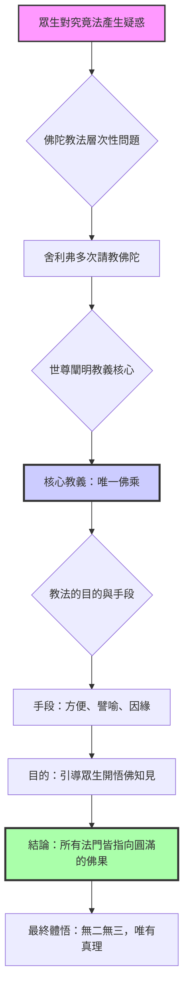

---

## Part 3

Source note: [[妙法蓮華經 (Part 3)]]

Original range: lines 821-1189
Original chars: 16423-24942

<!-- source: 妙法蓮華經 (Part 3).md -->

title: "妙法蓮華經 (第一部)：譬喻品與信解品"
tags: ["translation", "佛教", "大乘"]
type: "translation"

---

### 翻譯與比較報告

#### 總結 (Summary)

本篇文本涵蓋了《妙法蓮華經》中至為著名的兩大譬喻故事：「火宅譬喻」（《譬喻品》）和「窮子譬喻」（《信解品》）。兩故事的核心目的都是闡述佛陀教法中的「方便」（Upāya，智慧的指引）概念。

**《譬喻品》** 描繪了富長者如何設法將諸子從燃燒的火宅中解救出來，最終從「三車」的誘引，升級到「大車」的圓滿接引，象徵著從初級的教法引導到圓滿的佛法。

**《信解品》** 描繪了富長者如何設法讓年幼的兒子，從貧困的境遇中，最終被接回富貴的家園，象徵著從世俗的困苦到覺悟的歸依。

兩故事的總結教義是：佛陀的教法（如來）亦是世間的父，其教導的「三乘」（聲聞、緣覺、如來）皆是方便，最終的目標和圓滿的法門，皆指向「大乘」（佛乘），即圓滿的佛道。

#### 譯文主體 (Translation Body)

##### 一、 譬喻品：火宅與大車 (The Fire House Parable)

**【故事概述】**
一位富有的長者，其家宅雖大，卻只有一門。某日，家宅突然被大火焚燒。長者見諸子在火宅內嬉戲，毫無驚恐，長者深感焦慮。他於是設法，以「珍玩好車」為誘餌，引導諸子離開火宅。當諸子安全出來後，長者又以「七寶大車」接引，讓諸子得以安穩，展現了「有如實情，皆為方便」的道理。

**【佛陀教義闡釋】**
佛陀對舍利弗闡釋，如長者為子提供大車，並非虛妄。佛陀指出，如來亦是世間的父，面對眾生在「三界火宅」（生老病死、憂悲、苦惱等苦難）的煎熬，無法自行解脫。==佛陀最初以「三乘」（聲聞、緣覺、如來）的教法引導，最終卻以「大乘」的法門，為一切眾生開示，指引眾生「出三界」，證得涅槃==。

**【核心教點】**
*   **方便性 (Upāya)：** 佛陀的教法，無論是說三乘還是說大乘，皆是因緣和合的「方便」，目的是指引眾生脫離輪迴的苦難。
*   **大乘的圓滿：** 最終的法門是「大乘」，其智慧和慈悲，能圓滿地接引一切眾生，不令任何一人獨得解脫。

##### 二、 信解品：貧困與歸依 (The Poor Child Parable)

**【故事概述】**
一位極富的長者，其兒子（窮子）在世間遊歷了五十餘年，經歷了貧困和艱辛。他最終在父親的城鎮前徘徊。父親見子後，心懷欣喜，但為避免子懷疑，便設法讓兒子在「貧民區」生活，並以「除糞」為生計。多年後，父親才以「我所有一切財物，皆是子有」的方式，讓兒子心甘情願地回歸富貴之家，體現了「緣起性空」與「歸依」的過程。

**【佛陀教義闡釋】**
佛陀對舍利弗闡釋，此故事的教義與前述相似。世間的父，皆以方便引導其子。佛陀教法亦是如此，先以「三乘」引導，最終以「大乘」的法門，指引眾生超越世間的貪愛與執著，達到涅槃。

##### 三、 妙法華經的殊勝性 (The Exclusivity of the Lotus Sutra)

**【教法總結】**
佛陀進一步闡述，眾生的心智層次不同，能領受的法門也不同。
1.  **聲聞乘 (Shravaka)：** 具備「智性」，能聞法信受，勤修精進，求出世間道。
2.  **緣覺乘 (Pratyeka)：** 具備「自然慧」，樂於獨善寂，深知諸法因緣。
3.  **大乘乘 (Mahayana)：** 具備「一切智」（佛智、自然智等），心懷慈悲，利益一切眾生，是菩薩所求。

**【經法結論】**
佛陀強調，《妙法華經》的法義極為深奧，對於淺識的眾生，難以完全領悟。只有具備「信受」（對佛法深信）的修行者，才能依此經法入道。若有惡念（如誹謗、輕賤），則會招致極重的惡報，直至輪迴無盡。

#### 術語對照 (Glossary & Key Terms)

| 漢語術語 (Traditional Chinese) | 英文對照 (English Equivalent) | 釋義與文化詮釋 (Interpretation) |
| :--- | :--- | :--- |
| **方便 (Fāngbiàn)** | Skillful Means (Upāya) | 指佛陀根據眾生的根機、心性，隨時變通、適應的教導方法。非指虛假，而是指「目的在於利益眾生，而非字面意義」。 |
| **三乘 (Sān Chéng)** | Three Vehicles | 指佛教早期教法體系：聲聞乘 (Shravaka)、緣覺乘 (Pratyeka)、如來乘 (Sambhogakāya/Trikāya)。 |
| **大乘 (Dà Chéng)** | Mahayana (Great Vehicle) | 佛教最高層次的法門，強調菩薩精神，目標是「廣度一切眾生」，不論其根機。 |
| **三諦 (Sān Dì)** | Threefold Truths | 佛教核心哲學概念：苦諦 (Dukkha, 苦的真理)、集諦 (Samudaya, 苦的生起之因)、滅諦 (Nirodha, 苦的止息)。 |
| **阿耨多羅三藐三菩提** | Supreme Enlightenment | 意指圓滿、無上、究竟的覺悟境界，即佛果。 |
| **信受 (Xìn Shòu)** | Faith and Acceptance | 指對佛陀教法產生深厚的信任和內心接納，是學習佛法的基礎。 |

#### 流程圖解 (Logical Flow Diagram)

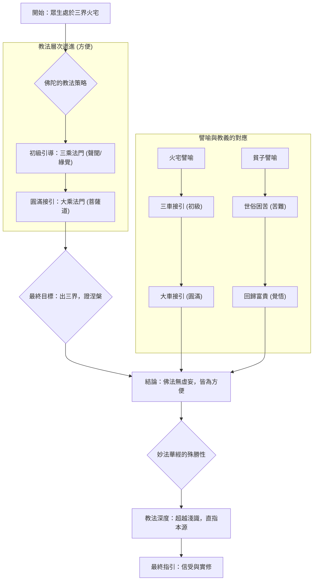

---

## Part 4

Source note: [[妙法蓮華經 (Part 4)]]

Original range: lines 1191-1645
Original chars: 24944-33155

<!-- source: 妙法蓮華經 (Part 4).md -->

title: "妙法蓮華經 (妙法蓮華經)"
tags: ["佛教經典", "大乘佛教", "智慧教法"]
type: "translation"

---

### Translation & Comparison Report

#### Summary

本篇文本涵蓋了《妙法蓮華經》中多個核心教法，內容極其宏大且層次分明。主要論述了佛陀如何根據眾生的心性與根機，以「方便力」（Upaya）來教化眾生，從最初的「樂小法」（如聲聞乘）到最終的「大乘法」（空性、涅槃）。

文本結構上包含三個主要層次：
1. **心性闡述**：弟子們對自己心念的自覺與佛陀智慧的體悟。
2. **譬喻闡釋**：透過「父子」、「大雲」等譬喻，說明佛法的本質是「一相一味」，其教法是無邊、遍及一切的。
3. **授記與法輪**：佛陀為大弟子們（如迦葉、須菩提等）預言其未來成佛的功德與法門，展示了佛法的無量功德。

整體核心思想是：**佛法本體圓滿，教法隨緣，一切眾生皆具成佛的潛能，唯需依循大乘的「空性」與「無我」心識，方能圓滿解脫。**

#### Translation Body

##### 一、 關於心念的自覺與大乘法（開篇對話）

**【原文核心意旨】**
弟子們（如摩訶迦葉）曾因心念著迷於「小法」的成就（如得涅槃一日之價），自以為滿足。佛陀洞察其心，隨即以方便力，引導他們明白，真正的佛法智慧是無所吝惜的，大乘法是超越小法的。他們最終領悟到，佛法本來就是圓滿的，無需有任何「求取」的念頭。

**【翻譯與詮釋】**
此段描繪了修行初期常見的「知足於小成就」的心理陷阱。佛陀的教導體現了「不著相」的境界，即真正的覺悟是「自無有志願」。

##### 二、 譬喻的層次遞進（父子與大雲）

**1. 譬如童子與父子（父慈子愚的教化）**
此譬喻描繪了一位巨富的父親，對年邁卻仍迷惘的兒子進行的教導。父親從物質的富足（世間法）到親身勞作（小事），再到最終的智慧指引，體現了「循序漸進」的教化過程。
*   **核心啟示**：無論是富貴的物質，還是勞作的體力，最終都是父愛和智慧的引導。佛陀的教法亦是如此，從眾生能接受的層次，逐步引導至最高真理。

**2. 譬如大雲普降（一相一味之法）**
此譬喻將佛法比擬為覆蓋三千大千世界的「大雲」。這朵雲所帶下的雨水（法音），雖然灑落在不同的草木（眾生），滋潤不同的根機（小、中、大），但其本質的「水性」（法性）是完全一致的。
*   **核心啟示**：佛法本質是「一味」（One Essence）。無論教化哪個眾生，其教法都是指向「解脫相、離相、滅相」，最終歸於空性。

##### 三、 諸乘與修行的層級（三乘比喻）

**【原文核心意旨】**
佛陀進一步闡述了修行的層級：
1. **聲聞乘**：如「藥草」，能初步脫離生死，是基礎修習。
2. **緣覺乘**：如「中藥草」，能於山林中證得空性，是進階修習。
3. **菩薩道**：如「大樹」，心性堅固，不為任何法所動，持續度化眾生。
4. **佛果**：如「一味雨」，法體圓滿，能平等地、無差別地教化一切。

##### 四、 佛陀的無量功德與授記（傳承與預言）

此部分是經文的關鍵高潮，佛陀為諸大弟子預言其未來世的功德與成就：

*   **摩訶迦葉**：預言其功德無量，是諸法之王，能以智方便演說一切智地。
*   **須菩提**：預言其未來世將奉覲無數佛，最終成佛，其國土莊嚴，眾生皆能修持菩薩道。
*   **大迦旃延**：預言其需供養諸佛，最終成佛，號為「閻浮那提金光如來」。
*   **大目犍連**：預言其需供養諸佛，最終成佛，號為「多摩羅跋栴檀香如來」，其法體更為圓滿。

這些授記的遞進性，體現了佛法傳承的宏大敘事，即從修習到教化，再到最終的圓滿成佛。

***

#### Glossary & Key Terms

| 梵文/術語 (Original) | 繁體中文翻譯 (Translation) | 語義解析 (Interpretation) |
| :--- | :--- | :--- |
| **方便力 (Upaya)** | 方便力/方便法 | 佛陀根據眾生的根機、心性，採取最適當的教化方法或論述，指教法的彈性與智慧。 |
| **小法 vs. 大乘法** | 小法 vs. 大乘法 | 「小法」指早期階段的修學目標（如聲聞的解脫），「大乘法」指圓滿的、包含一切眾生、超越二邊的究竟真理（如空性、無我）。 |
| **一相一味** | 一相一味 | 指佛法的本質是統一的、單一的，雖然外顯的教法（相）不同，但其核心真理（味）是相同的。 |
| **聲聞、緣覺、菩薩** | 聲聞、緣覺、菩薩 | 佛教修行的三個主要階段或體系。聲聞（Śrāvaka）指聞法、初步解脫；緣覺（Pratyeka）指自行了悟；菩薩（Bodhisattva）指發願度化眾生，持續修行的最高境界。 |
| **無漏法** | 無漏法 | 指不被任何世間或心念所困擾的、究竟清淨的真理或法門。 |
| **應供、正遍知** | 應供、正遍知 | 佛陀的尊稱，意指應於諸佛供養、具備圓滿的智慧與知識。 |

#### Mermaid Diagram

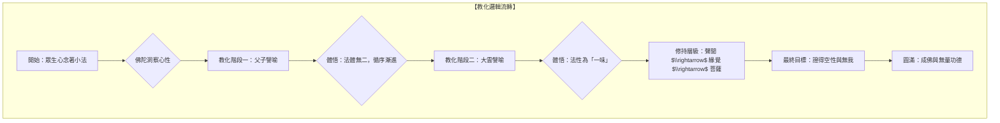

---

## Part 5

Source note: [[妙法蓮華經 (Part 5)]]

Original range: lines 1647-1941
Original chars: 33157-41368

<!-- source: 妙法蓮華經 (Part 5).md -->

### Translation & Comparison Report

#### Summary

本段落內容是《妙法蓮華經》極為核心的敘事部分，詳細描繪了釋迦牟尼佛在菩提樹下證得「阿耨多羅三藐三菩提」的過程，以及諸天、諸國、諸弟子（包括十六王子和富樓那彌多羅尼子）如何共同見證、恭敬讚歎並請求佛陀轉開「無上法輪」。

文本結構宏大，採用了「四方來報」的敘事手法，從東、南、西、北、上、下六方，描繪了各方眾生因緣和合、共同成就佛果的場景。核心主題圍繞著「佛法不二、唯有佛乘」的教義，強調了佛陀的無上智慧、大慈大悲，以及一切眾生最終都必須依循的「一佛乘」法門。

#### Translation Body

##### 一、 證悟與成就佛果 (The Enlightenment)

佛陀於菩提樹下坐禪，歷經十小劫，終於證得「阿耨多羅三藐三菩提」。此時，諸天梵王、雨眾天等，皆以無盡的供養與讚歎圍繞。

諸比丘讚歎世尊，讚頌其「大威德」，指出世尊為度眾生，歷經無量劫才成佛，其心常惔怕，永安於「無漏法」。眾生深知，世尊的成佛，是為了指引眾生擺脫「盲瞑無導師」的苦惱，從永恆的黑暗中解脫。

##### 二、 四方諸天共襄盛舉 (The Celestial Confirmation)

文本後續描繪了從東方、南方、西方、西北方、北方、下方（以及上方）六個方向，諸梵天王、諸國土的眾生，因緣和合地「尋光」來到佛陀的道場。

1. **共議與推尋：** 各方梵天王因發現自身宮殿的光明在過去未曾有，於是共同討論，推尋這股「大光明」的來歷。
2. **共同奉獻：** 諸梵天王帶著他們極為莊嚴的宮殿、天華，向佛陀行頭面禮，並奉獻所有所得。
3. **共同讚歎：** 眾生以偈頌讚歎佛陀的稀有、無量功德，並懇切地請求世尊「轉於法輪」，以大慈悲力度化眾生。

此「四方來報」的結構，極大地烘托了佛陀的無上地位，體現了「法界本體」的圓滿性。

##### 三、 佛法核心教義：一佛乘 (The Doctrine of One Vehicle)

在眾生和諸天持續的讚歎與請求下，佛陀開始闡述法輪的教義。

1. **十二因緣法：** 佛陀詳細闡述了「十二因緣」的生滅過程，指出了「無明」是痛苦的根源，而「無明滅」才是解脫的起點。
2. **三乘與一乘：** 佛陀指出，世間眾生所經歷的「聲聞乘」、「緣覺乘」等，皆是「方便法」；而最終、究竟的解脫之道，唯有「佛乘」能夠徹底開啟。
3. **比喻闡釋：** 佛陀以「五百由旬的險難惡道」為喻，說明眾生在修行中容易懈怠退縮。導師（佛陀）必須先「化作大城」作為止息的依處，讓眾生心生安穩，才能最終引導其前進，到達真正的「寶處」（涅槃）。

##### 四、 殊勝弟子與法身顯現 (The Disciples and the Dharma Body)

文本最後，重點描寫了：

1. **十六王子：** 諸王子皆發願，共同請佛轉法輪，並展現了他們修行的功德。
2. **富樓那彌多羅尼子：** 諸比丘讚歎富樓那，稱其為「最為第一」的說法人，其功德不僅限於當世，更貫穿於無量劫，具足「四無礙智」，是輔助弘法、淨化佛土的關鍵存在。
3. **佛界描述：** 描繪了佛陀的法身境界——「恒河沙等三千大千世界」的佛土，其眾生皆具足無量功德，壽命無量阿僧祇劫，體現了法界圓滿的莊嚴。

---

#### Glossary & Key Terms

| 術語 (Original) | 翻譯 (Translation) | 釋義/文化背景 (Interpretation) |
| :--- | :--- | :--- |
| **阿耨多羅三藐三菩提** | 最高無上正等菩提 | 指證悟的最高境界，即圓滿的佛果，意指「無上、正等、菩提」。 |
| **轉法輪** | 轉動法輪 | 指佛陀開始系統性地教導佛法，將其教義傳播給世人。 |
| **無漏法** | 無漏法 | 指不沾染任何煩惱、不留任何業力，達到徹底解脫的法性。 |
| **一佛乘** | 一乘法門 | 佛教教義核心概念，指所有眾生最終都能依循的、達到成佛果的唯一途徑。 |
| **十二因緣** | 十二因緣 | 佛教解釋生死輪迴的十二個環節（無明、行、識...），是理解苦集之源的理論模型。 |
| **菩提樹** | 菩提樹 | 證悟佛果的聖樹，象徵著覺悟的智慧。 |
| **法華經** | 法華經 | 意指「華盛開的法」，代表佛法最圓滿、最殊勝的教法。 |

#### Mermaid Diagram

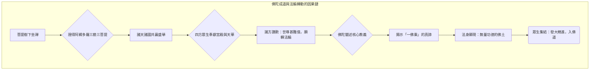

---

## Part 6

Source note: [[妙法蓮華經 (Part 6)]]

Original range: lines 1943-2229
Original chars: 41370-49589

<!-- source: 妙法蓮華經 (Part 6).md -->

title: "妙法蓮華經 (Lotus Sutra): 弟子功德與十方佛域"
tags: ["translation", "佛教"]
type: "translation"

---

### Translation & Comparison Report

#### Summary

本章節內容涵蓋了《妙法蓮華經》中關於諸大弟子（如富樓那、憍陳如、阿難、羅侯羅、學無學二千人）的功德事蹟與成就。核心思想圍繞著「菩薩道」的至高無上，闡述了聲聞（Arhat）的涅槃境界，雖為殊勝，仍不及菩薩發心所能達到的圓滿。經文藉由「無價寶珠繫衣」的譬喻，警示眾生不可自滿，誤以為小乘的成就即為究竟解脫。最終，經文描繪了諸佛的無量功德，並以宏大的場景，展現了十方諸佛的莊嚴境界，強調了法華經的至高地位與其無邊的教化力量。

#### Translation Body

**【富樓那與神通成就】**
（原文：知眾樂小法、 而畏於大智， 是故諸菩薩， 作聲聞緣覺...）
諸菩薩深知世人喜愛小乘法門，卻又畏懼於大智的深奧，故而有時會作聲聞或緣覺的表象，以無數方便來化度眾生。雖然他們能說出聲聞的法，卻與佛陀的究竟道相距甚遠。他們度化無量眾生，皆能成就功德，雖然心生懈怠，但仍需逐漸修習，方能成就佛果。他們內心深處實行著菩薩的行持，外表卻顯現為聲聞的形象；他們對生死雖有厭離之心，但實質上仍是淨化佛土。

**【諸大弟子之功德與記願】**
（原文：若我具足說、 種種現化事...）
若我具足說出各種化現的事，眾生聽聞後，心裡反而會生出疑惑。今，富樓那（樓那）在昔日千億佛的弘法過程中，勤修所行道，宣護諸佛法。他為求得無上智慧，於諸佛的法會中，現身為弟子。他多聞且有智慧，所說法無人所畏，能令眾生歡喜，從未感到疲倦，並且以助佛陀的事業。他已度化了巨大的神通，具備了四無礙的智慧，能了解眾生的根機差異，持續宣說清淨的法義，教導千億眾生，使大家體會到大乘的法義，並淨化了佛土。未來他也會供養無量無數的佛，護持正法，並淨化佛土。他常以各種方便說法，使眾生無所畏懼，度化不可計的眾生，並成就一切的智慧。他供養諸如來，護持法寶，之後成就佛果，名號為法明。其國土名善淨，由七寶合成，劫名為寶明。菩薩眾極為多，數量無量億，皆具備巨大的神通與威德力量，充滿其國土。聲聞弟子亦無數，具備三明與八解脫，擁有四無礙智慧，以這些為僧。其國的眾生，已斷盡淫欲，純粹地變化生，具備莊嚴的相貌。他們以法喜和禪悅為食，不再有餘食的念想。富樓那比丘功德圓滿，應得此淨土，諸賢聖眾極為多。

**【「寶珠繫衣」譬喻與菩薩道的覺醒】**
（原文：世尊，譬如有人至親友家...）
（此處引用了「寶珠繫衣」的譬喻）
佛陀比喻，如同有親友家，醉酒臥睡。親友會為他帶走無價寶珠，繫在他的衣裡，而他本人毫不知情。當他醒來，遊行到他處，為生計而辛苦勞作，若獲得一點點，便認為足夠。後來親友會遇他，便指責道：「唉，諸位，何止衣食如此？我當初為令你安樂，在你某年某月，已用無價寶珠繫在你的衣裡，如今你卻毫不知情。你辛苦勞作，為求生計，實在是太愚癡了。你現在可以憑藉這寶珠，交易所需，永遠滿足，永無匱乏。」
佛陀的教化亦如是，當他為菩薩時，教化了我們，使我們發起了一切的智慧心。然而，我們卻尋廢忘失，不知不覺，既得到了阿羅漢的道，便自以為已了結了解脫，認為世間的艱難生計已足夠。但事實上，一切智慧的願力，都尚未放下。現在世尊覺悟了我們，說：「諸比丘，你們所得到的，並非究竟的解脫。我早就為你們種下了成佛的善根，只是暫時以涅槃的相來示現，而你們卻誤以為這是真正的解脫。」

**【阿難、羅侯羅、學無學二千人的記願】**
（原文：阿難、羅侯羅、而作是念...）
阿難、羅侯羅等弟子心想：「我們每時都在思維，如果能得到記願，那該多快啊！」於是他們恭敬地向佛陀稟告：「世尊，我等也應有份，唯有如來，我等所歸。而且我們為一切世間的天、人、阿修羅、所見的知識，阿難常為侍者，護持法藏；羅侯羅是佛的兒子。如果佛能夠記我們得到阿耨多羅三藐三菩提的記願，我願心滿，眾生之望亦足夠。」
於是，佛陀為阿難指出了其來世的成就：他將成佛，號曰「山海慧自在通王如來」，需供養六十二億諸佛，教化二十千萬億恒河沙諸菩薩，其國名常立勝幡，地為琉璃，劫名妙音遍滿。

**【法華經的至高地位】**
（原文：藥王，當知是人、一切世間所應瞻奉...）
佛陀告藥王菩薩：「當知是人，已曾供養了十萬億佛，在諸佛的法會中，成就了巨大的願力，因為憐憫眾生，才在世間的惡世中，廣演此經。若有善男子、善女人，在未來世，能為我說法華經，哪怕只說一句話，當知此人是如來所使，是如來所派遣，行如來的事。更何況在大眾中廣為人說呢？」
「藥王，若有惡人，以不善心，在一劫中現身於佛前，常毀罵佛，其罪尚輕；若有人僅用一句惡言，毀謗在家或出家的讀誦法華經者，其罪就更重了。」

#### Glossary & Key Terms

| 術語 (Original) | 繁體中文翻譯 | 概念解釋 (Cultural/Theological Note) |
| :--- | :--- | :--- |
| **阿耨多羅三藐三菩提** | 無上正等正覺 (或 圓滿的覺悟) | 佛教最高境界，指圓滿、無上、完美的覺悟，即成佛的目標。 |
| **方便** | 方便法門 | 指佛陀為了適應眾生的心智層次，而展現的各種教法或化身。非指「方便做某事」，而是指「適當的教導方式」。 |
| **聲聞** | 聲聞乘 | 早期佛教的修行階梯之一，指證悟了初步解脫，但尚未達到佛果的修行者。 |
| **菩薩** | 菩薩道 | 大乘佛教的核心，指發願廣度一切眾生，不為自身解脫而止，直到所有眾生都成佛為止的修行者。 |
| **妙法華經** | 妙法華經 | 佛教經典中極為重要的一部，被認為是佛陀最圓滿、最究竟的教法，強調了「一切眾生皆有佛性」。 |
| **法喜禪悅** | 法喜與禪悅 | 佛教修行的兩種最高心態。法喜源於對法義的體悟，禪悅源於心神專注於禪定，皆為超越世俗的喜悅。 |
| **十方諸佛** | 十方佛域 | 指宇宙萬方（東、南、西、北、上、下，以及中間的空間）皆有佛陀的法界，體現了佛法的無所不在。 |

#### Mermaid Diagram

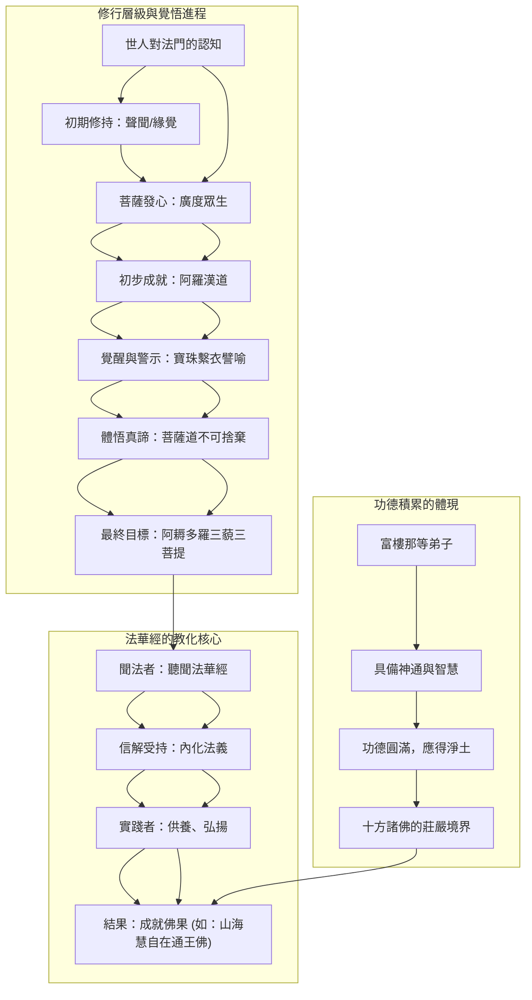

---

## Part 7

Source note: [[妙法蓮華經 (Part 7)]]

Original range: lines 2231-2573
Original chars: 49591-57784

<!-- source: 妙法蓮華經 (Part 7).md -->

### 妙法蓮華經（續）：諸佛集會、法難持與菩薩誓願

**[Context]** 本文內容涵蓋了《妙法蓮華經》中極為核心的教法部分，主要圍繞著釋迦牟尼佛在臨涅槃前，召集十方諸佛，闡述「法難持」的深奧義理，並引導諸菩薩發下護持此經的宏大誓願。內容涵蓋了「提婆達多品」、「勸持品」及「安樂行品」等重要章節。

#### Summary

本章節描繪了十方諸佛齊聚，共同聆聽釋迦牟尼佛的教法。佛陀闡明，妙法華經的教法極為深奧，若在佛陀涅槃之後，世人若無法護持、讀誦此經，便是極難之事。諸佛和諸菩薩（如多寶佛、文殊師利菩薩等）皆發下宏大誓願，承諾無論在何種惡世、何種環境，都將不懈怠地護持、宣說此經，以確保法脈的傳承。此外，內容亦詳細闡述了菩薩在末法時代應具備的「安樂行」心態與修行準則。

#### Translation Body

##### 一、 諸佛集會與法華經的開示

當釋迦牟尼佛的法身分身、百千萬億那由他諸佛，從十方諸國土聚集而來，皆在寶樹下，坐於師子座。諸佛皆遣使者詢問佛陀，確認其身心是否安泰，並提及某甲佛欲開寶塔。

釋迦牟尼佛見諸佛已到，於是起身，在虛空中開口，發出大音聲，如開啟了巨大的城門。眾佛皆見多寶如來於寶塔中安坐，全身不散，如同禪定。多寶佛隨即與釋迦牟尼佛分座，邀請其入塔。

佛陀隨後向大眾宣說：「誰能於此娑婆國土，廣說妙法華經，今正是時。如來不久當入涅槃，佛欲以此妙法華經，付囑有在。」

佛陀隨後發出偈語，強調了法華經的殊勝與不易：

*   **法難持性：** 佛陀指出，此經法難持。若在佛滅度後，世人若能護持、讀誦此經，便是極難的功德。
*   **超越性：** 佛陀甚至比喻，若能以足指動大千界、或在惡世中能暫讀此經，皆是極難之事。
*   **唯一性：** 佛陀總結：「我為佛道，於無量土，從始至今，廣說諸經，而於其中，此經第一。」

##### 二、 提婆達多品：法華經的傳承源起

佛陀隨後闡述了法華經的歷史傳承。在過去無量劫中，佛陀為了求法華經，曾化身為國王，發願求法。時有阿私仙人現身，告知佛陀「妙法蓮華經」的存在。佛陀隨即接受此法，並在諸位比丘面前，闡述了其功德：

1.  **功德累積：** 佛陀具足六波羅蜜、三十二相、八十種好，成就了等正覺。
2.  **教法傳承：** 佛陀指出，其成就皆因「提婆達多善知識」的引導。
3.  **弘法歷程：** 佛陀描述了天王如來、應供等諸佛的弘法歷程，直到最終的涅槃，正法仍將於世間持續二十中劫。
4.  **未來世的指引：** 佛陀告誡世人，若有善男子善女人聞此經，則能於未來世，在任何處所，聞此經，乃至於蓮華化生。

##### 三、 菩薩的誓願與護法承諾（勸持品）

在諸位菩薩、阿羅漢、以及學無學的眾生面前，諸位代表發下了堅定的誓願：

*   **菩薩摩訶薩與大樂說菩薩摩訶薩：** 誓願於佛滅後，不惜身命，奉持、讀誦、書寫此經。
*   **阿羅漢與學無學：** 誓願於異國他方，廣說此經，因為娑婆國土眾生心性已染濁惡，亟需此經的教化。
*   **諸菩薩的誓願：** 諸菩薩發誓，無論在何等惡世，面對惡口罵詈、加刀杖的對待，皆應忍受，因為護持此經是佛陀的囑咐。

##### 四、 安樂行品：末法時代菩薩的修行準則

佛陀進一步為文殊師利菩薩闡述了末法時代菩薩應具備的「安樂行」心態與修行準則：

1.  **菩薩行處：** 應安住於「忍辱地」，心不驚，觀諸法如實相，不分別。
2.  **菩薩親近處：** 應遠離國王、外道、貪著小乘學人、以及任何有戲弄、為利殺生之對象。
3.  **第二親近處（空性觀）：** 觀一切法空無所有，如虛空，不生不出，不常住一相。
4.  **安樂行實踐：** 菩薩應心懷平靜，隨緣說法，不生嫉妒、不輕慢，不論他人長短。若遇難問，應以大乘之義解說，令眾生獲得一切種智。

#### Glossary & Key Terms

| 術語 (Original) | 翻譯 (Translation) | 釋義 (Interpretation) |
| :--- | :--- | :--- |
| **妙法蓮華經** | 妙法蓮華經 | 佛教經典，強調法華乘的殊勝與圓滿。 |
| **諸佛** | 諸佛 | 指十方世界、歷代成佛的眾多佛陀。 |
| **涅槃** | 涅槃 | 佛陀圓寂，指生命輪迴的終結。 |
| **娑婆國土** | 娑婆國土 | 佛教指代人類居住的此世間世界。 |
| **法難持** | 法難持 | 指佛法教義極為深奧，難以在世間傳承和維持。 |
| **六波羅蜜** | 六波羅蜜 | 佛教修行中的六種圓滿功德（布施、持戒、忍辱、精進、禪定、般若）。 |
| **安樂行** | 安樂行 | 指末法時代菩薩應具備的平靜、無執、隨緣的教化態度。 |
| **菩薩** | 菩薩 | 尚未成佛，但發下廣度眾生的宏大誓願的修行者。 |

#### Mermaid Diagram

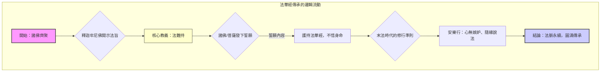

---

## Part 8

Source note: [[妙法蓮華經 (Part 8)]]

Original range: lines 2575-2875
Original chars: 57786-65984

<!-- source: 妙法蓮華經 (Part 8).md -->

title: "翻譯與比較報告：妙法蓮華經（續）"
tags: ["翻譯", "佛教", "法華經"]
type: "translation"

---

### 翻譯與比較報告

#### 摘要 (Summary)

本段經文是《妙法蓮華經》的後續內容，核心圍繞著「法華經」的至高地位、佛陀無量無邊的智慧，以及佛陀教化眾生時所採用的「方便法門」。經文透過文殊師利菩薩的提問，引導出佛陀的教法並非字面上的線性敘事，而是根據眾生心性與時機，以最適切的方式（方便）來指引眾生心靈，最終目的是讓眾生領悟到佛法的無邊與圓滿。重點闡述了佛陀的壽命和教化過程的「方便性」。

#### 翻譯正文 (Translation Body)

##### 一、法華經的至高地位 (The Supreme Status of the Lotus Sutra)

**【原文核心】** 佛陀強調法華經是諸經中最深奧的，是諸佛秘密的寶藏，歷經長夜守護，直到今日才與聽聞者開示。

**【譯文】**
「文殊師利，此法華經，是諸如來第一之說，於諸說中，最為甚深，末後賜與。如同那強力之王，久護明珠，直到今日才與之。文殊師利，此法華經，是諸佛如來秘密的寶藏，於諸經中，最在其上。它長期以來一直守護著，直到今日才向汝等開示。」

**【偈頌翻譯】**
「常行忍辱，哀愍一切，乃能演說，佛所讚經。
後末世時，持此經者，於在家出家，及非菩薩，
應生慈悲，斯等不聞，不信是經，則為大失。
我得佛道，以諸方便，為說此法，令住其中。」

##### 二、佛陀的教化與「方便」的譬喻 (The Buddha's Teaching and the Metaphor of *Upāya*)

**【原文核心】** 佛陀以轉輪聖王（指世俗王權）和自身（指佛法）的譬喻，說明獲取功德與傳授法義的過程。

**【譯文】**
「如來亦復如是，以禪定智慧力，得法國土，王於三界，而諸魔王不肯順伏。如來賢聖諸將，與之共戰，其有功者，心亦歡喜，於四眾中，為說諸經，令其心悅，賜以禪定、解脫、無漏根力、諸法之財，又復賜與涅槃之城，言得滅度，引導其心，令皆歡喜，而不為說是法華經。」

**【核心概念】** 佛陀的教化，如同王戰勝魔王，賜予功德，但法華經的開示，是最終且最寶貴的「明珠」，只有在極度需要時才會給予。

##### 三、無量菩薩的集結與疑問 (The Gathering of Infinite Bodhisattvas and Their Question)

**【原文核心】** 描述了無量無邊的菩薩（阿僧祇菩薩）從地底湧出，向佛陀詢問：如此龐大、無邊的眾生，是如何在極短時間內，成就菩薩道並發心？

**【譯文】**
「世尊，此大菩薩眾，假使有人，於千萬億劫、數不能盡，不得其邊，斯等久遠已來，於無量無邊諸佛所、植諸善根，成就菩薩道，常修梵行。世尊，如此之事，世所難信。譬如有人、色美發黑，年二十五，指百歲人，言是我子，其百歲人，亦指年少，言是我父，生育我等，是事難信。」

##### 四、佛陀對「方便」的最終闡釋 (The Buddha's Final Explanation of *Upāya*)

**【原文核心】** 佛陀解釋，其成佛和教化眾生，皆是為了度化眾生，而非字面上嚴格的線性時間敘述。

**【譯文】**
「諸善男子，我亦如是，成佛已來、無量無邊百千萬億那由他阿僧祇劫，為眾生故，以方便力，言當滅度，亦無有能如法說我虛妄過者。」
「我常住於此，以諸神通力，令顛倒眾生，雖近而不見。眾見我滅度，廣供養舍利，咸皆懷戀慕，而生渴仰心。… 我淨土不毀，而眾見燒盡，憂怖諸苦惱，如是悉充滿。是諸罪眾生，以惡業因緣，過阿僧祇劫，不聞三寶名。諸有修功德、柔和質直者，則皆見我身在此而說法。」

**【總結】** 佛陀的教法，是為了眾生的心性（信、渴仰）而展現的，其真實的法身存在和教化能力是無邊的。

#### 術語對照 (Glossary & Key Terms)

| 梵文/บาลี (Original Term) | 繁體中文翻譯 (Traditional Chinese Translation) | 釋義與語境 (Meaning and Context) |
| :--- | :--- | :--- |
| **法華經 (Fǎhuá Jīng)** | 法華經 | 意指《妙法蓮華經》，佛教大乘經典，強調佛法的殊勝與圓滿。 |
| **阿耨多羅三藐三菩提 (Ādi-bhūta-śatyā-śatyadṛṣṭi)** | 無上正等正覺 | 佛教最高層次的覺悟境界，指圓滿的佛果。 |
| **方便 (Fāngbiàn)** | 方便法門 / 方便 | 指佛陀教化眾生時所採用的各種方法、譬喻或說法，目的是達到教化的目的，而非字面意義的真實描述。 |
| **菩薩 (Púsà)** | 菩薩 | 覺悟的聖者，指尚未成佛，但發下廣大願力，為度化一切眾生而修行者。 |
| **阿僧祇 (Āsengqí)** | 阿僧祇 | 一種極大的數量單位，用於形容無邊無際的眾生或時間，數目極為龐大。 |
| **轉輪聖王 (Zhuǎnlún Shèngwáng)** | 轉輪聖王 | 指世間的王權或世俗的權威，常被用來比喻世間的功德或權力。 |

#### 文化與語境解析 (Cultural and Contextual Analysis)

1.  **「方便」的哲學意義 (The Philosophy of *Upāya*)：** 在大乘佛教語境中，「方便」是理解本經最關鍵的鑰匙。當佛陀說「我已成佛了」，但又說「我只是方便說」，這並非指佛陀的成佛是虛假的。相反地，它意指佛陀的「說法」和「教化」本身，是根據聽眾的心智層次（從初學到甚深）來調整的。這是一種超越二元對立（真/假、有/無）的智慧體現。
2.  **時間與空間的超越性 (Transcendence of Time and Space)：** 經文多次提到「無量無邊」、「無數劫」以及「從地湧出」。這挑戰了世俗人對時間和空間的線性認知。在佛教的宇宙觀中，時間和空間是相對的，佛陀的法身（真身）是超越這些限制的，因此其教化過程的描述，必然是宏大且非世俗邏輯的。
3.  **「明珠」的象徵 (The Symbolism of the Jewel)：** 文殊師利菩薩的「髻中明珠」是極為著名的比喻。它象徵著「法華經」的精華法義，是所有功德與智慧的總結，是世間王權（轉輪王）無法輕易取得的至寶，只有達到極高境界的實踐者才能領悟。

#### 邏輯結構圖 (Logic Flow Diagram)

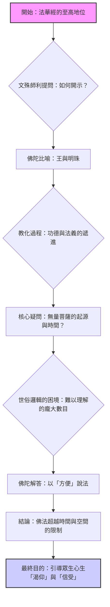

---

## Part 9

Source note: [[妙法蓮華經 (Part 9)]]

Original range: lines 2877-3209
Original chars: 65986-74402

<!-- source: 妙法蓮華經 (Part 9).md -->

### Translation & Comparison Report

#### Summary

本篇文本收錄了《妙法蓮華經》中關於「功德」的連續闡述（共三品目：第十七、十八、十九）。內容核心圍繞著「聞法華經」所能帶來的無量無邊的功德，並詳細闡述了不同層次的修行行為如何累積福報。

**主要論點包括：**
1. **【功德品十七】**：闡述了佛陀壽命的無量長遠，並指出修行者透過修持五波羅蜜、禪定、般若等功德，能累積的福報層級，從「一生當得阿耨多羅三藐三菩提」到「八世界微塵數眾生皆發阿耨多羅三藐三菩提心」。
2. **【功德品十八】**：重點強調了「隨喜心」的巨大功德。將「隨喜」的功德置於「大施主」的物質布施之上，指出其無量無邊的價值。此外，也詳細描述了聞法、傳法、以及為人說法所帶來的身體和精神上的完美體現（如口氣無臭、面目端嚴）。
3. **【功德品十九】**：闡述了「受持」經典的功德，重點描繪了修持者如何獲得「六根清淨」的殊勝能力：
    *   **眼功德**：能看見三千大千世界的一切景物。
    *   **耳功德**：能聽到三千世界的一切聲響。
    *   **鼻功德**：能聞到三千世界的一切香氣。
    *   **舌功德**：能說出入眾生心底的深妙聲音。

整體而言，文本的語氣極為莊嚴、宏大，充滿了對佛法教義的讚歎與對修行者無限期盼的期許。

#### Translation Body

##### 妙法蓮華經：功德品第十七（佛壽與功德累積）

**【譯文概述】**
佛陀向彌勒菩薩闡述了其壽命的無量長遠，並描繪了在佛法會中，眾生在不同層次的修行（如修持五波羅蜜、禪定、般若）所能達成的功德境界。修行者若能持續累積功德，其果報將會超越一切可思議的範疇。

**【關鍵論述】**
*   **壽命無量**：佛陀的壽命如無量無邊，眾生聞此，皆獲大饒益。
*   **功德遞增**：功德的累積是層層遞進的，從「一生當得阿耨多羅三藐三菩提」到「八世界微塵數眾生皆發阿耨多羅三藐三菩提心」。
*   **修行法門**：強調了修行者應當修持「五波羅蜜」（布施、持戒、忍辱、精進、般若）等，並透過「回向佛道」來累積功德。
*   **結論**：無論是聞法、持戒、忍辱、精進，只要心念不懈，功德便不可量。

##### 妙法蓮華經：功德品第十八（隨喜功德）

**【譯文概述】**
本品目極力讚頌「隨喜心」的無上功德。佛陀指出，與其進行物質上的巨大布施（如為眾生提供一切娛樂所需），不如「聞法華經一偈，隨喜」的功德來得殊勝無量。

**【關鍵論述】**
*   **隨喜之勝**：佛陀明確比較了物質布施與隨喜功德，結論是「隨喜功德，百分、千分、百千萬億分、不及其一，乃至算數譬喻所不能知」。
*   **傳法與聞法**：若能將法華經傳給他人聽，或親自聽聞，其功德都會大幅提升。
*   **身體與精神的淨化**：持續聞法和修行，能使人身心達到完美狀態，例如「世世無口患，齒不疏黃黑，唇不厚褰缺，無有可惡相」，口氣甚至散發「優缽華之香」。

##### 妙法蓮華經：功德品第十九（六根清淨）

**【譯文概述】**
本品目闡述了「受持」法華經所能帶來的六根（眼、耳、鼻、舌等）的清淨功德。修行者若能持續修持經典，其感官器官的感知能力將會超越凡夫範疇。

**【關鍵論述】**
*   **眼功德**：能看見三千大千世界內外的一切景物，即使未得天眼，肉眼力亦能達到此等境界。
*   **耳功德**：能聽到三千世界的一切聲響，從各種動物的叫聲、地獄的痛苦聲，到諸天、諸佛的法音，皆能清晰分辨而不壞耳根。
*   **鼻功德**：能聞到三千世界的一切香氣，從各種生靈的氣味，到天庭的香華，皆能分辨其來源與所在。
*   **舌功德**：能說出深妙的聲音，其言論能直達眾生心底，使聽者歡喜快樂。

#### Glossary & Key Terms

| 梵文/บาลี (Original) | 繁體中文翻譯 (Translation) | 釋義與文化背景 (Interpretation)                      |
| :----------------- | :------------------- | :-------------------------------------------- |
| **阿耨多羅三藐三菩提**      | 無上正等正覺               | 佛教最高境界，指圓滿的、無上無有的覺悟。                          |
| **五波羅蜜**           | 五種波羅蜜                | 佛教修行中的五種圓滿德行：==布施、持戒、忍辱、精進、般若==。              |
| **隨喜**             | 喜悅他人功德之情             | 佛教心法，指不計較自身功德，而是為他人成就感到由衷喜悅的心理狀態，被認為是極高層次的功德。 |
| **六根**             | 六種感官器官               | 指人體接收外界訊息的六個器官：眼、耳、鼻、舌、身、意（眼、耳、鼻、舌、身、意）。      |
| **三千大千世界**         | 三千大千世界               | 佛教宇宙觀中的一個完整宇宙體系，代表了極為廣闊的範圍。                   |
| **功德**             | 功德（福報）               | 指透過修行、善行累積的福報或精神層面的積累，通常與「無量無邊」掛鉤。            |
| **法華經**            | 法華經                  | 指《妙法蓮華經》，被譽為佛陀最究竟、最圓滿的教法。                     |

#### Mermaid Diagram

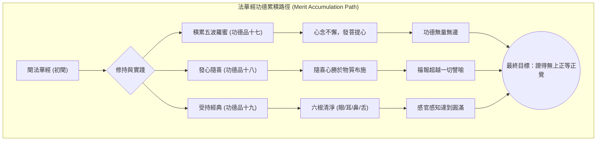

---

## Part 10

Source note: [[妙法蓮華經 (Part 10)]]

Original range: lines 3211-3411
Original chars: 74404-82715

<!-- source: 妙法蓮華經 (Part 10).md -->

title: "妙法蓮華經：功德與傳承的闡述"
tags: ["佛教經典", "法華經", "功德", "傳承"]
type: "translation"

---

### Translation & Comparison Report

#### Summary

本篇文本是《妙法蓮華經》的連續闡述，核心內容圍繞著「持誦、解說與弘揚法華經」所能帶來的無量功德與極高的地位。文本結構分為數個層次：首先闡述了法華經的功德（淨化身心、通達無量義）；接著描繪了法華經的傳承歷史，從威音王佛到常不輕菩薩，展現了佛法不滅的連續性；最後，從藥王菩薩的典故和經法的至高地位，強調了法華經在所有經典中的「最為第一」的殊勝性，最終指引眾生應當依此經修習，以成就無上菩提。

#### Translation Body

##### 一、法華經的功德體現 (The Merits of the Dharma)

世尊闡述了修持法華經的功德，主要體現在身心層面：

1.  **身體清淨 (Physical Purity):** 誦持者可得「清淨身」，其身如淨琉璃，眾生皆喜見。此身淨化後，能使三千大千世界的一切眾生、一切法相（包括天人、地獄、六道等）皆能於身中顯現。
2.  **意根清淨 (Mental Purity):** 透過持續的修持（讀、誦、解說、書寫），可獲得「清淨意根」。此根使人能夠通達無量無邊的義理，並能將所學的法理，依循義趣，準確地演說出來，無與實相背離。
3.  **心識洞察 (Insight):** 意根清淨的人，能知曉世間內外一切眾生（無論是天、龍、人、鬼神），其所念、所思，都能被其心識所知曉。

##### 二、佛法傳承的歷史脈絡 (The Lineage of the Dharma)

文本詳細描繪了法華經的傳承歷程，強調了法華經的「不滅」性：

1.  **威音王佛的傳法：** 威音王佛在度化眾生時，為求聲聞、辟支佛、菩薩等不同階層的眾生，分別說開四諦、十二因緣及六波羅蜜等法，展現了其教化的廣度。
2.  **常不輕菩薩的承繼：** 增上慢的常不輕菩薩，因其不輕慢於四眾，即使遭受惡言和打擊，仍堅守「汝等皆當作佛」的教誨。最終，他因受持法華經，獲得六根清淨，並在眾生敬仰下，傳承了法華經的弘揚。
3.  **法華經的至高地位：** 文本多次強調，法華經的功德，超越了世間的一切供養（如國城、妻子、珍寶），是「第一之施」，是所有經法中的「經中王」。

##### 三、法華經的殊勝性總結 (The Supremacy of the Sutra)

法華經被比喻為：

*   **江河之海：** 在所有經法中，法華經最為深大。
*   **諸山之須彌：** 在所有山體中，法華經最為殊勝。
*   **諸星之天子：** 在所有經法中，法華經最為光明。

其核心教義是：法華經能令眾生離一切苦惱，解一切生死之縛，是所有經法中，最能引導眾生「畢竟住一乘」的法門。

#### Glossary & Key Terms

| 術語 (Original) | 翻譯 (Traditional Chinese) | 釋義 (Interpretation) |
| :--- | :--- | :--- |
| **世尊** | 世尊 (Śākyamuni) | 指釋迦牟尼佛，即歷史上教化眾生的佛陀。 |
| **菩薩** | 菩薩 (Bodhisattva) | 尚未成佛，但發下宏大誓願，誓願度化一切眾生的修行者。 |
| **功德** | 功德 (Merit) | 指修行所累積的福報、德行或精神上的積累。 |
| **淨琉璃** | 淨琉璃 (Pure Lapis Lazuli) | 指極度清淨、無染的狀態，用來比喻身心清淨。 |
| **六根** | 六根 (Six Sense Bases) | 指眼、耳、鼻、舌、身、意，是眾生感知和認知世界的六種器官或能力。 |
| **阿耨多羅三藐三菩提** | 阿耨多羅三藐三菩提 (Ultimate Enlightenment) | 佛教最高境界的覺悟，指圓滿、無所不捨的佛果。 |
| **威音王佛** | 威音王佛 (Vainavaka Buddha) | 傳說中一位極為莊嚴、教化廣大的佛陀。 |
| **法華經** | 法華經 (Lotus Sutra) | 佛教經典之一，被認為是闡述佛法最高真義、最為殊勝的經典。 |

#### 邏輯流程圖 (Logic Flow Diagram)

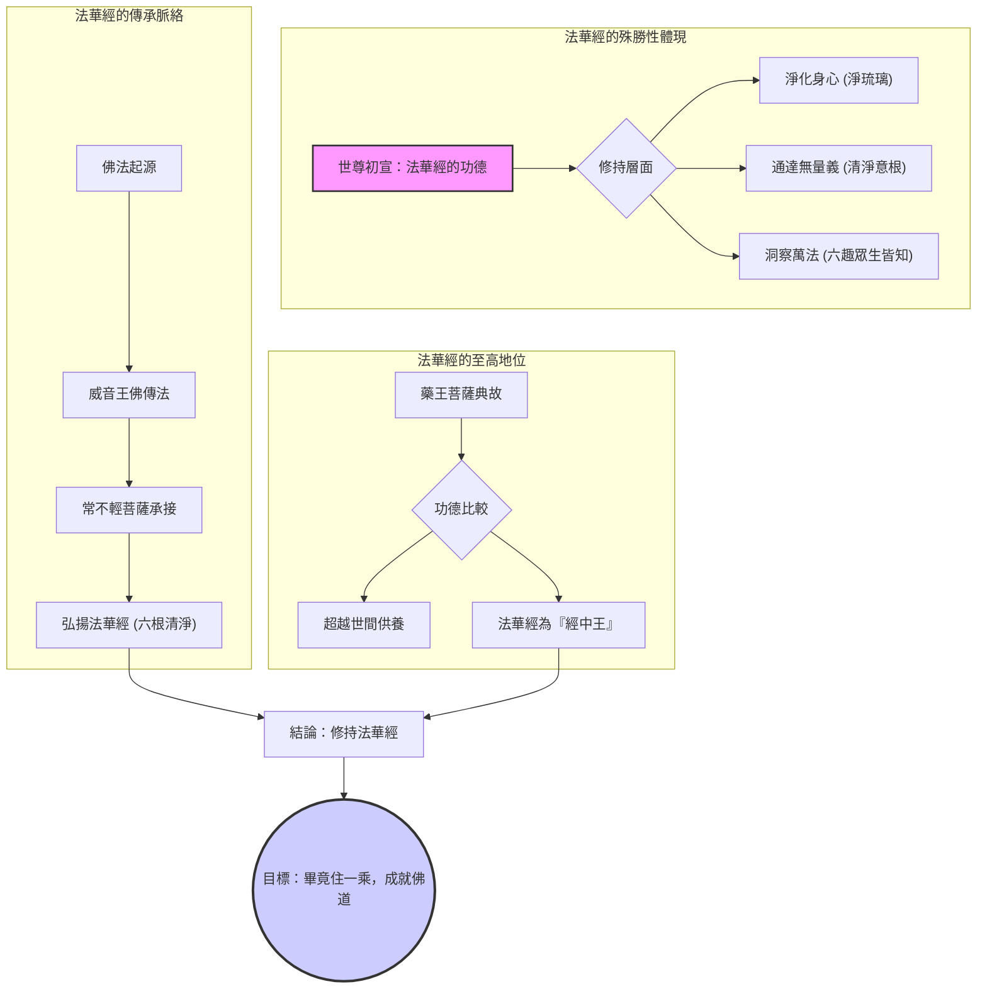

---

## Part 11

Source note: [[妙法蓮華經 (Part 11)]]

Original range: lines 3413-3587
Original chars: 82717-91088

<!-- source: 妙法蓮華經 (Part 11).md -->

title: "妙法蓮華經核心觀點彙集 (藥王、妙音、觀世音、陀羅尼、妙莊嚴)"
tags: ["佛教經典", "法華經", "密宗", "弘法"]
type: "translation"

---

### Translation & Comparison Report

#### Summary

本篇彙整了《妙法蓮華經》中多個關鍵品目（包括藥王菩薩本事品、妙音菩薩品、觀世音菩薩普門品、陀羅尼品、妙莊嚴王本事品）的核心教義。內容圍繞著「功德的積累」、「佛法的傳承與保護」、「名號的巨大力量」以及「眾生渡化的無邊慈悲」展開。重點闡述了：藥王菩薩的功德能使聞法者身帶香氣；妙音菩薩在淨土國度與娑婆世界間的弘法歷程；觀世音菩薩以無數種化身和名號，救度一切苦難；以及各種護法神祇和菩薩如何共同以陀羅尼咒語保護法華經。整體結構展現了佛法傳承的層層遞進與無所不在的庇佑。

#### Translation Body

##### 一、 藥王菩薩本事品（功德與囑累）

**核心教義：** 讚歎聞誦藥王菩薩本事品者，能使人現世體現青蓮華香與牛頭栴檀香，積累無量功德。宿王華菩薩囑累，此經是閻浮提眾生的良藥，能使人病消、不老不死。

**弘法指引：** 宿王華菩薩教導，若見有受持此經者，應以青蓮花、末香供養，並念誦「此人不久必當取草坐於道場，破諸魔軍，當吹法螺、擊大法鼓，度脫一切眾生、老病死海」，提醒眾生應生起恭敬心。

##### 二、 妙音菩薩品（淨土與娑婆的連結）

**核心教義：** 描述了妙音菩薩從淨光莊嚴國度前往娑婆世界的過程。淨華宿王智佛提醒妙音菩薩，娑婆世界雖「高下不平，土石諸山、穢惡充滿」，但其弘法價值極大，不可輕視。

**弘法歷程：** 妙音菩薩入三昧，化為八萬四千朵蓮華，隨後與眾菩薩來到娑婆世界。在釋迦牟尼佛和多寶佛的問訊下，妙音菩薩展現了其無量功德，並最終展示了其「現一切色身」的巨大神通力，隨所應度眾生的身形變化，體現了其無所不捨的慈悲心。

##### 三、 觀世音菩薩普門品（名號的無畏力量）

**核心教義：** 觀世音菩薩的威神之力，體現於其「名號」的巨大力量。無論眾生身處何種極端困境（如大火、巨海、羅剎鬼國、被惡人圍攻、被枷鎖），只要一心稱念「觀世音菩薩名號」，皆能獲得解脫與無畏。

**渡化方式：** 觀世音菩薩的渡化方式極為廣泛，能隨眾生修行的體現方式現身說法，包括佛身、聲聞身、梵王身、帝釋身、比丘身、居士身，乃至於天龍、夜叉等眾生之身。此體現了「隨所應度而為現形」的圓融智慧。

##### 四、 藥王菩薩陀羅尼品（護持法師的咒語）

**核心教義：** 闡述了法華經的護持力量。藥王菩薩、勇施菩薩、毗沙門天王、持國天王，乃至十羅剎女，皆發願以各自的「陀羅尼神咒」來保護法華經的傳承者。

**護持層級：** 這些咒語的層級從「護持法師」擴展到「護持經者」，體現了佛法傳承的連續性和多方位的加持。咒語的功效是「若有侵毀此法師者，則為侵毀是諸佛已」，具有極高的威懾力。

##### 五、 妙莊嚴王本事品（出家與信解的引導）

**核心教義：** 描寫了妙莊嚴王國的兩子（淨藏、淨眼）如何運用其智慧和神通，引導其父王（妙莊嚴王）從外道婆羅門法，轉向信奉佛法。

**轉化過程：** 兩子通過在虛空中展現各種神變（如身出水、身出火，大小變化），使其父王心生清淨信解。最終，他們以「佛難值，如優曇缽華，又如一眼之龜，值浮木孔」的比喻，勸說父母應當跟隨出家修道，體現了「引導眾生心識」的關鍵步驟。

#### Glossary & Key Terms

| 術語 (Original) | 翻譯 (Translation) | 釋義與文化詮釋 (Interpretation) |
| :--- | :--- | :--- |
| **菩薩 (Bodhisattva)** | 菩薩 | 意指發願成佛，但為度化眾生而延後自身成佛的聖者。在法華經中，菩薩的功德與慈悲心是核心主題。 |
| **陀羅尼 (Dharani)** | 陀羅尼 | 一種具有強大護持和加持力的聖咒語。在佛教儀軌中，常被用來抵禦魔障和惡念。 |
| **娑婆世界 (Sārpā World)** | 娑婆世界 | 佛教中指我們所處的、充滿塵世煩惱的世間。此處的「難」與「穢惡」是眾生必須經歷的修行場域。 |
| **無畏 (Fearlessness)** | 無畏 | 指心靈上沒有任何恐懼，是觀世音菩薩最常發出的功德。代表了精神層面的徹底解脫。 |
| **功德 (Merit / Karma)** | 功德 | 指透過善行、善念、善聞所積累的福報與智慧。在經文中，功德的累積是達到解脫的基礎。 |
| **現一切色身 (Manifesting all forms)** | 現一切色身 | 指菩薩能夠根據受度眾生的需求，變化出任何形態（如佛身、人身、動物身等），體現了其無邊的適應性與慈悲力。 |

#### Cultural & Contextual Analysis

1.  **「名」的至高性 (The Supremacy of the Name):** 在《觀世音菩薩普門品》中，經文極度強調「一心稱名」。這體現了佛教教義中「名號」本身即是力量（Nāma-Shakti）。在極端危難時，口稱聖名，其精神力量超越了物理層面的障礙（火、水、羅剎）。
2.  **「法師」的地位 (The Status of the Dharma Protector):** 在《陀羅尼品》中，各種神祇（藥王、毗沙門天王等）都以「護法師」的身份出現，並唸誦咒語。這象徵著佛法傳承的連續性，即無論是哪一位護法神祇，其核心職責都是保護「教法」本身不被污染或毀壞。
3.  **「身變」的哲學意義 (Philosophical Meaning of Manifestation):** 妙音菩薩和觀世音菩薩的「現一切色身」並非單純的魔法展示，而是哲學層面的體現。它告訴修行者，真正的智慧和慈悲，是**無形、無相**的，但為了指引迷途的眾生，必須暫時具象化，以符合眾生的認知結構。

#### 邏輯流程圖 (Logic Flow Diagram)

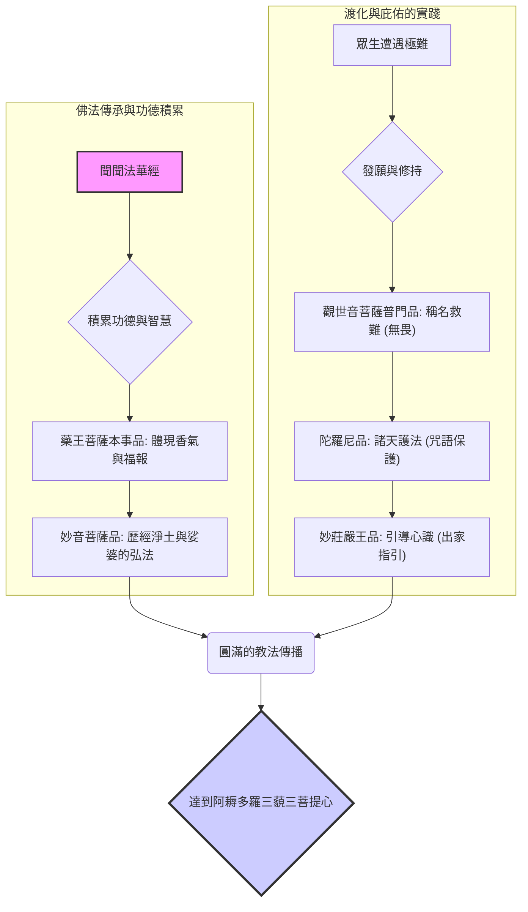

---

## Part 12

Source note: [[妙法蓮華經 (Part 12)]]

Original range: lines 3589-3631
Original chars: 91090-94768

<!-- source: 妙法蓮華經 (Part 12).md -->

### 妙法蓮華經 (Lotus Sutra)

#### Summary

《妙法蓮華經》是大乘佛教中極為重要的一部經典，其核心思想強調「一切眾生皆有佛性」，並闡述了修習佛法、成就菩提道的各種法門。本段落內容涵蓋了「譬喻品」中關於「善知識」的教法，以及「普賢菩薩勸發品」中，普賢菩薩發願護持經典的宏大誓願。經文體現了佛陀對弟子們的極大慈悲，以及菩薩們為弘揚正法所展現的無上神通與功德。

#### Translation Body

##### 一、 善知識的教法與菩薩的顯現（《譬喻品》核心）

佛陀在妙莊嚴王面前，闡述了「善知識」的至高重要性。佛陀指出，真正的善知識，其功德能引導眾生，使其發起「阿耨多羅三藐三菩提心」（圓滿的菩提心）。

**關鍵教點：**
1. **善知識的定義：** 善知識者，是能夠化導眾生，使其見到佛法，並發起圓滿菩提心的緣起。
2. **菩薩的身份揭示：** 佛陀開示，妙莊嚴王及其眷屬，實為光照莊嚴相菩薩、藥王菩薩、藥上菩薩等大菩薩。這顯示了世間的功德體現，最終皆歸於佛法的光輝。
3. **修行誓願：** 妙莊嚴王發起誓願，從此不再隨心行事，不生邪見、憍慢瞋恚等諸惡心念，展現了對佛法的堅定皈依。

##### 二、 普賢菩薩的宏大誓願（《普賢菩薩勸發品》）

普賢菩薩代表所有菩薩，向佛陀稟報，闡述了在未來「濁惡世」中，如何保護和弘揚法華經。

**四法成就：** 佛陀指點，若善男子、善女人能成就以下「四法」，於如來滅後，必能得法華經：
1. **為諸佛護念：** 懷有護持一切佛法的心。
2. **植眾德本：** 在眾生心中種下法華的種子。
3. **入正定聚：** 達到正念的境界。
4. **發救一切眾生之心：** 心懷廣大慈悲，願救度一切苦難眾生。

**護持誓願與功德：**
*   **守護方式：** 普賢菩薩發誓，將以「六牙白象王」等神通，在後五百年間，為受持者現身，供養和守護。
*   **教化方式：** 對於有忘失者，會指導其共讀誦，使法義通達；對於受持者，則會賜予「旋陀羅尼」等無破壞的陀羅尼咒。
*   **修持的殊勝果報：** 闡述了若能真正受持、讀誦、正憶念、解義趣的修行者，其終生將獲得極大的福報，最終能入彌勒菩薩處，得到無量功德。

##### 三、 經典總結與後序論述

後序部分由僧睿撰述，總結了法華經的深奧本質：
*   **本體性：** 法華經是諸佛的「秘藏」，是眾經的「實體」。
*   **法義層次：** 經文的深奧，如「壽量定其非數，分身明其無實」，指出了佛法超越了世間可計量的時間與形體限制。
*   **傳承的艱難：** 點出此經的深奧，非一般人能輕易領悟，需要極高的智慧和修持。

#### Glossary & Key Terms

| 術語 (Original) | 翻譯 (Traditional Chinese) | 釋義 (Interpretation) |
| :--- | :--- | :--- |
| **善知識** | 善知識 | 指能引導眾生走向正道的良師、良友，是開悟的關鍵助力。 |
| **阿耨多羅三藐三菩提心** | 圓滿菩提心 | 指圓滿、無所不缺的覺悟心，是成佛的最終目標。 |
| **陀羅尼** | 陀羅尼 | 一種具有神聖力量的咒語或密咒，被認為能具足強大的加持力。 |
| **四法** | 四法 | 佛法指引的四種修持境界：護念、植德、正定、發心，是修習法華經的基礎。 |
| **善權** | 善權 | 指適當的教化方法和智慧的運用，指教必須符合受眾的根機與時機。 |
| **憍慢瞋恚** | 憍慢瞋恚 | 佛教指的諸惡心念，包括傲慢、懈怠、嗔恨等，是修行最大的障礙。 |

#### 文化解析 (Cultural and Contextual Analysis)

1. **善知識的文化地位：** 在佛教文化中，「善知識」的概念極為重要，它不僅僅指老師，更是一種精神上的指引。這體現了佛教強調的「傳承」和「人際互動」的修行觀點，指出悟道絕非孤立的個人行為。
2. **菩薩的化身與世間顯現：** 經文將妙莊嚴王等比擬為菩薩，是典型的「法身顯現」的體現。這告訴信徒，菩薩的功德和智慧，可以透過世間可見的「富貴、功德、美貌」等外在現象來體現，打破了「聖賢必須是出家者」的世俗觀念。
3. **護法與誓願的文學手法：** 普賢菩薩的發願，是經典文學中常見的「誓願文學」。它極大地增強了法華經的權威性和不可動搖性，讓信徒感受到佛法是經過無量劫的眾生共同護持，其傳承的艱難與殊勝。

---
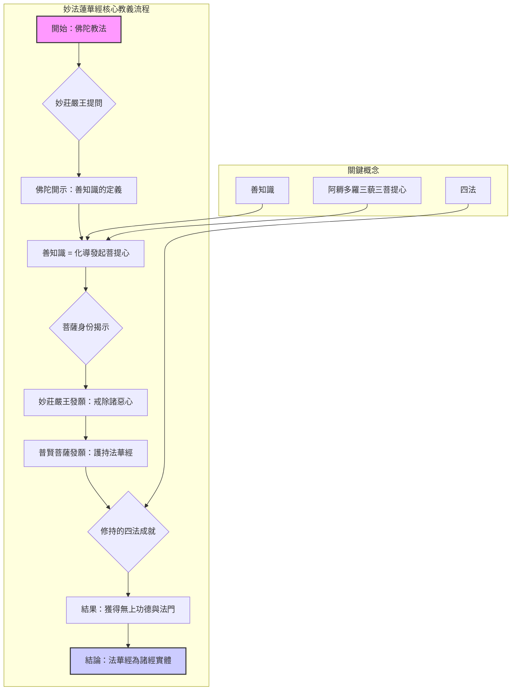

---