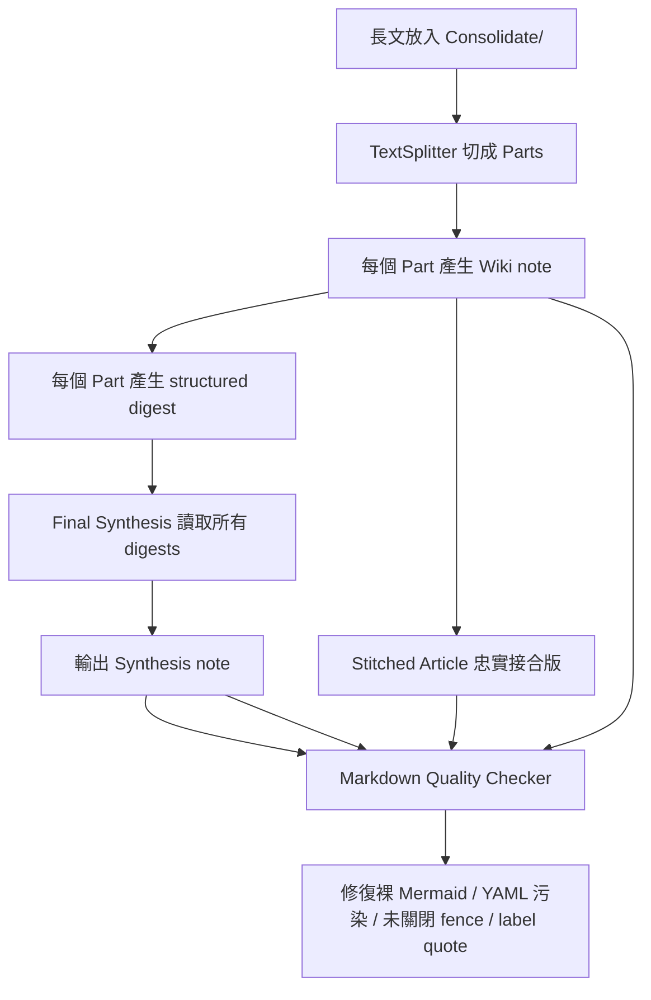
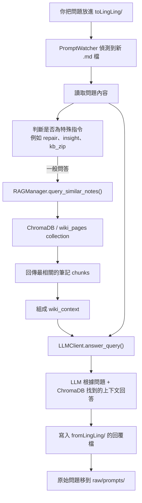

# 🎀 Ling-Ling / 玲玲小老師
  
> A self-evolving knowledge ecosystem driven by **Scripture**, **Skills**, and **Templates**.
> **白話文**：有書當讀直須讀，你若不讀玲玲替你讀。不只幫你讀，讀完還幫你寫結案報告。

Ling Ling 是一個將標準 Obsidian 筆記庫轉化為「活體知識系統」的 Agentic RAG 架構。她不只是自動搬運工，更是具備深度綜述能力的知識守護者。

---
## 2026-05-10 Synthesis Quality Upgrade

長文解析管線已從「Part 第一行摘要」升級為 **structured digest synthesis**。現在 Ling Ling 會先把長文切成 Parts，針對每個 Part 產生結構化 digest，再用這些 digest 進行最終 Synthesis，避免總結只看到標題、內容過度空泛。



- **Structured Digest**：每個 Part 會整理 `thesis`、`key_points`、`evidence`、`terms`、`open_questions`、`handoff`。
- **Part Digest Appendix**：每個 Part note 文末會附上自己的 digest；Synthesis 內也會彙整所有 Part digests，方便檢查 Ling Ling 在合成前如何理解每個 Part。
- **Stitched Article**：長文會額外輸出 `Title (Stitched).md`，將所有 Part notes 忠實接合成一篇可連續閱讀的完整文章，移除各 Part 的 navigation 與 digest appendix，保留來源註記。
- **Deterministic Markdown Quality Checker**：寫檔前會修復常見格式問題，例如裸 `mermaid` 區塊、未關閉 Mermaid fence、Mermaid `NodeId[...]` / `NodeId{...}` label 未加引號、LaTeX `\rightarrow` 被誤解成 carriage return、LLM 誤吐的 body YAML frontmatter。
- **Traceable Metadata**：新筆記會標記 `quality_checker: deterministic-markdown-v1`；Synthesis 會標記 `synthesis_pipeline: structured-digest-v1` 與 `digest_schema: part-digest-v1`。

## 2026-05-10 Fix bugs when using ChromaDB. This is how it works:


## 2026-05-09 Connect with Open Claw
    僅介面打通，Open Claw對於調用工具仍有問題。(維持動口不動手的特質...)

## 2026-05-08 Daemon Performance Optimization

這次針對「daemon 明明沒有工作，Mac 卻變熱」做了實際程序檢查與 idle 行為優化。檢查結果顯示正式 daemon、local bridge 與 Ollama 在 idle 時皆為 `0.0% CPU`，當下主要 CPU 消耗來自 macOS `WindowServer`；但 Ling Ling 仍有幾個會造成背景重複醒來或重複工作的問題，已一併修正。

- **只監聽必要資料夾**：`VaultWatcher` 不再遞迴監聽整個 `lings-desktop/`。現在只監聽 `pages/`、`Notes/` 與 `Scripture/`，避免 `fromLingLing/`、`Insights/`、`raw/`、Obsidian metadata 等無關變動排入背景 timer。
- **避免啟動掃描重複執行**：startup scan 仍會保護 busy state，但結束時不再觸發 busy-to-idle callbacks，因此不會啟動後立刻重掃一次 `Consolidate/` 與 `toLingLing/`。
- **圖片剪報成功後自動歸檔**：修正圖片 ingestion 成功後仍殘留在 `Consolidate/` 的問題。圖片現在會複製到 `Assets/` 供 Obsidian 預覽，原始待處理檔會移到 `raw/assets/`，避免 daemon 每次重啟都重新 vision 分析同一張圖片。
- **Daily insight 避免同日重跑**：`InsightScheduler` 啟動時會讀取既有 `Insights/*full-insight-YYYYMMDD*.md`，如果今天已經產生 full insight，就不會因 daemon 重啟再次執行重型背景分析。
- **降低 scheduler 輪詢頻率**：daily insight scheduler 從每 1 分鐘檢查一次降為每 5 分鐘檢查一次。每日任務不需要分鐘級輪詢，idle 時更安靜。
- **修正 busy 期間新檔事件 bug**：`VaultWatcher.on_created()` 在 busy 分支會使用尚未定義的 `filepath`，已修正並在事件入口先做路徑白名單過濾。
- **清理重複 daemon**：檢查時發現同時有 `/Users/$User/projects/ling-ling` 與 `/Users/$User$/Documents/ling-ling` 兩份 `System_Engine/main.py` 在跑；已停止誤啟動的第二份，避免重複監聽與排程。

Operational note: `Consolidate/` 應該代表「待處理佇列」。若 idle 時懷疑 Ling Ling 還在工作，先確認 `Consolidate/` 與 `toLingLing/` 是否仍有檔案；成功處理後，Markdown 應進入 `raw/consolidate/`，圖片應進入 `raw/assets/`。

## ✨ Core Features

- **📚 Scripture-Driven Logic (聖典驅動)**: 所有的 AI 行為（角色性格、輸出語言、智力參數）都定義在 Wiki 內的 `Scripture/Scripture.md`。改筆記就能改大腦，無需重啟程式。
- **📥 Consolidate & Synthesis (清洗、消化與合成)**: 遇到雜訊多、萬字長的長文也不怕。現在您可以先在 `Clippings/` 手動清洗雜訊，再拉入 `Consolidate/` 觸發 AI 精煉。Ling Ling 會自動精確切割、產生帶有 digest appendix 的 Part notes、輸出忠實接合版 Stitched Article、整理 structured digests，最後生成帶有「執行摘要」、「跨頁導覽連結」與「Part Digest Appendix」的合成頁。
- **📚 Stitched Article (忠實接合版)**: `Title (Stitched).md` 會接合所有 Part notes 的主要正文，適合完整閱讀與校對；`Title (Synthesis).md` 則保留為洞察與濃縮總結。
- **🔗 E-book Style Navigation (電子書導航)**: 自動在解析後的 Part 與 Synthesis 之間建立連結，支援「查看原始碼」、「上一篇/下一篇」與「返回總結」，讓長文閱讀如同翻閱電子書。
- **🧩 Structured Digest Synthesis**: 每個長文 Part 都會先萃取 thesis、key points、evidence、terms 與 open questions，再交給最終合成階段，降低長文總結空泛化。
- **🧹 Markdown Quality Checker**: 寫入 Obsidian 前自動修復裸 Mermaid、未關閉 Mermaid fence 與 body YAML 污染，並把修復紀錄寫入 metadata。
- **🛡️ High Reliability (高可靠性監測)**: 支援跨資料夾「拖拉搬移」偵測，並具備「啟動自動掃描」功能，確保任何遺漏的指令或剪輯都能在開機時自動補齊。
- **🎀 Knowledge Dashboard (自動知識地圖)**: 專業的 `index.md` 自動維護系統。支援 **自然排序**（Part 1 在 Part 10 前面）與 **Obsidian Callouts** 階層化顯示，讓你的知識庫再大也不亂。
- **🤖 Agentic Command Workflow**: 在 `toLingLing/` 丟入指令檔（如 `@ling-patrol-tags`），玲玲會自動執行標籤稽核、合併筆記或生成洞察。
- **🏷️ Bulk Tag Repair (批量標籤修復)**: 革命性的彙整稽核。同一個標籤問題只會出現一次，勾選一行即可修復全庫所有受影響的檔案。
- **🦉 S-S-T Architecture**: 
    - **Scripture (靈魂)**: 決定她是誰、嚴肅程度與記憶長短。
    - **Skills (分析能力)**: 定義她如何解構問題（如 5W1H、波特五力）。
    - **Templates (外貌規格)**: 定義輸出的 Markdown 格式。

---

## 🚀 開始使用 (Getting Started)

### 1. 必要條件
- Python 3.10+
- Obsidian App (建議安裝 Web Clipper 插件)
- 一個 LLM 提供者 (Ollama, vLLM, 或 Gemini API)

### 2. 安裝與執行
```bash

#clone the repo
git clone <repo-url>
cd ling-ling

# copy .env.example to .env
cp .env.example .env 

# update environment variables, like ip/port, api key, etc...
vim .env

# start the daemon process
./start.sh 

```

### 3. 配置 Scripture (智慧調教)
進入 Obsidian 開啟 `Scripture/Scripture.md`，您可以動態調整以下參數：
- `creativity`: (Temperature) 越高越有創造力，越低越嚴謹。
- `memory_limit`: (Context Window) 模型一次能吞下的文字量。
- `search_depth`: (Top-K) 回答問題時要參考幾篇相關筆記。
- `strict_mode`: 是否強制模型閉嘴、不準聊天，嚴格執行模板。

---

## 📂 目錄結構 (Directory Structure)

```text
lings-desktop/
├── Scripture/            # 📜 玲玲的靈魂設定 (性格、智力參數、語系)
├── Clippings/            # 📥 外部剪報暫存區 (手動清洗、刪除廣告與版權宣告處)
├── Consolidate/          # ⚙️ 知識精煉區 (整理好的檔案拉進這裡，立即觸發 AI 解析)
├── toLingLing/           # ⌨️ 互動指令入口 (@ling-* )
├── fromLingLing/         # 💌 玲玲產出的報告與分析
├── pages/                # 🤖 玲玲自動寫出的實體頁面與 Synthesis 合成頁
├── Notes/                # ✍️ 你自己寫的思考隨筆
├── Skills/               # 🧠 玲玲的分析方法包 (可自行新增 MD 技能)
├── Templates/            # 📐 玲玲輸出的外觀模板
├── Insights/             # 🎐 玲玲做夢時產出的戰略洞察
└── index.md              # 🎀 自動維護的階層化知識地圖
```

```text
ling-ling/
├── Backups/
│   ├── kb_backup_[Timestamp].zip   # 每次自動備份的檔案
│   └── ...
│ 
├── lings-desktop/                  # ObsidianVault 的主要目錄
│ 
├── System_Engine/                  # 核心程式碼目錄
│   ├── (source code and etc.)
│   └── daemon.pid
│ 
├── venv/                           # Python 虛擬環境
├── .env                            # 環境變數
├── RELEASE_NOTE_[version].md       # 版本發行說明
├── requirements.txt                # Python 依賴套件
├── SCHEMA.md                       # LLM Wiki 結構定義
└── start.sh                        # 啟動腳本

```

---

## 📜 虎之卷 (Commands / @ling-*)

將以下關鍵字作為檔名放入 `toLingLing/` 即可發動技能：

- `@ling-patrol`: **全庫健康檢查**。找出死連結、孤兒頁面與資料庫不同步。
- `@ling-patrol-tags`: **標籤巡邏**。找出所有沒翻譯或格式錯誤的標籤。
- `@ling-repair-tags`: **批量修復標籤**。根據你勾選的清單，一鍵更新全庫標籤。
- `@ling-insight`: **發動洞察**。強迫玲玲把讀過的內容拿出來「做夢」，產出跨領域的聯想。
- `@ling-merge`: **合併筆記**。內容包含 `[[A]]` 與 `[[B]]` 即可將兩者融合。
- `@ling-zip / @ling-unzip`: **大腦備份與還原**。具備衝突檢測功能的壓縮包管理。
- `@ling-RESET`: **大腦清洗**。安全地清除所有內容（執行前會自動強制備份）。

---

## 🦉 玲玲的養育守則 (Design Philosophy)

1. **不要罵玲玲**：少用「不可以...」來描述期待，給予明確的「要怎麼做」更能讓她發揮潛力。
2. **期待言簡意賅**：太複雜的指令會讓模型注意力崩潰，導致跳針。
3. **對抗熵增**：資料會從有序走向失序。定期發動 `@ling-patrol` 是保持大腦清爽的唯一方法。

## 📋 已知問題
    - [ ] Mermaid 語法仍可能有語意層錯誤；目前 checker 會修 fence/包裹格式與 node label quote 問題，但不會理解整張圖是否邏輯正確。
    - [ ] 長文解析已改為 structured digest pipeline，但語意品質仍受模型能力影響；後續會加入 semantic quality score 與 retry-with-critique。
    - [ ] 多國語混亂。模型不一定會使用指定語言回答。
 
---

## 🔖 License
MIT License Copyright (c) 2026 [MH / Project Ling Ling]
**[Ling Ling's Note]**: "Mom said you can use my code, but don't claim you wrote it yourself. That's plagiarism! "
