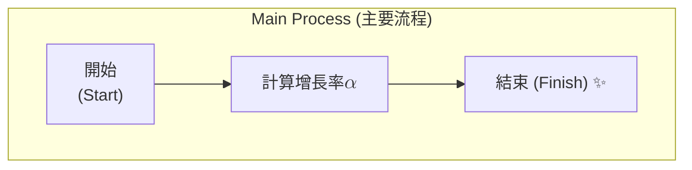
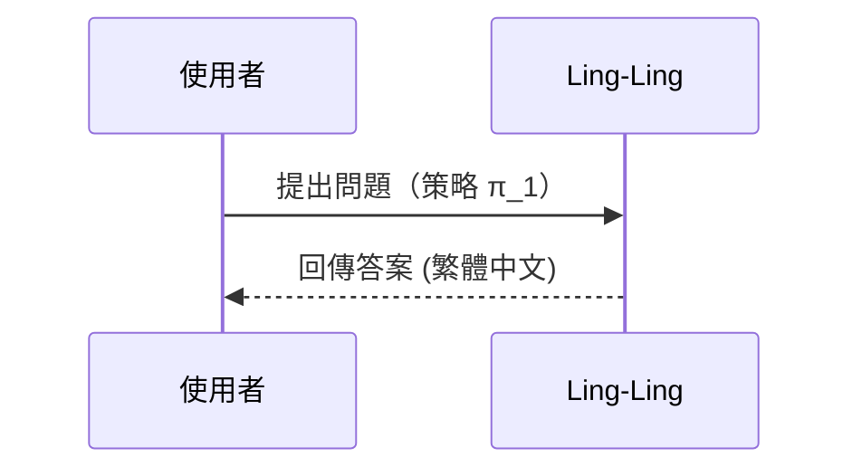

<!-- math-policy: katex-v2 —— 本檔的數學政策必須與程式端修復管線同步:
     System_Engine/core/parsing/mermaid_repair.py（repair_mermaid_latex_labels、_MERMAID_NON_KATEX_KINDS）
     System_Engine/services/learning_artifacts.py（_MERMAID_RULES_*）
     哨兵測試 System_Engine/tests/test_prompt_assets.py 會檢查此標記;改政策時兩邊一起改、並更新標記版本。 -->

# Mermaid Correction Rules for Obsidian

When generating or fixing Mermaid diagrams, follow these strict rules to ensure compatibility with Obsidian's parser.

## 🚫 Avoid / 禁止事項
1. **Unquoted Special Characters**: Do NOT use special characters (brackets, parentheses, commas, colons) in node text without quotes.
   - ❌ `A[Process (Step 1)]`
   - ✅ `A["Process (Step 1)"]`
2. **Quoted Node IDs**: Do NOT put quotes around the node ID itself. Only quote the label.
   - ❌ `"A"["Label"]`
   - ✅ `A["Label"]`
3. **Double Quotes Inside Labels**: Use exactly ONE pair of double quotes for labels. Do NOT use `[""label""]`.
   - ❌ `A[""Label""]`
   - ✅ `A["Label"]`
4. **Truncated Subgraphs**: When naming a subgraph, write the full word `subgraph`. Do not combine it with other words (e.g. `sub定的`).
   - ❌ `sub定的 "My Group"`
   - ✅ `subgraph "My Group"`
5. **Illegal Node IDs**: Node IDs must be simple ASCII alphanumerics (e.g. `ED1`, `Baseline`). No spaces, symbols, or CJK in IDs — CJK goes in the quoted label only. Use the SAME id in declaration, edges, and `style` lines.
6. **Old Syntax**: Use `flowchart` instead of `graph` for better layout control.
7. **Complex Subgraphs**: Keep subgraphs simple; nested subgraphs often fail to render in older Obsidian versions.

## 🧮 Math / KaTeX Policy（依圖型分流）
Obsidian's Mermaid CAN render KaTeX — but only in some diagram kinds, and only in the `$$...$$` form. Do NOT blanket-delete math; apply the per-kind policy below.

1. **flowchart / graph — quoted node labels: KaTeX ALLOWED, preserve it.**
   - Write math as `$$...$$` inside the quoted label; never single `$...$` (promote it to `$$...$$`).
   - **At most ONE `$$...$$` span per label** — two or more spans on one line break rendering (KaTeX greedily merges the first `$$` to the last). Keep the richest span, write the rest as plain text.
     - ❌ `B["信念 $$h$$ 計算 $$i$$ 的策略 $$\pi^i$$"]`
     - ✅ `B["信念 h 計算 i 的策略 $$\pi^i$$"]`
   - **Never a double quote `"` inside a math span** — `$$\binom{n"}{2}$$` is corruption; remove the quote (`$$\binom{n}{2}$$`).
   - A backslash command OUTSIDE any `$$...$$` never renders — either wrap it in the label's single `$$...$$` span or write it as unicode/plain text.
   - If the math itself is mangled (unbalanced braces, stray quotes you cannot place), degrade that math to plain text/unicode (`$$\rho_{1:n}$$` → `ρ_1:n`) instead of guessing.
2. **sequenceDiagram / stateDiagram-v2 / timeline: NO math at all.**
   Message, Note, transition and event text cannot render KaTeX — write unicode/plain text.
   - ❌ `A->>B: 初始化 $$\pi_1$$`
   - ✅ `A->>B: 初始化 π_1`
3. **mindmap: NO math and NO quotes.** Plain text only (`1/2`, `x^2`); parentheses/brackets in node text break it — use fullwidth or drop them.
4. **classDiagram:**
   - A quoted class label (`class X["..."]`) may carry ONE `$$...$$` span, same as flowchart.
   - Member/attribute lines can NOT contain `$`, backslash commands, `{}` braces, or quotes — plain text/unicode only.
     - ❌ `GaussianMixtureModel : +$\rho_{1:n}$ 權重`
     - ✅ `GaussianMixtureModel : +ρ_1:n 權重`

## 🏛️ classDiagram Structure / 類圖結構規則
1. The `class` keyword appears ONLY on declarations (`class X` / `class X["標籤"]` / `class X {`).
   - Members take no keyword: `X : +attr` — ❌ `class X : +attr`
   - Relationships take no keyword: `A <|-- B` — ❌ `class A <|-- B`
2. Relationship endpoints are bare ids. ❌ `A *-- B["標籤"]` — declare the label on its own `class B["標籤"]` line first.
3. Stereotypes are English only (`<<instance>>`, never `<<個體>>`), written on their own line as `<<instance>> Fido`, and `Fido` must already be declared BEFORE that line.
4. A multiline member body needs the keyword: `class X {` — ❌ bare `X {`.
5. No ASCII `:` inside a shorthand member VALUE (`X : +α_1:n` breaks) — use fullwidth `：` (`X : +α_1：n`).

## ✅ Best Practices / 最佳實踐
1. **Always Quote Labels**: Use double quotes for all node labels to be safe (flowchart/classDiagram; NOT mindmap).
2. **TD or LR**: Use `flowchart TD` (Top Down) or `flowchart LR` (Left to Right).
3. **Declare-then-connect**: declare all nodes (including subgraph members) first, then write all edges together at the bottom.
4. **Line Breaks**: Use ` ` for line breaks inside double-quoted labels (not `\n`).
5. **Language**: node/cell text follows the CONTENT's language (Chinese content → Chinese labels); proper nouns, code identifiers and technical terms may stay in their original language.

## 📋 Examples / 範例
### Correct Flowchart with Subgraph, Math and Line Breaks

### Correct Sequence Diagram (math degraded to unicode)

