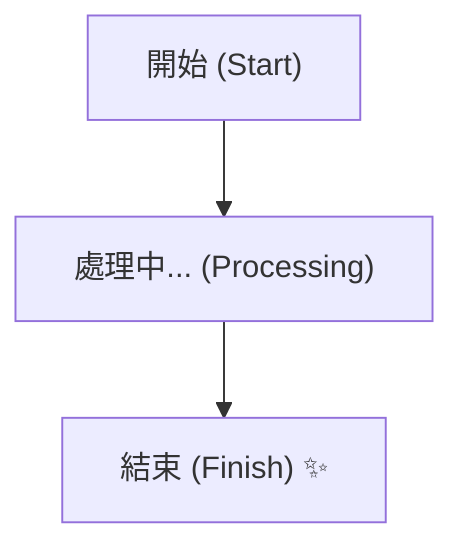
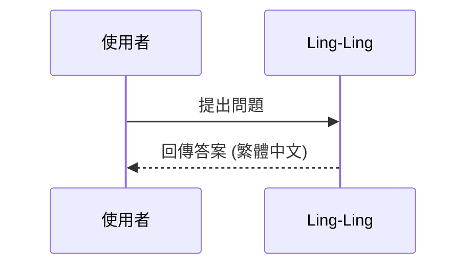

# Mermaid Correction Rules for Obsidian

When generating or fixing Mermaid diagrams, follow these strict rules to ensure compatibility with Obsidian's parser.

## 🚫 Avoid / 禁止事項
1. **Unquoted Special Characters**: Do NOT use special characters (brackets, parentheses, commas, colons) in node text without quotes.
   - ❌ `A[Process (Step 1)]`
   - ✅ `A["Process (Step 1)"]`
2. **Illegal Node IDs**: Node IDs should be simple alphanumeric characters. Do not use spaces or symbols in IDs.
3. **Old Syntax**: Use `flowchart` instead of `graph` for better layout control.
4. **Complex Subgraphs**: Keep subgraphs simple; nested subgraphs often fail to render in older Obsidian versions.

## ✅ Best Practices / 最佳實踐
1. **Always Quote Labels**: Use double quotes for all node labels to be safe.
2. **TD or LR**: Use `flowchart TD` (Top Down) or `flowchart LR` (Left to Right).
3. **Styling**: Use classes for styling rather than inline styles if possible.

## 📋 Examples / 範例
### Correct Flowchart

### Correct Sequence Diagram

