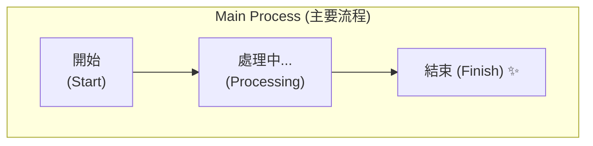
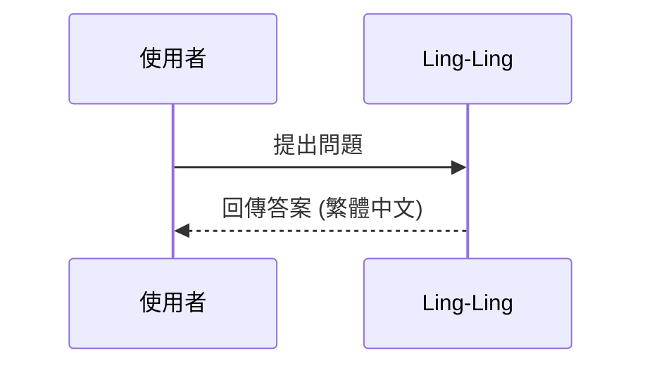

# Mermaid Correction Rules for Obsidian

When generating or fixing Mermaid diagrams, follow these strict rules to ensure compatibility with Obsidian's parser.

## 🚫 Avoid / 禁止事項
1. **Unquoted Special Characters**: Do NOT use special characters (brackets, parentheses, commas, colons) in node text without quotes.
   - ❌ `A[Process (Step 1)]`
   - ✅ `A["Process (Step 1)"]`
2. **Quoted Node IDs**: Do NOT put quotes around the node ID itself. Only quote the label.
   - ❌ `"A"["Label"]`
   - ✅ `A["Label"]`
3. **Double Quotes Inside Labels**: Use exactly ONE pair of double quotes for labels. Do NOT use `[""label""]`.
   - ❌ `A[""Label""]`
   - ✅ `A["Label"]`
4. **Truncated Subgraphs**: When naming a subgraph, write the full word `subgraph`. Do not combine it with other words (e.g. `sub定的`).
   - ❌ `sub定的 "My Group"`
   - ✅ `subgraph "My Group"`
5. **Illegal Node IDs**: Node IDs should be simple alphanumeric characters. Do not use spaces or symbols in IDs.
6. **Old Syntax**: Use `flowchart` instead of `graph` for better layout control.
7. **Complex Subgraphs**: Keep subgraphs simple; nested subgraphs often fail to render in older Obsidian versions.
8. **No LaTeX / Math in Labels**: Do NOT put `$$...$$`, `$...$`, or backslash commands (`\mathcal`, `\cong`, `\frac`, subscripts like `_{x}`) inside node labels. Obsidian's Mermaid parser cannot render them and the **entire diagram fails**. Write the math as plain text instead.
   - ❌ `B["定義: 安全基線流形 $$\mathcal{M}_0$$"]`
   - ✅ `B["定義: 安全基線流形 M_0"]`
   - ❌ `E{"驗證: $$\mathcal{T}_{New} \cong \mathcal{M}_0?$$"}`
   - ✅ `E["驗證: T_New ≅ M_0?"]`

## ✅ Best Practices / 最佳實踐
1. **Always Quote Labels**: Use double quotes for all node labels to be safe.
2. **TD or LR**: Use `flowchart TD` (Top Down) or `flowchart LR` (Left to Right).
3. **Styling**: Use classes for styling rather than inline styles if possible.
4. **Line Breaks**: Use ` ` for line breaks inside double-quoted labels (not `\n`).

## 📋 Examples / 範例
### Correct Flowchart with Subgraph and Line Breaks

### Correct Sequence Diagram

